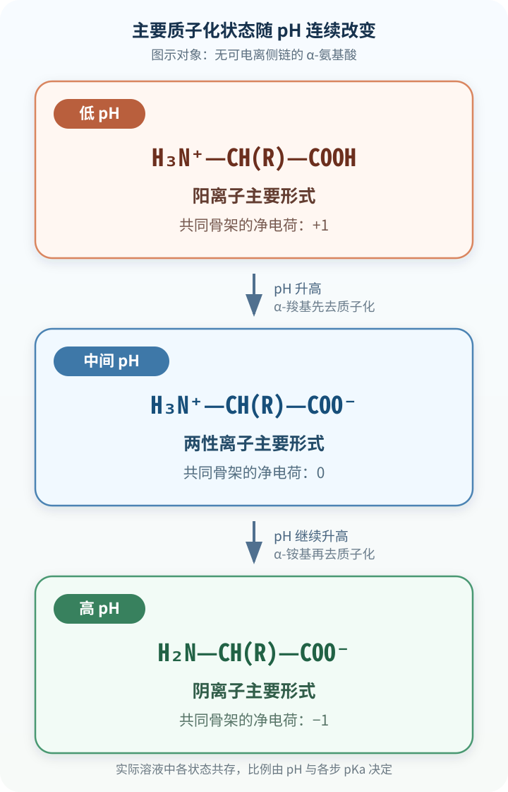

# 氨基酸

蛋白质由氨基酸通过肽键依次连接而成。二十种常见氨基酸共享能够形成肽键的主链骨架，侧链却在电荷、极性、空间体积、氢键能力和化学反应性上显著不同。

这些差异先表现为游离氨基酸在水溶液中的酸碱平衡和化学反应，进入多肽后又转化为主链构象、局部电场、分子识别和共价修饰的基础。认识氨基酸需要把共同骨架、侧链官能团与具体环境联系起来；名称和分类表提供的是进入这些关系的索引。

## α-氨基酸的共同结构与立体化学 { #amino-acid-structure }

### 共同骨架与离子形式 { #amino-acid-backbone }

蛋白质中常见的氨基酸几乎都是 α-氨基酸：α-碳同时连接氨基、羧基、氢原子和侧链 $R$。写作 $\mathrm{H_2N-CH(R)-COOH}$ 的不带电结构式便于辨认官能团，却不是多数 α-氨基酸在中性水溶液中的主要形式。α-羧基通常已经去质子化，α-氨基通常仍质子化，因此共同骨架可写为 $\mathrm{{}^{+}H_3N-CH(R)-COO^{-}}$。这只描述两个 α-官能团的状态；Asp、Glu、Lys、Arg 等还带有可电离侧链，分子的总电荷必须把侧链一并计算。[^zwitterion-structure]

两端带有相反形式电荷而整体电中性的化合物称为两性离子。对甘氨酸、丙氨酸等没有可电离侧链的氨基酸，上述主要形式的净电荷为零；对侧链带电的氨基酸，“具有两性离子骨架”和“整个分子净电荷为零”并不是同一判断。离子型晶格也使固态氨基酸通常具有较高的熔点，并常在明显熔化前后伴随分解。

!!! info "两性离子与等电点"

    两性离子要求同一分子同时具有正、负形式电荷；等电点（isoelectric point，pI）则是某一给定体系中分子群平均净电荷为零的 pH。一个含带电侧链的氨基酸可以具有两性离子结构而仍带非零净电荷；达到 pI 时，分子群中仍可同时存在多种微观质子化状态。

### D/L 构型、R/S 命名与旋光性 { #amino-acid-stereochemistry }

除甘氨酸外，二十种标准氨基酸的 α-碳均为手性中心。D/L 标记依据 Fischer 投影中氨基酸与甘油醛的相对构型关系；核糖体合成蛋白质所用的普通氨基酸通常属于 L 系列。R/S 则按 Cahn–Ingold–Prelog 优先顺序描述手性中心的绝对构型。多数 L-氨基酸的 α-碳是 $S$ 构型，但 L-Cys 因硫原子的优先级较高而是 $R$ 构型，不能用一个体系推断另一个体系。国际纯粹与应用化学联合会—国际生物化学与分子生物学联合会（IUPAC–IUBMB）的 3AA-3 至 3AA-5 规定构型与旋光命名，3AA-14 至 3AA-16 则规定三字母符号和残基书写方式。[^iupac-amino-acid-nomenclature]

D/L 也不表示旋光方向。右旋或左旋由实验条件下测得的比旋光度符号表示，同为 L 系列的氨基酸并不必然具有相同旋光方向；溶剂、pH、温度和测量波长还会改变观测值。苏氨酸和异亮氨酸的侧链另含一个手性中心，因此仅给出 α-碳的 D/L 或 R/S 信息仍不足以描述全部立体化学。

!!! info "构型与旋光方向分别回答不同问题"

    D/L 是相对构型命名，R/S 是绝对构型命名，$(+)/(−)$ 才是特定实验条件下的旋光方向。三者之间没有可供普遍换算的正负号规则。

### 甘氨酸和脯氨酸的结构特征 { #glycine-proline }

Gly 的侧链是氢，因此 α-碳连接两个相同的氢原子，不构成手性中心。较小的侧链使 Gly 能进入空间受限的位置，也扩大了主链可取的构象范围。Gly 对稳定性的影响取决于具体结构位置：它既可适应紧密转角，也可能提高未折叠态的构象熵。

Pro 的侧链回接 α-氨基氮，游离 Pro 含仲胺，“亚氨基酸”是传统但不精确的名称。形成内部肽键后，脯氨酰残基的主链酰胺氮被三个碳取代并缺少 N—H，因此该位置缺少主链氢键供体；N 端 Pro 因没有前一残基酰基而具有不同状态。环结构还限制主链二面角，并提高相邻肽键形成顺式构象的相对概率。其结构效应取决于所在位置和局部构象。

## 标准氨基酸的分类与侧链性质 { #amino-acid-side-chains }

### 二十种标准氨基酸及其符号 { #standard-amino-acid-table }

按侧链的极性与电荷分类便于比较二十种标准氨基酸，但这种分类只描述特定条件下占优势的性质；含有多种官能团的侧链常同时表现出不止一种化学特征。下表以接近 pH 7 的水相为参照，列出侧链而非整个游离氨基酸的常见电荷状态。实际蛋白质中的质子化比例还会随局部环境改变。[^osm-sidechain-classification]

| 氨基酸（符号） | 侧链官能团与 pH≈7 常见电荷 | 主要化学后果 |
| --- | --- | --- |
| 甘氨酸（Gly，G） | 氢；不带电 | 体积最小、无手性，允许较宽的主链构象范围 |
| 丙氨酸（Ala，A） | 甲基；不带电 | 提供小型疏水表面 |
| 缬氨酸（Val，V） | 支链烷基；不带电 | 疏水，β-碳分支限制局部构象 |
| 亮氨酸（Leu，L） | 异丁基；不带电 | 提供较大的疏水接触面 |
| 异亮氨酸（Ile，I） | 仲丁基；不带电 | 疏水，β-碳分支且含第二手性中心 |
| 甲硫氨酸（Met，M） | 硫醚；不带电 | 疏水而可极化，硫原子可被氧化 |
| 脯氨酸（Pro，P） | 回接主链氮的吡咯烷环；不带电 | 限制主链二面角，内部脯氨酰残基缺少主链 N—H |
| 苯丙氨酸（Phe，F） | 苄基芳香环；不带电 | 疏水并参与芳香堆积，紫外吸收弱于 Tyr、Trp |
| 色氨酸（Trp，W） | 吲哚；不带电 | 体积大，具有显著近紫外吸收，吲哚 N—H 可供氢键 |
| 丝氨酸（Ser，S） | 伯醇；不带电 | 可供受氢键，常作为催化亲核体或修饰位点 |
| 苏氨酸（Thr，T） | 仲醇；不带电 | 可供受氢键，β-碳分支且含第二手性中心 |
| 半胱氨酸（Cys，C） | 巯基；通常不带电 | 硫负离子亲核性强，两个 Cys 残基的巯基可氧化成二硫键 |
| 酪氨酸（Tyr，Y） | 酚；通常不带电 | 芳香性与极性并存，可形成氢键并发生磷酸化或氧化还原反应 |
| 天冬酰胺（Asn，N） | 甲酰胺；不带电 | 可供受氢键，是 N-连接糖基化序列基序中的受体残基 |
| 谷氨酰胺（Gln，Q） | 乙酰胺；不带电 | 可供受氢键，并参与细胞氮的携带与转移 |
| 天冬氨酸（Asp，D） | 羧酸盐；通常 $-1$ | 提供负电荷，可参与盐桥、金属配位和酸碱催化 |
| 谷氨酸（Glu，E） | 羧酸盐；通常 $-1$ | 提供负电荷，常参与质子转移和金属配位 |
| 赖氨酸（Lys，K） | ε-铵基；通常 $+1$ | 形成盐桥和氢键，也是多种酰化、甲基化修饰位点 |
| 精氨酸（Arg，R） | 胍基；通常 $+1$ | 正电荷离域，可形成多重、定向的氢键和离子相互作用 |
| 组氨酸（His，H） | 咪唑；pH 7 时部分质子化 | 侧链 pKa 常在 6 附近，适合在生理范围参与质子转移和金属配位 |

三字母与单字母符号是序列表示规范的一部分。B 表示不能区分 Asp 与 Asn 的 Asx，Z 表示不能区分 Glu 与 Gln 的 Glx，X 表示未知或未指定残基；遗传编码的硒代半胱氨酸（selenocysteine，Sec）与吡咯赖氨酸（pyrrolysine，Pyl）分别使用 Sec／U 和 Pyl／O。[^amino-acid-codes]

### 非极性与芳香族侧链 { #nonpolar-aromatic-side-chains }

-   **非极性侧链**

    以烃链、芳香环或硫醚表面为主，接近中性时不带电。代表残基包括 Ala、Val、Leu、Ile、Met、Phe 和 Pro；Gly 常因侧链过小而单独讨论。

-   **极性不带电侧链**

    含羟基、酰胺、巯基或吲哚 N—H，通常可形成氢键而在 pH 7 附近不带整单位电荷。代表残基包括 Ser、Thr、Asn、Gln、Cys、Tyr 和 Trp。

-   **酸性侧链**

    Asp 与 Glu 的侧链羧基在 pH 7 附近主要以羧酸根存在，通常各带一个负电荷。

-   **碱性侧链**

    Lys 和 Arg 在 pH 7 附近通常带正电；His 的咪唑基只有一部分质子化，其比例对局部环境尤其敏感。

疏水侧链在水相中被埋藏通常有利于减少非极性表面与水的接触，是球状蛋白形成疏水核心和跨膜蛋白适应脂双层的重要因素。Phe、Tyr 和 Trp 的芳香环还可参与芳香堆积与阳离子–π 相互作用；Tyr 的酚羟基和 Trp 的吲哚 N—H 还赋予二者极性和氢键性质。芳香族与极性分类发生交叉，正是侧链官能团需要逐一辨认的原因。

### 极性不带电侧链 { #polar-uncharged-side-chains }

Ser、Thr 的羟基，Asn、Gln 的酰胺以及 Cys 的巯基都能与水或蛋白质中的其他基团发生定向相互作用。极性侧链若埋入蛋白质内部并失去与水的氢键，通常需要由其他主链或侧链基团补偿。Cys 和 Tyr 在 pH 7 附近多为不带电形式；“不带电”只描述占优势的质子化状态，二者仍保留酸碱化学及亲核反应性。

### 酸性与碱性侧链 { #acidic-basic-side-chains }

Asp、Glu 的羧酸盐通常提供负电荷，Lys、Arg 的侧链通常提供正电荷，His 的咪唑则在接近生理 pH 时同时存在可观的质子化态与去质子化态。带电侧链可形成盐桥、参与金属配位并改变局部电场；其具体功能取决于几何构型、介电环境、溶剂暴露和相邻电荷。

### 支链、含硫及其他交叉分类 { #side-chain-cross-classification }

Val、Leu 和 Ile 合称支链氨基酸（branched-chain amino acids，BCAA），这一名称描述三者的碳骨架分支方式；它们在蛋白质中的具体作用仍由所在结构环境决定。Cys 与 Met 都含硫，但 Cys 的巯基能够解离、参与亲核反应和二硫键交换，Met 的硫醚在通常条件下不带电，反应性与 Cys 明显不同。Phe、Tyr、Trp 都含芳香环，Tyr 同时属于极性残基，Trp 的吲哚也能提供氢键。分类的意义在于提示可比较的官能团，具体判断仍须回到分子结构。

两个 Cys 残基的巯基氧化后形成二硫键，为同一条或不同多肽链增加共价约束；还原则恢复两个巯基。由两个 L-Cys 形成的天然 L,L-cystine 仍是手性化合物，并非内消旋体；D,L-cystine 才是相应的 meso 立体异构体。蛋白质中二硫键的形成位置和交换速率还受到折叠状态与细胞氧化还原环境控制。

## 氨基酸的酸碱平衡 { #amino-acid-acid-base }

### 逐级解离与缓冲区 { #stepwise-ionization }

可电离基团在水溶液中同时存在质子化态与去质子化态，两者的比例随 pH 连续变化；当 pH 接近该基团的 pKa 时，两种状态都不能忽略。对没有可电离侧链的 α-氨基酸，随 pH 升高通常先是 α-羧基失去质子，随后是 α-铵基失去质子。Henderson–Hasselbalch 关系描述每一步共轭酸碱对的比例，因此滴定曲线在各 pKa 附近出现缓冲区，而不是在一个点上完成全部分子的同步变化。

{ loading=lazy }
/// caption
无可电离侧链的 α-氨基酸随 pH 升高依次去质子化。[^fig-amino-acid-ionization]
///

下表给出本页计算使用的宏观解离常数。甘氨酸数值来自 25 ℃、离子强度 0.10 mol·L⁻¹ 的电位滴定；Asp 和 Lys 使用教材参考表中的水相数值。不同测定温度、离子强度、活度修正和实验方法会造成差异，表中数值不能视为脱离条件的常数。[^amino-acid-pka-values]

| 氨基酸 | α-羧基 pKa | 侧链 pKa | α-铵基 pKa | pI |
| --- | ---: | ---: | ---: | ---: |
| Gly | 2.33 | — | 9.57 | 5.95 |
| Asp | 1.88 | 3.65 | 9.60 | 2.77 |
| Lys | 2.18 | 10.53 | 8.95 | 9.74 |

### 等电点的确定 { #isoelectric-point }

等电点（pI）是特定条件下分子群平均净电荷为零的 pH。[^iupac-isoelectric-point] 求 pI 时，应先按 pH 从低到高写出逐级解离后的净电荷，再找出净电荷为零的主要形式；夹住这一形式的两个相邻 pKa 的平均值就是常用近似。不能预先规定永远平均“最低两个”或“最高两个”pKa。

#### 无可电离侧链的氨基酸 { #pi-neutral-side-chain }

Gly 在强酸性条件下主要带 $+1$ 电荷。α-羧基跨过 pKa 2.33 后，主要形式的净电荷变为 0；α-铵基跨过 pKa 9.57 后，净电荷再变为 $-1$。中性主要形式夹在这两个 pKa 之间，因此

\[
\mathrm{pI(Gly)}=\frac{2.33+9.57}{2}=5.95
\]

。

#### 含可电离侧链的氨基酸 { #pi-ionizable-side-chain }

Asp 在低 pH 时主要带 $+1$ 电荷。α-羧基首先解离后净电荷为 0，侧链羧基随后解离后净电荷为 $-1$，所以应平均 1.88 和 3.65：

\[
\mathrm{pI(Asp)}=\frac{1.88+3.65}{2}=2.77
\]

。

Lys 在低 pH 时两个氨基都质子化，连同未解离羧基时净电荷为 $+2$。羧基解离后变为 $+1$，α-铵基在 pKa 8.95 附近解离后才出现净电荷为 0 的主要形式，最后 ε-铵基在 pKa 10.53 附近解离而变为 $-1$。因此 Lys 选择夹住中性形式的两个较高 pKa：

\[
\mathrm{pI(Lys)}=\frac{8.95+10.53}{2}=9.74
\]

。

!!! example "按电荷序列判断 pI"

    Gly 的主要电荷序列为 $+1\rightarrow0\rightarrow-1$，中性区间由两个主链 pKa 夹住；Asp 为 $+1\rightarrow0\rightarrow-1\rightarrow-2$，中性区间在两个羧基 pKa 之间；Lys 为 $+2\rightarrow+1\rightarrow0\rightarrow-1$，中性区间在两个氨基 pKa 之间。先写电荷序列，能够避免机械套用平均公式。

!!! warning "pI 与最低溶解度的关系有适用边界"

    接近 pI 时静电排斥减弱，许多氨基酸或蛋白质的溶解度会下降，但疏水表面、晶体堆积、温度、盐浓度和其他溶质同样参与决定溶解度。“pI 处溶解度最低”是常见趋势，不是对所有分子和溶液条件都成立的定律。

### 蛋白质微环境中的 pKa 偏移 { #protein-pka-shifts }

表中的 pKa 描述游离氨基酸或规定条件下的参考体系。残基进入蛋白质后，溶剂暴露、邻近电荷、氢键、金属离子以及质子化引起的构象变化都会改变解离自由能。His 的游离侧链 pKa 常在 6 附近，因而在接近生理 pH 时质子化比例对环境尤其敏感；活性中心可以稳定其质子化态或去质子化态，使实际 pKa 明显偏离参考值。Asp、Glu、Lys、Cys、Tyr 等也可发生同类偏移，这正是蛋白质能够把常见侧链用于酸碱催化、亲核反应和电荷耦联的物理基础。

## 氨基酸的光学与光谱性质 { #amino-acid-spectroscopy }

### 旋光性与多手性中心 { #optical-properties }

手性氨基酸的对映体在非手性环境中具有相同的大多数物理性质，却使平面偏振光向相反方向旋转，并在酶、转运体等手性环境中受到不同识别。比旋光度由温度、波长、溶剂和浓度共同定义，L/D 标记只提供构型信息。Thr、Ile 的第二手性中心增加了可能的立体异构体；两个 Cys 氧化成 cystine 后，分子还包含两个原有 α-碳手性中心，天然 L,L-cystine 与 D,L-meso-cystine 必须区分。

### 紫外吸收与核磁共振表征 { #uv-nmr-information }

核磁共振（nuclear magnetic resonance，NMR）记录特定原子核在局部电子环境中的化学位移、峰形、耦合和弛豫。对纯氨基酸，这些信息可用于确认官能团、质子化和构象；对肽或蛋白质，同位素标记与多维谱可进一步提供残基归属、空间邻近和运动信息。化学位移会随 pH 改变，因而 NMR 也能用来追踪某些基团的滴定过程，但复杂混合物中的峰重叠和灵敏度仍限制解析方式。

Phe、Tyr 和 Trp 的芳香侧链具有近紫外吸收，其中蛋白质在 280 nm 的常用估算主要由 Trp 和 Tyr 决定，cystine／二硫键还有较小贡献。ExPASy ProtParam 使用下式估算水中消光系数：

\[
\begin{aligned}
\varepsilon_{280}={}&5500n_{\mathrm{Trp}}+1490n_{\mathrm{Tyr}}\\
&+125n_{\mathrm{cystine}}
\end{aligned}
\]

。该估算以样品中没有其他显著发色团为前提；辅因子、核酸或浑浊散射存在时，单凭序列计算不能直接换算浓度。[^protein-extinction]

在吸收与浓度近似线性的范围内，Beer–Lambert 关系写作 $A=\varepsilon cl$，其中 $\varepsilon$ 必须与波长、分子组成和测量条件相对应。游离氨基酸没有一个对全部种类都同样强的 280 nm 响应，因此混合物定量通常需要分离、衍生化或质谱等额外选择性。

## 遗传编码范围与天然氨基酸多样性 { #amino-acid-diversity }

### 硒代半胱氨酸和吡咯赖氨酸 { #sec-pyl }

“二十种标准氨基酸”概括通用遗传密码的主体，Sec 和 Pyl 则由专门的翻译系统直接插入正在延伸的多肽，单字母代码分别为 U 和 O。两者各有专用转运 RNA（transfer RNA，tRNA），但采用不同的装载与递送机制：Sec 的插入需要把特定 UGA 重新编码，并依赖硒代半胱氨酸插入序列（selenocysteine insertion sequence，SECIS）等 RNA 元件及 SelB／eEFSec 一类专门延伸因子；Pyl 由吡咯赖氨酰-tRNA 合成酶（PylRS）直接装载到 $\mathrm{tRNA^{Pyl}}$，读取特定 UAG 时通常由延伸因子 Tu（EF-Tu）或相应古菌／真核同源因子递送。[^sec-pyl-mechanisms]

这些系统只分布于部分生物和基因，终止密码子的重新解释也依赖局部序列与配套因子。因此“第 21、22 种氨基酸”说明遗传编码范围可以扩展，并不表示所有细胞在所有 UGA、UAG 位置都会插入 Sec 或 Pyl。

### 多肽合成期与合成后的修饰残基 { #modified-amino-acid-residues }

多肽中的化学多样性还来自原有残基的酶促改造，发生时间可以在多肽合成过程中，也可以在合成之后。胶原蛋白中的 Pro 和 Lys 可被羟基化，凝血蛋白中的 Glu 可形成 γ-羧基谷氨酸，Ser、Thr、Tyr 可被磷酸化，Lys 可被乙酰化或甲基化。不同糖基化类型也有各自的时间与区室：真核 N-连接糖链的装配可在内质网中与多肽转位和延伸相伴开始，而许多黏蛋白型 O-GalNAc 糖基化主要发生在折叠及高尔基体加工阶段。[^glycan-assembly-timing]

这些修饰残基通常没有独立密码子，而是由编码残基在特定序列、细胞区室和酶系统中转化而来。它们可能改变电荷、体积、氢键、金属结合或蛋白质降解信号，因而不能在分析中一律还原为“二十种未修饰残基”而不说明样品处理。

### 非蛋白氨基酸与 D-氨基酸 { #nonprotein-d-amino-acids }

β-丙氨酸、鸟氨酸、瓜氨酸和 γ-氨基丁酸等位于常规核糖体蛋白质单体集合之外，却可作为辅酶组成、代谢中间体、信号分子或天然产物成分。“非蛋白氨基酸”描述的是分子进入蛋白质的方式，而非其丰度或生物学重要性。

自然界也广泛利用 D-氨基酸。细菌肽聚糖含 D-Ala 和 D-Glu，某些细菌还释放 D-Met、D-Leu 等参与细胞壁重塑；非核糖体肽合成与后续消旋也能产生 D 型残基。[^d-amino-acids] D 型残基由这些专门途径形成，核糖体翻译则通常选择 L 型氨酰-tRNA，两类过程服务于不同分子用途。

### 营养学分类 { #nutritional-classification }

营养学中的必需性取决于某个物种、年龄和生理状态能否以足够速率合成氨基酸，而不取决于该残基是否由遗传密码编码。成人膳食中的九种不可缺少氨基酸是 His、Ile、Leu、Lys、Met、Phe、Thr、Trp 和 Val；Arg、Cys、Gln、Gly、Pro、Tyr 等可在生长、早产、创伤或疾病等条件下成为条件性不可缺少氨基酸。National Academies 将两组列于 Part II 第 147 页 Table 2。[^dietary-amino-acids]

## 氨基酸的化学反应与分析依据 { #amino-acid-analysis }

### α-氨基与 α-羧基反应 { #backbone-reactions }

游离 α-氨基酸兼具氨基与羧基，两类官能团的酸碱反应、亲核反应和酰基转移构成经典检测方法的化学基础。形成肽键后，内部残基的 α-氨基和 α-羧基成为主链酰胺的一部分，相关试剂主要作用于游离 N 端、C 端或带有同类官能团的侧链。

| 反应或试剂 | 主要目标基团／代表残基 | 典型现象或产物 | 用途与限制 |
| --- | --- | --- | --- |
| 茚三酮 | 多数游离伯氨基；Pro、羟脯氨酸等仲胺也可反应 | 多数氨基酸形成蓝紫色 Ruhemann 紫，仲胺常呈黄色 | 可用于显色和氨基氮检测，但并非 α-氨基酸绝对专一试剂 |
| 甲醛滴定 | 游离氨基酸或肽端的氨基 | 甲醛掩蔽氨基的碱性，改变后续碱滴定量 | 可估计游离氨基酸或氨基氮；铵盐、其他胺和样品基质会干扰，Pro 等仲胺响应不同 |
| Schiff 碱形成 | 具有伯 α-氨基的氨基酸与醛 | 可逆亚胺；磷酸吡哆醛（pyridoxal phosphate，PLP）酶中可形成外醛亚胺中间体 | 说明氨基参与羰基化学；Pro、羟脯氨酸的仲胺不按普通伯胺路径处理 |
| Van Slyke 亚硝酸反应 | 具有伯 α-氨基的氨基酸 | 脱氨并释放氮气 | 可用于经典氨基氮测定，但选择性和样品适用性有限，Pro、羟脯氨酸是例外 |
| 1-氟-2,4-二硝基苯（1-fluoro-2,4-dinitrobenzene，FDNB）、丹磺酰氯或异硫氰酸苯酯（phenyl isothiocyanate，PITC）标记 | 可接近的游离 N 端氨基，也可能反应于 Lys ε-氨基 | 稳定显色、荧光或可逐步释放的衍生物 | 支持端基鉴定或测序；需要可接近且未封闭的 N 端，并须区分侧链氨基反应 |
| 羧基酯化或活化 | 游离 α-羧基、C 端及 Asp／Glu 侧链羧基 | 酯、活化酰基或酰胺 | 可用于衍生化和肽键形成，产物位置取决于保护基与反应条件 |

茚三酮反应之所以适合氨基酸检测，是因为许多氨基酸都有可参与反应的游离氨基，并生成吸收强的有色产物；同一理由也决定了它不能证明样品中的反应物一定是 α-氨基酸。胺、氨以及某些肽端同样可能响应，Pro 和羟脯氨酸还因仲胺结构产生不同颜色。经典反应的机理与用途须按反应基团、样品组成和测定条件解释。[^osm-amino-acid-reactions]

甲醛滴定不是把羧基当作唯一待测对象。甲醛与游离氨基反应后降低其碱性，使样品的碱耗量能够用于估计游离氨基酸或氨基氮；反应不完全、铵离子、其他胺类和终点选择都会影响结果。[^formol-titration] N 端标记也利用同一“游离氨基仍可反应”的差异，但详细的水解条件、Sanger 端基分析、Edman 逐步降解及自动测序史属于[蛋白质研究方法](protein_methods.md)，不在本页展开。

### 侧链特异性反应 { #side-chain-reactions }

| 反应或试剂 | 主要目标基团／代表残基 | 典型现象或产物 | 用途与限制 |
| --- | --- | --- | --- |
| 黄蛋白反应 | Tyr、Trp 的易硝化芳香环；Phe 反应弱 | 硝化后呈黄色，碱化可加深 | Tyr、Trp 通常明显，Phe 可很弱或呈阴性；其他可硝化化合物会干扰 |
| Millon 反应 | Tyr 的酚基 | 加热后出现红色产物或沉淀 | 提示酚结构而非对 Tyr 绝对专一，强酸和含汞试剂限制实际使用 |
| Hopkins–Cole 反应 | Trp 的吲哚环 | 界面形成紫色环 | 可检出 Trp，但强酸条件和其他吲哚化合物影响专一性 |
| Sakaguchi 反应 | Arg 的胍基 | 氧化偶联形成红色产物 | 可估计胍基，颜色受试剂条件与样品背景影响 |
| 5,5′-二硫代双(2-硝基苯甲酸)（DTNB，Ellman 试剂） | 可接近的游离巯基，代表残基为 Cys | 巯基—二硫键交换释放黄色 2-硝基-5-硫代苯甲酸（TNB） | 可定量可接近巯基；被埋藏或已成二硫键的 Cys 不会直接给出同等响应 |

显色反应把侧链官能团转化为可见信号，适合展示结构与反应性的联系，但复杂样品中的阳性结果通常只支持“存在可反应基团”，不能单独完成残基鉴定。黄蛋白反应对 Tyr、Trp 较明显而 Phe 很弱，正说明同属芳香族不等于反应程度相同；Millon、Hopkins–Cole 和 Sakaguchi 反应也分别受其他酚、吲哚或胍类化合物干扰。

DTNB 与可接近的游离巯基发生巯基—二硫键交换，释放在约 412 nm 有强吸收的 TNB，因而可用于巯基定量。[^ellman-thiol-assay] 已形成二硫键的两个 Cys 残基不直接等同于两个可检测巯基；若先用 β-巯基乙醇、二硫苏糖醇（dithiothreitol，DTT）或三(2-羧乙基)膦（tris(2-carboxyethyl)phosphine，TCEP）还原，再比较处理前后信号，才可能估计二硫键贡献。三种还原剂的机制、有效 pH、稳定性及对后续测定的兼容性不同，不存在脱离实验条件的统一强弱排名。

!!! warning "显色反应提供的是有条件的化学证据"

    颜色深浅还受试剂新鲜度、温度、反应时间、样品浑浊和其他发色物影响。阳性对照、空白和独立分析方法是解释结果的一部分；仅凭一种颜色反应，不能断言复杂样品中某个特定氨基酸的含量或存在状态。

### 分离、检测与定量的化学依据 { #separation-detection-quantification }

酸碱平衡使不同氨基酸在给定 pH 下具有不同净电荷，可用于电泳和离子交换分离；侧链极性与疏水表面改变其在固定相和流动相之间的相互作用，可用于分配、反相或亲水作用色谱；氨基和巯基反应则可把难检测的分子转化为有色、荧光或更易保留的衍生物。分析方法由此把结构差异分别转化为迁移、保留或响应差异，完整鉴定通常需要多项性质相互印证。

现代氨基酸分析常将色谱分离与串联质谱（tandem mass spectrometry，MS/MS）结合。保留时间、前体离子的质荷比 $m/z$ 和碎片离子共同提高鉴定选择性，稳定同位素内标可校正部分回收与离子化差异；但响应因子、基质效应和同分异构体仍须用方法学验证。亲水相互作用色谱—串联质谱（HILIC–MS/MS）的具体研究展示了极性氨基酸如何在不依赖单一显色反应的情况下分离和定量；经典反应、其他色谱机制和水解条件仍各自提供与研究问题相应的证据。[^hilic-amino-acid-analysis]

测定蛋白质氨基酸组成还必须先释放残基。酸、碱或酶水解对 Trp、Cys、Met、Ser、Thr、Asn 和 Gln 的保存程度不同，完全水解只留下各残基的组成信息，不保留原有序列。详细水解条件、组成分析流程、离子交换与高效液相色谱（high-performance liquid chromatography，HPLC）操作以及端基测序见[蛋白质研究方法](protein_methods.md)；本页只保留理解这些方法所需的官能团、电荷和光谱基础。

游离氨基酸形成肽键后，主链官能团的自由状态和构象空间随之改变，侧链则把本页讨论的电荷、氢键、疏水作用与反应性带入多肽。下一页的[蛋白质结构](protein_structure.md)将由肽键平面性和主链二面角出发，说明这些局部性质如何共同形成可折叠的三维结构。

## 参考资料与延伸阅读

- Nelson, D. L., Cox, M. M. & Hoskins, A. A. *Lehninger Principles of Biochemistry*, 8th ed., Chapter 3. Macmillan Learning, 2021.
- OpenStax. [Structures of Amino Acids](https://openstax.org/books/organic-chemistry/pages/26-1-structures-of-amino-acids)；[Amino Acids and the Henderson–Hasselbalch Equation: Isoelectric Points](https://openstax.org/books/organic-chemistry/pages/26-2-amino-acids-and-the-henderson-hasselbalch-equation-isoelectric-points).
- IUPAC–IUBMB Joint Commission on Biochemical Nomenclature. [Nomenclature and Symbolism for Amino Acids and Peptides](https://iupac.qmul.ac.uk/AminoAcid/).
- RCSB PDB-101. [Primary Sequences](https://pdb101-east.rcsb.org/learn/guide-to-understanding-pdb-data/primary-sequences).
- Yuan, J. et al. [Distinct genetic code expansion strategies for selenocysteine and pyrrolysine are reflected in different aminoacyl-tRNA formation systems](https://pmc.ncbi.nlm.nih.gov/articles/PMC2795046/). *FEBS Letters* 584, 342–349 (2010).
- Kambhampati, S. et al. [Accurate and efficient amino acid analysis for protein quantification using hydrophilic interaction chromatography coupled tandem mass spectrometry](https://pmc.ncbi.nlm.nih.gov/articles/PMC6511150/). *Plant Methods* 15, 46 (2019).
- osm.bio. [《氨基酸性质整理》固定版本](https://osm.bio/index.php?title=%E6%B0%A8%E5%9F%BA%E9%85%B8%E6%80%A7%E8%B4%A8%E6%95%B4%E7%90%86&oldid=15292)；[《氨基酸的化学反应》固定版本](https://osm.bio/index.php?title=%E6%B0%A8%E5%9F%BA%E9%85%B8%E7%9A%84%E5%8C%96%E5%AD%A6%E5%8F%8D%E5%BA%94&oldid=16272).

[^zwitterion-structure]: IUPAC Gold Book, [zwitterionic compounds／zwitterions](https://goldbook.iupac.org/terms/view/Z06752)；OpenStax, [Structures of Amino Acids](https://openstax.org/books/organic-chemistry/pages/26-1-structures-of-amino-acids)。
[^iupac-amino-acid-nomenclature]: IUPAC–IUBMB, [3AA-3 to 3AA-5: configuration and optical rotation](https://iupac.qmul.ac.uk/AminoAcid/AA3t5.html) 与 [3AA-14 to 3AA-16: three-letter symbols and amino-acid residues](https://iupac.qmul.ac.uk/AminoAcid/A1416.html)。
[^osm-sidechain-classification]: 本节对分类的组织参考并实质性改编自 osm.bio [《氨基酸性质整理》固定版本](https://osm.bio/index.php?title=%E6%B0%A8%E5%9F%BA%E9%85%B8%E6%80%A7%E8%B4%A8%E6%95%B4%E7%90%86&oldid=15292)，并以 OpenStax 的结构与 pKa 表交叉核对。
[^amino-acid-codes]: IUPAC–IUBMB, [3AA-20 and 3AA-21: symbols for amino-acid residues](https://iupac.qmul.ac.uk/AminoAcid/A2021.html) 给出 B、Z、X 与 Sec／U；NCBI [Biological Sequences](https://www.ncbi.nlm.nih.gov/IEB/ToolBox/SDKDOCS/BIOSEQ.HTML) 的扩展编码表列出 Sec／U 和 Pyl／O；RCSB PDB-101 [Primary Sequences](https://pdb101-east.rcsb.org/learn/guide-to-understanding-pdb-data/primary-sequences)列出 SEC、PYL 三字母代码。
[^fig-amino-acid-ionization]: 本站依据 Borkovec, M., Koper, G. J. M. & Spiess, B. [The intrinsic view of ionization equilibria of polyprotic molecules](https://doi.org/10.1039/C4NJ00655K) 和 OpenStax [Amino Acids and the Henderson–Hasselbalch Equation: Isoelectric Points](https://openstax.org/books/organic-chemistry/pages/26-2-amino-acids-and-the-henderson-hasselbalch-equation-isoelectric-points)绘制；图中仅表示无可电离侧链氨基酸的主要形式。
[^amino-acid-pka-values]: Gly 的两个宏观 pKa 取自 Borkovec, M., Koper, G. J. M. & Spiess, B. [The intrinsic view of ionization equilibria of polyprotic molecules](https://doi.org/10.1039/C4NJ00655K)，文中给出 25 ℃、离子强度 0.10 mol·L⁻¹ 条件；Asp、Lys 的数值与 pI 取自 OpenStax [Structures of Amino Acids](https://openstax.org/books/organic-chemistry/pages/26-1-structures-of-amino-acids) 的 Table 26.1。
[^iupac-isoelectric-point]: IUPAC Gold Book, [isoelectric point](https://goldbook.iupac.org/terms/view/I03275)。
[^protein-extinction]: ExPASy, [ProtParam documentation: extinction coefficient](https://web.expasy.org/protparam/protparam-doc.html)。其中 cystine 指两个 Cys 残基形成的二硫键单位；计算假定没有其他显著发色团。
[^sec-pyl-mechanisms]: Yuan, J. et al. [Distinct genetic code expansion strategies for selenocysteine and pyrrolysine are reflected in different aminoacyl-tRNA formation systems](https://pmc.ncbi.nlm.nih.gov/articles/PMC2795046/). *FEBS Letters* 584, 342–349 (2010)；Voloshchuk, N. & Montclare, J. K. [Incorporation of unnatural amino acids for synthetic biology](https://doi.org/10.1039/B909200P). *Molecular BioSystems* 6, 65–80 (2010)。后者分别说明 Sec 使用专门延伸因子、Pyl-tRNA 可由 EF-Tu 递送。
[^glycan-assembly-timing]: Varki, A. et al., eds. *Essentials of Glycobiology*, 4th ed., NCBI Bookshelf: [Glycosyltransferases and Glycan-Processing Enzymes](https://www.ncbi.nlm.nih.gov/books/NBK453021/)。该章分别说明真核 N-糖链的共翻译起始与黏蛋白型 O-GalNAc 糖链在折叠、转运后的起始。
[^d-amino-acids]: Cava, F. et al. [Emerging knowledge of regulatory roles of D-amino acids in bacteria](https://pmc.ncbi.nlm.nih.gov/articles/PMC3037491/). *Cellular and Molecular Life Sciences* 68, 817–831 (2011)。
[^dietary-amino-acids]: National Academies. [Dietary Reference Intakes: The Essential Guide to Nutrient Requirements, Part II, p. 147, Table 2](https://nap.nationalacademies.org/skim.php?chap=144-155&record_id=11537)。
[^osm-amino-acid-reactions]: 本节对经典反应的组织参考并实质性改编自 osm.bio [《氨基酸的化学反应》固定版本](https://osm.bio/index.php?title=%E6%B0%A8%E5%9F%BA%E9%85%B8%E7%9A%84%E5%8C%96%E5%AD%A6%E5%8F%8D%E5%BA%94&oldid=16272)，并按官能团反应边界重新核对、改写。
[^formol-titration]: Eurasian Economic Union Pharmacopoeia, [Formol titration method](https://www.consultant.ru/document/cons_doc_LAW_359911/2658e69a5f901438e40b32f622896064e8192289/)；该方法用于测定游离或端基氨基所代表的氨基氮，并明确提示铵离子等干扰。
[^ellman-thiol-assay]: Ellman, G. L. [Tissue sulfhydryl groups](https://doi.org/10.1016/0003-9861%2859%2990090-6). *Archives of Biochemistry and Biophysics* 82, 70–77 (1959)。
[^hilic-amino-acid-analysis]: Kambhampati, S. et al. [Accurate and efficient amino acid analysis for protein quantification using hydrophilic interaction chromatography coupled tandem mass spectrometry](https://pmc.ncbi.nlm.nih.gov/articles/PMC6511150/). *Plant Methods* 15, 46 (2019)。
