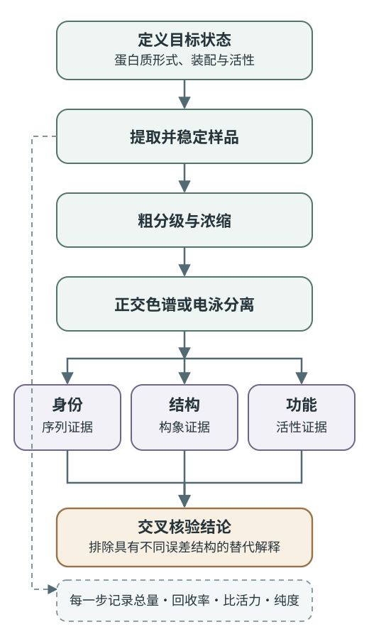

# 蛋白质研究方法

蛋白质研究需要根据样品状态和研究问题设计分级、检测与验证流程。细胞裂解液中的目标蛋白可能只占总蛋白的很小一部分；把它纯化出来，又可能丢失原有配体、脂质、修饰或亚基。电泳条带、色谱峰、质谱离子和三维密度图分别是蛋白质在不同实验条件下留下的投影。方法学的核心在于让样品状态、分离依据和最终要回答的问题彼此相容。

一条可靠的证据链通常从保持目标状态开始，经过逐步分级和定量，再用相互独立的方法确认身份、纯度、结构与活性。下图展示这些环节的一般依赖关系，具体步骤可按样品和目标调整。[^protein-fractionation-textbook]

{ loading=lazy }
/// caption
蛋白质研究从目标状态出发，经样品稳定与分级分离获得身份、结构和功能证据；各步骤同时记录总量、回收率、比活力与纯度。
///

## 样品状态与方法边界 { #sample-state }

### 蛋白质提取与状态保持 { #protein-extraction }

组织或细胞被破碎后，原本分隔的蛋白酶、氧化还原体系和底物进入同一溶液，稀释又会削弱亚基、配体和辅因子之间的可逆结合。提取缓冲液要围绕目标蛋白设计：pH 应落在蛋白稳定且满足后续分离的范围，离子强度既要抑制非特异聚集，也要保留必要的静电相互作用；温度、金属离子、甘油或特定配体则按已知稳定条件选择。低温能够减慢多种降解与变性过程，快速操作和针对性抑制剂则提供额外保护。

蛋白质的等电点（pI）是在规定溶液条件下平均净电荷为零的 pH，不表示每个可电离基团都不带电，也不表示溶液中只有一种微观质子化状态。严格说来，“等离子点”（isoionic point）指只含蛋白质及其平衡反离子时的零净电荷条件；实验中的盐种、离子强度、配体和修饰会使测得 pI 改变。许多生化流程把两词混用，因此报告 IEF 或电荷滴定结果时应同时给出测量条件，而不是把 pI 当作与环境无关的序列常数。

蛋白酶抑制剂必须按酶类覆盖。苯甲基磺酰氟（PMSF）主要不可逆抑制丝氨酸蛋白酶，在水溶液中又会水解，不能把一次加入 PMSF 理解为“抑制所有蛋白酶”。金属蛋白酶、半胱氨酸蛋白酶和酸性蛋白酶需要不同抑制策略；EDTA 能螯合金属，却也会夺走目标金属蛋白所需的辅因子，并妨碍固定化金属亲和层析。抑制剂组合应与目标活性和下一步操作一起决定。[^protease-inhibitors]

二硫键是否应被还原同样取决于研究对象。分析由二硫键连接的亚基时，可以并行比较还原与非还原条件；纯化依赖游离巯基的酶时，则常需抑制氧化。常见还原剂没有脱离条件的绝对“强弱排名”。

| 还原剂 | 主要化学特征 | 实验取舍 |
| --- | --- | --- |
| β-巯基乙醇（β-ME） | 单巯基通过巯基—二硫键交换维持还原环境 | 价格低、常需较高浓度，挥发且有强烈气味；残留会影响某些标记和定量反应 |
| 二硫苏糖醇（DTT） | 两个巯基还原二硫键后形成较稳定的分子内环状二硫化物 | 中性至碱性条件下反应较快，但会被空气氧化，低 pH 时有效巯基负离子比例下降 |
| 三(2-羧乙基)膦（TCEP） | 非巯基膦还原剂，不靠巯基交换完成反应 | 无巯基气味、抗空气氧化且可在较宽 pH 范围工作；仍需检查与金属、标记试剂及下游反应的兼容性 |

DTT、β-ME 和 TCEP 都可能改变蛋白质的天然共价拓扑，也可能干扰基于铜离子或游离巯基的测定。还原程度应以目标蛋白的天然共价状态和后续测定兼容性为准。[^reducing-agents]

### 膜蛋白的膜环境替代 { #membrane-protein-preparation }

可溶性蛋白通常把亲水表面暴露给缓冲液，整合膜蛋白却有大片疏水表面原本朝向脂质酰基链。去污剂浓度超过临界胶束浓度后，可用混合胶束包围这些表面并把蛋白带入水相；但去污剂种类、胶束大小和交换速率会改变亚基装配、构象平衡及结合脂质。能够高效提取膜蛋白的条件未必最能保持活性，筛选时应同时测定溶出比例、单分散性和功能。

膜支架蛋白纳米盘把一小片脂双层围成可溶颗粒，可在去污剂去除后为纯化蛋白恢复较接近膜的环境；两亲性聚合物形成的脂质颗粒则可在一些体系中连同周围脂质直接从膜中截取蛋白。纳米盘、聚合物盘、脂质体和去污剂胶束各自改变颗粒大小、曲率、脂质组成与两侧可接近性，不能把其中任何一种称为普遍的“天然状态”。[^membrane-mimetics]

## 分级纯化与定量评价 { #purification-path }

### 粗分级与样品复杂度降低 { #coarse-fractionation }

裂解后首先通过低速离心移除未破碎细胞和大块碎片，再按目标所在组分保留上清或沉淀。差速离心通过逐级提高离心力和时间，让沉降较快的颗粒先进入沉淀；每个沉淀仍是多种颗粒的混合物，并不因为“在某一转速沉下”就成为均一细胞器。速率区带离心把样品铺在预先形成的密度梯度上，主要按沉降速度形成区带；等密度离心则让颗粒移动到其浮力密度与介质相等的位置。

沉降系数定义为颗粒沉降速度 $v$ 与离心加速度 $\omega^2r$ 之比，即 $s=v/(\omega^2r)$，量纲为时间。它同时包含颗粒质量、溶剂浮力和摩擦阻力的信息，形状细长或水合程度高的蛋白即使质量相同，也可能具有不同 $s$ 值。分析型超速离心进一步利用沉降速度或沉降平衡曲线估计摩尔质量、形状、聚集和相互作用，和制备型离心的“收集某个沉淀”不是同一任务。

盐析利用高离子强度改变蛋白质水化和溶解度，常用来浓缩并粗分级；等电沉淀则在净电荷接近零时降低分子间静电排斥。两者都可能保持一部分蛋白活性，也都可能造成不可逆聚集，不能只按方法名称预判是否变性。有机溶剂沉淀、酸沉淀或加热处理通常更易扰动构象，适合性取决于目标蛋白的稳定性而非一条通则。

透析依靠小分子跨半透膜扩散来换液或脱盐，不主动浓缩大分子；超滤在压力或离心力作用下让溶剂和小溶质通过膜，同时截留大分子，因而可以浓缩并换液。膜的标称截留分子量不是锐利的筛孔边界，回收率还受蛋白形状、吸附、浓差极化和聚集影响。切向流动能降低膜面沉积，适合较大体积连续处理，但不是所有实验规模都需要。

一些经典方法从整体组成或依数性估计摩尔质量。若已知蛋白中每个分子恰含一个某种元素或稀有残基，其质量分数可给出“最低摩尔质量”；一旦实际拷贝数为 $n$，真实值就是该最低值的 $n$ 倍，所以未知化学计量时只能得到倍数关系。稀溶液渗透压满足理想近似 $\Pi/c\to RT/M$，可由 $c\to0$ 外推求数均摩尔质量，但电解质的 Donnan 效应、非理想相互作用和聚集都会改变渗透压。把样品调到 pI 并非渗透压法的普遍必要条件，反而可能诱发聚集。

### 纯化过程的回收率与富集 { #purification-metrics }

目标是酶时，每一步至少记录体积、总蛋白浓度和总活性。若组分体积为 $V$，蛋白浓度为 $C$，测得总活性为 $A$，则

$$
\text{总蛋白}=CV,\qquad
\text{比活力}=\frac{A}{CV}
$$

$$
\text{回收率}=\frac{A_i}{A_0}\times100\%,\qquad
\text{纯化倍数}=\frac{A_i/(C_iV_i)}{A_0/(C_0V_0)}
$$

比活力随步骤上升，说明目标活性相对于总蛋白得到富集；回收率下降则揭示代价。比活力平台可能意味着接近纯化极限，也可能是蛋白失活、抑制物共洗脱或活性测定进入非线性区。对没有便捷活性测定的结构蛋白，可以用特异 ELISA、定量质谱或其他可追踪信号替代，但必须说明这个信号究竟代表总量、可结合形式还是功能态。

一个染色条带或一个对称色谱峰都不足以证明化学均一。不同蛋白可能共迁移，聚集体与单体可能在某些条件下共洗脱，微量杂质也可能低于染色检测限。所谓“纯度”必须附带方法、检测波长、上样量和检测限；准备用于动力学、结构测定或治疗开发的样品，还需分别检查活性、聚集、化学修饰和内毒素等与用途相关的属性。

## 色谱分离与保留机制 { #chromatography }

色谱系统由固定相和流动相组成，样品组分反复经历吸附、分配或可逆结合。若讨论液—液分配，分配比必须写清分子和分母；例如 IUPAC 对某一确定化学形式给出的分配比可写为

$$
K_D=\frac{[A]_{\mathrm{extract}}}{[A]_{\mathrm{other\ phase}}}
$$

把它倒过来定义也可以，但必须明确说明。旧式笔记中“分配系数大者移动快”只有在特定系数定义和色谱体系下才成立，不能脱离两相与保留机制记忆。正相和反相只描述固定相、流动相的相对极性；峰拖尾是吸附位点、过载、传质或系统死体积等多种因素造成的峰形问题，并非正相色谱的定义特征。[^chromatography-nomenclature]

| 分离方式 | 主要分辨性质 | 结合或进入条件 | 常见洗脱与关键边界 |
| --- | --- | --- | --- |
| 离子交换色谱 | 给定 pH 下的表面净电荷与电荷分布 | 低至中等盐浓度下与相反电荷基团结合 | 增加盐浓度或改变 pH；相同 pI 的蛋白仍可因表面电荷斑块不同而分开 |
| 体积排阻色谱（SEC） | 溶液中的流体动力学尺寸 | 分子在不同程度上进入多孔填料 | 大颗粒较早洗脱；洗脱体积不能在未经校准和形状判断时直接等同于摩尔质量 |
| 疏水作用色谱（HIC） | 温和条件下暴露的疏水表面 | 常以较高盐浓度促进疏水结合 | 逐渐降低盐浓度洗脱；通常比反相色谱更有利于保持天然构象 |
| 反相高效液相色谱（RP-HPLC） | 在非极性固定相上的疏水保留 | 水相上样，常含离子对试剂或酸 | 提高有机相比例洗脱；适合肽和分析型分离，但有机溶剂可能使蛋白变性 |
| 亲和色谱 | 靶蛋白与固定配体的选择性结合 | 配体、标签或抗体必须可接近且仍能结合 | 加竞争配体或改变 pH、盐和金属状态；高选择性不排除非特异吸附和配体泄漏 |
| 羟基磷灰石色谱 | 蛋白表面与磷酸钙位点的复合相互作用 | 受磷酸盐、Ca$^{2+}$、pH 与表面电荷共同影响 | 常以磷酸盐梯度洗脱；不能简化成单一的“酸碱吸附” |

### 离子交换介质的命名 { #ion-exchange }

阴离子交换介质带正电，结合带负电的阴离子；阳离子交换介质带负电，结合带正电的阳离子。DEAE 基团质子化后带正电，是弱阴离子交换剂；CM 基团去质子化后带负电，是弱阳离子交换剂。名称指介质交换的对象，不是介质自身的电荷。[^ion-exchange-cellulose]

当缓冲液 pH 高于蛋白质 pI 时，蛋白整体趋向负电，可能结合阴离子交换介质；pH 低于 pI 时整体趋向正电，可能结合阳离子交换介质。但 pI 只是起点，真实保留还受局部电荷分布、构象和盐屏蔽影响。上样前换到低盐缓冲液，洗去未结合组分，再用盐梯度竞争静电作用，是常见流程；若蛋白在结合条件下不稳定，也可以设计“杂质结合、目标流穿”的负纯化。

梯度洗脱连续改变盐浓度或 pH，分段洗脱则在若干离散条件间跳变；前者便于分辨接近的组分，后者便于快速收集和放大。层析聚焦（chromatofocusing）让结合在离子交换介质上的蛋白随移动 pH 梯度接近各自 pI 后洗脱，与凝胶中蛋白停留在 pI 位置的 IEF 有相似的电荷逻辑，却是柱上的动态洗脱过程。

### 体积排阻与流体动力学尺寸 { #size-exclusion }

SEC 填料含有一定孔径分布。无法进入孔道的大分子主要走颗粒间体积，接近空隙体积 $V_0$ 洗脱；较小分子探索更多孔内体积，因而更晚洗脱。一个常用的无量纲分配量为

$$
K_{av}=\frac{V_e-V_0}{V_t-V_0}
$$

其中 $V_e$ 为洗脱体积，$V_t$ 为柱床总可用体积。球状标准蛋白可以建立 $V_e$ 与摩尔质量的经验校准，但细长蛋白、糖蛋白、去污剂—膜蛋白复合物和寡聚体的斯托克斯半径与同质量球状蛋白不同。SEC 因此很适合去除聚集体、换液和评估单分散性，却不是不加条件的“分子量秤”。

### 正交纯化步骤的组合 { #orthogonal-purification }

一个实用流程往往先用容量较高的离子交换、亲和或疏水作用步骤捕获目标，再用另一种分辨性质清除残留杂质，最后以 SEC 去除聚集体并换入测定缓冲液。连续使用两个相似阴离子交换柱，未必比“电荷—亲和—尺寸”组合提供更多独立选择性。步骤顺序还要考虑样品体积、盐浓度和稳定性：SEC 上样体积必须较小，HIC 的高盐流出液可直接衔接某些步骤，亲和洗脱中的咪唑或低 pH 则可能需要及时换液。

## 电泳条件与迁移物种 { #electrophoresis }

电泳迁移率由电场力与介质阻力共同决定。天然蛋白的净电荷、大小和形状同时起作用；凝胶孔径又产生分子筛效应。不同模式通过控制其中一些变量，把复杂差异投影到一条泳道或一个二维平面上。

| 方法 | 样品状态与分离依据 | 主要读出 | 不能直接推出 |
| --- | --- | --- | --- |
| Native PAGE | 尽量保留非共价装配；电荷、形状和大小共同决定迁移 | 复合物异质性、活性带、相对迁移变化 | 精确摩尔质量或确定亚基数 |
| SDS-PAGE | SDS 使多肽展开并赋予近似恒定的负电荷／质量比 | 主要按多肽链大小分离，估算表观相对分子质量 | 天然构象、非共价寡聚状态或绝对分子量 |
| 非还原／还原 SDS-PAGE | 分别保留或断开多数二硫键 | 判断二硫键连接是否改变迁移物种 | 二硫键的精确残基配对 |
| 等电聚焦（IEF） | 蛋白在 pH 梯度中移动，至净电荷接近零处聚焦 | 表观 pI 与电荷异质性 | 蛋白一定处于天然构象或化学均一 |
| 双向电泳 | 第一向 IEF，第二向 SDS-PAGE | 按电荷与大小正交展开复杂混合物 | 每个点天然只对应一个蛋白质形式 |

SDS-PAGE 中的多肽主要呈 SDS 包覆的延展链。多数蛋白在适当凝胶浓度下，其相对迁移率与摩尔质量对数近似线性，因此可与标准品比较；糖基化、强疏水跨膜区、异常 SDS 结合或不完全还原都会造成表观质量偏移。Laemmli 在 1970 年发表的不连续缓冲 SDS-PAGE 体系把样品先集中成窄带再进入分离胶，成为常用格式；其质量—迁移近似及偏差均取决于蛋白和凝胶条件。[^sds-page-laemmli]

移动界面电泳曾直接观察自由溶液中蛋白区界面的迁移，后来固定支持介质上的区带电泳因扩散较小、分辨率更高而成为常规。等速电泳在高迁移率的前导离子与低迁移率的尾随离子之间排列分析物，各组分形成相接而浓度自调节的区带，常用于预浓缩。毛细管电泳把分离通道缩小到毛细管，以高电场获得快速、高效分离；观测到的速度是分析物自身电泳迁移与电渗流的矢量和，不能概括为“所有带电粒子都向阴极”。毛细管内壁状态、pH、离子强度和温度都会改变电渗流及重复性。

## 抗体识别与信号检测 { #antibody-methods }

### 多克隆与单克隆抗体的来源 { #polyclonal-monoclonal }

多克隆抗体是多个 B 细胞克隆产生的抗体混合物，通常识别同一抗原上的多个表位；单克隆抗体来自一个克隆，具有统一的结合位点序列。多克隆试剂可能在抗原部分变性或某一表位被遮挡时仍保留信号，却有批次和交叉反应差异；单克隆试剂更明确、可持续重复制备，但单一表位的修饰或构象变化就可能使其失效。重组抗体可以固定序列来源，不过仍须在具体用途、样品和处理条件下验证选择性。

### Western blot 的大小分离与表位识别 { #western-blot }

Western blot 先用凝胶电泳分离蛋白，再把蛋白转移到硝酸纤维素或 PVDF 膜，封闭空余吸附位点，依次加入一抗和带标记的二抗或其他检测体系。每次洗涤都在分离“已结合”与“游离”试剂；显色、化学发光或荧光强度只在检测系统的线性范围内才可用于定量。Towbin、Staehelin 与 Gordon 于 1979 年发表的电泳转膜工作奠定了这种流程。[^western-transfer]

条带出现在预期表观质量附近只是身份支持，不是抗体特异性的充分证明。遗传敲除或敲低、独立抗体、标签蛋白、正负样品和正交质谱都可提供更强验证。定量时还要确认转移效率、曝光未饱和、各泳道上样处于线性范围，并避免把在不同膜或不同曝光条件下得到的条带直接相除。osm.bio 的 Western blot 故障页整理了气泡、膜方向、过度曝光和洗涤不足等常见现象，但其中固定电压、时间或试剂浓度不能脱离蛋白大小、膜孔径和转印体系照搬；这里仅保留“先定位流程环节”的诊断思路，并以抗体验证规范交叉核对。[^western-validation][^osm-western-troubleshooting]

### ELISA 格式与待测对象 { #elisa }

ELISA 把抗原或抗体固定在固相上，用酶促反应把特异结合转换为吸光或荧光信号。直接格式用带标记的一抗识别板上抗原；间接格式用未标记一抗和带标记二抗，便于信号放大；夹心格式先以捕获抗体富集抗原，再以识别另一表位的检测抗体形成复合物；竞争格式则让样品分析物与标记或固相参照物竞争有限结合位点，信号常与分析物含量呈反向关系。[^elisa-toolbox]

不论格式如何，定量都依赖标准曲线、空白、重复孔和适当基质对照。封闭降低非特异吸附，洗涤移除游离标记物；但过度封闭也可能遮蔽表位，样品基质还可能改变抗体结合或酶活。夹心 ELISA 需要捕获抗体与检测抗体识别可同时接近的不同表位，不能只因用了“两种抗体”就假定特异性和线性范围已经成立。

## 蛋白质总量、组成与序列测量 { #quantity-composition-sequence }

### 蛋白质定量与样品化学 { #protein-quantification }

| 方法 | 信号来源 | 适合场景 | 主要偏差与干扰 |
| --- | --- | --- | --- |
| $A_{280}$ | Trp、Tyr 和二硫键等的紫外吸收 | 已知序列、较纯蛋白的快速无损定量 | 不同蛋白消光系数差异大；核酸、浑浊和颗粒散射会抬高读数 |
| 双缩脲法 | 碱性条件下肽键与 Cu$^{2+}$ 形成有色配合物 | 蛋白浓度较高、组成差异影响相对较小的样品 | 灵敏度较低；螯合剂和能改变铜状态的成分会干扰 |
| Lowry 法 | 铜反应叠加 Folin–Ciocalteu 试剂还原 | 需要较高灵敏度的总蛋白测定 | 反应依赖部分侧链并受还原剂、螯合剂和多种缓冲成分影响 |
| BCA 法 | 蛋白还原 Cu$^{2+}$，BCA 与 Cu$^+$ 形成紫色配合物 | 微孔板定量、较宽工作范围 | DTT、TCEP 等还原剂及铜螯合剂可产生显著干扰 |
| Bradford 法 | Coomassie Brilliant Blue G-250 与蛋白结合引起吸收变化 | 快速、小体积测量 | 蛋白间响应差异较大，去污剂和超出线性区会改变结果 |
| 凯氏定氮／燃烧定氮 | 把样品总氮转为可测含氮产物，再以换算因子估计蛋白 | 食品、饲料或总物料的整体含氮分析 | 非蛋白氮也被计入；不同蛋白的氮质量分数不同，不能普遍固定为 16% |

任何一种比色法都应让标准品与样品处于尽量相同的缓冲背景，并设置试剂空白和覆盖预期范围的标准曲线。若样品需要大幅稀释才能避开去污剂或还原剂干扰，稀释后的信号仍必须高于定量下限。Lowry、Bradford 和 BCA 的原始论文建立了不同化学读出，后续比较显示同一蛋白在不同方法中的响应并不相同；所谓“蛋白浓度”因此应连同方法与标准品一起报告。[^protein-assays]

### 氨基酸组成分析与水解偏倚 { #amino-acid-analysis }

氨基酸组成分析先把蛋白水解为游离残基，再以离子交换或反相液相色谱分离，并用柱后茚三酮或柱前衍生化等方式检测。纸色谱、薄层色谱和经挥发性衍生化后的气相色谱在方法史和特定分析中仍有位置，但现代定量通常依赖自动化液相分离。常用强酸水解能充分断开许多肽键，却会破坏 Trp，使 Asn 与 Gln 分别以 Asp／Asn 总和（Asx）和 Glu／Gln 总和（Glx）出现，并不同程度损失 Ser、Thr、Tyr 及含硫残基。含硫氨基酸常在水解前氧化为更稳定的产物；Trp 可另用碱水解或其他专门条件测定。碱水解和酶水解又各有消旋、副反应、底物可接近性和裂解不完全等限制，并不存在“完全不损伤氨基酸”的通用水解法。[^amino-acid-hydrolysis]

组成分析可用于绝对蛋白定量、检查批次一致性或估计某些残基含量，却丢失了排列顺序。两个不同序列可以有完全相同的组成；水解后测得的 D/L 比例还包含样品原有构型、前处理和水解消旋的共同影响。因此它既不是完整测序，也不能在复杂混合物中单独证明某个蛋白的身份。

### 端基化学与逐步测序 { #terminal-sequencing }

Sanger 在 1945 年用 1-氟-2,4-二硝基苯（FDNB，又称 DNFB）标记胰岛素的游离氨基，酸水解后鉴定稳定的 DNP-氨基酸，由此判断肽链 N 端；这种端基分析本身只给出末端种类，不会逐残基读出全序列。丹磺酰氯也能形成灵敏的荧光衍生物，但同样通常在完全水解后只保留 N 端身份。[^sanger-end-group]

Edman 降解在弱碱条件下让苯基异硫氰酸酯（PITC）与游离 N 端反应，随后在较温和酸性条件下选择性释放首个残基并转化为可鉴定的 PTH-氨基酸，剩余肽链可进入下一循环。Edman 于 1949 年发表初步方法，1950 年由他单独发表详细反应；1967 年 Edman 与 Begg 报道自动蛋白质顺序分析仪。每轮偶联、裂解、转移和鉴定的收率低于 100%，副产物因而随循环累积，N 端封闭、样品混合和蛋白过长都会使读序失败。[^edman-history]

### 特异裂解与可解析肽段 { #protein-cleavage }

胰蛋白酶通常在 Lys 或 Arg 的羧基侧裂解，但后接 Pro、邻近修饰和三级结构可改变效率；糜蛋白酶偏好芳香族及部分疏水残基附近，Glu-C、Lys-C、Asp-N 和胃蛋白酶则有各自条件依赖的选择性。与 Pro 相邻时的影响须按具体酶和位置判断。甲硫氨酸羧基侧的经典化学裂解试剂为溴化氰（CNBr）；其副产物和甲硫氨酸氧化状态也会影响反应。

用两种不同特异性的裂解获得重叠肽段，曾是拼接长蛋白序列和定位二硫键的重要策略。还原后二硫键应及时烷基化游离 Cys，防止重新氧化。经典对角线电泳先分离含二硫键的肽，再在原位断键并以垂直方向重跑；偏离对角线说明迁移物种发生改变，却不能仅凭位于对角线上方或下方就普遍判定链内与链间二硫键。现代二硫键定位常比较还原与非还原酶解的 LC–MS/MS 结果，并用序列覆盖和碎片离子共同约束配对。

### 质谱的离子质量差与序列证据 { #mass-spectrometry }

质谱仪直接测量离子的质荷比 $m/z$。同一肽可形成多个电荷态，同一元素或肽也会产生同位素峰簇；电荷态、同位素峰簇和碎片系列共同提供质量与序列信息。软电离产生肽离子后，一级质谱给出前体离子的 $m/z$；串联质谱再选择前体、诱导碎裂并测量产物离子，肽键断裂形成的系列碎片提供序列约束。

肽质量指纹把特异酶解得到的一组肽质量与数据库中的理论酶切结果匹配，适合较纯蛋白；LC–MS/MS 则先分离肽段，再将实验碎片谱与理论谱匹配或进行 de novo 解释。数据库搜索会受到物种序列库、允许修饰、酶切规则和质量误差影响；多个蛋白共享肽段时，肽段身份也不自动唯一指定蛋白。诱饵库与错误发现率控制、独特肽段和正交证据都是把“最高分匹配”提升为可信鉴定所必需的环节。[^mass-spectrometry-identification]

## 光谱与三维结构方法的观察尺度 { #spectroscopy-structure }

### 溶液光谱与平均构象 { #solution-spectroscopy }

紫外差光谱比较两个状态的吸收差异，可感知芳香侧链微环境变化；内源荧光尤其受 Trp 周围极性、猝灭和能量转移影响。峰位或强度改变能够报告构象变化，却通常不能唯一指出是哪一个残基移动。荧光偏振或各向异性把分子转动速度与信号偏振联系起来，可用于结合和颗粒大小变化，但也受荧光寿命、局部探针运动与混合物影响。

远紫外圆二色谱（CD）主要反映肽键排列，可比较 α-螺旋、β-结构和无规构象的整体变化；近紫外 CD 更多反映芳香侧链与二硫键的不对称环境。由 CD 谱反演“二级结构百分比”依赖参考谱库、浓度、光程和基线，适合作为整体约束，不应代替残基级结构测定。浑浊、强吸收缓冲液和去污剂会使短波段数据失真，记录谱线时应同时报告样品浓度、池长、温度与缓冲液。

### 原子模型的数据约束 { #structural-methods }

| 方法 | 主要实验数据 | 适合的问题 | 核心限制与质量线索 |
| --- | --- | --- | --- |
| X 射线晶体学 | 晶体衍射强度及由此获得的电子密度 | 原子级折叠、配体和活性位点 | 需要有序晶体；分辨率、$R$／$R_{free}$、几何和模型—密度拟合共同约束可信度 |
| NMR 波谱 | 化学位移、原子间距离、取向和动力学等约束 | 溶液构象、局部运动和相互作用 | 谱峰重叠与样品大小、浓度限制解析；结构集合表示满足约束的构象，不等于逐帧运动轨迹 |
| 单颗粒冷冻电镜 | 玻璃态冰中大量粒子的二维投影及三维重构密度 | 大型复合物、多个构象状态和膜蛋白 | 取向偏好、颗粒异质性、局部分辨率和模型—密度拟合都需检查；密度图不是自动生成的原子坐标 |

X 射线、NMR 和冷冻电镜不会直接拍出一个无解释的“真实分子”。实验数据与已知共价几何、序列和建模假设共同形成最终坐标；柔性区可能缺少密度或约束，不同构象也可能在平均处理中被合并。PDB-101 对三类方法的说明和 wwPDB 方法特异的验证报告都强调，应同时检查原始或派生实验数据、模型几何以及模型对数据的拟合，而不只看一张彩色结构图或一个全局分辨率数值。[^structure-determination][^structure-validation]

## 固相肽合成与序列假说验证 { #solid-phase-peptide-synthesis }

测得序列之后，化学合成可以构建带有非天然残基、同位素、荧光基团或特定位点修饰的肽，用来检验结合位点和酶切规则。肽键形成要求一个氨基与一个活化羧基选择性反应，其他 α-氨基、羧基和侧链官能团需要暂时保护；保护基必须能在规定步骤去除，又不能破坏此前形成的肽键和其他保护关系。

Merrifield 在 1963 年报道的固相肽合成（SPPS）把首个氨基酸的 C 端固定在不溶性树脂上，随后沿 C 端到 N 端方向重复“去除 N 端保护基—偶联下一个受保护氨基酸—洗去过量试剂”。Fmoc 和 Boc 是常见的 α-氨基保护策略，羧基需由碳二亚胺、活化酯或其他缩合体系活化；完成组装后再移除侧链保护基并从树脂裂解产物。树脂让每轮洗涤变得简便，却不能消除消旋、缺失肽、天冬酰亚胺形成和聚集等副反应。[^solid-phase-peptide-synthesis]

若单轮偶联收率为 $y$，连续 $n$ 轮全部正确的理论比例约为 $y^n$；即使 $y=0.99$，经过 50 轮也只有约 $0.99^{50}\approx0.61$。长肽因此需要更严格的循环监测，并在裂解后用 RP-HPLC 纯化、质谱确认分子形式。合成产物具有预期质量仍不保证形成天然折叠或生物活性；这些结论必须再由结构、结合和功能实验建立。

## 方法间的证据闭环 { #evidence-loop }

方法选择从“需要区分哪些候选解释”开始。若想知道蛋白是否为二硫键连接的二聚体，还原／非还原 SDS-PAGE 可提供初筛，SEC–多角度光散射或分析型超速离心可测溶液中的装配，质谱可定位共价连接，突变与活性测定再判断该连接是否有功能意义。四种实验观察的是不同状态，不应只选择最符合预期的一种。

纯化得到的蛋白能催化反应，证明规定条件下的分子活性；Western blot 在细胞中出现目标大小条带，证明相应表位存在于某个迁移物种；冷冻电镜密度支持某种构象，却不自动给出细胞内的占据比例。把这些证据连起来时，应保留蛋白来源、缓冲液、温度、配体、修饰、浓度和时间尺度。方法的价值不在于给结论增添仪器名称，而在于用彼此不同的误差结构共同排除替代解释。

更具体的上样、层析柱操作、凝胶配制和仪器质控将在[分离技术与蛋白质分析](../exptech/biochem_molecular/separation_protein.md)与[光谱测定与生化定量](../exptech/biochem_molecular/spectroscopy_assays.md)中展开；蛋白质组数据处理、肽谱匹配和错误发现率则见[蛋白质组学](../bioinfo/proteomics.md)。阅读实验结果时，还应把这里的方法条件与[蛋白质结构](protein_structure.md)和[蛋白质功能](protein_function.md)中讨论的构象、装配和活性边界对应起来。

## 参考资料与延伸阅读

- Alberts, B. et al. [Fractionation of Cells](https://www.ncbi.nlm.nih.gov/books/NBK26936/). *Molecular Biology of the Cell*, 4th ed.
- Scopes, R. K. *Protein Purification: Principles and Practice*, 3rd ed. Springer, 1994.
- IUPAC. [Nomenclature for chromatography](https://old.iupac.org/reports/1993/6504ettre/index.html)；[partition ratio](https://goldbook.iupac.org/terms/view/P04440)；[ion-exchange chromatography](https://goldbook.iupac.org/terms/view/I03168)。
- Fountoulakis, M. & Lahm, H.-W. [Hydrolysis and amino acid composition of proteins](https://pubmed.ncbi.nlm.nih.gov/9917165/). *Journal of Chromatography A* 826, 109–134 (1998).
- EMBL-EBI Training. [Protein identification](https://www.ebi.ac.uk/training/materials/proteomics-bioinformatics-materials/protein-identification/protein-identification/).
- RCSB PDB-101. [Methods for Determining Structure](https://pdb101.rcsb.org/learn/guide-to-understanding-pdb-data/methods-for-determining-structure)；wwPDB [Validation Reports](https://www.wwpdb.org/validation/validation-reports)。
- Janeway, C. A. Jr et al. [Immunologists' Toolbox](https://www.ncbi.nlm.nih.gov/books/NBK10755/). *Immunobiology*, 5th ed.

[^protein-fractionation-textbook]: Alberts et al., [Fractionation of Cells](https://www.ncbi.nlm.nih.gov/books/NBK26936/)。该章把细胞分级、差速与梯度离心、蛋白质色谱、SDS-PAGE、二维电泳、Western blot 和肽质量指纹放在同一条实验链中；本页据现代方法边界重组，而不照搬其历史定量示例。
[^protease-inhibitors]: Burgess, R. R., [Overview of the Purification of Recombinant Proteins](https://pmc.ncbi.nlm.nih.gov/articles/PMC4410719/). *Methods in Enzymology* 463, 331–342 (2009)；另见蛋白质组样品流程中对 PMSF 水溶液不稳定性的操作说明：[SCX/IMAC enrichment approach](https://pmc.ncbi.nlm.nih.gov/articles/PMC2728452/)。
[^reducing-agents]: [Use of Protein Folding Reagents](https://pmc.ncbi.nlm.nih.gov/articles/PMC4821428/). *Current Protocols in Protein Science* (2016)。该资料比较 DTT、β-ME 与 TCEP 的化学性质；正文不采用脱离 pH、浓度和下游兼容性的绝对效力排名。
[^membrane-mimetics]: Dörr, J. M., [Recent advances in membrane mimetics for membrane protein research](https://pmc.ncbi.nlm.nih.gov/articles/PMC10317169/). *Essays in Biochemistry* 67, 119–131 (2023)。该综述比较去污剂、纳米盘、SapNP、peptidisc 与 SMALP 对脂质环境和复合物稳定性的不同影响。
[^chromatography-nomenclature]: IUPAC, [Nomenclature for chromatography](https://old.iupac.org/reports/1993/6504ettre/index.html)与 Gold Book [partition ratio](https://goldbook.iupac.org/terms/view/P04440)。分配比的相次序必须显式定义；色谱保留不能用未定义的单一系数口诀概括。
[^ion-exchange-cellulose]: Matsumoto, K., Hirayama, C. & Motozato, Y. [Preparation of Bead-shaped Cellulosic Ion Exchangers](https://doi.org/10.1246/nikkashi.1981.1890). *Nippon Kagaku Kaishi* 1981, 1890–1898。该文明确 DEAE-cellulose 为阴离子交换介质、CM-cellulose 为阳离子交换介质；术语定义另见 IUPAC [ion-exchange chromatography](https://goldbook.iupac.org/terms/view/I03168)。
[^sds-page-laemmli]: Laemmli, U. K. [Cleavage of structural proteins during the assembly of the head of bacteriophage T4](https://pubmed.ncbi.nlm.nih.gov/5432063/). *Nature* 227, 680–685 (1970)。这篇论文中的不连续 SDS-PAGE 体系成为常用蛋白电泳格式。
[^western-transfer]: Towbin, H., Staehelin, T. & Gordon, J. [Electrophoretic transfer of proteins from polyacrylamide gels to nitrocellulose sheets](https://pmc.ncbi.nlm.nih.gov/articles/PMC411572/). *Proceedings of the National Academy of Sciences USA* 76, 4350–4354 (1979)。
[^western-validation]: Pillai-Kastoori, L. et al. [Antibody validation for Western blot: By the user, for the user](https://pmc.ncbi.nlm.nih.gov/articles/PMC6983856/). *Journal of Biological Chemistry* 295, 926–939 (2020)。文章强调抗体验证须针对具体实验情境，并以遗传、独立抗体或正交方法验证选择性与可重复性。
[^osm-western-troubleshooting]: osm.bio，[Western blot 条带结果分析整理](https://osm.bio/index.php?title=Western_blot条带结果分析整理&oldid=11140)，CC BY-SA。正文仅改编其“按转移、封闭、抗体与检测环节定位异常”的线索；固定参数和带有绝对性的处置建议未采用，并以 Towbin 原始工作与抗体验证综述交叉核验。
[^elisa-toolbox]: Janeway et al., [Immunologists' Toolbox](https://www.ncbi.nlm.nih.gov/books/NBK10755/)。该附录说明 ELISA 中固相固定、封闭、洗涤、酶标检测、夹心格式和竞争格式的共同逻辑。
[^protein-assays]: Lowry, O. H. et al. [Protein measurement with the Folin phenol reagent](https://pubmed.ncbi.nlm.nih.gov/14907713/). *Journal of Biological Chemistry* 193, 265–275 (1951)；Bradford, M. M. [A rapid and sensitive method for the quantitation of microgram quantities of protein](https://pubmed.ncbi.nlm.nih.gov/942051/). *Analytical Biochemistry* 72, 248–254 (1976)；Smith, P. K. et al. [Measurement of protein using bicinchoninic acid](https://pubmed.ncbi.nlm.nih.gov/3843705/). *Analytical Biochemistry* 150, 76–85 (1985)；综合适用条件见 Cold Spring Harbor Protocols, [Methods for Measuring the Concentrations of Proteins](https://doi.org/10.1101/pdb.top102277)。
[^amino-acid-hydrolysis]: Fountoulakis, M. & Lahm, H.-W. [Hydrolysis and amino acid composition of proteins](https://pubmed.ncbi.nlm.nih.gov/9917165/). *Journal of Chromatography A* 826, 109–134 (1998)。该综述把水解、残基分离和检测视为一个整体，并详述酸碱和酶水解对敏感残基、消旋及定量的影响。
[^sanger-end-group]: Sanger, F. [The free amino groups of insulin](https://pmc.ncbi.nlm.nih.gov/articles/PMC1258275/). *Biochemical Journal* 39, 507–515 (1945)。这项工作是 FDNB 端基分析，不应与后来完成的胰岛素全序列等同。
[^edman-history]: Edman, P. [A method for the determination of amino acid sequence in peptides](https://pubmed.ncbi.nlm.nih.gov/18134557/). *Archives of Biochemistry* 22, 475–476 (1949)；[Method for Determination of the Amino Acid Sequence in Peptides](https://doi.org/10.3891/acta.chem.scand.04-0283). *Acta Chemica Scandinavica* 4, 283–293 (1950)；Edman, P. & Begg, G. [A Protein Sequenator](https://doi.org/10.1111/j.1432-1033.1967.tb00047.x). *European Journal of Biochemistry* 1, 80–91 (1967)。三篇文献分别对应初步报告、Edman 单独发表的详细方法和自动化顺序分析仪。
[^mass-spectrometry-identification]: EMBL-EBI Training, [Protein identification](https://www.ebi.ac.uk/training/materials/proteomics-bioinformatics-materials/protein-identification/protein-identification/)；Merkley, E. D. et al. [Flying blind, or just flying under the radar?](https://pmc.ncbi.nlm.nih.gov/articles/PMC7454419/). *Protein Science* 29, 1864–1878 (2020)。两者分别说明肽谱—序列匹配、诱饵库与错误发现率，以及数据库搜索与 de novo 解释的适用边界。
[^structure-determination]: RCSB PDB-101, [Methods for Determining Structure](https://pdb101.rcsb.org/learn/guide-to-understanding-pdb-data/methods-for-determining-structure)。该指南区分 X 射线衍射、NMR 约束和三维电镜密度等实验数据与由其建立的原子模型。
[^structure-validation]: wwPDB, [Validation Reports](https://www.wwpdb.org/validation/validation-reports)。报告按 X 射线、NMR 和 EM 分别评价模型几何、实验数据与模型—数据拟合；单一全局分辨率不能替代方法特异的质量检查。
[^solid-phase-peptide-synthesis]: Merrifield, R. B. [Solid Phase Peptide Synthesis. I. The Synthesis of a Tetrapeptide](https://pubs.acs.org/doi/10.1021/ja00897a025). *Journal of the American Chemical Society* 85, 2149–2154 (1963)；现代保护、偶联与副反应概览见 [Introduction to Peptide Synthesis](https://pmc.ncbi.nlm.nih.gov/articles/PMC3564544/)。
