# 细胞膜与跨膜运输

先看下面这张红细胞膜的电镜照片。把细胞内外分开的，只是两道很靠近的暗线；旁边的模型才把夹在其中的脂质和蛋白质展开给我们看。脂双层厚约 5 nm，已经薄到普通光学显微镜分辨不出它的两面，却要挡住大多数离子，留住细胞内的代谢物，还得允许营养物进入、信号传递和整个细胞变形。厚度没多少，工作倒是排得很满。[^membrane-structure]

[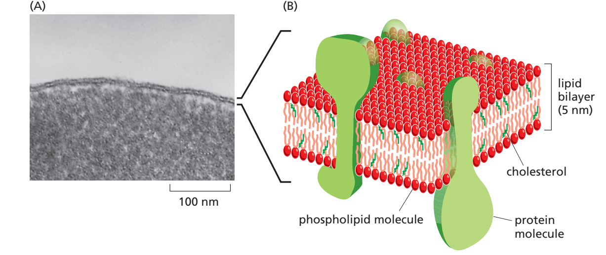{ width="680" height="287" }](_img/membrane_transport/membrane-overview.jpg)
/// caption
左侧是实际膜截面，右侧是帮助理解组成的模型。电镜的明暗来自样品处理与成像对比，不能把每条暗线直接当作一排磷脂头部。注意左图的 100 nm 比例尺与右图标出的双层厚度。[^fig-mboc-10-1]
///

膜能做这些事，与它的材料和组织方式有关。脂质构成连续屏障，蛋白质在其中开辟选择性的通路；两者都在运动，膜的两面却仍维持着不同的组成。先把这张膜看清楚，再去追踪一个离子或一个葡萄糖分子，就容易理解运输为什么会这样发生。

## 脂双层怎样把内外分开 { #bilayer-boundary }

### 两亲分子、自组装与封闭 { #bilayer-self-assembly }

一个常见的膜磷脂有能与水相互作用的头部，也有两条不喜欢暴露在水中的烃链。把很多这样的分子放在水中，烃链聚到一起、头部留在表面的排列比较有利。双尾膜脂的形状适合排成双层：一层头部朝外侧水相，另一层朝内侧水相，两层的尾部在中间相遇。脂质结构的细节可以回看[膜脂](../biochem/lipid.md#membrane-lipids)，这里先记住这种空间安排。

“疏水”很容易让人想成两条尾巴互相吸引、拼命拥抱。实际的自组装包含水的作用：非极性表面分散暴露时，会影响周围水分子的排列；把这些表面聚在一起，可以减少这种接触。烃链之间的范德华作用、头基之间的作用以及水和离子，也共同影响双层是否稳定。

一片双层仍有一个麻烦：边缘。头部可以遮住上下两面，却遮不住切口处露出的烃链。让片层弯曲并闭合，便能消除这圈边缘。因此，合适条件下脂质会形成封闭囊泡，小的暂时性破口也可能自行封合。这个结果并不需要细胞先发出一道“请闭合”的指令。

[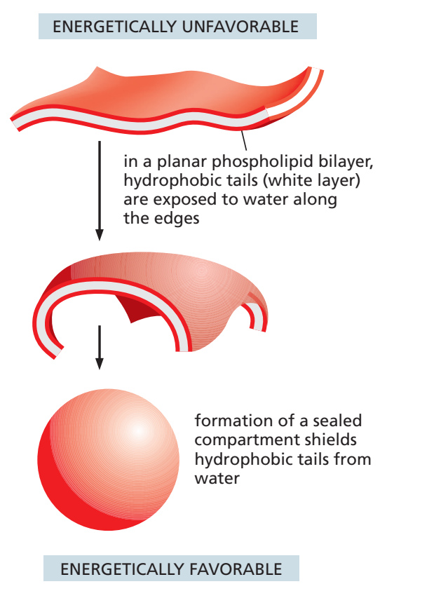{ width="390" height="515" loading="lazy" }](_img/membrane_transport/bilayer-closure.jpg)
/// caption
沿边缘看：开放片层使疏水部分接触水，闭合后这圈暴露的边缘消失。[^fig-mboc-10-8]
///

[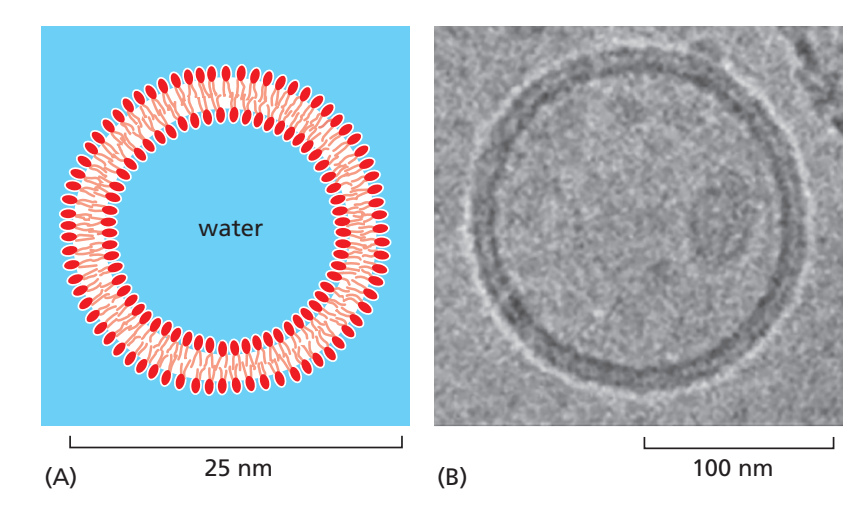{ width="470" height="290" loading="lazy" }](_img/membrane_transport/liposome.jpg)
/// caption
模型中的内部装着水；真实脂质体也确实形成了封闭边界。两幅图的比例尺不同，不要直接按画面大小比较囊泡直径。[^fig-mboc-10-9]
///

这种人工脂质囊泡称为**脂质体（liposome）**。它让我们可以先研究一张成分已知的膜，再逐一加入蛋白质，观察通透性或运输能力怎样改变。脂质体也不会在水中一碰面就自动融合：两张膜表面的水合层构成接近的障碍，生物膜融合还需要相应蛋白质帮助克服它。能自行封闭，与能随意融合，是两件事。

### 什么能直接穿过脂双层

穿膜的分子必须先进入双层内部，再从另一面出来。O$_2$、CO$_2$ 等小分子容易进入疏水环境，类固醇激素等脂溶性分子也较容易通过；水、尿素等小而不带电的极性分子也能通过，但速率通常较低。葡萄糖有许多羟基，进入疏水核心的代价已经很大；Na$^+$、K$^+$ 等离子还带有电荷和周围的水合层，让它们直接钻过双层尤其困难。这里不能只按分子直径排队：一个小离子，完全可能比一个较大的疏水分子更难通过。[^transport-principles]

低通透性为细胞留下了维持内外差别的机会。随后只需加入特定通道或载体，就能显著改变某一类物质的通量。许多细胞的快速水运输依赖水通道蛋白，也是这个道理；水能自行穿膜，并不意味着裸脂双层已经能满足所有组织的水通量。

## 膜里的分子一直在动 { #membrane-mobility }

### 左右移动容易，换一面却很费劲

教科书常把磷脂画得整整齐齐，像两排站军姿的小人。那是为了让我们看懂双层，分子本身并没有这么守纪律。它们会侧向移动、绕长轴旋转，烃链也不断弯折。下面左图是分子模拟，更接近这种热运动下的杂乱状态；右图才把几种运动分开表示。

[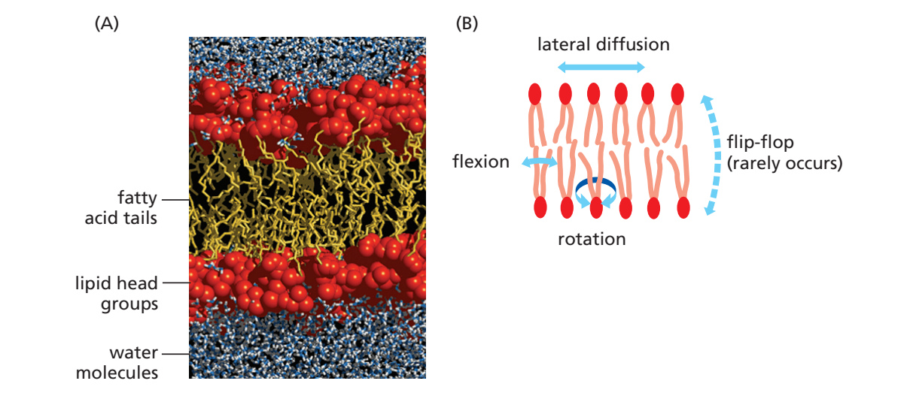{ width="650" height="291" loading="lazy" }](_img/membrane_transport/lipid-motion.jpg)
/// caption
同一叶片中的侧向扩散很快；从一个叶片翻到另一个叶片，需要亲水头部穿过疏水核心，普通磷脂的自发翻转因此慢得多。左图为模拟，并非显微照片。[^fig-mboc-10-10]
///

双层中的每一层也称为一个**叶片（leaflet）**。分子在同一叶片内换邻居时，亲水头部仍接触水，烃链仍处在疏水环境；跨层翻转却要暂时破坏这个安排。于是，一张膜可以在平面内相当流动，同时长期保持两个叶片的组成不同。胆固醇只有一个较小的羟基需要跨过核心，其跨层移动通常比磷脂快，不能把所有膜脂的翻转速率视为相同。

### 脂肪酸链与胆固醇怎样改变膜的物性 { #fluidity-curvature }

烃链之间接触得越充分，越容易形成紧密、有序的排列。较长的饱和链有较多相互接触的部位，降温时也更容易排成较有序的状态；短链或带顺式双键的链则不容易如此紧密堆积。顺式双键处的弯折很直观：一排笔直的链中塞进几条带弯的，邻居们就很难再贴得严丝合缝。

[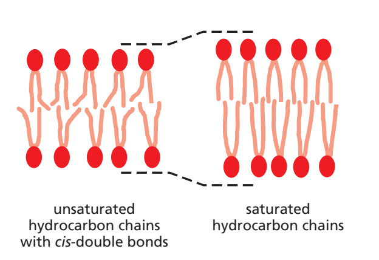{ width="410" height="281" loading="lazy" }](_img/membrane_transport/chain-packing.jpg)
/// caption
看双键造成的弯折怎样妨碍相邻链靠拢。图示比较的是堆积倾向，真实膜还含多种脂质和大量蛋白质。[^fig-mboc-10-11]
///

胆固醇的羟基靠近头部，刚性的甾环插在烃链之间，限制靠近头部的链段摆动，使这部分双层较难变形，也可降低小型水溶性分子的通透性。但它同时打乱整齐的结晶式排列，降低低温下膜脂排成凝胶状态的倾向。因此，“胆固醇增加还是降低流动性”需要带上温度、膜脂组成和测量对象来回答。把它记成一个永远朝同一方向拨动的开关，反而不如看一眼它插在哪里。[^membrane-structure]

膜的厚度和弯曲也与材料有关。较长的烃链通常形成较厚的疏水核心；头部与尾部占据的截面积不同，或两个叶片面积不匹配，则会使某些曲率更容易形成。蛋白质还能插入一侧叶片、搭起弯曲支架，或借助肌动蛋白和马达施力。出芽、融合和细胞器管网所需的曲率，就是脂质形状与这些蛋白质动作共同产生的。反过来，已经弯曲的膜面也会更容易容纳某些形状的脂质和蛋白质，进一步改变局部组成。

### 怎样知道膜蛋白也能移动 { #fluid-mosaic-evidence }

脂双层可以流动，嵌进去的蛋白质会不会被固定在原地？1970 年的人鼠细胞融合实验把这个问题处理得很漂亮：把两种细胞融合，用两种荧光分别认出人和小鼠的表面蛋白，再比较不同时间的标记位置。刚融合时，两种颜色主要各占一边；随后逐渐混合。只要能分清“原来属于哪边”，分子的移动就有了可追踪的标记。[^cell-fusion]

???+ abstract "把两种细胞的表面拼在一起"

    [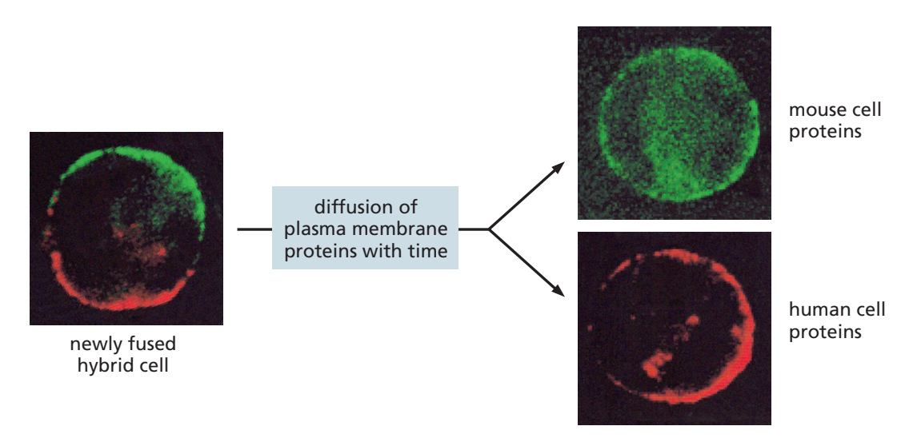{ width="610" height="296" loading="lazy" }](_img/membrane_transport/cell-fusion.jpg)
    /// caption
    图中展示融合后的标记分布及后续混合。它支持表面蛋白能够侧向再分布；不同蛋白的速度、限制范围，还需要其他实验测量。[^fig-mboc-10-32]
    ///

    Frye 与 Edidin 的实验让可移动膜蛋白的认识获得了直接支持。1972 年 Singer 与 Nicolson 提出的流动镶嵌模型，把连续脂双层与嵌入其中的两亲性蛋白组织起来；后来发展的荧光漂白恢复、单分子追踪等方法，进一步测量了运动的速率和限制。这里有一个时间顺序：后来的精细测量丰富了模型，并不是所有实验都在模型提出前已经做完。[^fluid-mosaic]

**荧光漂白恢复（fluorescence recovery after photobleaching，FRAP）**提供了另一种办法。先让目标膜分子带上荧光，再用一束强光把局部的荧光团漂白。这个小区域突然暗下去，周围却仍然发亮。如果带标记的分子能移动，未漂白的分子就会进入这里，局部亮度逐渐恢复。

[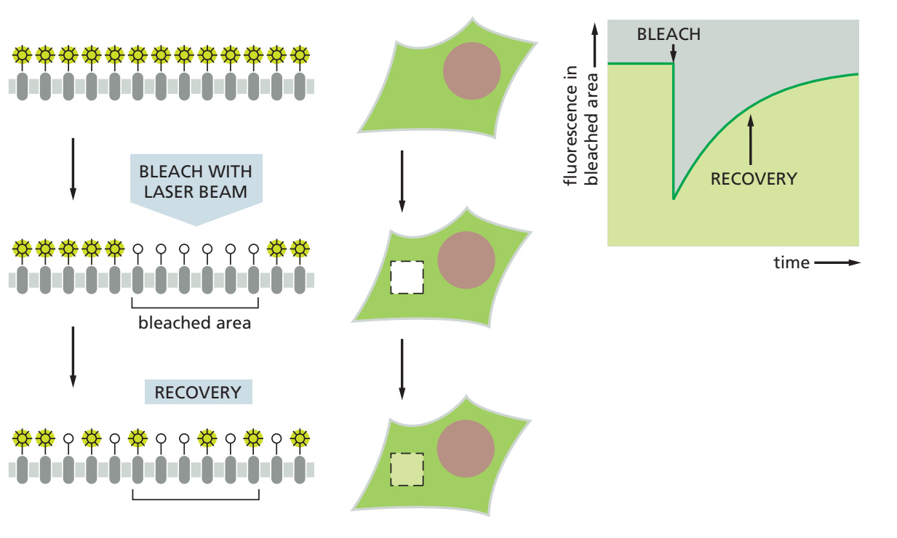{ width="650" height="390" loading="lazy" }](_img/membrane_transport/frap.jpg)
/// caption
沿左侧三步看局部标记怎样变化，再读右侧曲线：漂白时骤降，之后恢复。恢复的是观测区域的亮度，不是原来被漂白的荧光团重新发光。[^fig-mboc-10-33]
///

恢复快慢可用来估计扩散相关参数；最终恢复到多少，还反映了实验时间内能参与交换的分子比例。分析时需要考虑漂白区域大小、观测时长，以及分子在膜与胞质之间的交换。单看一条没有完全回到起点的曲线，还不足以宣布“剩下的蛋白全被骨架钉住了”。

!!! question "读图练习：暗区为什么又亮了？（自编）"

    假设目标蛋白只在膜平面内交换，实验期间可以忽略新蛋白合成。对同一种细胞，漂白一个小圆区和一个较大的圆区，都能观察到荧光恢复。这是否说明被漂白的蛋白被细胞修复了？两种区域的恢复时间能否不作修正地直接比较？

    ??? success "解析"

        局部恢复来自未漂白分子进入观测区域，已漂白分子也可离开。漂白改变了荧光团的发光能力，并没有把蛋白从膜上抹掉。区域尺度会影响扩散恢复所需的时间，因此比较恢复时间必须考虑漂白几何条件；不能把“区域更大、恢复更慢”直接解释为蛋白扩散能力下降。

### 流动的膜为什么还会分区 { #membrane-domains-caveolae }

如果只看融合实验，很容易把膜想成一片可以任意游动的海面。把时间和空间分辨率再提高，情况就有趣了：一个分子可能先在很小的范围内兜圈子，过一阵才进入旁边的区域。

[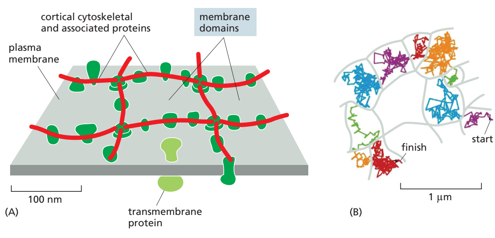{ width="650" height="313" loading="lazy" }](_img/membrane_transport/hop-diffusion.jpg)
/// caption
左图表示膜下骨架及其相连蛋白可能构成的围栏；右图为单分子轨迹，颜色帮助区分不同停留区。先看分子在哪里反复折返，再看它如何跨到相邻区域。[^fig-mboc-10-39]
///

膜下的肌动蛋白网、与它连接的跨膜蛋白，以及较大的蛋白复合体，都可能形成暂时的障碍。分子仍在热运动，只是它能进入的空间受到了限制。单分子追踪中的这种分区与跨区运动，常称为跳跃扩散；其尺度和持续时间依分子、细胞和测量条件而变。红细胞的 spectrin—actin 骨架则是膜与骨架共同工作的另一个清楚例子，详见[红细胞变形能力](../physiology/blood/blood_cell.md#erythrocyte-mechanics)。[^hop-diffusion]

脂质也参与组织膜域。胆固醇和鞘脂有利于某些较有序的局部区域，蛋白质间相互作用、皮层骨架、曲率和两个叶片的耦联又会改变这些区域的寿命和组成。所谓脂筏，最好放在这样的动态背景中理解，而不要先在脑中画出一块边界永久不变的小岛。

???+ note "分离出一份膜组分，等于看见了活细胞中的脂筏吗？"

    用低温去垢剂处理膜后，可以得到较难溶解的“去垢剂抗性膜”组分。但去垢剂本身会重新安排脂质和蛋白质，分离产物已经经历过一轮处理。它能提供组成与相互作用的线索；要判断活细胞中有没有相应的膜域，还应结合成像、动力学和扰动实验。把方法得到的组分直接命名成原位结构，容易在第一步就走得太远。[^detergent-resistant-membranes]

## 一张膜的两面，各有各的工作 { #membrane-asymmetry }

### 叶片组成与表面方向 { #leaflet-composition }

既然磷脂很少自行翻到另一面，细胞就能让两个叶片保有不同配方。以人红细胞质膜为例，磷脂酰胆碱（PC）和鞘磷脂较多分布在外侧，磷脂酰乙醇胺（PE）与磷脂酰丝氨酸（PS）较多分布在胞质侧；糖脂的糖链伸向细胞外。看图时可以逐一认出同一种头部，比较它在两层中的数量。

[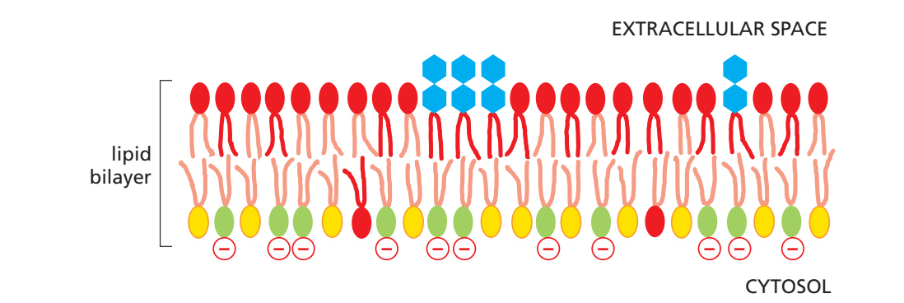{ width="650" height="218" loading="lazy" }](_img/membrane_transport/leaflet-asymmetry.jpg)
/// caption
上方为细胞外侧，下方为胞质侧。图表示人红细胞中的典型分布，不能作为所有细胞膜通用的固定配方。[^fig-mboc-10-15]
///

胞质侧的 PS 和磷脂酰肌醇及其磷酸化衍生物，还为蛋白质提供带负电的结合表面和特定识别位点。受体、酶和膜骨架在这里装配，正好与外侧负责配体结合、细胞识别的表面相接。两侧的脂肪酸不饱和度和堆积也可以不同；例如对红细胞等哺乳动物膜的研究显示，外叶片相对富含较饱和的脂质。具体物性仍应随所测细胞与方法说明。[^leaflet-asymmetry]

| 膜面 | 常见的组成或朝向 | 与后文的联系 |
| --- | --- | --- |
| 非胞质侧；质膜处即细胞外侧 | PC、鞘磷脂和糖脂较丰富，糖链伸向这一侧 | 细胞识别、外界配体结合；内吞后成为囊泡腔面 |
| 胞质侧 | PE、PS、磷脂酰肌醇及磷酸肌醇较丰富 | 招募信号蛋白、膜骨架、包被和胞质运输机器 |

### 翻转酶、外翻酶与扰乱酶 { #lipid-translocases }

不容易自行跨层，对维持不对称很有利，却给膜生长出了道难题。新磷脂主要在内质网膜的胞质侧合成；如果它们全留在这里，两层就不能一起扩展。细胞因此需要帮助脂质跨层的蛋白质。

[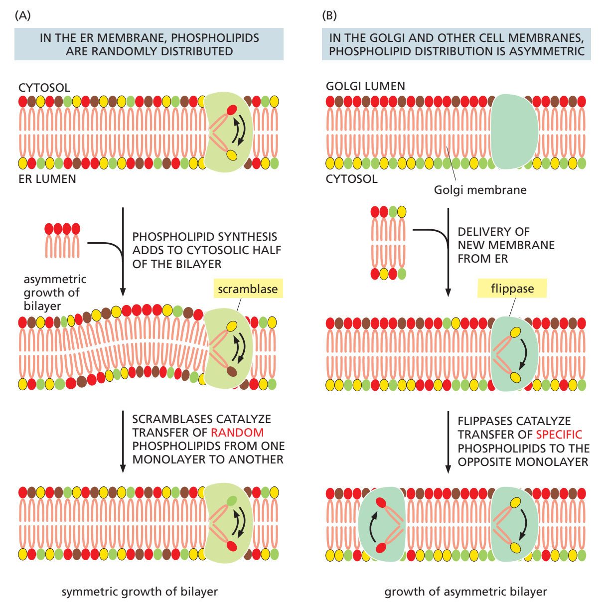{ width="660" height="663" loading="lazy" }](_img/membrane_transport/lipid-translocases.jpg)
/// caption
左图从“新脂质只加到胞质侧”开始，观察扰乱酶怎样让两层一起增长；右图显示定向转位如何改变组成。[^fig-mboc-12-39]
///

**脂质扰乱酶（scramblase）**降低脂质跨层的障碍，促进双向重分布，本身通常不直接用 ATP 把脂质泵向特定一侧。相对地，许多 **P4 型 ATP 酶**利用 ATP 将特定脂质转到胞质侧，常称为翻转酶；一部分 **ABC 转运体**将特定脂质送向非胞质侧，承担外翻酶功能。不同成员的底物范围并不一样，名称概括的是方向和作用，不能替代具体蛋白的选择性。

内质网中的持续重分布有助于膜生长；质膜上的某些扰乱酶则由信号激活。两个场景使用了相近的物理原理，却承担不同任务。

???+ note "同样是 PS 外露，血小板和凋亡细胞在做不同的事"

    静息血小板把多数 PS 保持在胞质侧。强烈激活时，胞质 Ca$^{2+}$ 上升，TMEM16F 相关脂质扰乱使 PS 暴露在外侧，负电表面有利于凝血反应复合体装配。其中包括 FIXa—FVIIIa 组成的内源性 X 因子酶复合体，以及 FXa—FVa 组成的凝血酶原酶复合体。这项促凝作用由外露 PS 承担，不能换写成 PC。[^tmem16f]

    凋亡细胞的 PS 外露常涉及受半胱天冬酶调节的 XKR8 等蛋白，并可成为吞噬清除的识别线索。看到“PS 在外面”，还要接着看是哪种细胞、发生在什么状态；同一个分子的朝向变化，在两个故事里有不同的后续。[^xkr8]

### 膜蛋白怎样嵌进去 { #membrane-protein-topology }

蛋白质要留在双层内部，其接触烃链的表面也需要与这个环境相容。常见跨膜 $\alpha$ 螺旋把疏水侧链朝向外侧，肽链骨架上的极性基团则通过螺旋内部的氢键得到满足。多条这样的螺旋可以围成有水的通路，或者形成能够结合底物的腔室。细菌、线粒体和叶绿体的外膜中还常见 $\beta$ 桶，桶壁外侧接触脂质，内侧形成不同性质的孔道。

[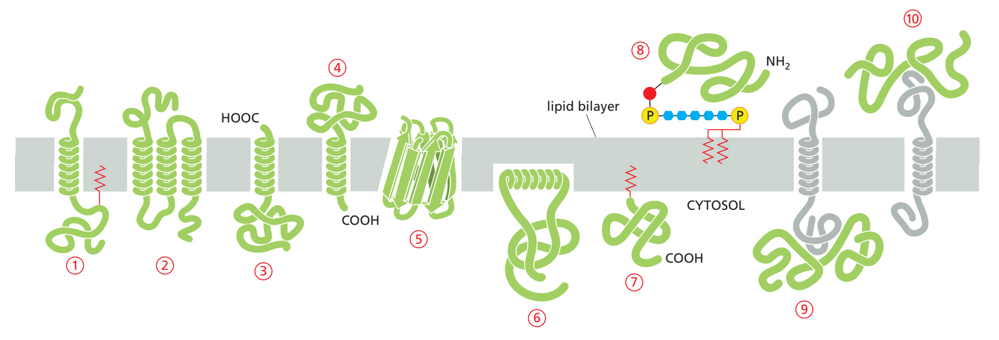{ width="760" height="258" loading="lazy" }](_img/membrane_transport/membrane-proteins.jpg)
/// caption
先找真正穿过双层的部分，再看只停在一侧的蛋白。末端标签和锚定位置帮助判断蛋白的哪一部分暴露于胞质。[^fig-mboc-10-17]
///

冷冻断裂提供了从双层内部观察这些结构的办法：膜往往沿疏水内部裂开，断裂面上可以看见凸起的颗粒和相应的凹坑。结合其他证据，这些颗粒被辨认为嵌在膜中的蛋白质或蛋白复合体；单靠一颗凸起的外形，当然还认不出它是哪一种运输体。

也有蛋白根本不需要穿过双层。外周膜蛋白借助静电作用或与其他膜蛋白结合停在表面，改变离子强度或 pH，有时就能把它们释放下来。脂锚蛋白则以共价连接的脂质固定：胞质侧常见肉豆蔻酰、棕榈酰或异戊二烯基锚，非胞质侧常见糖基磷脂酰肌醇（GPI）锚。某些脂化还可逆，使蛋白在膜与胞质之间重新分配。

这些蛋白的朝向在合成、插膜和膜泡运输中建立，并不会因为膜很流动就随便翻个身。受体在外侧结合配体，胞质结构域接着改变酶活性或招募其他蛋白；黏附蛋白连接邻近细胞或细胞外基质；运输体则必须从规定的一面结合并释放底物。拓扑朝向本身就是机制的一部分。

## 小分子怎样穿过这道边界 { #transport-energetics }

### 通道与载体，动作有什么不同 { #channels-carriers-pumps }

先比较下面两种通路。通道开放时，膜两侧之间形成可供特定物质通过的含水通路；载体则先结合底物，再改变构象，把同一结合部位先后暴露给两侧。后者有点像只能轮流开两边门的小隔间，但真正运输的是分子的结合、释放和蛋白构象变化。若两边一直同时敞开，载体精细控制运输循环的能力就保不住了。[^osm-carriers-channels]

[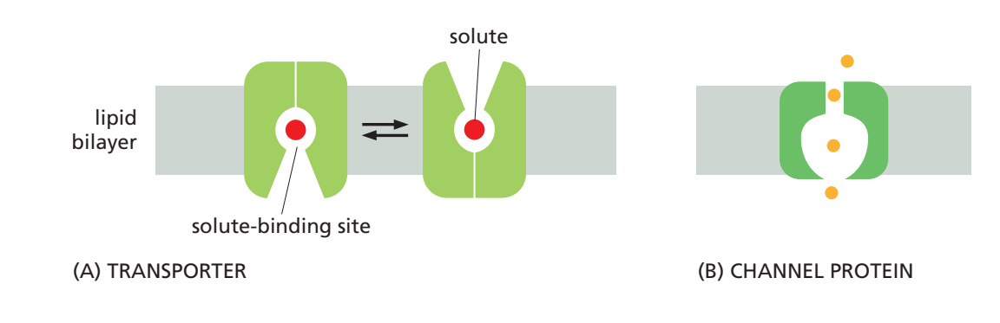{ width="650" height="210" loading="lazy" }](_img/membrane_transport/channel-carrier.jpg)
/// caption
左侧载体把结合部位交替暴露给两面，右侧通道在开放时提供贯通路径。图中的绿色结构只表示工作原理，不对应统一的真实蛋白外形。[^fig-mboc-11-3]
///

通道的**选择性**与**门控**是两个相关但不同的问题：什么能通过，和什么时候允许通过。选择性滤器与离子的大小、电荷、脱水代价有关；门控则可以响应电压、配体、机械力或温度。开放概率和单通道电导共同影响总体电流。开放以后，离子沿自身电化学势降低的方向流动。

K$^+$ 通道提供了一个很好的反直觉例子：Na$^+$ 更小，为什么反而常被挡在外面？如果把孔道当成厨房筛子，这里就解释不下去了。水中的离子周围有水合层；进入狭窄滤器时，它必须失去部分水分子，而通道内的氧原子需要提供足够有利的相互作用来补偿。

[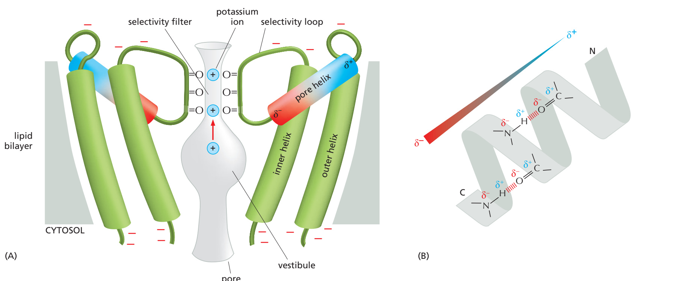{ width="750" height="307" loading="lazy" }](_img/membrane_transport/potassium-channel.jpg)
/// caption
图 A 为了看清内部只显示部分亚基，图 B 放大滤器。沿离子的路线找到胞质侧入口、腔室和最狭窄的滤器。[^fig-mboc-11-24]
///

[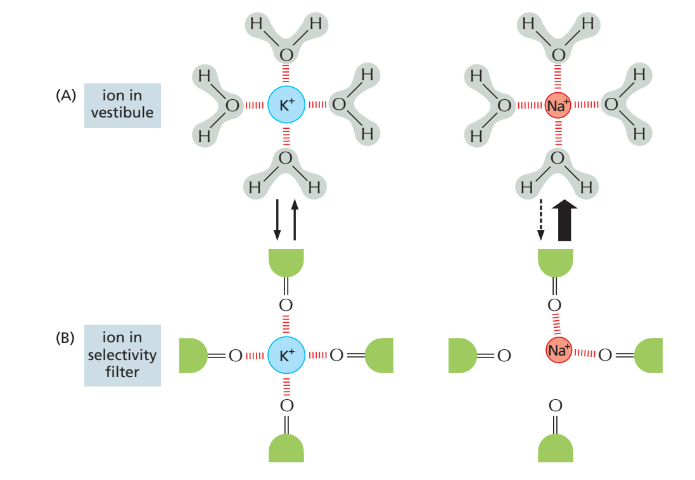{ width="470" height="326" loading="lazy" }](_img/membrane_transport/potassium-selectivity.jpg)
/// caption
上排是水合离子，下排是进入滤器后的配位示意。滤器羰基氧的排列能较好补偿 K⁺ 失水的代价；更小的 Na⁺ 在这个位置反而不能获得同样的补偿。[^fig-mboc-11-25]
///

这是理解经典 K$^+$ 选择性的一种结构与能量解释。通道并不是只量裸离子的直径，滤器也会发生热运动；具体通道的动态结构和不同离子结合状态，还会进一步影响选择性。先把失水代价接到结构上，就已经比“孔小所以筛选”多走了关键一步。[^potassium-filter]

水通道蛋白（aquaporin）常组成四聚体，而每个单体各有一条水通路。水分子在狭窄处排成单列通过，孔道的几何形状与电性同时限制离子进入。下图还展示了水分子取向与质子传递问题：高水通量必须与维持离子梯度兼容。部分家族成员能运输甘油等小分子，其选择性需要具体看亚型。

[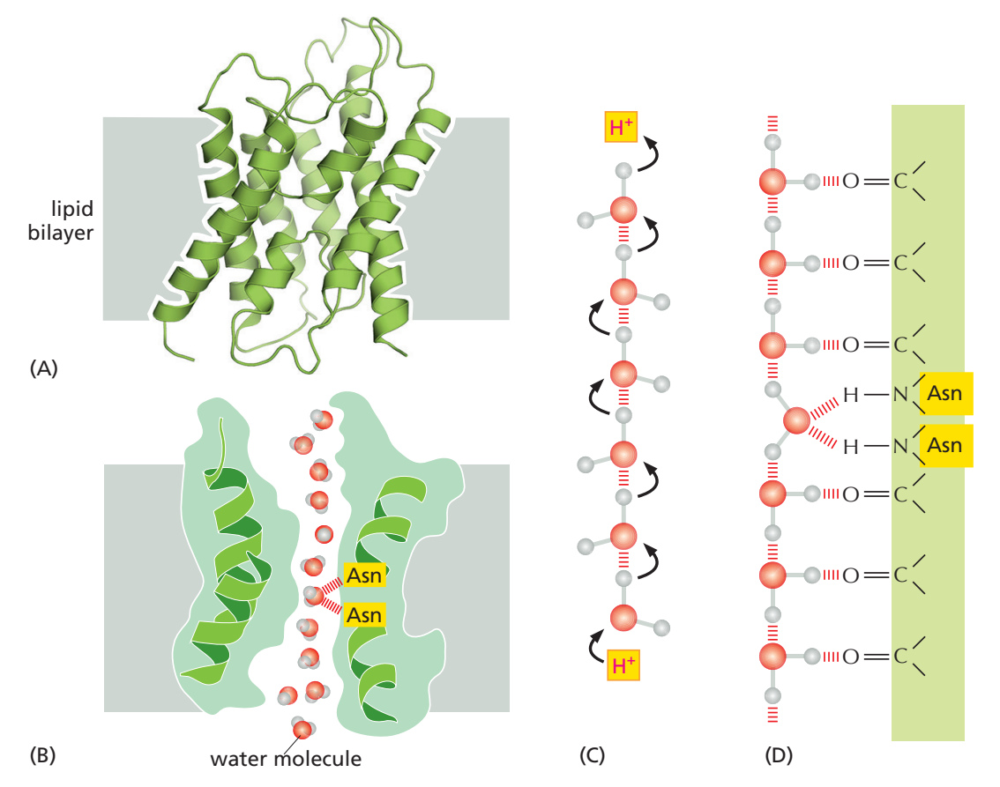{ width="650" height="512" loading="lazy" }](_img/membrane_transport/aquaporin.jpg)
/// caption
A、B 沿单体看水通路；C、D 比较连续水链与孔道约束下的取向。后两幅帮助理解质子通透问题，图示的氢键安排是简化机制模型。[^fig-mboc-11-20]
///

### 载体怎样把底物送到另一面

以 SLC2 家族的葡萄糖载体 GLUT 为例，面向细胞外开放时，葡萄糖可以进入结合位点；随后蛋白闭合外侧入口，形成两面暂时都不开放的**闭塞态（occluded state）**，再向胞质侧开放，葡萄糖便有机会释放。空载体也能转换构象，开始下一次运输。

[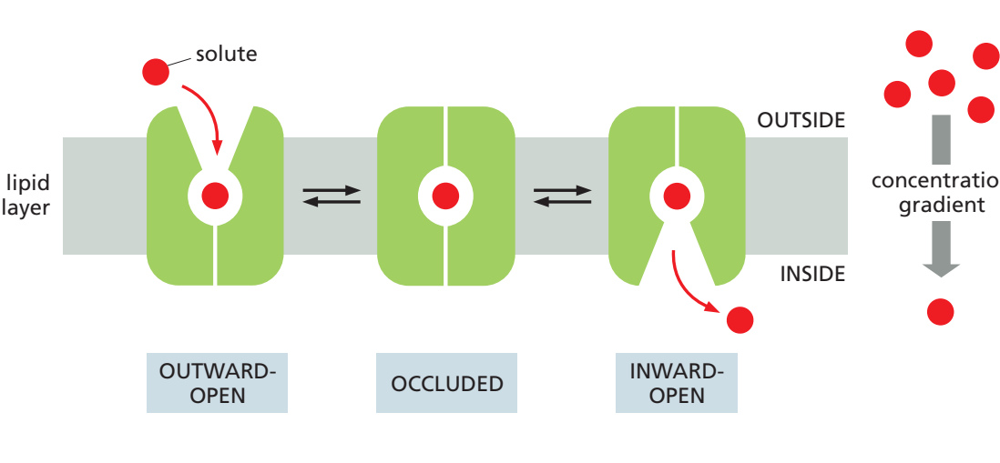{ width="510" height="236" loading="lazy" }](_img/membrane_transport/alternating-access.jpg)
/// caption
逐一找出底物结合部位与开放的一侧。闭塞态把两侧通路隔开，避免形成持续漏通的孔。[^fig-mboc-11-5]
///

[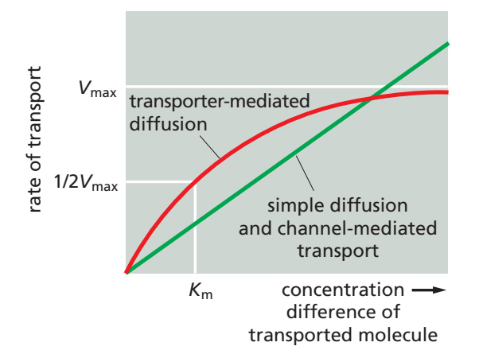{ width="360" height="266" loading="lazy" }](_img/membrane_transport/carrier-saturation.jpg)
/// caption
载体数量和周转能力有限，速率逐渐接近上限。图中曲线用于比较变化趋势，不宜把不同通路的绝对速度直接读成同一量级。[^fig-mboc-11-6]
///

GLUT 的这个循环可以反向进行。外侧葡萄糖较多时，外侧结合和向内输送的事件在总体上占优势；梯度反过来，净运输也可以反向。底物每次都要经过结合和构象变化，有限数量的载体因而会出现最大运输能力。能够竞争同一结合位点的相似分子还可能互相抑制运输，这也为辨认底物选择性提供了实验线索。通道在很高的离子浓度等条件下也可饱和，所以“会不会饱和”不能单独作为辨认载体与通道的绝对标准。

改变膜上的载体数量，也是细胞调节通量的办法。胰岛素促进骨骼肌和脂肪细胞中含 GLUT4 的囊泡转位到质膜，增加可供葡萄糖通过的载体，而不是把 GLUT4 变成直接烧 ATP 的葡萄糖泵。相关组织差异见[胰岛素的作用](../physiology/endo/endo_islet.md#insulin-action)。

### 浓度与电位怎样共同决定方向 { #electrochemical-driving-force }

有了通路，还得知道物质往哪边走。对不带电的葡萄糖，在其他条件相同的简化情形下，浓度差就给出了净扩散方向。对离子，还要看电位：假设外侧 Na$^+$ 较多、胞内又相对带负电，浓度差和电作用都支持 Na$^+$ 内流；对胞内浓度较高的 K$^+$，浓度差倾向于让它流出，负的胞内电位却倾向于把它留住。两项作用可以同向，也可以相互抵消。

[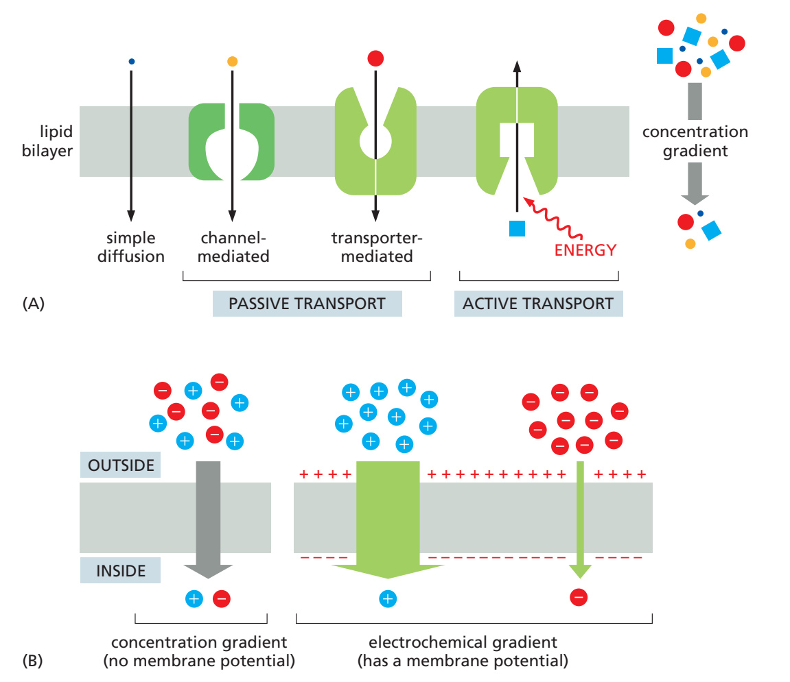{ width="650" height="562" loading="lazy" }](_img/membrane_transport/transport-driving-force.jpg)
/// caption
先比较上排箭头与浓度分布，再看下排带电溶质：出现膜电位后，浓度差不再单独决定净流向。[^fig-mboc-11-4]
///

在温度恒定、两侧活度可以近似用浓度表示时，离子 X 从一侧 1 移到另一侧 2 的摩尔自由能变化为

$$
\Delta G_{1\rightarrow2}=RT\ln\frac{[X]_2}{[X]_1}+zF(\psi_2-\psi_1).
$$

$R$ 是气体常数，$T$ 是绝对温度，$z$ 是离子的带符号价数，$F$ 是法拉第常数，$\psi$ 是电势。第一项比较目的侧与出发侧的浓度；第二项同时考虑电荷和电势变化。对中性溶质，$z=0$，电势项消失。若 $\Delta G<0$，所写方向在热力学上有利；若 $\Delta G>0$，就需要耦联其他有利过程。即使方向有利，没有合适通路时，实际通量仍可能极小。

??? example "把两个方向都代入一次：一个示例计算"

    假设温度为 310 K，某一价阳离子的胞外浓度是胞内的 10 倍，胞内比胞外低 60 mV。这是用于读公式的设定，不是一组实验数据。取方向为“胞外→胞内”：

    $$
    RT\ln(1/10)\approx-5.9\ \mathrm{kJ\,mol^{-1}},\qquad
    F(-0.060\ \mathrm{V})\approx-5.8\ \mathrm{kJ\,mol^{-1}}.
    $$

    两项合计约 $-11.7\ \mathrm{kJ\,mol^{-1}}$，都支持内流。若把运输方向反过来，浓度比和电势差都要反过来，结果变为约 $+11.7\ \mathrm{kJ\,mol^{-1}}$。对阴离子还要改变 $z$ 的符号，不能直接照搬阳离子的判断。

更完整的通量、渗透和电生理关系见[跨膜转运的自由能差](../physiology/membrane_dynamics.md#transport-driving-force)及[细胞的电活动](../physiology/electrical_activity.md)。

## 细胞怎样建立并使用离子梯度 { #active-transport }

### Na⁺/K⁺ 泵：让结合与释放朝着不同的方向 { #atp-driven-transporters }

动物细胞通常维持胞内低 Na$^+$、高 K$^+$。Na$^+$ 越积越多在外侧，继续把它送出去就越不利；这时需要把运输与 ATP 水解耦联起来。Na$^+$/K$^+$-ATPase 每个常规循环消耗一个 ATP，将 3 个 Na$^+$ 送出、2 个 K$^+$ 带入。

[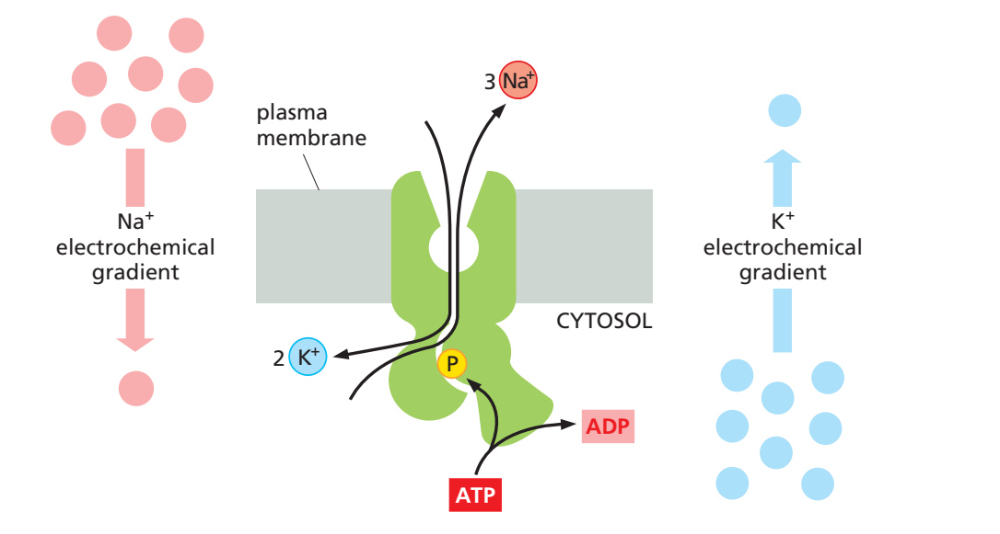{ width="620" height="332" loading="lazy" }](_img/membrane_transport/sodium-potassium-pump.jpg)
/// caption
先数离子，再看方向：每循环 3 Na⁺ 出、2 K⁺ 入，净移出一个正电荷。这张图概括收支，构象变化见相邻正文。[^fig-mboc-11-15]
///

可以从朝胞质开放的状态开始跟一圈。泵先在内侧结合 Na$^+$，ATP 将磷酸基转移到泵的一个天冬氨酸残基上。磷酸化与后续构象变化相连，离子短暂被闭塞在蛋白内部；当外侧通路开放时，结合位点对 Na$^+$ 的亲和力降低，Na$^+$ 释放到胞外。

随后，外侧 K$^+$ 结合，促进去磷酸化。泵又经过闭塞状态，返回朝胞质开放的构象，并把 K$^+$ 释放到胞内。这里真正实现定向运输的，是不同构象下的开放方向、离子亲和力和化学反应相互配合；ATP 水解使持续按这一方向运行成为可能。常用的 E1、E2 名称，就是循环中两类主要构象的简称。[^nak-cycle]

由于循环中出现蛋白质的磷酸化中间体，这类泵称为 **P 型 ATPase**。肌质网的 SERCA 和质膜上的 PMCA 也是 P 型泵，但运输的是 Ca$^{2+}$，离子结合和循环细节应分别看待。它们帮助细胞把升高的胞质 Ca$^{2+}$ 降下来，为下一轮信号响应恢复条件。

### Na⁺ 的回流怎样带来葡萄糖的积累 { #secondary-active-transport }

钠钾泵建立了 Na$^+$ 向内流动的强烈倾向，其他载体可以利用这份梯度。SLC5 家族的 Na$^+$—葡萄糖同向转运体 SGLT 就是一个例子。外侧 Na$^+$ 结合后，有利于载体结合糖；结合齐全的载体较容易完成向内转换，两者随后在胞质侧释放。蛋白结构让这些步骤相互依赖，糖的运输因此与 Na$^+$ 的运输发生耦联。

[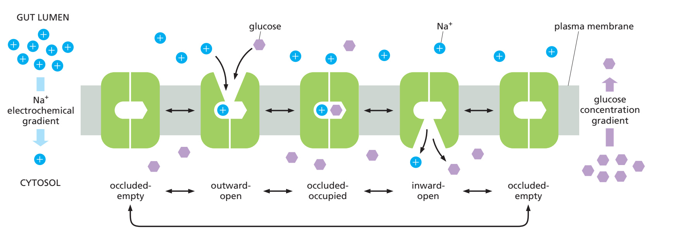{ width="760" height="261" loading="lazy" }](_img/membrane_transport/sodium-glucose-cycle.jpg)
/// caption
从左向右跟随结合位点，看 Na⁺ 与糖在哪一面结合、在哪一面释放。图用单个 Na⁺ 图标表达原理，不表示所有 SGLT 亚型都是 1∶1 计量。[^fig-mboc-11-9]
///

如果葡萄糖已经在胞内积累，继续输入它本来需要正的自由能；只要耦联的 Na$^+$ 内流释放足够多的自由能，整个循环仍可向内运行。人 SGLT1 通常以 2 Na$^+$ 耦联一个糖分子，SGLT2 则通常是 1 Na$^+$ 对一个葡萄糖。计量会改变能达到的浓集程度，不能只从原则图上的小球数量推断。[^sglt-structure]

现在把几种机器放回肠上皮细胞。顶端膜面向肠腔，SGLT1 利用 Na$^+$ 梯度把葡萄糖收入；基底外侧膜的 GLUT 让胞内葡萄糖向间质释放；同侧的 Na$^+$/K$^+$ 泵再将进入的 Na$^+$ 排出，维持下一轮吸收所需的梯度。一个葡萄糖跨过整个细胞的过程，便由两种不同载体接力完成。

[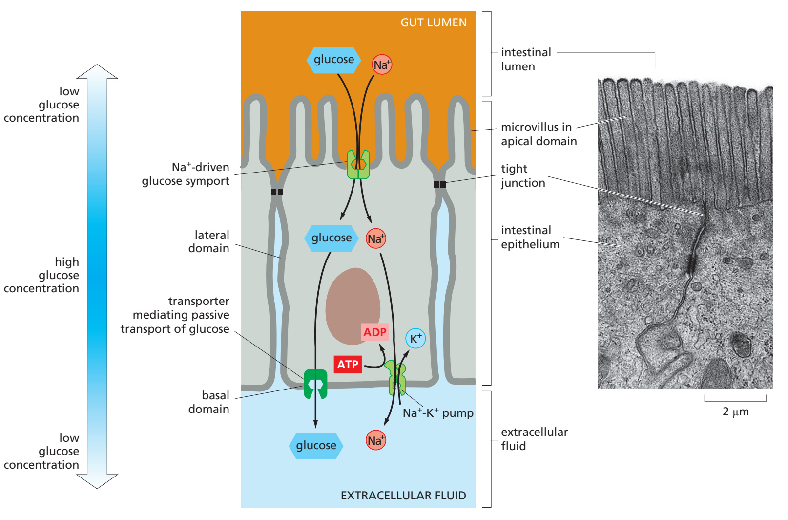{ width="760" height="501" loading="lazy" }](_img/membrane_transport/epithelial-glucose.jpg)
/// caption
沿肠腔→细胞→细胞外液追踪葡萄糖，再单独追踪 Na⁺。图突出跨细胞运输；紧密连接具有选择性旁细胞通透性，不是对一切溶质绝对密封。[^fig-mboc-11-11]
///

这里还用到了膜的分区：顶端与基底外侧的蛋白质组成不同，细胞连接帮助维持这种极性。若把所有载体均匀撒到表面，整齐的跨细胞接力就难以成立。肠道与肾脏的具体组合分别见[单糖吸收](../physiology/digestive/digestion_absorption.md#monosaccharide-transport)和[近端小管回收](../physiology/urinary/filtration_transport.md#proximal-tubule)。

同向转运让耦联的底物朝同一方向移动，反向转运则使它们朝相反方向移动。动物细胞经常利用 Na$^+$ 梯度，植物、真菌和许多细菌则大量使用 H$^+$ 梯度。方向取决于所有底物的计量与自由能变化之和：Na$^+$/Ca$^{2+}$ 交换体通常借助 Na$^+$ 内流排出 Ca$^{2+}$，当膜电位和浓度条件显著改变时，也可能反向工作。“泵出去”是某个生理状态下的结果，蛋白质不会因此获得一张永远禁止倒车的交通标志。

### 其他运输机器怎样利用能量

V 型 ATPase 通过 ATP 水解驱动旋转，将 H$^+$ 泵入内体、溶酶体等区室，也可在特定细胞的质膜上工作。F 型复合体常沿相反的能量转化方向运行：H$^+$ 顺梯度流动驱动旋转，进而合成 ATP；条件改变时也能反向水解 ATP 并泵出 H$^+$。它们的常见生理方向不同，但旋转原理相关，详见[细胞器与能量转换](organelles.md)。

ABC 转运体利用核苷酸结合结构域的 ATP 结合、水解与重置，驱动跨膜结构域的构象循环，运输的底物包括脂质、胆汁酸和药物等。光驱动泵则把吸收光子引发的分子变化接到离子转移上。能量来源的分类与蛋白质结构的分类可以交叉使用，实际机制不必都套成同一种载体模型。

| 运输方式 | 主要动作与能量关系 | 例子 |
| --- | --- | --- |
| 单纯扩散 | 直接穿过双层，净流动沿化学势降低方向 | O$_2$、CO$_2$ |
| 通道运输 | 开放通路，溶质顺电化学势流动 | K$^+$ 通道、水通道 |
| 被动载体 | 结合与交替开放，顺相应梯度运输 | GLUT |
| 次级主动运输 | 将不同溶质的跨膜移动耦联 | SGLT、Na$^+$/Ca$^{2+}$ 交换体 |
| P 型泵 | 蛋白磷酸化中间体参与离子运输循环 | Na$^+$/K$^+$ 泵、SERCA、PMCA |
| V/F 型旋转机器 | 旋转连接 ATP 反应与离子流，方向依系统和条件而定 | 区室酸化、ATP 合成 |
| ABC 转运体 | 核苷酸结构域与跨膜结构域共同完成循环 | 多种脂质与药物转运体 |

!!! question "CFTR 用 ATP，为什么仍称为通道？（自编）"

    CFTR 来自 ABC 转运体家族，其 ATP 结合与水解参与开关调节。它允许 Cl$^-$ 和 HCO$_3^-$ 通过，这是否说明它把阴离子主动泵向高电化学势的一侧？

    ??? success "解析"

        需要区分开关的耗能与溶质通过时的驱动力。CFTR 的门控与 ATP 反应有关，但开放后的阴离子沿自身电化学势降低的方向流动；ATP 没有在这里与固定计量的阴离子逆梯度运输相耦联。判断通道的运输方式，要跟着离子的跨膜过程看。[^cftr-uniprot]

## 货物太大时，膜把它包起来 { #endocytosis-entry }

蛋白质复合体、细菌或一整滴胞外液，显然不能靠 GLUT 这样的结合口袋逐个搬进来。内吞用的是另一种办法：质膜包围货物，向内出芽，再分离成囊泡。货物进入了细胞内部的空间，却仍在囊泡腔中，与胞质之间隔着膜。

[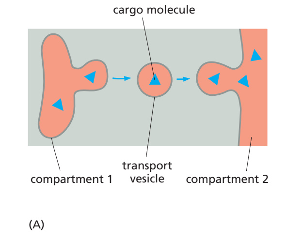{ width="430" height="362" loading="lazy" }](_img/membrane_transport/membrane-topology.jpg)
/// caption
橙色表示区室腔内，灰绿色表示周围胞质，蓝色三角是货物。沿出芽与融合追踪：膜没有翻面，货物也没有直接穿过脂双层。[^fig-mboc-12-4]
///

这解释了前面留下的方向问题。内质网和高尔基体腔内添加的糖链，随膜泡运输到达质膜时朝向胞外；质膜内吞后，这些糖链朝向囊泡腔。外排与内吞不断改变质膜面积，脂质合成、膜回收和蛋白质分选又把它们接到细胞整体的膜平衡上。

### 从包被小窝到内吞囊泡 { #receptor-mediated-endocytosis }

受体在胞外侧结合货物，胞质尾部的内吞信号则由适配蛋白识别。适配蛋白把受体和网格蛋白（clathrin）包被接起来，使货物在局部集中，也帮助组织弯曲的膜面。下面的电镜图把不同形态按形成过程排列：浅凹陷、加深的小窝、带细颈的结构，最后是分离的包被小泡。[^endocytosis]

[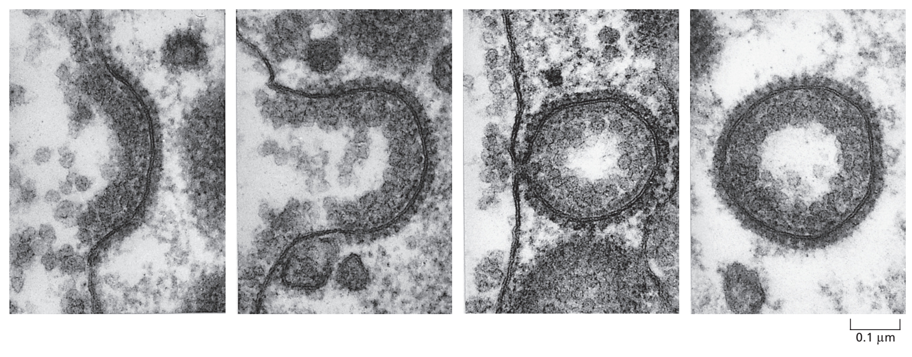{ width="760" height="299" loading="lazy" }](_img/membrane_transport/clathrin-electron-micrographs.jpg)
/// caption
看胞质侧毛茸茸的包被和逐渐收窄的膜颈。腔面另一层致密物质是被摄取的脂蛋白颗粒。四幅来自不同结构的截面，并非同一小泡的延时录像；右下角比例尺为 0.1 μm。[^fig-mboc-13-51]
///

在许多网格蛋白内吞事件中，发动蛋白（dynamin）在膜颈处装配，GTP 反应与结构变化参与最后的切割。包被随后卸除，新囊泡把货物交给早期内体；在那里，受体可能回收，货物可能走向降解，也可能送往另一侧膜面。后续的分选与成熟见[内膜系统、蛋白质分选与囊泡运输](endomembrane.md)。

### 吞噬、大胞饮和膜窖 { #phagocytosis-macropinocytosis }

吞噬从颗粒与表面受体结合开始，肌动蛋白驱动膜伸展、包围细菌或死亡细胞，最后形成吞噬体。巨噬细胞和中性粒细胞是熟悉的专业吞噬细胞。大胞饮则常由膜褶皱卷回，包进较大体积的胞外液；它能持续取样，也会受到生长因子或病原体信号影响。小胞饮是较小囊泡摄取液相的总称，底下还包括多种分子机制。

膜窖（caveola）则有很有辨识度的瓶形外观，常由 caveolin 与 cavin 蛋白系统组织，在脂肪、内皮和肌细胞等处较常见。

[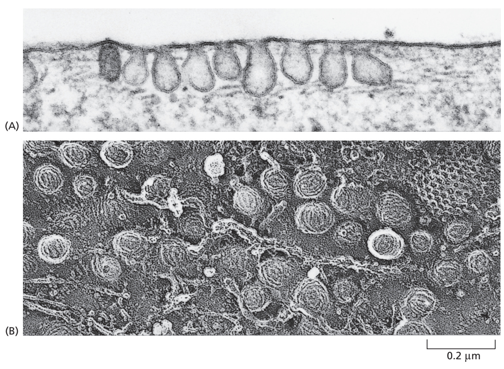{ width="560" height="410" loading="lazy" }](_img/membrane_transport/caveolae.jpg)
/// caption
上图看质膜下的一排内陷，下图从胞质侧看膜窖表面的组织。瓶形外观标识一种膜结构，单凭一张静态图不能判断它是否正在内吞。[^fig-mboc-13-52]
///

许多膜窖相对稳定。当膜张力突然上升时，一部分可以展平，释放额外表面积；表面原先留着的褶余，临时派上了用场。它们还参与信号组织及某些内吞过程，但不能把所有膜窖都画成一队不停出发的运输小泡。机械展平的作用已有直接实验支持。[^caveolae-tension]

实际研究某种货物的入口时，还要结合超微结构、遗传扰动、时间过程与最终去向。同一种货物在不同细胞中可能走不同路线；测到胞内荧光增加之后，才刚有了继续追踪的理由。

## 把膜拆开，再装回去 { #membrane-evidence }

到这里，膜已经是一张相当忙碌的界面了。但若想判断“这个蛋白本身能不能运输某种离子”，忙碌反而会带来麻烦：细胞里同时存在别的通道、泵和调节蛋白，观察到的变化可能经过好几步。

一个有力的做法，是纯化目标蛋白，再将它重构进成分已知的脂质体，形成**蛋白脂质体（proteoliposome）**。这样，原本混在一起的许多变量可以分别控制。

[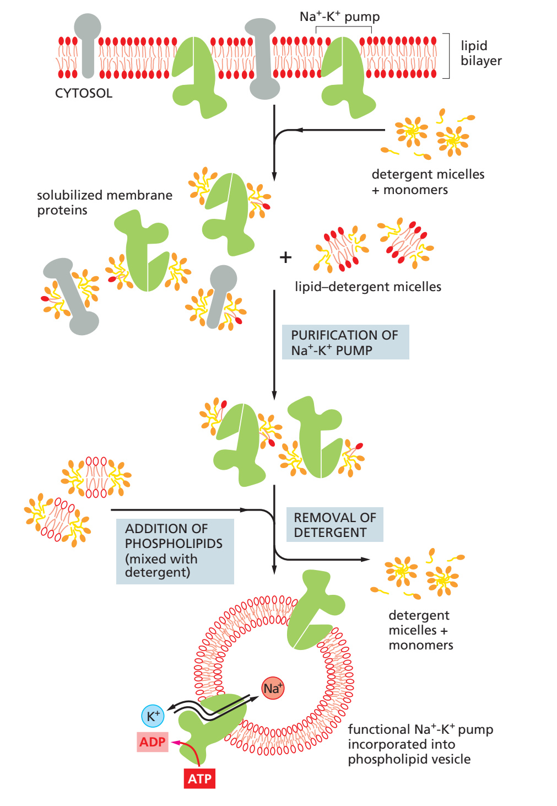{ width="530" height="766" loading="lazy" }](_img/membrane_transport/proteoliposome-reconstitution.jpg)
/// caption
沿去垢剂溶解、蛋白与脂质重新混合、去除去垢剂的过程看。最后得到的膜同时包含已知脂质与目标蛋白，可以单独检验运输功能。[^fig-mboc-10-28]
///

随后可以测放射性或荧光底物的通量、电流、ATP 水解和梯度耗散。每项读出回答的问题不同：ATPase 活性说明发生了水解，却不能独自证明溶质被有效运到另一面；通量增加也需要排除膜本身漏了。空脂质体、失活蛋白、不同朝向和受控膜电位等对照，帮助我们把一次观察接到具体的运输循环。

电镜让我们看见膜，融合与 FRAP 让我们看见运动，单粒子追踪揭示运动的限制，脂质组学结合叶片选择性处理辨认两面的组成，重构实验则把某项功能重新交给一个已知蛋白。几种证据接在一起，薄薄的边界才逐渐有了可以检验的内部细节。

## 参考资料与延伸阅读 { #references }

本页主要依据 *Molecular Biology of the Cell* 第 7 版第 10、11 章，膜泡拓扑和内吞参照第 12、13 章。各图的图号、印刷页与处理方式见图注来源。

- Alberts B, Heald R, Johnson A, et al. *Molecular Biology of the Cell*. 7th ed. W. W. Norton; 2022。
- Frye LD, Edidin M. [The rapid intermixing of cell surface antigens after formation of mouse-human heterokaryons](https://pubmed.ncbi.nlm.nih.gov/4098863/). *Journal of Cell Science*. 1970;7:319–335.
- Singer SJ, Nicolson GL. [The fluid mosaic model of the structure of cell membranes](https://pubmed.ncbi.nlm.nih.gov/4333397/). *Science*. 1972;175:720–731.
- Lorent JH, et al. [Plasma membranes are asymmetric in lipid unsaturation, packing and protein shape](https://pubmed.ncbi.nlm.nih.gov/32367017/). *Nature Chemical Biology*. 2020;16:644–652.
- Sinha B, et al. [Cells respond to mechanical stress by rapid disassembly of caveolae](https://pubmed.ncbi.nlm.nih.gov/21295700/). *Cell*. 2011;144:402–413.

[^membrane-structure]: 膜的双层、自组装、流动性与膜蛋白组织主要依据 Alberts 等，*Molecular Biology of the Cell*，第 7 版，第 10 章（2022）；可在线参阅第 4 版的[膜结构章节](https://www.ncbi.nlm.nih.gov/books/NBK21055/)。
[^fig-mboc-10-1]: Alberts B, Heald R, Johnson A, et al. *Molecular Biology of the Cell*. 7th ed. W. W. Norton; 2022，图 10–1，印刷页 603。本站截取教材图版区域，去除页眉与原排版正文，保留图中标记；配中文图注，未重绘。其中 A 的电镜由 Daniel S. Friend 提供，教材注明经 E. L. Bearer 转用。
[^fig-mboc-10-8]: Alberts B, Heald R, Johnson A, et al. *Molecular Biology of the Cell*. 7th ed. W. W. Norton; 2022，图 10–8，印刷页 608。本站截取教材图版区域，去除页眉与原排版正文，保留图中标记；配中文图注，未重绘。
[^fig-mboc-10-9]: Alberts B, Heald R, Johnson A, et al. *Molecular Biology of the Cell*. 7th ed. W. W. Norton; 2022，图 10–9，印刷页 608。本站截取教材图版区域，去除页眉与原排版正文，保留图中标记；配中文图注，未重绘。B 的冷冻电镜原出处为 Kotouček J 等，*Scientific Reports*. 2020;10:5595。
[^transport-principles]: 通透性、载体与通道的机制主要依据 *Molecular Biology of the Cell*，第 7 版，第 11 章；可在线参阅第 4 版的[膜运输原理](https://www.ncbi.nlm.nih.gov/books/NBK26815/)。
[^fig-mboc-10-10]: Alberts B, Heald R, Johnson A, et al. *Molecular Biology of the Cell*. 7th ed. W. W. Norton; 2022，图 10–10，印刷页 609。本站截取教材图版区域，去除页眉与原排版正文，保留图中标记；配中文图注，未重绘。
[^fig-mboc-10-11]: Alberts B, Heald R, Johnson A, et al. *Molecular Biology of the Cell*. 7th ed. W. W. Norton; 2022，图 10–11，印刷页 609。本站截取教材图版区域，去除页眉与原排版正文，保留图中标记；配中文图注，未重绘。
[^cell-fusion]: Frye 与 Edidin 的[异核体实验](https://pubmed.ncbi.nlm.nih.gov/4098863/)在细胞融合后追踪两物种表面抗原，直接显示膜蛋白在细胞表面发生侧向再分布。
[^fig-mboc-10-32]: Alberts B, Heald R, Johnson A, et al. *Molecular Biology of the Cell*. 7th ed. W. W. Norton; 2022，图 10–32，印刷页 628。本站截取教材图版区域，去除页眉与原排版正文，保留图中标记；配中文图注，未重绘。图解依据 Frye LD、Edidin M，*Journal of Cell Science*. 1970;7:319–335（[原始研究](https://pubmed.ncbi.nlm.nih.gov/4098863/)）。
[^fluid-mosaic]: 流动镶嵌模型的原始论述见 Singer 与 Nicolson 的[1972 年论文](https://pubmed.ncbi.nlm.nih.gov/4333397/)；现代膜研究保留其动态双层框架，同时加入跨叶片不对称、纳米域、骨架围栏与蛋白拥挤等层次。
[^fig-mboc-10-33]: Alberts B, Heald R, Johnson A, et al. *Molecular Biology of the Cell*. 7th ed. W. W. Norton; 2022，图 10–33，印刷页 628。本站截取教材图版区域，去除页眉与原排版正文，保留图中标记；配中文图注，未重绘。
[^fig-mboc-10-39]: Alberts B, Heald R, Johnson A, et al. *Molecular Biology of the Cell*. 7th ed. W. W. Norton; 2022，图 10–39，印刷页 632。本站截取教材图版区域，去除页眉与原排版正文，保留图中标记；配中文图注，未重绘。B 的轨迹据 Kusumi A 等，*Annual Review of Biophysics and Biomolecular Structure*. 2005;34:351–378 改编。
[^hop-diffusion]: 肌动蛋白膜骨架依赖的分区和脂质跨区“跳跃扩散”，见 Fujiwara 等的[单分子追踪研究](https://pubmed.ncbi.nlm.nih.gov/12058021/)。
[^detergent-resistant-membranes]: 低温 Triton X-100 分离产生的囊泡与多层结构已相对原红细胞膜明显重排，见 Koumanov 等的[去垢剂抗性组分研究](https://pubmed.ncbi.nlm.nih.gov/15629118/)；因此去垢剂抗性是分离定义，活细胞膜域还需其他证据确认。
[^fig-mboc-10-15]: Alberts B, Heald R, Johnson A, et al. *Molecular Biology of the Cell*. 7th ed. W. W. Norton; 2022，图 10–15，印刷页 612。本站截取教材图版区域，去除页眉与原排版正文，保留图中标记；配中文图注，未重绘。
[^leaflet-asymmetry]: 脂质组学、叶片选择性探针和模拟揭示的组成、不饱和度、堆积与扩散不对称，见 Lorent 等的[哺乳动物质膜叶片研究](https://pubmed.ncbi.nlm.nih.gov/32367017/)。
[^fig-mboc-12-39]: Alberts B, Heald R, Johnson A, et al. *Molecular Biology of the Cell*. 7th ed. W. W. Norton; 2022，图 12–39，印刷页 721。本站截取教材图版区域，去除页眉与原排版正文，保留图中标记；配中文图注，未重绘。
[^tmem16f]: 血小板 Ca$^{2+}$ 依赖性 PS 外露、TMEM16F 缺失与促凝活性下降的证据，见 Yang 等的[TMEM16F 研究](https://pubmed.ncbi.nlm.nih.gov/23021219/)。
[^xkr8]: 凋亡时由半胱天冬酶依赖的 XKR8 促成 PS 外露，见 Suzuki 等的[XKR8 原始研究](https://pubmed.ncbi.nlm.nih.gov/23845944/)。
[^fig-mboc-10-17]: Alberts B, Heald R, Johnson A, et al. *Molecular Biology of the Cell*. 7th ed. W. W. Norton; 2022，图 10–17，印刷页 615。本站截取教材图版区域，去除页眉与原排版正文，保留图中标记；配中文图注，未重绘。
[^osm-carriers-channels]: 载体和通道的结构分类实质性改编自 osm.bio [《载体蛋白和通道蛋白》固定版本](https://osm.bio/index.php?title=%E8%BD%BD%E4%BD%93%E8%9B%8B%E7%99%BD%E5%92%8C%E9%80%9A%E9%81%93%E8%9B%8B%E7%99%BD&oldid=14634)，固定版本贡献者为寸烛盈夜，原文按 [CC BY-SA 4.0](https://creativecommons.org/licenses/by-sa/4.0/deed.zh-hans) 许可；相关内容经重组，并用 Alberts 等的[载体与主动运输章节](https://www.ncbi.nlm.nih.gov/books/NBK26896/)交叉核验。
[^fig-mboc-11-3]: Alberts B, Heald R, Johnson A, et al. *Molecular Biology of the Cell*. 7th ed. W. W. Norton; 2022，图 11–3，印刷页 639。本站截取教材图版区域，去除页眉与原排版正文，保留图中标记；配中文图注，未重绘。
[^fig-mboc-11-24]: Alberts B, Heald R, Johnson A, et al. *Molecular Biology of the Cell*. 7th ed. W. W. Norton; 2022，图 11–24，印刷页 658。本站截取教材图版区域，去除页眉与原排版正文，保留图中标记；配中文图注，未重绘。
[^fig-mboc-11-25]: Alberts B, Heald R, Johnson A, et al. *Molecular Biology of the Cell*. 7th ed. W. W. Norton; 2022，图 11–25，印刷页 659。本站截取教材图版区域，去除页眉与原排版正文，保留图中标记；配中文图注，未重绘。
[^potassium-filter]: 钾通道滤器的结构基础见 Doyle DA 等，*Science*. 1998;280:69–77，[原始结构研究](https://doi.org/10.1126/science.280.5360.69)；本文的配位解释沿用 MBoC 第 7 版第 11 章的教学模型。
[^fig-mboc-11-20]: Alberts B, Heald R, Johnson A, et al. *Molecular Biology of the Cell*. 7th ed. W. W. Norton; 2022，图 11–20，印刷页 653。本站截取教材图版区域，去除页眉与原排版正文，保留图中标记；配中文图注，未重绘。
[^fig-mboc-11-5]: Alberts B, Heald R, Johnson A, et al. *Molecular Biology of the Cell*. 7th ed. W. W. Norton; 2022，图 11–5，印刷页 641。本站截取教材图版区域，去除页眉与原排版正文，保留图中标记；配中文图注，未重绘。
[^fig-mboc-11-6]: Alberts B, Heald R, Johnson A, et al. *Molecular Biology of the Cell*. 7th ed. W. W. Norton; 2022，图 11–6，印刷页 641。本站截取教材图版区域，去除页眉与原排版正文，保留图中标记；配中文图注，未重绘。
[^fig-mboc-11-4]: Alberts B, Heald R, Johnson A, et al. *Molecular Biology of the Cell*. 7th ed. W. W. Norton; 2022，图 11–4，印刷页 640。本站截取教材图版区域，去除页眉与原排版正文，保留图中标记；配中文图注，未重绘。
[^fig-mboc-11-15]: Alberts B, Heald R, Johnson A, et al. *Molecular Biology of the Cell*. 7th ed. W. W. Norton; 2022，图 11–15，印刷页 648。本站截取教材图版区域，去除页眉与原排版正文，保留图中标记；配中文图注，未重绘。
[^nak-cycle]: Na⁺/K⁺ 泵的磷酸化中间体、内外向构象与 3 Na⁺／2 K⁺ 计量见 MBoC 第 7 版第 11 章；循环步骤也可参阅 *Basic Neurochemistry* 的[Na⁺/K⁺ 泵章节](https://www.ncbi.nlm.nih.gov/books/NBK28174/)。
[^fig-mboc-11-9]: Alberts B, Heald R, Johnson A, et al. *Molecular Biology of the Cell*. 7th ed. W. W. Norton; 2022，图 11–9，印刷页 643。本站截取教材图版区域，去除页眉与原排版正文，保留图中标记；配中文图注，未重绘。
[^sglt-structure]: SGLT 的耦联与构象变化可结合[家族结构研究](https://www.nature.com/articles/s41586-021-04211-w)阅读；人 SGLT1 的 2 Na⁺∶1 糖与 SGLT2 的 1 Na⁺∶1 葡萄糖计量分别参见 [SGLT1 结构研究](https://www.nature.com/articles/s41467-022-33421-7)和 [SGLT2–MAP17 结构研究](https://www.nature.com/articles/s41594-023-01134-0)。
[^fig-mboc-11-11]: Alberts B, Heald R, Johnson A, et al. *Molecular Biology of the Cell*. 7th ed. W. W. Norton; 2022，图 11–11，印刷页 645。本站截取教材图版区域，去除页眉与原排版正文，保留图中标记；配中文图注，未重绘。
[^cftr-uniprot]: CFTR 的 ATP 依赖门控、Cl$^-$／HCO$_3^-$ 通道功能及 ABC 家族归属，见 UniProt 审校条目 [P13569](https://www.uniprot.org/uniprotkb/P13569/entry)。
[^fig-mboc-12-4]: Alberts B, Heald R, Johnson A, et al. *Molecular Biology of the Cell*. 7th ed. W. W. Norton; 2022，图 12–4，印刷页 687。本站截取教材图版区域，去除页眉与原排版正文，保留图中标记；配中文图注，未重绘。
[^endocytosis]: 吞噬、受体介导内吞、clathrin 包被与早期内体入口的教材框架，见 Cooper 的[内吞章节](https://www.ncbi.nlm.nih.gov/books/NBK9831/)。
[^fig-mboc-13-51]: Alberts B, Heald R, Johnson A, et al. *Molecular Biology of the Cell*. 7th ed. W. W. Norton; 2022，图 13–51，印刷页 789。本站截取教材图版区域，去除页眉与原排版正文，保留图中标记；配中文图注，未重绘。原电镜为 Perry MM、Gilbert AB，*Journal of Cell Science*. 1979;39:257–272；材料为鸡卵母细胞摄取脂蛋白的包被结构。
[^fig-mboc-13-52]: Alberts B, Heald R, Johnson A, et al. *Molecular Biology of the Cell*. 7th ed. W. W. Norton; 2022，图 13–52，印刷页 790。本站截取教材图版区域，去除页眉与原排版正文，保留图中标记；配中文图注，未重绘。原图为 Rothberg KG 等，*Cell*. 1992;68:673–682；B 为快速冷冻深蚀图。
[^caveolae-tension]: 膜窖在机械应力下快速展平、缓冲质膜张力的实验依据，见 Sinha 等的[细胞力学研究](https://pubmed.ncbi.nlm.nih.gov/21295700/)。
[^fig-mboc-10-28]: Alberts B, Heald R, Johnson A, et al. *Molecular Biology of the Cell*. 7th ed. W. W. Norton; 2022，图 10–28，印刷页 624。本站截取教材图版区域，去除页眉与原排版正文，保留图中标记；配中文图注，未重绘。
