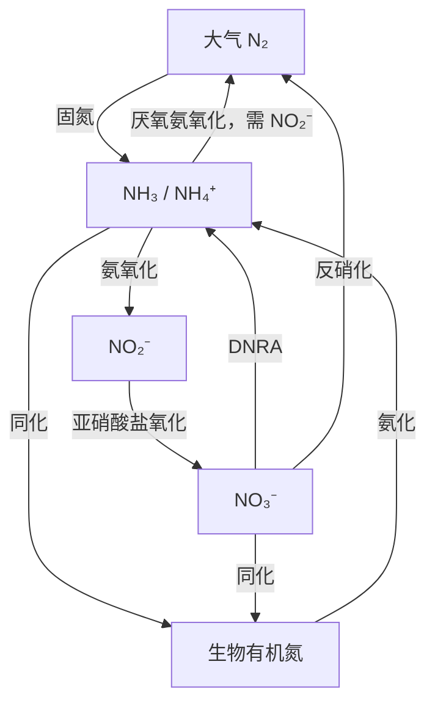

# 生物地球化学循环

生态系统中的碳、氮、磷和硫不断在生物体、空气、水、土壤、沉积物与岩石之间转移。生物通过同化、摄食、排泄和分解改变元素形态，地球化学过程又通过风化、溶解、沉淀、扩散和构造运动连接局地生态系统与整颗行星。生物地球化学循环（biogeochemical cycle）因此既不是只发生在生物体内的“物质循环”，也不是一条首尾相接、各环节等速前进的封闭圆环，而是许多大小不一、周转速度不同的库由通量连接成的网络。

前一页[生产力、分解与能量流](production_decomposition.md)说明有机物怎样形成、被利用并分解；本页继续追踪分解所释放的元素怎样重新进入生物圈。水循环提供输送介质，碳循环连接能量代谢和气候，氮、磷、硫循环则突出微生物转化、营养限制和氧化还原反应。各种循环在人类扰动下的共同变化，会在下一页[生物群系与全球变化](biomes_global_change.md)进一步整合。

## 库、通量与周转时间 { #pools-fluxes-turnover }

库（pool 或 reservoir）是在规定边界内以某种形态储存的物质量，例如大气中的 N₂、海水中的溶解无机碳、植被中的有机碳或沉积物中的磷。传统教材常把库容大、滞留久且多为非生物的部分称为“储存库”，把库容较小、交换较快且常含生物组分的部分称为“流通库”。这种二分有助于起步，但同一个库内部仍可能同时包含快慢组分：表层土壤有机质可在季节尺度周转，矿物结合有机质则可保存很久；海洋表层与深海也不能合成一个均匀箱体。

通量（flux）是单位时间穿过系统边界或由一个库进入另一个库的物质量，常写成 mol yr⁻¹、g N m⁻² yr⁻¹ 或 kg P ha⁻¹ yr⁻¹。若库量为 $X$，总输出通量为 $F_{out}$，在近似充分混合且输出与库量成比例时，周转率与平均周转时间可写为

$$
k=\frac{F_{out}}{X},\qquad \tau=\frac{X}{F_{out}}=\frac{1}{k}.
$$

$k$ 的量纲为时间⁻¹，$\tau$ 的量纲为时间。只有在边界、组分和时间窗口一致时，这两个量才可比较；非稳态系统还要同时写出输入、输出和存量变化：

$$
\frac{dX}{dt}=\sum F_{in}-\sum F_{out}.
$$

因此，“水的周转最短、氮的周转最长”不能作为全球通则。大气水汽可以在日到周尺度更新，深层地下水和冰盖却可保存极久；生物体内无机氮可能数小时至数日被利用，大气 N₂ 与沉积氮则处在完全不同的时间尺度。元素名称本身不能决定周转时间，真正决定它的是所选库、化学形态、边界和过程。

## 水循环连接能量与物质输送 { #water-cycle }

太阳辐射为蒸发和蒸腾提供能量，重力驱动降水、坡面径流、河流和地下水向低处移动。海洋蒸发的水汽一部分在海上凝结降回海洋，陆地蒸散的水汽也可在陆地再次降水，传统上称为海洋小循环与陆地小循环；海洋水汽输送到陆地、形成降水，再由河流和地下水返回海洋，则构成海陆大循环。大循环与小循环不是彼此隔绝的水路，而是按水汽来源和降水去向划分同一全球网络的通量。

陆地某一流域在给定时段的水量平衡可简写为

$$
P=ET+Q+\Delta S,
$$

其中 $P$ 是降水，$ET$ 是蒸散，$Q$ 是流域出口的地表与地下径流，$\Delta S$ 是土壤水、地下水、湖泊、积雪和冰川等储水变化。若还存在跨流域调水、深层地下水交换或人类取水，应另列边界通量。降水入地后可被冠层截留、入渗土壤、由根吸收并蒸腾，也可补给含水层，经过泉和基流较慢地返回河流。洪水脉冲、融雪和地下水基流因而会把不同时间尺度的水路叠加在同一河道中。[^usgs-water-cycle]

海洋容纳地球上绝大部分水，冰盖和地下水也形成巨大储库；大气、河流和生物体内的水量小，却因周转快而对天气、溶质运输和生物代谢格外重要。旧教材所说“地球上大多数水不参与循环”，更准确的含义是：在一个生态研究期内，大部分水停留在海洋、深层地下水或冰体等大库中，没有进入快速的蒸散—降水—径流支路。它们并非永远静止，深海环流、冰川流动和水岩反应仍会在更长尺度上交换水。

水还搬运其他元素。风化产生的离子随径流进入河海，溶解有机碳和颗粒有机质沿坡面与河网横向输送，地下水则可把硝酸盐、硫酸盐或还原性溶质带到湿地和近岸。筑坝、灌溉、排水、城市不透水面和地下水开采不只是改变“水量”，也改变物质到达生物可利用位置的时间与路径。

## 碳循环跨越生物代谢与岩石圈 { #carbon-cycle }

碳库大小的传统争论源于边界不同。若包括沉积岩、变质岩和地幔中的碳，岩石圈是最大的长期储库；若讨论近地表、能够在较短地质时期与大气交换的活跃碳库，海洋中的溶解无机碳远大于大气和陆地植被。把“海洋最大”或“岩石圈最大”单独写成答案都会漏掉限定语。[^carbon-cycle-reservoirs]

快速碳循环以生物同化和异化为主。光合与化能自养生物把 CO₂ 或 HCO₃⁻ 固定成有机碳，摄食把它转移到食物网，呼吸、发酵和分解又产生 CO₂；缺氧环境中的产甲烷与甲烷氧化使 CH₄ 成为另一条重要支路。陆地碳还在植被、凋落物、土壤有机质、河流和大气间横向或垂直移动。火灾、采收与土地利用变化能在很短时间内把长期积累的碳重新释放或输出。

海洋表面通过分压差与大气双向交换 CO₂。溶解度泵借助冷水吸收、海水环流和深层混合搬运溶解无机碳；生物泵则由浮游生物固定碳，随后以颗粒沉降、溶解有机物输送和食物网迁移把一部分碳带离表层。钙化生物形成 CaCO₃，碳酸盐颗粒沉降并最终埋藏；碳酸盐风化、沉积、俯冲和火山逸气又把这一支路接入慢速地质循环。地质慢循环可持续数百万年以上，不能与一年尺度的森林净吸收放在同一“快慢”排序中。[^nasa-carbon-cycle]

碱性、富含 Ca²⁺ 和 HCO₃⁻ 的水体中，一些轮藻和沉水被子植物利用 HCO₃⁻ 光合作用，使叶表微环境 pH 升高并促进 CaCO₃ 沉淀，外观上像植物“释放碳酸钙”。这里的沉淀来自水体离子在光合改变的化学条件下结晶，并非所有水生植物都主动排出 CaCO₃。钙化同时改变溶解无机碳与总碱度，在某些条件下还可促进 CO₂ 释放；观察到碳酸盐沉淀不能直接等同于净碳封存。[^charophyte-calcification]

“源”和“汇”描述的是给定边界与时期内的净通量。一个森林在生长年份可为大气 CO₂ 净汇，火灾年份可转为净源；海洋即使长期净吸收人为 CO₂，局部上升流区仍可向大气释放 CO₂。“汇”也不保证吸收的碳永久保存。20 世纪碳预算研究曾把估算排放与大气增量之间未能归因的差额称为 missing sink，旧素材留下“25% 去向不明”的历史说法。今天的全球碳预算把化石燃料与土地利用排放、大气增长、陆地汇、海洋汇和预算不平衡分别估计；不平衡仍表示观测与模型的不确定性，但不能再把固定四分之一的人为排放写成完全未知去向。[^global-carbon-budget]

## 氮循环由多条微生物通路组成 { #nitrogen-cycle }

大气 N₂ 是全球最大的可交换氮库，却因三键稳定而不能被绝大多数生物直接同化。固氮生物以固氮酶把 N₂ 还原成 NH₃，进入水后主要以 NH₄⁺ 存在。根瘤菌与豆科等植物共生，自生固氮细菌和古菌分布于土壤、沉积物和水体，蓝细菌则可依靠光能自养并固氮；“固氮细菌均为异养”因此不成立。共生固氮在陆地植物中十分醒目，自生固氮则同时存在于陆地和海洋。闪电能生成反应性氮，但全球自然新生反应性氮主要由生物固氮提供。工业 Haber–Bosch 合成氨和化石燃料燃烧又在人类时代大幅增加反应性氮输入。[^human-nitrogen-cycle]

生物把 NH₄⁺ 或 NO₃⁻ 同化进氨基酸、核苷酸等有机物。死亡、排泄和分解后，有机氮经胞外水解、脱氨及多种微生物反应矿化为 NH₄⁺，这一整体过程称为氨化或氮矿化；“蛋白质水解为氨基酸”只是前段，不能代替整个定义。在有氧环境，氨氧化细菌和古菌把 NH₃／NH₄⁺ 氧化为 NO₂⁻，亚硝酸盐氧化菌再生成 NO₃⁻；部分 *Nitrospira* 可在同一细胞中完成全程氨氧化（comammox）。经典的两步硝化链条仍然成立，现代研究只是扩充了执行者和路径。[^microbial-nitrogen-network]

低氧环境中，反硝化通常依次把 NO₃⁻ 还原为 NO₂⁻、NO、N₂O 和 N₂，使固定氮返回大气。许多反硝化者以有机碳为电子供体，但也有利用 H₂、还原硫或亚铁等无机供体的自养反硝化者；参与类群还不只异养细菌。渍水土壤是经典场所，湖泊与海洋沉积物、湿地、污水、生物膜、土壤团聚体和海洋低氧区同样可发生。厌氧氨氧化（anammox）把 NH₄⁺ 与 NO₂⁻ 转成 N₂；异化硝酸盐还原成铵（DNRA）则把 NO₃⁻ 留在可再利用的固定氮库。固氮、反硝化和厌氧氨氧化共同影响长期平衡，却不要求每个地点、每个年份的输入与损失恰好相等。

化肥施用、畜牧排泄和燃烧排放把反应性氮输送到原本氮输入较低的生态系统，可造成土壤酸化、物种组成改变、淡水与近岸富营养化、缺氧以及 N₂O 排放。长期氮添加常使适应贫营养条件的植物、地衣和微生物减少，因而氮污染可降低陆地和水体多样性，但响应取决于原有限制因子、磷供应、气候和食物网。

饮水中的 NO₃⁻ 可在体内或受污染水体中还原成 NO₂⁻；亚硝酸盐把血红蛋白中的 Fe²⁺ 氧化为 Fe³⁺，形成携氧能力低的高铁血红蛋白。婴儿较易发生高铁血红蛋白血症，严重时皮肤发绀，故有“蓝婴病”之称。风险还与胃肠道感染和井水微生物污染共同相关，不能简化成“亚硝酸盐与血红蛋白结合”这一句话。[^who-nitrate]

## 磷循环以风化、再生和沉积为主 { #phosphorus-cycle }

磷几乎没有主导全球通量的稳定气相，因而传统上称为沉积型循环。含磷岩石和沉积物是最大的长期库：构造抬升使磷灰石等矿物暴露，物理侵蚀与化学风化释放溶解或颗粒态磷；植物、微生物和菌根吸收无机磷酸盐，食物网再把有机磷传递给消费者。死亡物和排泄物经磷酸酶水解与矿化释放磷酸盐，后者可再次被生物吸收，也可吸附到铁、铝氧化物和黏土表面，沉淀为钙磷矿物，或在解吸、溶解和还原条件改变时重新进入水相。

径流和侵蚀把陆地磷送入河流、湖泊与海洋，颗粒沉降和沉积物埋藏构成长时间尺度的去向。海洋磷返回陆地确实比入海慢，但并非完全没有回路：海鸟和洄游鱼类可形成生物搬运，人类捕捞也会转移磷，海相沉积物最终还可经构造抬升和风化重返陆地。长地质回路与生态系统内部的快速摄取—矿化并存，正是“沉积型”不等于“只沉积不循环”的原因。[^global-phosphorus-cycle]

动物磷排泄会随摄食量、食物 C∶N∶P、组织生长、体温和肾脏调节而变，呼吸也受活动和代谢率影响，两者在某些物种或情境下可能相关。然而，磷不在呼吸链中按固定比例被消耗，因而“磷周转时间与代谢率直接成正比”“磷酸盐排泄率与呼吸率成正比”都不能作为跨物种定律。生态系统磷周转还受矿物吸附、风化、侵蚀和微生物再生控制。

农业开采磷矿、施肥、土壤侵蚀和生活污水把地质库中的磷快速调入耕地和水体。磷在淡水常是重要限制元素；输入增加可刺激藻华和有机物沉降，随后的微生物呼吸消耗氧并改变沉积物氧化还原状态。即使外源输入下降，沉积物中累积的磷也可能在缺氧期重新释放，形成内源负荷。

## 硫循环沿氧化还原梯度往返 { #sulfur-cycle }

硫以硫化物（如 H₂S、FeS、FeS₂）、单质硫、硫酸盐和有机硫等多种氧化态存在。岩石风化、火山与热液活动、海盐气溶胶以及海洋生物产生的二甲硫等过程都能输送硫；河流把陆地风化产生的 SO₄²⁻ 带入海洋。植物和微生物同化硫酸盐并将硫并入半胱氨酸、甲硫氨酸等有机物，分解再使有机硫矿化。硫的长期库主要在岩石、沉积物和海洋硫酸盐中，因此可称沉积型循环，但它同时具有显著的大气和生物支路。[^marine-dms]

缺氧环境中，硫酸盐还原微生物以 SO₄²⁻ 为电子受体，把有机物或 H₂ 等电子供体氧化，并产生 H₂S／HS⁻。还原硫可被有氧或光合硫氧化微生物重新氧化成单质硫或硫酸盐，也可与 Fe²⁺ 形成 FeS，进一步转化为黄铁矿等矿物并埋藏。煤、石油冶炼和含硫燃料燃烧不是硫循环的“成因”，而是把地质库中的硫快速转为大气 SO₂ 的人为扰动；SO₂ 氧化形成硫酸盐气溶胶与酸沉降，可改变空气质量、土壤酸度、水体化学和养分流失。

### 铁—硫—磷耦联取决于氧化还原条件 { #iron-sulfur-phosphorus-coupling }

在含氧沉积物表层，Fe(III) 氧化物常吸附磷酸盐，形成一道保留磷的矿物屏障。缺氧后，微生物还原 Fe(III) 可使氧化物溶解并释放所结合的磷；硫酸盐还原产生的硫化物又能还原 Fe(III)，并把 Fe²⁺ 固定为 FeS。这样，可重新形成铁氧化物并结合磷的活性铁减少，沉积物向水体释放磷的可能性上升。[^sulfide-phosphate]

这就是旧教材“FeS 限制铁的利用、促进磷”的可解释部分，但结果不是无条件的：pH、硫酸盐供应、有机碳、铁矿物种类、再氧化、钙磷沉淀和水体交换都会改变净效应。FeS 形成也可能把硫和铁共同埋藏。必须先说明氧化还原状态和具体矿物过程，才能判断磷是被固定还是被动员。

## 元素循环在代谢与环境中耦联 { #coupled-cycles }

同一个过程往往同时改变多种元素。光合作用固定碳并建立对氮、磷、硫的生物量需求；分解者利用有机碳供能，同时矿化或固定养分。氧充足时，微生物可用 O₂ 氧化有机碳；氧耗尽后，硝酸盐、锰和铁氧化物、硫酸盐等可按环境和能量收益接替为电子受体，最终还可能发生产甲烷。硝酸盐供应会影响硫酸盐还原出现的位置，硫化物会改变铁和磷的矿物结合，磷或氮限制又会反过来约束碳固定。

驱动这些反应的关键酶系统在微生物中高度保守。固氮酶、氨单加氧酶、硝酸盐还原酶、硫酸盐还原与硫氧化系统把细胞尺度的电子传递连接到全球元素通量。现代分子生态学能够用功能基因、转录本和基因组识别潜在执行者，却不能单凭“检测到基因”确定现场通量；仍需与浓度梯度、培养实验、同位素示踪和质量平衡结合。[^microbial-engines]

人类活动也常以耦联方式扰动循环。化石燃料燃烧同时向大气输入 CO₂、氮氧化物和含硫污染物；施肥与畜牧改变 N、P 输入，并通过初级生产、缺氧和温室气体释放影响 C、S、Fe；筑坝和灌溉改变水循环，又重排颗粒磷、有机碳和氮的停留时间。把污染问题逐元素拆开有利于追踪来源，判断生态后果时仍要把水文、能量和氧化还原反馈接回同一系统。

## 从循环图建立可检验预算 { #biogeochemical-budget }

一张循环图只有在箭头可以被测量时才成为科学模型。首先划定空间边界和时间窗口，再列出各库的化学形态与单位；随后分别测量输入、输出、库量变化和内部转化。内部通量会改变形态或库位置，却不直接改变整个研究边界内的元素总量；河流输出、大气沉降、收获和深层埋藏才跨越边界。库量很大也不等于通量很大，浓度很低的反应中间体也可能因快速周转承担重要通量。

质量平衡可用水文监测、气体交换、沉积物捕集、营养盐分析和遥感约束；稳定同位素及放射性同位素可区分来源、反应途径与时间尺度。例如 δ¹⁵N 可为固氮、硝化和反硝化提供线索，δ³⁴S 可追踪硫酸盐还原与来源，¹⁴C 可约束碳年龄。任何单一同位素都可能有来源重叠和分馏歧义，需要与过程速率、化学形态和环境条件共同解释。

经典的库—通量—周转框架仍是学习五类循环的主干。现代微生物组学、传感器和地球系统模型扩展了能够观察的执行者与尺度，但没有替代守恒关系，也没有取消传统自然史事实。真正的更新，是为旧循环图的每一条箭头补上反应物、执行者、环境条件、量纲和证据边界。

## 参考资料与延伸阅读 { #references }

- Chapin, F. S. III, Matson, P. A. & Vitousek, P. M. *Principles of Terrestrial Ecosystem Ecology*. 2nd ed. Springer, 2011.
- Schlesinger, W. H. & Bernhardt, E. S. *Biogeochemistry: An Analysis of Global Change*. 4th ed. Academic Press, 2020.
- Falkowski, P. G., Fenchel, T. & Delong, E. F. “The microbial engines that drive Earth's biogeochemical cycles.” *Science* 320 (2008): 1034–1039. [doi:10.1126/science.1153213](https://doi.org/10.1126/science.1153213).
- Kuypers, M. M. M., Marchant, H. K. & Kartal, B. “The microbial nitrogen-cycling network.” *Nature Reviews Microbiology* 16 (2018): 263–276. [doi:10.1038/nrmicro.2018.9](https://doi.org/10.1038/nrmicro.2018.9).
- Filippelli, G. M. “The global phosphorus cycle: past, present, and future.” *Elements* 4 (2008): 89–95. [doi:10.2113/GSELEMENTS.4.2.89](https://doi.org/10.2113/GSELEMENTS.4.2.89).

[^usgs-water-cycle]: U.S. Geological Survey, “The Water Cycle.” [Water Science School](https://www.usgs.gov/special-topics/water-science-school/science/water-cycle)。该资料把蒸发、蒸腾、降水、入渗、地下水储存与流动、地表径流和河流等视为相互连接的储库与通量。
[^carbon-cycle-reservoirs]: Ciais, P. et al. “Carbon and Other Biogeochemical Cycles.” In *IPCC Climate Change 2013: The Physical Science Basis*, Chapter 6. [IPCC 章节](https://www.ipcc.ch/site/assets/uploads/2018/02/WG1AR5_Chapter06_FINAL.pdf)。该章区分快速碳循环与岩石、沉积物中的巨大慢速碳库，并以库量除交换通量定义周转时间。
[^nasa-carbon-cycle]: NASA Earth Observatory, “The Carbon Cycle.” [NASA Science](https://science.nasa.gov/earth/earth-observatory/the-carbon-cycle/)。用于交叉核对快速生物循环与风化—沉积—构造慢循环的时间尺度。
[^charophyte-calcification]: Sand-Jensen, K. et al. “Photosynthesis and calcification of charophytes.” *Aquatic Botany* 149 (2018): 46–51. [doi:10.1016/j.aquabot.2018.05.005](https://doi.org/10.1016/j.aquabot.2018.05.005)。
[^global-carbon-budget]: Friedlingstein, P. et al. “Global Carbon Budget 2024.” *Earth System Science Data* 17 (2025): 965–1039. [doi:10.5194/essd-17-965-2025](https://doi.org/10.5194/essd-17-965-2025)。文中的预算不平衡是独立估计的排放、大气增长、陆地汇和海洋汇之间的残差；“汇”表示研究期内净流入，并不保证未来持续或永久储存。
[^human-nitrogen-cycle]: Galloway, J. N. et al. “Transformation of the nitrogen cycle: recent trends, questions, and potential solutions.” *Science* 320 (2008): 889–892. [doi:10.1126/science.1136674](https://doi.org/10.1126/science.1136674)。
[^microbial-nitrogen-network]: Kuypers, M. M. M., Marchant, H. K. & Kartal, B. “The microbial nitrogen-cycling network.” *Nature Reviews Microbiology* 16 (2018): 263–276. [doi:10.1038/nrmicro.2018.9](https://doi.org/10.1038/nrmicro.2018.9)。该综述整合固氮、硝化、反硝化、厌氧氨氧化和 DNRA，并核对参与细菌与古菌类群。
[^who-nitrate]: World Health Organization, *Guidelines for Drinking-water Quality: Fourth Edition Incorporating the First, Second and Third Addenda*. 2026. [WHO 指南](https://www.who.int/publications/i/item/9789240121225)。高铁血红蛋白血症风险还受硝酸盐还原、婴儿生理与胃肠道感染等条件影响。
[^global-phosphorus-cycle]: Filippelli, G. M. “The global phosphorus cycle: past, present, and future.” *Elements* 4 (2008): 89–95. [doi:10.2113/GSELEMENTS.4.2.89](https://doi.org/10.2113/GSELEMENTS.4.2.89)；Zhao, M. et al. “Drivers of the global phosphorus cycle over geological time.” *Nature Reviews Earth & Environment* 5 (2024): 873–889. [doi:10.1038/s43017-024-00603-4](https://doi.org/10.1038/s43017-024-00603-4)。
[^marine-dms]: Hopkins, F. E. et al. “The biogeochemistry of marine dimethylsulfide.” *Nature Reviews Earth & Environment* 4 (2023): 361–376. [doi:10.1038/s43017-023-00428-7](https://doi.org/10.1038/s43017-023-00428-7)。
[^sulfide-phosphate]: Wilfert, P. et al. “Sulfide induced phosphate release from iron phosphates and its potential for phosphate recovery.” *Water Research* 171 (2020): 115389. [doi:10.1016/j.watres.2019.115389](https://doi.org/10.1016/j.watres.2019.115389)。该实验用于说明硫化物还原 Fe(III) 与 FeS 形成可动员铁结合磷；自然沉积物中的净结果还需结合其他矿物与再氧化过程。
[^microbial-engines]: Falkowski, P. G., Fenchel, T. & Delong, E. F. “The microbial engines that drive Earth's biogeochemical cycles.” *Science* 320 (2008): 1034–1039. [doi:10.1126/science.1153213](https://doi.org/10.1126/science.1153213)。
