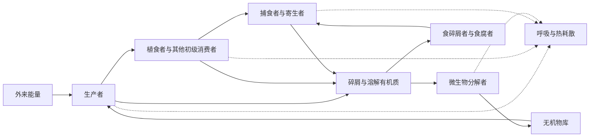

# 生态系统结构与食物网

生态系统把生物群落与其物理、化学环境放在同一研究边界内。森林不只是乔木、鸟和微生物的集合，还包括土壤水分、矿质元素、枯落物、辐射以及跨边界输入输出；湖泊也不能只由水中物种名单定义。Tansley 在提出 ecosystem 一词时，强调的正是生物与环境共同构成的物理系统。[^tansley-ecosystem]

本页先界定生态系统的组成与边界，再沿生产者—消费者—碎屑途径进入食物链和食物网，讨论营养级、生态金字塔、能量收支、传递效率、污染物放大以及上下行控制。初级与次级生产的测定、分解速率和完整能流预算在下一页[生产力、分解与能量流](production_decomposition.md)展开；元素的库与循环则留给[生物地球化学循环](biogeochemical_cycles.md)。

## 生态系统由边界、组分和过程共同定义 { #ecosystem-boundaries }

一个生态系统是在明确时空范围内，生物组分与非生物环境通过能量、物质和相互作用联系起来的整体。边界可以是湖岸、集水区或培养容器，也可以是研究者为计算通量而规定的一平方米草地。自然边界和分析边界未必重合，所以研究必须写明面积或体积、观测期以及哪些输入输出被纳入。

生态系统分析常把对象分成**库**与**通量**。某时刻土壤有机碳、湖水溶解磷和植物生物量是库，单位可写成质量或能量每单位面积；光合固定、摄食、呼吸、淋溶和迁出是单位时间内改变库的通量。只有单位和边界一致，才能判断一个库为何增加、减少或维持近似稳态。

物质可在生物、碎屑和无机环境之间反复转化，能量则以辐射或化学能进入，经生物化学反应和食物关系传递，最终以热耗散。动物信号、植物挥发物、病原体诱导和行为记忆也会改变过程速率，传统材料因而把“信息交流”列作生态系统功能；这里的信息是影响相互作用的结构和信号，不像能量或元素那样构成一个守恒通量。

生产、分解、养分再生和食物网传递是常用的生态系统过程。它们并不要求系统保持不变：组成、气候或外来输入改变时，库和通量都可重组。所谓调节力失效，可能表现为负反馈减弱、正反馈增强、关键功能组丧失或外界压力越过阈值，而不只是抽象的“信息系统破坏”。

## 非生物环境和功能组构成基本结构 { #ecosystem-components }

非生物环境包括水、空气、矿质元素和其他无机化合物，也包括温度、光、流速、地形等物理条件。枯落物、尸体、粪便、土壤腐殖质和溶解有机质来自生物，却在生态系统分析中常作为非生命有机物库单独记录，因为它们连接生物生产、分解和长期储存。

生物组分可按取得碳和能量的方式分成若干功能组：

| 功能组 | 主要过程 | 典型成员与边界 |
| --- | --- | --- |
| 生产者 | 以光能或无机化学反应提供的能量固定无机碳，形成有机物 | 绿色植物、藻类、蓝细菌和其他光合细菌，以及化能无机自养的细菌和古菌；“把非生物能量输入生态系统”更准确地说是把外来能量转成可进入生物量的化学能 |
| 消费者 | 摄取其他生物或其产物，进行异养生长、维持和繁殖 | 植食者、捕食者、杂食者、寄生物与滤食者；消费者可改变生产者、猎物、竞争关系和养分再生，不能一概视为“可有可无” |
| 微生物分解者 | 通过胞外酶把大分子有机物转成可吸收的小分子，并使部分元素矿化 | 细菌、真菌和部分古菌；它们承担许多化学分解和养分再生过程 |
| 食碎屑者与食腐者 | 摄食、破碎或搬运死亡有机物，扩大微生物作用界面并把碎屑能量带入动物食物网 | 蚯蚓、白蚁、螨、许多甲壳类、蠕虫和软体动物属于食碎屑者；秃鹫、蟹等可为食腐者。旧教材常把它们统称分解者，按消化位置和过程分开更清楚 |

同一生物可以跨组。食虫植物能光合也摄取动物来源的矿质营养，珊瑚与共生藻共同跨越自养和异养途径，许多原生生物兼有光合与吞噬能力。功能组是追踪过程的工具，不是新的分类阶元。

初级生产是自养生物形成有机物的过程；次级生产是异养生物把已摄取或吸收的有机物转成自身新生物量的过程，包括个体生长和繁殖产生的组织。生产量是在给定时间内形成的量，生产力是单位面积或体积、单位时间的速率。消费者呼吸释放的能量不属于次级生产，后代数量本身也不能替代生物量或能量单位。

图中的实线追踪物质与可利用化学能进入各库的主要路径，虚线表示能量经呼吸等过程耗散。排遗、死亡和未被摄食的生产把各营养层都连接到碎屑库；因此碎屑链不是牧食链末端附加的一条小支路，而是食物网的核心能量通道。[^detrital-web]

## 食物链是食物网中的一条路径 { #food-chains-webs }

食物链按资源被摄食的先后排列一条能量和物质路径，例如草—蝗虫—蛙—蛇。自然群落中，一个消费者常取食多个资源，一个资源也被多个消费者利用，死亡物和排泄物再进入微生物与食碎屑者通道，多条链因而交织成食物网。记录“谁吃谁”得到拓扑食物网；再加入摄食量、生产量或作用强度，才能判断哪条联系承担主要通量或控制作用。

箭头方向需要事先声明。本页按能量和物质传递方向，由资源指向消费者；若研究的是种间作用，消费者对资源的负效应箭头则方向相反。同一张图混用两套箭头会使食物网和调控网难以区分。

### 牧食、碎屑与寄生途径 { #grazing-detrital-parasitic-chains }

牧食食物链或捕食食物链从活的生产者开始，经植食者进入捕食者。浮游植物生产明显的湖泊和远洋表层中，这条通道很醒目，但细菌、溶解有机质和沉降颗粒仍可贡献大量能流。碎屑食物链从死亡有机物、粪便或溶解有机质开始，经微生物、食碎屑者及其捕食者继续，在多数陆地生态系统、土壤、浅水和盐沼中尤其重要。

水体中的微生物环把溶解有机碳带入细菌，再经异养原生生物和浮游动物返回较大的消费者。陆地枯落物也同时进入真菌主导和细菌主导的通道。快周转的牧食通道与较慢的碎屑通道可以在共同捕食者处耦合，通道间时间尺度差异有时会缓冲波动。[^food-web-channels]

传统“辅助食物链”中的寄生链应保留为食物网的一类路径：寄生物以寄主组织或资源为食，重寄生物又利用寄生物，寄生关系可显著增加网络连接。旧称腐生链的部分则归入微生物分解和碎屑通道。寄生者、病原体和共生微生物体型小、生活史隐蔽，早期食物网常低估其连接数。

## 营养级是位置而非固定身份 { #trophic-levels }

营养级把从基础资源到消费者的摄食步数相近者归在一起。生产者通常置于第 1 营养级，直接利用生产者的初级消费者位于第 2 级，捕食它们的消费者位于更高层。碎屑本身不是一个进行代谢的物种，却是碎屑食物网的基础资源；分解者和食碎屑者也不是永远处在“最后一级”，它们会被原生生物、无脊椎动物和脊椎动物继续摄食。

杂食使实际营养位置成为分数。若消费者 $i$ 的食物中，资源 $j$ 所占比例为 $d_{ij}$，且各比例之和为 1，可写为

$$
TL_i=1+\sum_j d_{ij}TL_j.
$$

一个动物若 70% 食物来自生产者、30% 来自初级消费者，其营养位置为

$$
1+0.7\times1+0.3\times2=2.3.
$$

食性随年龄、季节和地点改变时，同一物种的营养位置也会改变。食物网实测和稳定同位素可以估计这种连续位置，但都依赖基线、饮食比例和分馏假设。[^trophic-tangles]

食物链长度可用最长摄食路径、最高营养位置或能量传递次数表示，三种定义未必给出同一数值。许多生态系统常见少于约五个主要营养级，这来自每次传递的损失、种群维持所需资源和网络动力学共同约束；它不是“最多五级”的硬上限。生态系统面积、资源供应、干扰、捕食关系和组装历史都会改变链长。[^food-chain-length]

## 生态金字塔必须写明测量对象 { #ecological-pyramids }

生态金字塔把各营养级的数量、现存生物量或一定时间内的生产和能流并列。三者单位不同，形状也不能互相推断。

| 金字塔 | 测量量与单位 | 能否倒置及其解释 |
| --- | --- | --- |
| 数量金字塔 | 单位面积或体积中的个体数 | 可以倒置。一棵树可支持大量植食昆虫，昆虫又可携带多个寄生物；个体大小悬殊时，数量不能代表功能贡献 |
| 生物量金字塔 | 某时刻各层的现存生物量，如 g C m⁻² | 可以倒置。海洋或湖泊中，少量但快速更新的浮游植物可支持周转较慢、瞬时生物量更高的浮游动物；英吉利海峡的传统实例属于这种现存量关系 |
| 生产／能流金字塔 | 一定时间内各层形成的新生物量或传递能量，如 kJ m⁻² yr⁻¹ | 在边界、时间和能量口径一致且纳入外来补给时不会倒置，因为每次传递都有未摄食、未同化、呼吸和排泄损失 |

水域中的倒置生物量不违反热力学。现存量是“此刻有多少”，生产力是“单位时间产生多少”；周转率等于生产量与平均现存量之比。浮游植物被迅速生产又迅速摄食，低现存量仍可维持较高年生产。全球海洋的生产者现存碳量小于消费者现存碳量，也主要反映生产者周转快。[^inverted-biomass]

若能流金字塔看似倒置，常见原因是漏掉了跨边界补给、把不同季节的值拼接、混用干重和能量，或把现存量误当生产率。比较金字塔时还应说明湿重、干重、碳量还是热值，避免大型含水生物或木质组织造成尺度误读。

## 个体能量预算连接到营养级效率 { #energy-budget-efficiency }

对消费者，摄食量 $I$ 是进入消化道的食物能量，未被吸收而随粪便排出的部分记为 $F$，同化量为

$$
A=I-F.
$$

同化能量随后用于呼吸和活动 $R$、形成生长与繁殖组织的生产 $P$，以及尿素、氨等排泄物中的能量损失 $U$：

$$
A=P+R+U.
$$

有些简化预算把 $U$ 合并进代谢损失，写成 $P=A-R$；采用哪一口径必须注明。对生产者，传统材料把光合作用固定量类比为同化量，更规范的符号是总初级生产 GPP，扣除自养呼吸后得到净初级生产 NPP。本页只建立符号，测定方法在下一页展开。

生态效率描述预算中不同节点的比例。设第 $n$ 营养级的生产为 $P_n$，第 $n+1$ 级从它摄食 $I_{n+1}$、同化 $A_{n+1}$、形成生产 $P_{n+1}$，则：

| 效率 | 公式 | 生物学含义 |
| --- | --- | --- |
| 消费效率 | $CE=I_{n+1}/P_n$ | 下层新生产中有多少被上层实际摄食；未摄食部分可死亡、储存或进入碎屑链 |
| 同化效率 | $AE=A_{n+1}/I_{n+1}$ | 摄入能量中有多少穿过消化或吸收界面；受食物化学组成、结构、防御和消化生理影响 |
| 净生产效率 | $PE=P_{n+1}/A_{n+1}$ | 已同化能量中有多少形成新的消费者生物量，而非用于呼吸、活动和其他损失 |
| 营养级传递效率 | $TTE=P_{n+1}/P_n$ | 相邻两营养级生产率之比；在上述口径下 $TTE=CE\times AE\times PE$ |

旧教材中的“生态效率”“Lindeman 效率”和“传递效率”有时分别用生产比、摄食比或同化比表示。直接报告公式比只报名称可靠。原素材把 $CE$ 写成 $I_{n+1}/P_n$ 是合理的；若同时把 Lindeman 效率写成 $A_{n+1}/A_n$ 并令其等于三项效率乘积，代数上并不一致。本页以相邻营养级生产率之比作为总传递效率。

食肉动物的同化效率常高于食草动物，主要因为动物组织较易消化，而植物细胞壁和化学防御会降低吸收；这不是所有物种的固定排序。内温动物把大量同化能用于维持体温，群体净生产效率通常低于外温动物，但同化效率本身主要受食物与消化影响，不能写成“恒温动物必高于变温动物”。幼体在快速生长期可能有较高生产效率，成年个体的繁殖投入也属于生产，不能只看体重增加。

植物把太阳辐射转成生物量的效率与消费者把同化有机物转成新组织的效率具有不同分母，不宜放进“植物＞小动物＞大型动物”的同一序列。跨类群比较还会受到体型、温度、食物质量、化学计量和维持代谢影响。

### 十分之一法则的用途和限度 { #ten-percent-rule }

Lindeman 的营养动力学把各营养级的生产和能量损失放进统一预算，并使“相邻营养级约传递十分之一”成为经典教学近似。[^lindeman] 它适合说明能量为何沿链逐级减少，也可用于数量级估算；它不是每条食物链都应得到 10% 的自然常数。

湖泊综述中的相邻营养级传递效率从低于 1% 到超过 30% 均有记录。估计值会随生产测量方法、营养位置划分、底栖—水层耦合和外来有机质而变化。[^trophic-transfer] $CE$、$AE$ 和 $PE$ 任一环节改变，都能使总效率偏离 10%；食物的 C:N:P 比和必需脂肪酸还会使“能量充足”与“营养质量足够”分离。

## 污染物在个体和食物网中的增浓 { #contaminant-transfer }

能量逐级减少并不意味着所有物质浓度都同步降低。难降解、易被组织结合且排出缓慢的污染物可以在个体内积累，并随食物关系转移。三个相近术语应按路径区分：

- **生物浓缩**（bioconcentration）是生物直接从水或其他环境介质吸收化学物，不包括食物途径；
- **生物积累**（bioaccumulation）是个体经呼吸、体表、沉积物和食物等全部途径摄入后，净摄入长期超过代谢与排出的结果；
- **生物放大**（biomagnification）是污染物经膳食传递后，组织浓度随营养位置系统升高。

原素材把生物浓缩解释为“同营养级从环境蓄积”容易与积累混淆；判据应是是否只考虑环境直接吸收。美国 EPA 也按直接水相摄取、全部途径摄取和跨营养级升高区分三者。[^bioaccumulation]

污染物进入食物网不一定发生放大。代谢转化快、易排泄或受生长稀释的化合物可随营养位置降低；脂溶性只是部分有机污染物的重要机制，甲基汞等还涉及蛋白结合。判断放大需要比较捕食者—猎物浓度或以稳定同位素估计的营养位置斜率，并控制组织类型、年龄、季节和食谱变化。

## 上行供给和下行控制共同塑造食物网 { #bottom-up-top-down }

底层资源供应向上传递的作用称上行或 bottom-up 控制。光、氮、磷、水分或碎屑输入增加，可能先提高生产者或微生物生产，再改变植食者和捕食者；响应能否向上传递受食物质量、消费者饱和和栖息地结构限制。下行或 top-down 控制从消费者开始：捕食者改变猎物数量或行为，间接影响更低营养级，连续的间接效应称营养级联。

Paine 移除潮间带海星后，贻贝扩张并排挤多种固着生物，展示了捕食者怎样通过竞争关系改变局地多样性。[^paine-food-web] 湖泊研究又表明，食鱼鱼类可压低食浮游动物鱼类，使大型浮游动物增强、浮游植物受摄食加强；养分供给与鱼类控制共同决定湖泊生产和清澈度。[^lake-cascade] 陆地系统也存在捕食者—植食者—植物级联，但强度随捕食者类型、植物补偿、空间异质性和食物网多样性而变。[^terrestrial-cascade]

同一系统可在不同季节或营养级同时表现上下行控制。杂食者跨层取食、消费者转食、外来补给和碎屑通道会削弱、增强甚至反转简单三层链的预期。操纵养分与消费者的析因实验、前后对照和多层时间序列，比单次丰度相关更能区分控制方向。

## 开放性和反馈决定系统怎样响应变化 { #feedback-openness }

自然生态系统通常是开放系统，持续交换能量、物质和生物。河流接受上游有机质并向下游输出，森林与大气交换碳和水，海岛依靠迁入补充物种。分析若漏掉这些跨界通量，局地消费者可能看似凭空获得超过本地生产的能量。

热力学中的封闭系统不交换物质但可以交换能量，孤立系统才既不交换物质也不交换能量。旧教材所举“宇宙舱生态系统”或密闭微宇宙，是努力使物质循环闭合、仍从外界接受光或电并释放热的实验系统；完全封闭且长期自持的生命系统在实践中难以实现。开放与封闭描述边界交换，不等于系统稳定或不稳定。

反馈把状态变化送回过程速率。资源减少使消费者增长放慢、密度升高使死亡或迁出增加，属于可能抑制偏离的负反馈；捕食者—猎物时滞可让同一反馈产生振荡。植被丧失引起侵蚀和保水下降、浑水抑制水草而水草丧失又维持浑水，则可形成放大变化的正反馈和替代稳态。负反馈有助于局部稳定，却不能保证群落回到唯一“生态平衡”。

物种丧失对稳定性的影响取决于身份、功能冗余、响应差异和食物网位置。长期草地实验显示较高植物多样性可提高群落生产的时间稳定性，部分来自物种波动不同步；关键捕食者或主要分解者的丧失又可能产生不成比例的后果。[^biodiversity-stability] 反过来，随机连接的复杂模型并不自动更稳定，真实食物网的相互作用强度、模块、快慢能量通道和反馈符号同样重要。[^complexity-stability]

因此“任何一种生物灭绝都会降低稳定性”保留为重视网络依赖的警示，却不能作为逐物种普适定律。稳定性还必须说明测量的是生产变异、物种持续、受扰幅度、恢复速度还是状态转换阈值。

## 食物网推断需要从连线走向通量与机制 { #food-web-inference }

一张物种连线图回答谁可能吃谁，营养级回答资源路径长度，能量预算回答多少生产真正传到上层，操纵实验回答某个节点是否控制其他节点。连线数多不等于通量大，数量稀少的关键种也可能通过强相互作用改变整个网络；相反，频繁发生但彼此补偿的联系可使总功能较稳定。

建立食物网时应同时记录研究边界、季节和生命阶段，尽可能区分直接观察、胃含物、DNA 食性、稳定同位素与模型推断。随后用摄食率、生产率或相互作用强度给连线加权，并把碎屑、微生物、寄生者与外来补给纳入。这样，经典的生产者—消费者—分解者、食物链、金字塔和十分之一法则仍提供清楚入口，同时可以进入真实生态系统的多通道、杂食和反馈结构。

## 参考资料与延伸阅读 { #references }

- Chapin, F. S. III, Matson, P. A. & Vitousek, P. M. *Principles of Terrestrial Ecosystem Ecology*. 2nd ed. Springer, 2011.
- Moore, J. C. & de Ruiter, P. C. *Energetic Food Webs: An Analysis of Real and Model Ecosystems*. Oxford University Press, 2012.
- Polis, G. A. & Winemiller, K. O. (eds.). *Food Webs: Integration of Patterns and Dynamics*. Chapman & Hall, 1996.
- Sterner, R. W. & Elser, J. J. *Ecological Stoichiometry*. Princeton University Press, 2002.
- Begon, M. & Townsend, C. R. *Ecology: From Individuals to Ecosystems*. 5th ed. Wiley, 2021.

[^tansley-ecosystem]: Tansley, A. G. “The use and abuse of vegetational concepts and terms.” *Ecology* 16 (1935): 284–307. [doi:10.2307/1930070](https://doi.org/10.2307/1930070)。
[^detrital-web]: Moore, J. C. et al. “Detritus, trophic dynamics and biodiversity.” *Ecology Letters* 7 (2004): 584–600. [doi:10.1111/j.1461-0248.2004.00606.x](https://doi.org/10.1111/j.1461-0248.2004.00606.x)。
[^food-web-channels]: Rooney, N., McCann, K., Gellner, G. & Moore, J. C. “Structural asymmetry and the stability of diverse food webs.” *Nature* 442 (2006): 265–269. [doi:10.1038/nature04887](https://doi.org/10.1038/nature04887)。
[^trophic-tangles]: Williams, R. J. & Martinez, N. D. “Trophic levels and trophic tangles: the prevalence of omnivory in real food webs.” *Ecology* 88 (2007): 2689–2696. [doi:10.1890/06-1869.1](https://doi.org/10.1890/06-1869.1)。
[^food-chain-length]: Post, D. M. “The long and short of food-chain length.” *Trends in Ecology & Evolution* 17 (2002): 269–277. [doi:10.1016/S0169-5347(02)02455-2](https://doi.org/10.1016/S0169-5347%2802%2902455-2)。
[^inverted-biomass]: Bar-On, Y. M., Phillips, R. & Milo, R. “The biomass distribution on Earth.” *Proceedings of the National Academy of Sciences* 115 (2018): 6506–6511. [doi:10.1073/pnas.1711842115](https://doi.org/10.1073/pnas.1711842115)；Gasol, J. M., del Giorgio, P. A. & Duarte, C. M. “Biomass distribution in marine planktonic communities.” *Limnology and Oceanography* 42 (1997): 1353–1363. [doi:10.4319/lo.1997.42.6.1353](https://doi.org/10.4319/lo.1997.42.6.1353)。
[^lindeman]: Lindeman, R. L. “The trophic-dynamic aspect of ecology.” *Ecology* 23 (1942): 399–417. [doi:10.2307/1930126](https://doi.org/10.2307/1930126)。
[^trophic-transfer]: Mehner, T. et al. “Trophic transfer efficiency in lakes.” *Ecosystems* 25 (2022): 1628–1652. [doi:10.1007/s10021-022-00776-3](https://doi.org/10.1007/s10021-022-00776-3)。
[^bioaccumulation]: U.S. Environmental Protection Agency. “Bioaccumulation testing and interpretation for the purpose of sediment quality assessment: status and needs.” 2000. [EPA 原文](https://nepis.epa.gov/Exe/ZyPURL.cgi?Dockey=20003TM1.TXT)；Mackay, D. et al. “Bioconcentration, bioaccumulation, biomagnification and trophic magnification: a modelling perspective.” *Environmental Science: Processes & Impacts* 20 (2018): 72–85. [doi:10.1039/C7EM00485K](https://doi.org/10.1039/C7EM00485K)。
[^paine-food-web]: Paine, R. T. “Food web complexity and species diversity.” *The American Naturalist* 100 (1966): 65–75. [doi:10.1086/282400](https://doi.org/10.1086/282400)。
[^lake-cascade]: Carpenter, S. R., Kitchell, J. F. & Hodgson, J. R. “Cascading trophic interactions and lake productivity.” *BioScience* 35 (1985): 634–639. [doi:10.2307/1309989](https://doi.org/10.2307/1309989)；Power, M. E. “Top-down and bottom-up forces in food webs: do plants have primacy?” *Ecology* 73 (1992): 733–746. [doi:10.2307/1940153](https://doi.org/10.2307/1940153)。
[^terrestrial-cascade]: Schmitz, O. J., Hambäck, P. A. & Beckerman, A. P. “Trophic cascades in terrestrial systems: a review of the effects of carnivore removals on plants.” *The American Naturalist* 155 (2000): 141–153. [doi:10.1086/303311](https://doi.org/10.1086/303311)。
[^biodiversity-stability]: Tilman, D., Reich, P. B. & Knops, J. M. H. “Biodiversity and ecosystem stability in a decade-long grassland experiment.” *Nature* 441 (2006): 629–632. [doi:10.1038/nature04742](https://doi.org/10.1038/nature04742)。
[^complexity-stability]: May, R. M. “Will a large complex system be stable?” *Nature* 238 (1972): 413–414. [doi:10.1038/238413a0](https://doi.org/10.1038/238413a0)。
