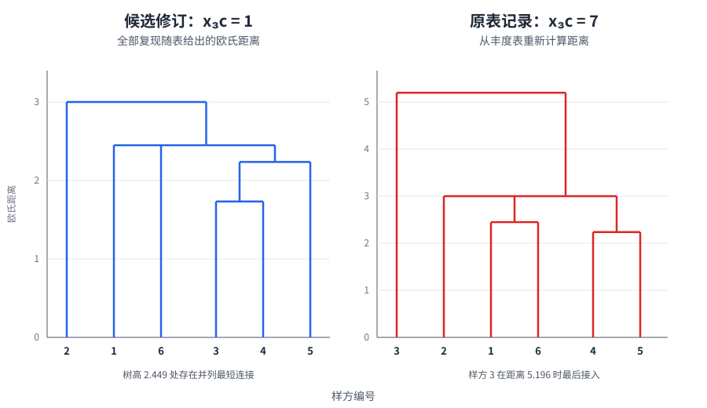

# 群落多样性与分类分析

群落调查从一张“样本 × 分类单元”数据表开始，却不会在算出一个多样性指数后结束。同一批样方可以按个体数、盖度或生物量描述，丰富度会随取样努力增加，样本之间的远近又会随数据变换、距离和聚类方法改变。分析的任务是把这些选择写清楚，使优势种、多样性和样方分类分别回答可检查的问题。

本页承接土壤与潮间带动物调查中的分类、计数、称量、优势种判定和多样性计算，并完整重算六个样方的最近邻聚类练习。取样框、潮位或土层记录见[环境梯度与生态生理实验](ecophysiology.md#soil-intertidal-sampling)，多样性与群落结构的生态学含义见[群落组成、结构与多样性](../../ecology/community_ecology.md#alpha-diversity)，多元方法的一般原理见[多元统计、降维与分类](../../biostat/multivariate_models.md#distance-and-ordination)。

## 样本与分类单元的数据矩阵 {#community-data-matrix}

矩阵的一行应代表一个预先定义的样本单位，如一个样方、样芯或独立样地；一列代表一个分类单元；单元格 $x_{ji}$ 表示样本 $j$ 中分类单元 $i$ 的测量值。同一张分析矩阵必须保持相同的取样面积、分类精度和测量口径。把某些列写个体数、另一些列写湿重，所得距离和相对丰度没有统一含义；把同一样带中的相邻小格当成独立样地，也会夸大重复数。

### 分类身份与凭证 {#taxonomic-identity-vouchers}

素材把海葵、海星、海胆、蛏、海岸水虱、牡蛎和弹涂鱼列在“土壤动物”实验下，这些对象实际来自不同潮间带微生境，不能与农田或凋落物中的土壤动物合并成一个无边界群落。每批样本应先确定纳入对象和最低分类阶元，再用检索表、连续形态特征和必要的专家复核鉴定。物种名尚不能确定时，可使用稳定的“形态种 A”“多毛类 B”等操作分类单元，并保留现场照片、样品编号、采集地点、日期、鉴定者和置信度；后续改名时更新分类映射，而不改写原始计数。

陌生个体或出现在预期层位之外的个体仍属于观察结果。悄悄丢弃、借用其他组标本补数或在记录后倒掉样品，会同时改变物种数、优势度和样本距离，使所有后续计算失去证据基础。异常标本应保留为待复核分类单元；若受许可、保护要求或样品条件限制而不能制作实体凭证，则至少保存带尺度的多角度影像和现场记录。凭证的目的在于让分类身份可复核，而不是为了计算而额外采集个体。

### 个体数、盖度与生物量 {#abundance-cover-biomass}

“优势”必须连同测量轴一起陈述。活动性土壤动物常按单位面积或体积的个体数比较，牡蛎等固着生物可以按盖度或占据点数比较，体型差异很大的类群还可分别报告生物量。设分类单元 $i$ 的测量值为 $y_i$，其相对量为

$$
p_i=\frac{y_i}{\sum_{k=1}^{S}y_k}.
$$

$y_i$ 可以是数量、盖度或生物量，但一项分析中只能采用一种明确定义的量。数量优势种未必具有最高生物量，盖度最高的固着种也未必个体最多；因此原练习要求的“个体数、盖度、生物量”应分别排序，而不是把三个不同单位直接相加。植物群落常用的相对密度、相对频度和相对优势度综合重要值有特定定义，不能未经说明搬到动物样本；其计算见[群落组成、结构与多样性](../../ecology/community_ecology.md#importance-value)。

称重前去水、去泥和去杂物需要固定操作，例如统一沥水或吸干时长、是否连壳、测湿重还是干重。湿重受体腔水和表面水影响，干重或无灰干重则需要破坏样品。若研究问题只需比较数量或盖度，不必为了获得一个额外指标而牺牲全部凭证。

## 局地物种多样性 {#alpha-diversity}

观察丰富度 $S$ 是样本中记录到的分类单元数，相对丰度 $p_i$ 描述测量总量怎样分配。常用指标对稀有种和优势种赋予的权重不同：

| 指标 | 公式 | 本页中的解释 |
| --- | --- | --- |
| Shannon 熵 | $H'=-\sum_i p_i\ln p_i$ | 同时响应丰富度和均匀度，稀有种权重高于 Simpson 集中度 |
| Shannon 有效数 | ${}^{1}D=\exp(H')$ | 与该样本同样多样的等丰度物种数 |
| Simpson 集中度 | $\lambda=\sum_i p_i^2$ | 两次独立抽取落入同一分类单元的概率形式，对优势种权重较高 |
| Gini–Simpson 多样性 | $1-\lambda$ | 两次独立抽取落入不同分类单元的概率形式 |
| Simpson 有效数 | ${}^{2}D=1/\lambda$ | 以等丰度物种数表示的优势种多样性 |
| Pielou 均匀度 | $J'=H'/\ln S$ | 在 $S>1$ 时比较同样丰富度下的最大 Shannon 熵 |

“Simpson 指数”可能指 $\lambda$、$1-\lambda$ 或 $1/\lambda$，报告时必须给出公式。Hill 数把丰富度、Shannon 熵和 Simpson 集中度统一成有效物种数：${}^{0}D=S$、${}^{1}D=\exp(H')$、${}^{2}D=1/\sum p_i^2$；阶数 $q$ 越高，结果越受常见种支配。[^hill-diversity]

以聚类练习的样方 1 为例，三个分类单元的数值为 $(2,0,3)$，所以 $S=2$、$p=(0.4,0.6)$。由此得到 $H'=0.673$、${}^{1}D=1.960$、$\lambda=0.520$、$1-\lambda=0.480$、${}^{2}D=1.923$ 和 $J'=0.971$。这些值描述的是按当前计数口径记录到的两个分类单元；它们不会自动校正漏检，也不能说明这两个分类单元在功能或系统发育上相差多远。

### 取样完整度与公平比较 {#sampling-completeness}

物种数随样方面积、样本数、个体数和鉴定努力增加。比较两个地点时，应先画物种累积或稀释—外推曲线，并同时保留原始努力和不确定区间。基于样本覆盖度的标准化比较“下一次抽到的个体属于已记录物种”的概率相近时的多样性，能避免只把样本较大的地点判为更丰富。Chao 等建立的框架可同时处理丰度资料和出现频次资料，并把 $q=0,1,2$ 的 Hill 数放在共同的稀释与短程外推体系中。[^coverage-rarefaction]

指数之前仍应展示秩—丰度曲线或完整的分类单元表，因为同一个 $H'$ 可能由不同的丰富度—均匀度组合产生。独立样地或样方才提供组间不确定度；把一个地点中所有样方先合并为单一指数，再用样方数充当统计重复，不能检验地点差异。

## 样方之间的距离与相异度 {#community-dissimilarity}

原练习对样方 $j$、$k$ 使用欧氏距离

$$
D_{jk}=\sqrt{\sum_{i=1}^{S}(x_{ij}-x_{ik})^2}.
$$

$D_{jk}=0$ 表示两行向量相同，数值越大表示差异越大，所以它是距离而非“相似系数”。原始个体数上的欧氏距离会让总数量大、数值大的分类单元主导结果；共同零不增加距离，却也不能说明“双方都未检出”究竟来自相似环境、相同漏检还是该分类单元根本不在样本框内。若目标是比较群落组成，可以根据数据含义选择另一种输入：

| 输入与相异度 | 计算形式 | 回答的问题与边界 |
| --- | --- | --- |
| 原始或标准化向量的 Euclidean | $\sqrt{\sum_i(x_{ij}-x_{ik})^2}$ | 保留绝对差值；受总量、尺度和极端值影响 |
| Hellinger 变换后 Euclidean | 先令 $h_{ji}=\sqrt{x_{ji}/\sum_i x_{ji}}$ | 比较相对组成，并减弱优势种和许多零值对欧氏几何的扭曲 |
| Bray–Curtis 相异度 | $\sum_i|x_{ij}-x_{ik}|/\sum_i(x_{ij}+x_{ik})$ | 用非负丰度比较共享数量；共同零不增加相似性 |
| Jaccard 相异度 | $(b+c)/(a+b+c)$ | $a$ 为共有分类单元数，$b,c$ 为各自独有数；将数据化为出现／缺失后比较名单，舍弃数量信息 |

Hellinger 变换使基于欧氏距离的排序和聚类更适合物种丰度表；Bray–Curtis 则直接按共享丰度构造相异度。二者并不保证产生同一分组，选择应由“绝对数量差”“相对组成差”还是“物种名单差”这一研究问题决定。[^community-transform-distance]

若只比较一组非负欧氏距离的大小，平方距离与距离具有相同的两两排序；在严格按最小距离更新的单连接聚类中，合并次序也不变，但树状图纵轴会变成平方距离。平均连接、质心法、Ward 法及其他更新公式不能把“省略开根号”当成普遍简化，报告矩阵和树高时也必须注明所用尺度。

## 六样方数据的冲突审计 {#six-quadrat-audit}

素材给出三个分类单元 a、b、c 在六个样方中的数值：

| 分类单元 | 样方 1 | 样方 2 | 样方 3 | 样方 4 | 样方 5 | 样方 6 |
| --- | ---: | ---: | ---: | ---: | ---: | ---: |
| a | 2 | 5 | 2 | 1 | 0 | 3 |
| b | 0 | 1 | 4 | 3 | 1 | 2 |
| c | 3 | 4 | **7** | 0 | 0 | 2 |

按这张表计算，样方 1 与 3 的距离应为

$$
D_{13}=\sqrt{(2-2)^2+(0-4)^2+(3-7)^2}
=\sqrt{32}=5.657,
$$

样方 3 与 4 的距离应为 $\sqrt{51}=7.141$。素材随后却分别列为 4.472 和 1.732。检查全部 15 个两两距离可发现：只要把 $x_{3c}$ 从 7 改为 1，素材距离矩阵便全部成立；例如

$$
D_{13}=\sqrt{0^2+(-4)^2+2^2}=\sqrt{20}=4.472,
\qquad
D_{34}=\sqrt{1^2+1^2+1^2}=1.732.
$$

这构成很强的转录错误证据，却仍不能授权分析者静默改写原始数据。正确处理是回查纸质记录、电子录入和标本计数；无法恢复时保留两个版本，标为“原表 $x_{3c}=7$”和“与距离矩阵一致的候选修订 $x_{3c}=1$”，分别分析其敏感性。候选修订对应的距离矩阵为：

| $D_{jk}$ | 1 | 2 | 3 | 4 | 5 | 6 |
| --- | ---: | ---: | ---: | ---: | ---: | ---: |
| 1 | 0 | 3.317 | 4.472 | 4.359 | 3.742 | 2.449 |
| 2 |  | 0 | 5.196 | 6.000 | 6.403 | 3.000 |
| 3 |  |  | 0 | 1.732 | 3.742 | 2.449 |
| 4 |  |  |  | 0 | 2.236 | 3.000 |
| 5 |  |  |  |  | 0 | 3.742 |
| 6 |  |  |  |  |  | 0 |

## 最近邻层次聚类 {#single-linkage-clustering}

凝聚型层次聚类从六个单样方簇开始，每一步合并当前距离最小的两个簇。最近邻法即单连接法（single linkage）；新簇 $U=A\cup B$ 到另一簇 $V$ 的距离为

$$
d(U,V)=\min_{u\in U,\,v\in V}d(u,v).
$$

素材所说“涉及合并样方的数据求平均”属于平均连接的思想，不是最近邻更新。平均连接按两个簇中所有跨簇样本对的距离求平均；两种规则会产生不同树。SciPy 的正式方法说明也分别把 single 定义为最小成对距离、average 定义为全部跨簇距离的平均，并指出最小距离并列时，不同实现可能选取不同的二叉合并次序。[^linkage-methods]

### 与距离矩阵一致的候选修订 {#candidate-c3-one}

在 $x_{3c}=1$ 的版本中，最近邻合并过程为：

| 阶段 | 合并 | 树高 |
| ---: | --- | ---: |
| 1 | $\{3\}$ 与 $\{4\}$ | 1.732 |
| 2 | $\{3,4\}$ 与 $\{5\}$ | 2.236 |
| 3 | $\{1\}$ 与 $\{6\}$ | 2.449 |
| 4 | $\{1,6\}$ 与 $\{3,4,5\}$ | 2.449 |
| 5 | $\{2\}$ 与 $\{1,3,4,5,6\}$ | 3.000 |

树高 2.449 处同时存在 $1$—$6$ 与 $6$—$\{3,4,5\}$ 两条最短连接。软件可能先画其中任意一条，但在这一高度切树时，样方 1、3、4、5、6 已通过最近邻链连成同一组；叶片左右顺序也可旋转，不代表额外生态梯度。

### 坚持原表数值的重算 {#printed-c3-seven}

若 $x_{3c}=7$ 确为原始观察，素材距离矩阵便应废弃并从丰度表重算。最近邻结果改为：样方 4 与 5 在 2.236 合并，样方 1 与 6 在 2.449 合并；树高 3.000 处样方 2 和 $\{4,5\}$ 都通过与 $\{1,6\}$ 的最短距离接入；样方 3 最后才在 5.196 接入。由一个单元格产生的这项变化说明，数据审计不能被视为聚类之前的机械整理。

{ loading=lazy }
/// caption
同一练习中，$x_{3c}=1$ 可复现素材距离矩阵，$x_{3c}=7$ 则使样方 3 成为最后接入的离群样方；横线高度为欧氏距离。
///

树状图底端是原始样方，向上逐步形成较大的簇，顶端是包含全部样方的根簇；纵轴是本例的欧氏距离，不是相似度。单连接只需一对近邻就能把两个簇接在一起，容易产生细长的“链化”分组。素材所说的“空间压缩”可理解为这种最小距离更新对簇内远端差异不敏感，而不能理解为原始样方真的在地理空间中被压缩。

## 分析流程与结果复核 {#analysis-workflow-validation}

群落分析应保存未经变换的样本矩阵，再从研究问题确定测量轴、数据变换、相异度和连接规则。先检查总量、零值、异常录入和分类精度，绘制各样方的组成及秩—丰度关系；随后计算局地多样性与取样完整度，再构造样方距离矩阵和树状图。矩阵对称性、对角线为零、手算的若干距离与软件输出一致，是最低限度的计算复核。

聚类属于探索性分类。可比较原始 Euclidean、Hellinger–Euclidean 与 Bray–Curtis，并比较 single、average 或其他有明确几何条件的方法；若分组随一个单元格、一次变换或一种连接法彻底改变，结论应报告为不稳定。预先记录的土层、潮位、基质和植被可在聚类完成后叠加解释，但不能先按环境标签修改样本值，再声称聚类独立发现了这些组。

树状图纵轴、切树高度、距离与连接法、并列距离的处理、软件及版本都应保留。一个簇表示在所选数据表示下相近的样方，不等同于正式植被类型、动物群落边界或共同生态机制；因果解释还需要独立环境变量、重复样地、时间复测或操纵实验支持。

## 记录与结论边界 {#records-inference}

最终数据包应包含样方位置和面积、取样日期、提取与计量方法、原始分类单元名、后续分类映射、原始计数／盖度／生物量、照片或凭证号、数据更正记录以及分析脚本。原表的 7、候选修订的 1 和作出判断的距离证据必须并存，不能只留下“清洗后”的表格。

多样性比较只适用于相同样本框、努力和分类精度下可比的群落。优势度说明谁在所选测量轴上占比高，Hill 数说明相对丰度怎样分配，距离与聚类说明样方在指定几何下怎样成组；三者互相补充，却不能彼此替代。保留分类不确定性、取样不完整和方法敏感性，才使一棵整齐的树状图成为可复核的群落证据。

## 参考资料与延伸阅读 {#references}

- Magurran, A. E. *Measuring Biological Diversity*. 2nd ed. Wiley-Blackwell, 2021.
- Legendre, P. & Legendre, L. *Numerical Ecology*. 3rd English ed. Elsevier, 2012.
- Borcard, D., Gillet, F. & Legendre, P. *Numerical Ecology with R*. 2nd ed. Springer, 2018.
- Krebs, C. J. *Ecological Methodology*. 3rd ed. University of British Columbia, 2014.

[^hill-diversity]: Hill MO. Diversity and evenness: a unifying notation and its consequences. *Ecology*. 1973;54:427–432. [doi:10.2307/1934352](https://doi.org/10.2307/1934352).
[^coverage-rarefaction]: Chao A, Gotelli NJ, Hsieh TC, et al. Rarefaction and extrapolation with Hill numbers: a framework for sampling and estimation in species diversity studies. *Ecological Monographs*. 2014;84:45–67. [doi:10.1890/13-0133.1](https://doi.org/10.1890/13-0133.1).
[^community-transform-distance]: Legendre P, Gallagher ED. Ecologically meaningful transformations for ordination of species data. *Oecologia*. 2001;129:271–280. [doi:10.1007/s004420100716](https://doi.org/10.1007/s004420100716); Bray JR, Curtis JT. An ordination of the upland forest communities of southern Wisconsin. *Ecological Monographs*. 1957;27:325–349. [doi:10.2307/1942268](https://doi.org/10.2307/1942268).
[^linkage-methods]: SciPy Community. [`scipy.cluster.hierarchy.linkage`](https://docs.scipy.org/doc/scipy/reference/generated/scipy.cluster.hierarchy.linkage.html). 该文档分别给出 single、complete、average、weighted、centroid 与 Ward 的更新定义，并说明并列最小距离的实现差异。
