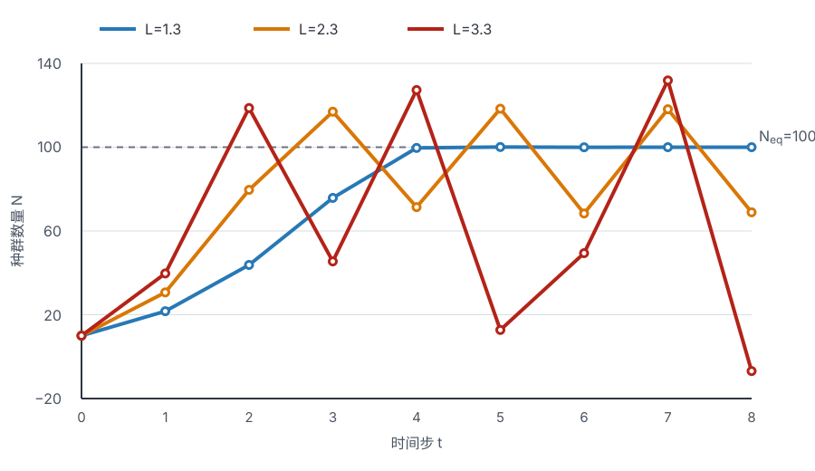

# 种群增长与种间竞争实验

连续调查得到的是一列数量，种群动力学实验要进一步判断这些数量由怎样的增长、密度反馈和种间作用产生。相同的 S 形曲线可能来自资源限制、培养容积、个体生理变化或观察饱和；相似的波动也可能由非线性反馈、环境变化和计数误差造成。因此，模型计算不仅要得到下一时刻的数值，还要检查时间步长、参数含义、状态是否保持生物学可行，以及替代模型能否给出同样轨迹。

三组经典训练分别按差分方程递推种群数量，以草履虫时间序列拟合连续逻辑斯谛（logistic）曲线，并用 Lotka–Volterra 方程解释两种竞争者的瞬时变化和平衡。原始数据、完整表格和传统直线化方法均予保留，其中的逐步舍入、比值转录、稳定性分区和平衡公式则按计算结果订正。种群动力的生态背景见[种群增长、调节与空间动态](../../ecology/population_dynamics.md)，回归尺度与残差的统计边界见[曲线直线化与非线性回归](../../biostat/correlation_regression.md#transformation-nonlinear)。

## 时间序列与过程模型 {#time-series-process-model}

每个观测值都要附带时间单位、培养或样地边界、计数对象和观察方法。$N_t$ 可以是培养液每毫升的个体密度，也可以是整个容器的个体数；两者不能只写成无单位的“密度”。若每次取样移走一部分培养液，补液、稀释和取样损失也会进入种群账本。独立培养容器是生物学重复，同一容器中连续 19 次计数属于重复测量，不能当作 19 个独立种群。

动力模型描述潜在真实状态怎样改变，显微计数则是观察模型。视野体积、混匀、沉降、个体团聚、观察者和稀释倍数都会使观测偏离真实密度。实验记录至少应同时保留原始计数、换算因子、取样体积和培养操作，避免模型把观察误差解释成出生、死亡或竞争。

## 离散时间的线性密度反馈 {#discrete-density-feedback}

### 方程、平衡与稳定性 {#discrete-equation-stability}

离散时间的线性密度反馈可写为：

$$
N_{t+1}=\left[1-B(N_t-N_{\mathrm{eq}})\right]N_t
=N_t\left[1+B(N_{\mathrm{eq}}-N_t)\right]
$$

$N_{\mathrm{eq}}$ 是正平衡数量，也可类比记作 $K$；$B$ 表示密度每增加一个数量单位时，有限增长因子下降多少。$B$ 的数值依赖 $N$ 的单位：若把“每毫升”改成“每升”，$B$ 必须随之换算。令

$$
x_t=\frac{N_t}{N_{\mathrm{eq}}},
\qquad
L=BN_{\mathrm{eq}},
$$

可得无量纲形式：

$$
x_{t+1}=x_t[1+L(1-x_t)].
$$

它有 $x^*=0$ 和 $x^*=1$ 两个固定点。在正平衡处，更新函数导数为 $1-L$；局部稳定要求

$$
|1-L|<1,
$$

即 $0<L<2$。由导数符号还可分出两种趋近方式：$0<L\le1$ 时，平衡附近通常同侧、单调趋近；$1<L<2$ 时，轨迹跨过平衡并作衰减振荡。$L=2$ 发生翻转分岔；$2<L<\sqrt6\approx2.449$ 时稳定二周期出现，随后经历四周期、八周期等倍周期分岔，并在 $L\approx2.570$ 附近进入混沌区。混沌区仍夹有周期窗口，不能把 $L>2.57$ 一概写成“趋异波动”。该差分式可变换为经典 logistic 映射，May 的综述正是以这类一阶确定性方程说明固定点、周期级联与表观随机波动怎样连续出现。[^may-discrete]

当 $L>3$ 时，对应的 logistic 映射参数超过 4；某些初值会越出可保持非负的区间。本模型的单步增长因子在

$$
N_t>N_{\mathrm{eq}}+\frac1B
$$

时变为负数，下一步产生负“种群数量”。负值不是预测到真实的负个体，而是说明这个更新步长和线性反馈已离开生物学可用范围。

### 三组递推数据 {#three-discrete-trajectories}

三组递推均取 $N_0=10$、$N_{\mathrm{eq}}=100$，分别令 $B=0.013$、0.023 和 0.033，因此 $L$ 依次为 1.3、2.3 和 3.3。用未舍入的 $N_t$ 递推，只在表格显示时保留一位小数：

| $t$ | $B=0.013$，$L=1.3$ | $B=0.023$，$L=2.3$ | $B=0.033$，$L=3.3$ |
| ---: | ---: | ---: | ---: |
| 0 | 10.0 | 10.0 | 10.0 |
| 1 | 21.7 | 30.7 | 39.7 |
| 2 | 43.8 | 79.6 | 118.7 |
| 3 | 75.8 | 116.9 | 45.5 |
| 4 | 99.6 | 71.4 | 127.3 |
| 5 | 100.1 | 118.4 | 12.7 |
| 6 | 100.0 | 68.4 | 49.4 |
| 7 | 100.0 | 118.1 | 131.9 |
| 8 | 100.0 | 68.9 | −6.9 |

{ loading=lazy }
/// caption
相同初值和平衡量下，$L=1.3$ 衰减振荡至平衡，$L=2.3$ 接近稳定二周期，$L=3.3$ 在第 8 步越过非负状态边界。图线按未舍入递推值绘制。
///

$L=1.3$ 的序列若逐步显示为 $21.7,43.8,75.8,99.7,100.1,100.0$，与未舍入结果仅有显示舍入差异，属于阻尼振荡。$L=2.3$ 逐渐靠近约 68.8 与 118.2 的稳定二周期，而非保持任意振幅的周期波动。$L=3.3$ 若逐步把一位小数回代，得到 $N_8=-4.8$；保留机器精度递推则得到 $N_8=-6.890$。两条路径都跨入负值，定性结论相同；非线性迭代应以未舍入数值作为下一步输入。

若 $N_t=N_{\mathrm{eq}}$，有限增长因子

$$
\lambda_t=1-B(N_t-N_{\mathrm{eq}})=1,
$$

所以 $N_{t+1}=N_t$，净变化为零，轨迹停在平衡点。这里的 $\lambda_t$ 随密度变化，不是无密度制约几何增长中的常数 $\lambda$。模型还假定研究边界封闭或净迁移已纳入更新，忽略年龄／阶段结构、反馈时滞和随机性，并把单位个体增长同密度的关系固定为直线。改变时间步长时，$B$ 与 $L$ 的意义和稳定区间都会改变，不能把同一数值直接搬到日、周和世代三种时间尺度。

## 连续逻辑斯谛增长的拟合 {#continuous-logistic-fit}

### 方程与线性化 {#logistic-equation-linearization}

连续逻辑斯谛方程写作：

$$
\frac{\mathrm dN}{\mathrm dt}
=rN\left(1-\frac{N}{K}\right),
$$

其解为：

$$
N(t)=\frac{K}{1+A e^{-rt}},
\qquad
A=\frac{K-N_0}{N_0}.
$$

$r$ 是模型中的低密度瞬时单位个体增长参数，$K$ 是给定环境、观测单位和模型条件下的平衡量，$A$ 由初始状态相对 $K$ 的位置决定。$A$ 也常记作 $a$，表示由初始状态确定的比例参数。当 $0<N<K$ 时，变换可得：

$$
\ln\left(\frac{K-N}{N}\right)=\ln A-rt.
$$

固定 $K$ 后，把左侧变换量对时间作直线回归，截距估计 $\ln A$，斜率估计 $-r$。变换要求每个观测满足 $0<N<K$；若人为把 $K$ 选得小于最大观测值，对数便无定义。这也解释了为什么应先判断平台是否有信息，而不是为了完成直线化给 $K$ 任意加一个常数。

### 十九时点数据的完整重算 {#logistic-worked-data}

以下密度序列覆盖 $t=0$ 至 18。传统“目测上渐近线”可作为初始探索；“最大三项平均后再加 5”得到 $(655.9+659.6+661.8)/3+5=664.1$，再取 $K=665$，这项经验规则可保证所有观测低于候选 $K$，但没有一般统计依据。这里先以 $K=665$ 完成经典直线化，再与原尺度非线性拟合比较。

| $t$ | 观察密度 $N$ | $(K-N)/N$ | $\ln[(K-N)/N]$ | 线性化拟合的预计值 |
| ---: | ---: | ---: | ---: | ---: |
| 0 | 9.6 | 68.271 | 4.223 | 10.2 |
| 1 | 18.3 | 35.339 | 3.565 | 17.1 |
| 2 | 29.0 | 21.931 | 3.088 | 28.6 |
| 3 | 47.2 | 13.089 | 2.572 | 47.2 |
| 4 | 71.1 | 8.353 | 2.123 | 76.5 |
| 5 | 119.1 | 4.584 | 1.522 | 120.3 |
| 6 | 174.6 | 2.809 | 1.033 | 181.5 |
| 7 | 257.3 | 1.585 | 0.460 | 259.1 |
| 8 | 350.7 | 0.896 | −0.110 | 346.1 |
| 9 | 441.0 | 0.508 | −0.677 | 431.3 |
| 10 | 513.3 | 0.296 | −1.219 | 504.2 |
| 11 | 559.7 | 0.188 | −1.671 | 560.0 |
| 12 | 594.8 | 0.118 | −2.137 | 598.9 |
| 13 | 629.4 | 0.057 | −2.872 | 624.5 |
| 14 | 640.8 | 0.038 | −3.276 | 640.6 |
| 15 | 651.1 | 0.021 | −3.847 | 650.4 |
| 16 | 655.9 | 0.014 | −4.278 | 656.3 |
| 17 | 659.6 | 0.008 | −4.805 | 659.9 |
| 18 | 661.8 | 0.005 | −5.332 | 662.0 |

原表中 $t=0$ 的比值 68.771 应为 68.271，$t=10$ 的 0.276 应为 0.296，$t=15$ 的 0.027 应为 0.021；各行对数以正确比值重算。用全部 19 点作普通最小二乘，得到：

$$
\widehat{\ln[(K-N)/N]}=4.16357-0.530675t,
$$

因此

$$
\hat A=e^{4.16357}=64.3008,
\qquad
\hat r=0.530675\ \text{时间}^{-1}.
$$

变换尺度上的 $R^2=0.9996$，回代后的原尺度均方根误差约为 4.13 个密度单位。因为回归同时估计截距，$\hat A$ 不会严格等于由第一个观测算出的 $(665-9.6)/9.6=68.2708$；若强制曲线经过 $N_0$，便是在拟合另一个有约束的模型。

直线化把误差模型也一并改变：它最小化对数比值尺度的残差，且接近 $K$ 时一个很小的计数误差会被对数放大。直接在原密度尺度拟合 $N(t)=K/(1+Ae^{-rt})$，本数据给出约 $K=663.02$、$A=71.58$、$r=0.5470$，原尺度均方根误差约为 3.20。这个结果不自动比直线化“正确”，但它说明 $K$、误差尺度和拟合目标应共同声明。非线性最小二乘还需要起始值、参数可辨识性和残差诊断；NIST 的方法说明也把迭代优化列为与线性最小二乘相比的重要差别。[^nonlinear-fit]

### 曲线阶段与模型限制 {#logistic-phases-limitations}

传统教学常把 S 形曲线划成开始、加速、转折、减速和饱和五段。这些名称适合读图，但并不对应五个边界固定的生理时期。对 $0<N_0<K$ 的标准逻辑斯谛曲线，$N\ll K$ 时近似指数增长；总增长速率在 $N=K/2$ 的拐点达到最大值 $rK/4$，此后下降并渐近 $K$。严格的指数近似限于密度反馈尚弱的早期。

模型默认 $r$ 与 $K$ 在观察期内恒定、种群封闭或净迁移可忽略、单位个体增长率随 $N$ 线性下降，并忽略年龄结构、反馈时滞、环境和人口统计随机性。它还把所有个体及拥挤作用压入同一个平均密度，隐含低密度时不存在配偶限制等强阿利效应（strong Allee effect）。稳定年龄／阶段组成是把结构化种群压缩成单一 $N$ 的条件之一；温度、食物、代谢废物、取样和补液还会使 $K$ 随条件移动。

### 草履虫刺丝泡观察接口 {#paramecium-trichocysts}

草履虫的形态观察可与增长曲线实验并行记录。刺丝泡是排列在皮层内的分泌性射出胞器，受到适当的机械或化学刺激后可快速胞吐，内容物展开成细长、相对不运动的结构。纤毛则是表面数量众多、短而有规则排列的运动细胞器，通过协调摆动产生游泳和摄食水流。显微镜下应先在未处理活体中记录纤毛运动，再用课程核准的刺激条件另制处理装片；传统碘液可诱发刺丝泡释放，同时也会迅速改变或固定细胞，处理后的静态形态只代表处理后状态。刺丝泡的钙依赖释放、结构展开和防御作用已有专门综述；观察时须把胞器原位影像与已经射出的丝分开。[^trichocysts]

## Lotka–Volterra 种间竞争 {#lotka-volterra-competition}

### 方程与实验参数 {#competition-equations}

两种竞争者的经典方程为：

$$
\frac{\mathrm dN_1}{\mathrm dt}
=r_1N_1\left(1-\frac{N_1+\alpha N_2}{K_1}\right),
$$

$$
\frac{\mathrm dN_2}{\mathrm dt}
=r_2N_2\left(1-\frac{N_2+\beta N_1}{K_2}\right).
$$

$K_i$ 是物种 $i$ 单独培养时的平衡量。$\alpha$ 把一个物种 2 个体对种群 1 的作用折算成多少个物种 1 个体，$\beta$ 作反向折算；两个系数不是同一个作用的简单倒数。$r_i$ 控制在给定状态下变化的时间尺度，不改变标准模型零增长线的位置。要从实验估计这些量，至少需要两个物种各自的单独培养、多个初始密度的混合培养、独立容器重复，以及保持一致的资源、体积、温度和计数方法。只观察一条混合培养轨迹，往往无法把 $K_i$、$r_i$ 和竞争系数同时辨认出来。

### 给定状态的瞬时变化 {#competition-worked-derivatives}

给定参数与种群状态为：

$$
r_1=0.1,\ K_1=100,\ \alpha=0.5,\ N_1=30,
$$

$$
r_2=0.1,\ K_2=80,\ \beta=0.4,\ N_2=120.
$$

代入方程：

$$
\frac{\mathrm dN_1}{\mathrm dt}
=0.1\times30\left(1-\frac{30+0.5\times120}{100}\right)
=0.3,
$$

$$
\frac{\mathrm dN_2}{\mathrm dt}
=0.1\times120\left(1-\frac{120+0.4\times30}{80}\right)
=-7.8.
$$

这两个数是当前状态下的瞬时导数。若用步长 $\Delta t=1$ 作一次前向 Euler 近似，才得到

$$
N_1(t+1)\approx30+0.3=30.3,
\qquad
N_2(t+1)\approx120-7.8=112.2.
$$

将前者记为 30.5 是算术错误。更重要的是，连续方程在这一时间单位内的导数会随 $N_1,N_2$ 改变；Euler 值是前向欧拉近似，并非微分方程的一步精确解。报告时应把“当前增长方向与速率”和“数值积分后的时点预测”分开。

### 零增长线、内部平衡与可侵入性 {#competition-equilibrium-invasion}

两个正种群的零增长线分别为：

$$
N_1+\alpha N_2=K_1,
\qquad
\beta N_1+N_2=K_2.
$$

联立得到内部平衡：

$$
N_1^*=\frac{K_1-\alpha K_2}{1-\alpha\beta},
\qquad
N_2^*=\frac{K_2-\beta K_1}{1-\alpha\beta}.
$$

若只写分子 $K_1-\alpha K_2$ 和 $K_2-\beta K_1$，会漏掉共同分母；数值 75 和 50 则来自含有正确分母的完整公式。代入本例：

$$
N_1^*=\frac{100-0.5\times80}{1-0.5\times0.4}=75,
\qquad
N_2^*=\frac{80-0.4\times100}{1-0.5\times0.4}=50.
$$

稳定性可用“稀有时能否增长”直接判断。当种 1 稀有而种 2 位于 $K_2$ 时：

$$
g_{1\mid2}=r_1\left(1-\frac{\alpha K_2}{K_1}\right)=0.06>0;
$$

当种 2 稀有而种 1 位于 $K_1$ 时：

$$
g_{2\mid1}=r_2\left(1-\frac{\beta K_1}{K_2}\right)=0.05>0.
$$

两种都能从稀有状态侵入，内部平衡在标准模型中稳定。等价条件是 $\alpha K_2<K_1$ 且 $\beta K_1<K_2$。四类经典结局——稳定共存、种 1 排斥种 2、种 2 排斥种 1、由初始状态决定胜者的双稳态——均可由两条侵入增长率的符号得到，详见[竞争、生态位与共存](../../ecology/species_interactions.md#lotka-volterra-competition)。[^competition-coexistence]

平衡时 $N_1^*=75<K_1$、$N_2^*=50<K_2$，符合模型中另一物种增加竞争负荷的设定。两种数量之和 125 大于任一单种 $K_i$，却不能单凭这个算术关系证明“资源利用更有效”：两个物种的个体可能在大小、需求和计数单位上不同，$K_1$ 与 $K_2$ 也属于各自单种模型。资源互补需要直接测量资源消耗、产量或功能，竞争则需由混合培养相对单独培养降低增长或平衡量的效应来支持。

## 实验设计、拟合与模型检验 {#experimental-design-model-checking}

一套可辨认增长和竞争参数的培养实验应把处理结构写在计数之前：

| 设计部分 | 主要作用 | 需要控制或记录 |
| --- | --- | --- |
| 各物种单独培养的初始密度梯度 | 估计 $r_i$、$K_i$ 和种内密度反馈 | 接种体积、个体状态、培养批次、容器和资源 |
| 两种混合培养的析因密度组合 | 分离 $N_i$ 与竞争者密度对增长的作用 | 两种初始密度同时变化，避免只沿一条密度比例线 |
| 独立容器重复与随机位置 | 估计培养间变异并控制位置效应 | 随机化、区组、蒸发、温度和光照 |
| 预定的重复计数时点 | 识别早期增长、转折、平台和时滞 | 同一昼夜时段、混匀、取样损失和补液 |
| 无生物或过程对照 | 检查介质变化、污染和计数背景 | 培养液批次、空白、显微计数室和观察者 |

先绘制每个独立容器的原始轨迹，再叠加模型曲线和残差。平台附近的系统偏差可能提示 $K$ 随时间变化，连续正负交替残差可能提示时滞或自相关，组间方差随均值扩大则需要显式方差模型。比较离散和连续模型时必须统一时间步长与预测对象；同一条曲线上的高 $R^2$ 不能证明密度反馈就是唯一机制。

竞争方程的参数应连同区间和相关性报告。$\alpha$、$\beta$ 与 $K_i$ 常高度相关，短序列或缺少单独培养时尤其难辨认。可用原尺度非线性混合模型或状态空间模型连接容器差异、过程变化和计数误差，并用留出时点或独立实验检验预测。模型扩展可以加入时变资源、阶段结构、时滞和环境随机性，但每增加一项都需要相应数据，而不是仅为贴合历史曲线。

## 记录与结论边界 {#records-inference}

记录表应保留物种与培养物身份、接种来源、容器编号、初始数量、培养体积、介质配方、温度、光周期、取样与补液、每次原始计数和换算过程。草履虫形态观察另记活体或处理状态、刺激条件、时间、放大倍数和刺丝泡／纤毛的判读依据。任何污染、容器破损、计数室异常或偏离计划都应保留原记录和处置理由。

结论首先属于所拟合的模型和实验条件。阻尼振荡、二周期、混沌、平衡共存和竞争排斥都是参数化模型的动力学结果；真实培养物还需由重复轨迹、低密度侵入、资源或邻体操纵及独立验证支持。把经典手算保留到每一个中间量，同时明确误差尺度、数值积分和生物学可行域，能够让模型练习成为可检查的实验推断，而不是只记住一条 S 形曲线或四幅相平面图。

## 参考资料与延伸阅读 {#references}

- Gotelli, N. J. *A Primer of Ecology*. 4th ed. Sinauer, 2008.
- Turchin, P. *Complex Population Dynamics: A Theoretical/Empirical Synthesis*. Princeton University Press, 2003.
- Begon, M. & Townsend, C. R. *Ecology: From Individuals to Ecosystems*. 5th ed. Wiley, 2021.
- Gause, G. F. *The Struggle for Existence*. Williams & Wilkins, 1934.

[^may-discrete]: May RM. Simple mathematical models with very complicated dynamics. *Nature*. 1976;261:459–467. [doi:10.1038/261459a0](https://doi.org/10.1038/261459a0).
[^nonlinear-fit]: National Institute of Standards and Technology. [Nonlinear least squares regression](https://www.itl.nist.gov/div898/handbook/pmd/section1/pmd142.htm). 该说明区分参数非线性模型与普通线性回归，并强调迭代优化、起始值和收敛诊断。
[^trichocysts]: Plattner H. Trichocysts—Paramecium's projectile-like secretory organelles: reappraisal of their biogenesis, composition, intracellular transport, and possible functions. *Journal of Eukaryotic Microbiology*. 2017;64:106–133. [doi:10.1111/jeu.12332](https://doi.org/10.1111/jeu.12332).
[^competition-coexistence]: Chesson P. Mechanisms of maintenance of species diversity. *Annual Review of Ecology and Systematics*. 2000;31:343–366. [doi:10.1146/annurev.ecolsys.31.1.343](https://doi.org/10.1146/annurev.ecolsys.31.1.343); Gause GF. *The Struggle for Existence*. Williams & Wilkins, 1934.
