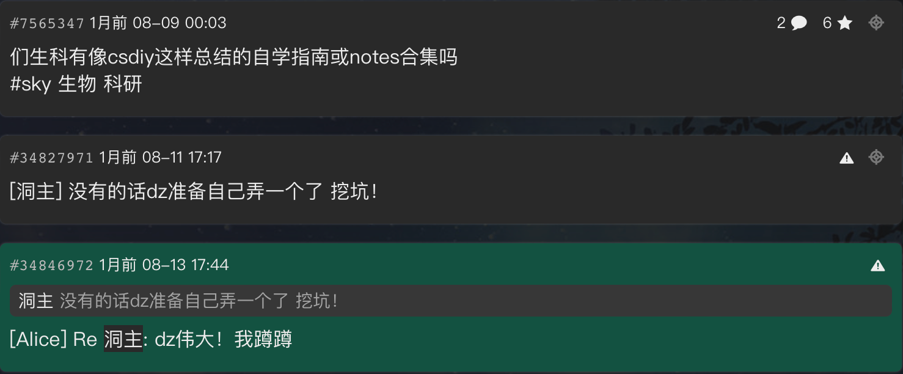

# Welcome to 花火生物档案！

<!--备用名：BioNotes, BioCodex-->

> パッと光って咲いた 
>
> **花火**を見ていた
>
> きっとまだ 終わらない夏が
>
> 曖昧な心を 解かして繋いだ
>
> この夜が 続いて欲しかった

## 简介

🎉🎉  **Oct. 3, 2025 Update** ：**[生物化学](./biochem/index.md)**部分初稿完成更新 🎉🎉

这里是 **Ximiku67 的个人生物学笔记**，汇集了生物化学、细胞生物学、动植物学等微观到宏观层面的知识内容，既包括基础理论，也尝试链接最新的前沿研究。这里会记录或追踪我在一坤年的高中生物竞赛期间学习到的全部（或大概全部）理论和实验知识，基于之前的生物竞赛笔记重新整理，并加入北大生科的课程笔记与资料进行汇总，试图整理成一份生物学知识库，在讲解生物学基础知识的同时，也记录一些生物相关的趣事。

## 这份笔记的起源

这份笔记的最初起源设想来源于高中生物竞赛生涯。博主是一个**对笔记很执着的人**，想着记录自己见过的一切东西，又因为有点强迫症，每次写笔记前都要规划好长时间，从选择用什么材质、厚度的纸、横线还是方格纸、用哪些种类哪些颜色的笔，到纸的页面该如何设计、哪些地方需要打印粘贴图片、要多少留白以供后续补充…… 博主的同学很多都听过博主最初的植物学笔记大括号占半页，以及生理学笔记比书还厚的事迹（笑）。

在两年多的竞赛学习中，我记下了20多本纸质笔记，虽说笔耕不少，却自认质量不高，唯一值得捧说的就是几本横向总结。然而，纸质笔记更新困难，携带不便；平板手写也因不习惯而放弃。直到国赛前夕，我仍没有一套完整的笔记体系，这成为我竞赛经历中最大的遗憾之一，以至于我现在在大学试图回忆起某个知识点时，都求路无门。

而尝试使用电子笔记来记录的想法，则来源于传奇学长李一言和他的传奇笔记。李一言学长的笔记是在 Word 里整理的带缩进的文档，给了最初学竞赛的我一些系统感的震撼；我也在竞赛期间找到了正在起步的 **[osm.bio](https://osm.bio)**（当时还只有几篇文章，现在已经几乎成为生物竞赛最大的网站了），惊叹于大佬们的精妙总结，十分受用。从此便有了总结一版电子版生物竞赛笔记的想法，方便携带又方便修改。而进入北大后，我无意中找寻到计算机的学长们编写的 **[csdiy](https://csdiy.wiki)** ，被学长热情而真挚的文字打动，他们无私地把自己的学习路径完整分享出来，践行着开源精神。

我在树洞上发布了相关问题帖子，回应我的是热切的期盼。让我认识到在北大这片方圆之地，总有一些渴求着知识的青年在寻找出路，**而我又何尝不能是破壁者**。多方试探后我选择了  **[MkDocs]()** 进行网站搭建，使用 **[Materials for MkDocs](https://squidfunk.github.io/mkdocs-material/)** 主题， 将 md 文件转化为静态网站，既方便修改，也便于公开分享。

{ width="720" loading="lazy" }
/// caption
感谢5位点关注的🕳️u，更感谢 Alice 的鼓励
///

与此同时，我一直有个想法：**把课本与科研之间的“最后一公里”打通**。原因是我时常认为时常教科书与前沿科研有割裂感，课本的每一句话，往往对应着若干篇数十年前的论文，而科研前沿的每一步探索，又是从这些“旧知识”延伸而来。我们习惯用课本建立基础，却很少去追溯这些知识的来龙去脉，或者去理解科学界如何在此基础上继续搭建。因此在基础知识之外，我也在笔记中尝试追踪某些领域的历史脉络，从经典到前沿，串联起它们的里程碑式成果，试图探寻基础的实验如何搭建起知识的大厦。虽不说能解决问题，也当尽绵薄之力。

因此，这份笔记的构建大致分为几个阶段：

1. 以李一言笔记为基底，构建大致的知识框架；
2. 将我竞赛期间的20多本手写笔记浓缩进网站；
3. 融入北大课程的课堂与实验笔记，补充专业英语内容；
4. 整理讲座和阅读文献的摘录，尝试链接科研前沿。

它既是我写给未来自己的备忘录，让我始终保持**对基础知识的敏感与对前沿的好奇**；也希望能对同样热爱生物学的你有所帮助。无论你是准备竞赛的中学生，还是学习生物医药相关专业的大学生，都或许能在这里找到属于你的收获。

## 关于 HanaBio Archive

**HanaBio Archive** | 花火生物档案，**Hanabi** 是日语“花火”的罗马音，后加 o 构成 **Bio**，**Archive** 则参考了*蔚蓝档案*的名字（~~Bio Archive也是BA~~）。

本站现在还在初始搭建阶段，如果你有一切关于本站的问题或建议，非常欢迎提出 [issue](https://github.com/ximiku/HanaBio-Archive/issues) 进行讨论；如果你愿意，也欢迎一同完善本站：提交 [Pull Request](https://github.com/ximiku/HanaBio-Archive/pulls)，或直接联系博主的邮箱[jiaxi_liu@stu.pku.edu.cn](mailto:jiaxi_liu@stu.pku.edu.cn)。（不久后可能会上线 giscus 评论系统，敬请期待喵～）

如果你认为本站对你有帮助，可以给仓库点个 star，或者分享一个你正在听的歌或看的番哦~

## 致谢

本站在编写过程中参考了大量资源，包括经典教科书、网络资料、课程课件以及前辈与同学们的经验分享。在具体知识点下，我已尽可能进行标注与说明。在此，我要向各位教授、学者、作者以及朋友们的慷慨分享表达诚挚的感谢。正是因为有你们的帮助与积累，我才能在学习的过程中不断拓展视野、整理知识，并最终将这些内容汇集成一个开放共享的知识库。

本站受到 **[osm.bio](https://osm.bio)**、**[csdiy](https://csdiy.wiki)** 和 **[OI Wiki](https://oi-wiki.org)** 的启发，在编写过程中也参考了诸多资料，在此一并致谢。

本站的内容完全开源免费，如果有侵权之处，请联系删除；本站由博主编写的内容遵循 **[CC BY-SA 4.0](https://creativecommons.org/licenses/by-sa/4.0/)** 和 **[SATA](https://github.com/zTrix/sata-license)** 协议，其余部分遵循原作者规定的许可。

<!--侧栏更新通知-->

**Update Notification**

<ul>
  <li data-date="2025-10-03"><a href="./biochem/index.md">生物化学部分初稿完成</a></li>

</ul>

