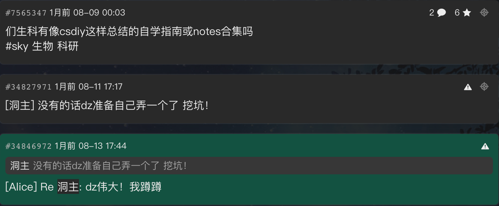

# Welcome to 花火生物档案！

<!--备用名：BioNotes, BioCodex-->

> パッと光って咲いた 
>
> **花火**を見ていた
>
> きっとまだ 終わらない夏が
>
> 曖昧な心を 解かして繋いだ
>
> この夜が 続いて欲しかった

## 简介

🎉🎉  **Jul. 24, 2026 Update** ：网站重构为Zensical架构 🎉🎉

这里是 **Ximiku67 的个人生物学笔记**，汇集了生物化学、细胞生物学、动植物学等微观到宏观层面的知识内容，既包括基础理论，也包括最新的前沿研究。这里会尽可能完整地整理我在两年半的高中生物竞赛生涯中学习到的理论和实验知识，以之前的生物竞赛笔记为底稿，并持续融入北大生科的课程笔记、前沿论文与资料等，希望把这个网站逐渐建成一个**生物学知识库**，在讲解生物学基础知识的同时，也链接相关的前沿内容。

## 这份笔记的起源

这份笔记的最初设想起源于高一的暑假。我是一个**对笔记很执着的人**，想着记录自己见过的一切东西。我又因为有点强迫症，每次写笔记前都要规划好长时间，从选择用什么材质、厚度的纸、横线尽可能完整地还是方格纸、用哪些种类哪些颜色的笔，到纸的页面该如何设计、哪些地方需要打印粘贴图片、要多少留白以供后续补充…… 我的很多同学都听过博主最初的植物学笔记大括号占半页，以及生理学笔记比书还厚的事迹（笑）。

在两年多的竞赛学习中，我记下了20多本纸质笔记，虽说笔耕不少，却自认质量不高，于是尝试寻找破局之法。然而，纸质笔记更新困难，携带不便；平板手写也因不习惯而放弃。直到国赛前夕，我仍没有一套完整的笔记体系，这成为我竞赛经历中最大的遗憾之一，以至于我现在在大学试图回溯某个知识点时，都求路无门。

而尝试使用电子笔记来记录的想法，则来源于传奇学长李yy和他的传奇笔记。李yy学长的笔记是在 Word 里整理的带缩进的文档，使学竞赛的我第一次被系统性知识库所震撼；我也在竞赛期间找到了正在起步的 **[osm.bio](https://osm.bio)**（当时还只有几篇文章，现在已经几乎成为生物竞赛最大的网站了），惊叹于大佬们的精妙总结，十分受用。从此便有了总结一版电子版生物竞赛笔记的想法，方便携带又方便修改。而进入北大后，我无意中找寻到北大信科的学长们编写的 **[csdiy](https://csdiy.wiki)** ，被学长热情而真挚的文字打动，他们无私地把自己的学习路径完整分享出来，践行着开源精神。

我在树洞上发布了相关问题的帖子，回应我的是热切的期盼。让我认识到在北大这片方圆之地，总有一些渴求着知识的青年在寻找出路，**而我又何尝不能是破壁者**。多方试探后我选择了  **[Zensical](https://zensical.org)** 进行网站搭建， 将 md 文件转化为静态网站，既方便修改，也便于公开分享。

{ width="720" loading="lazy" }
/// caption
感谢5位点关注的🕳️u，更感谢 Alice 的鼓励
///

与此同时，我一直有个想法：**把课本与科研之间的“最后一公里”打通**。我常常感到现有的生物教科书与前沿科研之间存在割裂：课本的每一句话，往往对应着若干篇数十年前的论文，而科研前沿的每一步探索，又是从这些“旧知识”延伸而来。我们习惯用课本建立基础，却很少去追溯这些知识的来龙去脉，或者去理解科学界如何在此基础上继续向前推进。因此在基础知识之外，我也在笔记中尝试追踪某些领域的历史脉络，从经典到前沿，串联起它们的里程碑式成果，试图探寻一个个基础实验如何搭建起今天的知识大厦。虽不说能解决问题，也当尽绵薄之力。

因此，这份笔记的构建大致分为几个阶段：

1. 以生物学各领域的经典教材为基底，构建大致的知识框架；
2. 将我竞赛期间的20多本手写笔记浓缩进网站；
3. 融入北大课程的课堂与实验笔记，补充专业英语内容；
4. 整理讲座和阅读文献的摘录，尝试链接科研前沿。

它既是我写给未来自己的备忘录，让我始终保持**对基础知识的敏感与对前沿的好奇**；也希望能对同样热爱生物学的你有所帮助。无论你是准备生物竞赛的中学生，还是学习生物医药相关专业的大学生，都或许能在这里找到属于你的收获。

## 关于 HanaBio Archive

**HanaBio Archive** | 花火生物档案，**Hanabi** 是日语“花火”的罗马音，后加 o 构成 **Bio**，**Archive** 则参考了*蔚蓝档案*的名字（~~Bio Archive也是BA~~）。

本站现在还在初始搭建阶段，如果你对本站有任何问题或建议，非常欢迎提交 [issue](https://github.com/ximiku/HanaBio-Archive/issues) 进行讨论；如果你愿意，也欢迎一同完善本站：提交 [Pull Request](https://github.com/ximiku/HanaBio-Archive/pulls)，或直接联系我的邮箱[jiaxi_liu@stu.pku.edu.cn](mailto:jiaxi_liu@stu.pku.edu.cn)。（不久后可能会上线 giscus 评论系统，敬请期待喵～）

如果你认为本站对你有帮助，可以给[仓库](https://github.com/ximiku/HanaBio-Archive)点个 star，或者在 [Discussions](https://github.com/ximiku/HanaBio-Archive/discussions) 留下你的足迹~

## 致谢

本站在编写过程中参考了大量资源，包括经典教科书、网络资料、课程课件以及前辈与同学们的经验分享。在具体知识点下，我已尽可能进行标注与说明。在此，我要向各位教授、学者、作者以及朋友们的慷慨分享表达诚挚的感谢。正因为前人的积累与分享，我才能在学习的过程中不断拓展视野、整理知识，并最终将这些内容汇集成一个开放共享的知识库。本站也使用 Codex 辅助网站构建、整理与维护。

本站受到 **[osm.bio](https://osm.bio)**、**[csdiy](https://csdiy.wiki)** 和 **[OI Wiki](https://oi-wiki.org)** 的启发，在编写过程中也参考了诸多资料，在此一并致谢。

本站的知识内容开源免费开放，如果有侵权之处，请联系删除；本站由我（[Ximiku67](https://github.com/ximiku)）原创的内容遵循 **[CC BY-SA 4.0](https://creativecommons.org/licenses/by-sa/4.0/)** 和 **[SATA](https://github.com/zTrix/sata-license)** 协议，其余部分遵循原作者规定的许可发布。

<!--初音未来开始-->

<!--初音未来结束-->

<!--侧栏更新通知-->

**Update Notification**

<ul>
  <li data-date="2026-07-24">网站重构为 Zensical 架构</li>
  <li data-date="2025-08-08">提交第一条 commit 🚀，网站建立</li>
</ul>

