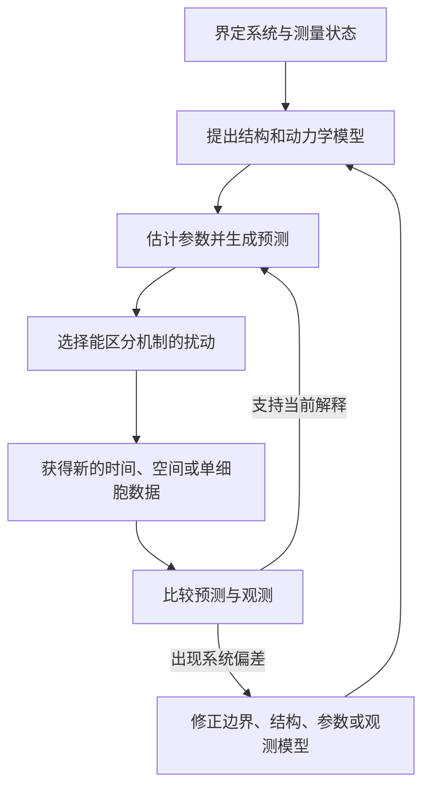

# 系统生物学

系统生物学研究生命系统的组成部分怎样通过相互作用，在特定环境和时间尺度上形成可观察的整体行为。知道细胞中有哪些基因、蛋白质和代谢物，只建立了组分清单；进一步理解细胞为何适应刺激、怎样选择命运、如何维持代谢稳态或形成空间图案，还要追踪组分之间的关系、关系随时间的变化以及系统受到扰动后的响应。Kitano 在系统生物学早期综述中把结构、动力学、控制和设计并列为系统层面理解的关键方面，这一框架至今仍构成学科的主干。[^kitano-overview]

“系统”可以是一条由少数分子组成的反馈回路，也可以是代谢网络、细胞群体、发育组织或器官间交换。系统生物学由研究方式界定：先明确边界和观测量，再把相互作用组织成模型，用模型提出定量预测，最后通过新的测量与扰动检验并修正解释。本页面组依次展开网络结构、确定性动力学、随机与空间过程以及模型推断，组成一条从关系图到可检验机制的学习路线。[^systems-textbook]

## 系统由边界、组分、关系和环境共同定义 { #system-definition }

一个生物系统至少包含四类信息。边界规定哪些对象纳入解释，组分说明系统中有哪些状态实体，关系描述物质转化、结合、调控或通信，环境则提供输入、限制条件和持续交换。以细菌趋化为例，受体、适配蛋白和磷酸化反应构成内部组分与关系；配体浓度随时间的变化是输入，运动偏向是输出，细胞生长和能量状态属于实验时间尺度上可能需要固定或显式建模的环境条件。

边界取决于所问的问题。同一套胰岛素信号可以在分子尺度研究激酶磷酸化，在细胞尺度研究葡萄糖摄取，也可以在器官尺度研究肝、肌与脂肪组织之间的底物分配。边界扩大后，原先的外部输入可能变成系统内部变量；边界缩小时，被省略的过程会表现为有效参数、延迟、噪声或条件依赖。模型结果因此总是关于“这个边界内、这些条件下的系统”，不能脱离边界成为组分的永久属性。

开放的生命系统持续交换物质、能量和信息。稳态表示选定观测量在一段时间内近似不变，却可以由持续的输入和输出共同维持；细胞分裂、组织生长和环境周期又会缓慢移动这一状态。系统边界应同时写清空间范围、时间范围和分析单位，才能区分真正的内部调节与边界条件变化。

## 状态把组分清单转成可变化的系统 { #states-inputs-outputs }

状态变量描述在给定时刻足以继续预测系统演化的信息。它可以是分子数、浓度、修饰比例、膜电位、细胞位置、群体中不同状态的比例，或经过合理粗粒化的有效变量。参数则描述反应速率、结合强度、扩散系数或调控增益等相对稳定的关系。两者的区别依模型尺度而定：细胞内 ATP 浓度在秒级信号模型中可能作为固定参数，在代谢模型中却是随时间变化的状态。

输入是从边界外施加到系统的作用，如营养、激素、温度、机械负荷或实验光脉冲；输出是实验用于判断系统行为的观测，如转录响应、通量、振荡周期、细胞命运比例或组织图案。内部状态与实验读出不必一一对应。荧光报告常只反映某种分子状态的代理量，群体平均又会掩盖单细胞分布，因此观测过程本身也需要进入模型。

系统行为必须以随时间或条件变化的状态来描述。两个细胞在终点有相同蛋白丰度，可能一个经历了短促高峰，另一个缓慢单调上升；两个组织有相同平均表达量，可能分别由均一中等表达和高低细胞混合产生。时间序列、单细胞分布和空间位置把这些不同过程分开，使网络关系可以接受更有辨别力的检验。

## 结构、动力学和功能是相连的三个层面 { #structure-dynamics-function }

结构层说明谁与谁相互作用，以及边的方向、符号和生物学含义。转录调控边、酶促反应、物理结合和遗传互作来自不同实验，不能只因都画成网络连线就互相替代。局部回路反复出现在较大的网络中，例如自调控、前馈环和反馈环；模块则把一组共同完成某种功能的组分组织起来。Hartwell 等把功能模块描述为由多种相互作用分子构成的单位，并强调表型分析与分子分析需要共同揭示模块怎样工作。[^modular-cell]

动力学层把网络放进时间。负反馈可以降低稳态偏差、加速响应或产生适应，正反馈可以放大差异并在合适参数范围形成双稳态，延迟和非线性负反馈可以支持振荡。相同拓扑在不同速率、饱和度和初始状态下可能产生不同轨迹，增加一条边也可能只在特定输入范围内改变行为。因此，网络图提供机制候选，速率关系和实验条件决定候选在真实系统中怎样运行。

功能层讨论一种结构和动力学在具体环境下维持了什么系统性质。趋化回路可以在不同背景配体水平上保持适应，细胞周期回路把连续分子变化组织成有序状态转换，代谢网络在营养改变时重新分配碳流，发育组织通过梯度和局部耦合形成可重复图案。输入—输出关系、扰动以及适合度或生理后果共同赋予结构以功能解释。

## 尺度连接产生新的观测量 { #scales-emergence }

生命系统跨越分子、细胞、组织、个体和群体尺度。下层过程为上层行为提供机制，上层环境又改变下层过程的工作条件。受体结合改变单细胞信号，许多细胞之间的通信形成同步或空间边界；组织灌流决定氧和底物供应，细胞代谢反过来改变局部耗氧和分泌。跨尺度模型需要明确接口变量及其单位，而不是把不同层级的网络简单叠在一张图上。

上层规律常需要新的观测量描述。单个振荡细胞有相位和周期，细胞群体还要测量同步度、相位波和空间相关；单条代谢反应有局部速率，完整网络还要研究稳态通量分配和控制系数；单个细胞可以切换状态，群体则同时受状态转换、差异增殖和邻居通信影响。所谓涌现行为指这些由相互作用产生、需要在较高层级定义的性质，它仍须由可追踪的下层机制和边界条件解释。

模块化、冗余、反馈和分布式控制可以让某些输出在组分波动下保持稳定，也会带来成本和脆弱性。系统对温度变化保持通量，并不表示它对营养缺失或联合基因扰动同样稳定；维持稳态的反馈还可能降低响应速度或增加能量消耗。鲁棒性须同时指明扰动对象、保持的输出、允许的变化范围和环境条件。[^biological-robustness]

## 测量决定模型能看见什么 { #measurement-strategy }

组学测量扩大了可同时观察的组分范围。转录组记录 RNA 丰度，蛋白质组和修饰组接近蛋白容量与状态，代谢组记录代谢物池，互作与染色质实验提供候选关系。它们落在不同物理层和时间尺度：转录本变化不直接等于蛋白活性，代谢物浓度也不直接给出通量。多组学整合要保留每一层的观测过程，再通过共享反应、调控关系或时间顺序建立联系。[^systems-practice]

时间、空间和单细胞分辨率常比增加同类终点指标更能区分机制。高频采样可看到快速峰值和延迟，长时间追踪可识别恢复、记忆和状态切换，空间成像可区分原位命运改变与细胞迁移，单细胞数据可区分均一响应与亚群混合。测量分辨率还要匹配过程尺度；采样慢于反应时，快速中间态会被平均，观测区域大于图案波长时，空间差异会被抹平。

扰动把相关关系推进为机制检验。改变特定结合位点、反应活性、输入波形或局部信号源，可以让候选模型产生不同预测；组合扰动还能揭示冗余、补偿与非线性交互。Ideker 等对酵母半乳糖利用网络的系统扰动研究，把已有网络知识与转录组、蛋白质组测量结合，用数据反复构建、检验和修正通路模型，成为系统生物学实验—模型迭代的经典示例。[^integrated-perturbation]

## 模型和实验形成可重复的研究循环 { #model-experiment-cycle }

系统模型是对现有知识与假设的明确表达。网络图可以表达关系，常微分方程追踪连续状态，随机过程描述低拷贝事件和细胞间差异，反应—扩散与基于个体的模型加入空间，约束模型限定大规模代谢网络的可行通量。选择模型形式时，要让它足以回答当前问题，同时保留能够被测量和扰动的机制差异。EMBL 的生物建模中心也把模型概括为现有知识或生物学假说的数学表示，并把一致性检查、候选机制比较、扰动定量和实验选择列为建模能够回答的主要问题。[^embl-modeling]

循环中的每一步都可能暴露不同问题。模型无法重现已知现象，可能说明结构或边界缺失；多组参数产生相同输出，提示可辨识性不足；训练数据拟合良好而新扰动失败，说明模型只完成了插值或遗漏条件依赖机制。修正模型时应记录改变了哪项假设，并重新产生前瞻预测，使模型保持可反驳性。

模型也能帮助设计下一次实验。灵敏度分析指出哪些参数影响目标输出，可辨识性分析判断现有观测能否区分参数，候选模型之间的预测差异则决定最有信息量的剂量、时间点和扰动组合。计算由此进入实验选择、证据解释和新假说生成的全过程。

## 四个专题页组成连续的学习路线 { #learning-path }

| 专题页 | 核心问题 | 进入下一步所需的证据 |
| --- | --- | --- |
| [生物网络结构与网络模体](systems_networks.md) | 节点和边分别代表什么，局部回路、模块和层级怎样识别 | 明确边的证据类型，并提出具体回路的可检验功能假说 |
| [反馈、开关与振荡](systems_dynamics.md) | 速率、非线性、反馈和延迟怎样形成稳态、适应、双稳态与周期 | 时间序列、输入波形、状态分布和边级扰动共同限定动力学 |
| [随机动力学、空间模式与群体系统](systems_stochastic_spatial.md) | 分子涨落、扩散、细胞通信和状态转换怎样改变个体与群体行为 | 单细胞轨迹、空间传播、局部扰动和群体统计区分生成机制 |
| [系统建模、参数推断与实验检验](systems_modeling_inference.md) | 怎样选择模型、约束通量、估计参数、判断可辨识性并验证预测 | 独立条件、前瞻扰动和完整不确定性决定模型能否外推 |

这四页不是相互割裂的方法目录。网络结构给出变量和关系，动力学说明这些关系怎样随时间运行，随机与空间模型补入离散事件和多细胞耦合，推断与实验设计再判断哪些结构和参数真正受到数据支持。学习时可沿同一个例子往返各页：先画出调控网络，再写出状态与反馈，随后考虑噪声和空间，最后设计能够区分候选机制的实验。

## 与相邻学科的接口 { #disciplinary-interfaces }

系统生物学与生物信息学都处理网络和组学数据，关注点有所分工。生物信息学栏目说明数据库证据、网络构建、矩阵分析和多组学数据流程；本页面组从这些结果出发，研究系统行为、机制模型和扰动预测。统计学栏目提供估计、不确定性、模型诊断与因果推断的通用语言，系统生物学把这些方法放进具体的生物反应、状态和实验设计中。

[生物物理学](biophysics.md)从能量、涨落、力、输运和尺度关系解释生命过程受到的物理约束，[化学生物学](chemical_synthetic_biology.md)用选择性化学工具测量和扰动系统，[合成生物学](synthetic_biology.md)则把网络原理用于设计和构建新的线路或群体行为。天然系统的解释、物理限制、化学干预和工程构建相互提供证据，却各自保留不同的核心问题。

系统生物学最终追求的是可以工作的因果解释：说明哪些组分在什么边界和条件下相互作用，怎样产生可观察的时间与空间行为，以及改变某个环节后系统将如何响应。完整的组分清单、精确的模型和高通量数据都服务于这一目标；它们在测量—模型—扰动—检验的循环中相互校正，才逐步形成可靠的系统知识。

## 参考资料与延伸阅读 { #references }

[^kitano-overview]: Kitano H. [Systems biology: a brief overview](https://doi.org/10.1126/science.1069492). *Science*. 2002;295(5560):1662–1664.
[^systems-textbook]: Alon U. [*An Introduction to Systems Biology: Design Principles of Biological Circuits*, 2nd ed.](https://www.routledge.com/An-Introduction-to-Systems-Biology-Design-Principles-of-Biological-Circuits/Alon/p/book/9781439837177). Chapman & Hall/CRC, 2020；MIT OpenCourseWare. [Systems Biology 8.591J: Instructor Insights](https://live.ocw.mit.edu/courses/8-591j-systems-biology-fall-2014/pages/instructor-insights/).
[^modular-cell]: Hartwell LH, Hopfield JJ, Leibler S, Murray AW. [From molecular to modular cell biology](https://doi.org/10.1038/35011540). *Nature*. 1999;402(6761 Suppl):C47–C52.
[^biological-robustness]: Kitano H. [Biological robustness](https://doi.org/10.1038/nrg1471). *Nature Reviews Genetics*. 2004;5(11):826–837.
[^systems-practice]: Aderem A. [Systems biology: its practice and challenges](https://doi.org/10.1016/j.cell.2005.04.020). *Cell*. 2005;121(4):511–513.
[^integrated-perturbation]: Ideker T, Thorsson V, Ranish JA, et al. [Integrated genomic and proteomic analyses of a systematically perturbed metabolic network](https://doi.org/10.1126/science.292.5518.929). *Science*. 2001;292(5518):929–934.
[^embl-modeling]: EMBL Bio-IT. [Centre for Biological Modelling](https://bio-it.embl.de/centres/cbm/).
