# DNA 复制

一条 DNA 双螺旋要变成两条，碱基互补似乎已经把办法提示出来了：两条链各自留下来，按它们的序列配出新链。真正动手时，问题才陆续出现。两条模板方向相反，聚合酶却只会朝一个方向延长新链；双螺旋刚被打开，前面的 DNA 又开始扭紧；复制到染色体尽头，还会发现已经没有模板可供继续照抄。

这些困难各有解决办法，而且彼此接得上。先弄清亲代链的去向，再看一个核苷酸如何接入，复制叉上那些名字很长的蛋白质就会逐个有事可做。至于以 RNA 为模板合成 DNA 的过程，本章另有[逆转录子页](reverse_transcription.md)，端粒酶也会把两部分自然地接起来。

## 亲代的两条链去了哪里 { #semiconservative-replication }

**半保留复制（semiconservative replication）**指一次复制后，每个子代双链 DNA 各含一条亲代链和一条新生链。这个说法描述的是旧链的去向。“半”保留的是每条子代双链中的一条链，不是把序列保留一半、剩下的一半临场发挥。

如果只知道 DNA 的互补结构，也仍可以提出其他模型：亲代双链完整保留，另外产生一条全新的双链；或者旧链被分散到子代 DNA 中，使每条链都含新旧片段。要区分它们，需要有办法认出旧 DNA，而不能只看复制前后 DNA 总量增加了多少。

[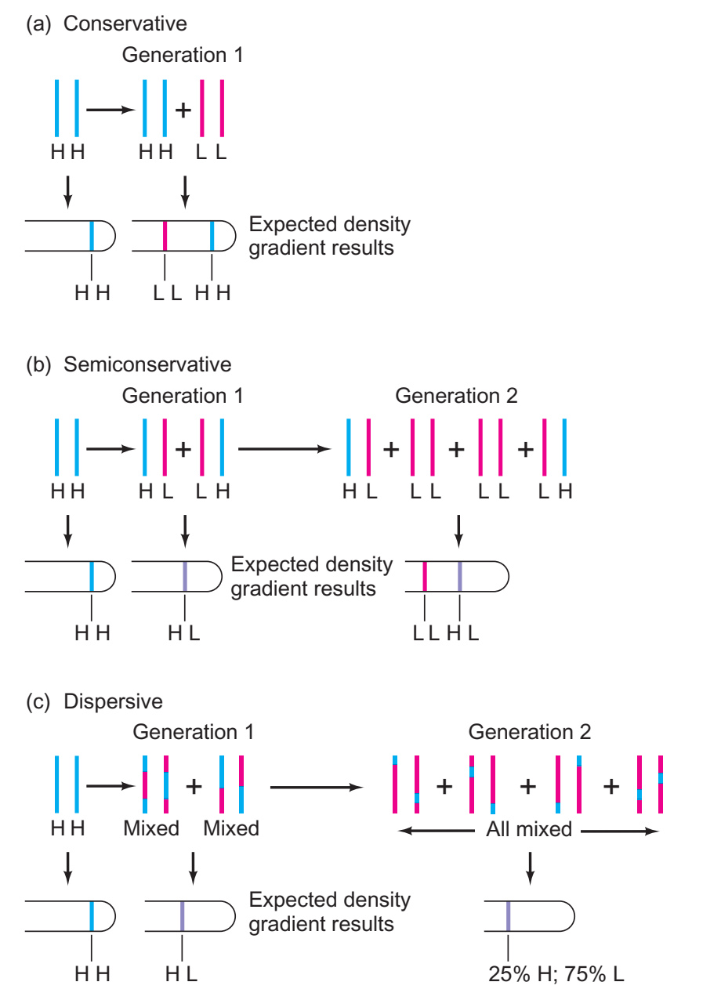{ width="560" height="777" }](../_img/dna_replication/semiconservative-models.jpg)
/// caption
蓝色表示原有重标记，粉色表示新合成的轻标记。先比较第一代：保守模型预测两带，其余两种预测中间带；第二代的预测才把半保留与分散模型进一步分开。[^fig-weaver-20-3]
///

Meselson 与 Stahl 让大肠杆菌先在含 $^{15}$N 的培养基中生长，使 DNA 获得较重的氮同位素标记，再转入含 $^{14}$N 的培养基。新合成的链主要使用轻氮，旧链仍保留重氮；取出不同时间的 DNA，就能追踪旧材料去了哪里。[^meselson-stahl]

关键在于怎样把它们分开。在 CsCl 的平衡密度梯度离心中，DNA 会聚集到与自身浮力密度相应的位置。全重 DNA、全轻 DNA 和一重一轻的杂合双链有不同的密度，因而形成不同位置的条带。这里分的是密度，不是在用条带位置给 DNA 的长短排队。

[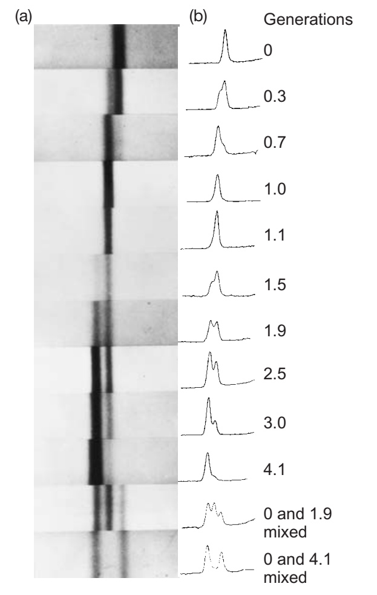{ width="430" height="678" loading="lazy" }](../_img/dna_replication/meselson-stahl-bands.jpg)
/// caption
每一横行对应右侧标出的世代数。原始重带逐渐被中间带替代；约两代时，中间与轻带并存。底部混样帮助比较各带位置，右侧曲线是条带的光密度读数。[^fig-weaver-20-4]
///

复制约一代后，主要出现一条中间密度带。这排除了“旧双链完整保留、旁边生成全新双链”的保守模型，因为后者应该同时产生重带和轻带。但只到这一步，半保留与分散模型还没有分出胜负。

再过一代，半保留模型预测：每条杂合双链分开后，旧重链会再次得到一条新轻链，原来的轻链则配上一条新轻链，于是杂合 DNA 与全轻 DNA 各占约一半。分散模型却预测新旧材料仍混在每个分子中，只是重材料的比例继续降低，主要条带应整体向轻侧移动。实验得到前一种结果。漂亮的实验往往就在这里：不只拿一个现象支持自己，还让几种解释作出不同预测，再看谁能留下来。

!!! question "如果先把双链拆开再测密度呢？（自编）"

    假设从重氮转到轻氮后，取第一代 DNA，并在合适条件下使其两条链完全分离。半保留和分散模型分别预测怎样的单链密度分布？只要求比较模式，不要求计算具体密度。

    ??? success "解析"

        半保留模型中的杂合双链拆开后，得到一条保留重标记的旧链与一条新轻链，因此预期能区分重、轻两类单链。分散模型则预期每条单链内部仍混有新旧材料。判断所用的实验必须能维持单链状态，并有相应密度对照；不能把双链实验中各带的绝对位置直接搬来使用。

## 先看一个核苷酸怎样接上去 { #replication-chemistry }

### 模板、引物和 dNTP

DNA 聚合酶需要一个**引物—模板接头（primer–template junction）**。模板提供下一步配对的碱基；引物已经与模板配对，并留下可以继续延长的 3′-OH。图中的短链是引物，较长的链是模板。注意，真正增加一个核苷酸的是引物所在的链，模板并不在这一步被接长。

[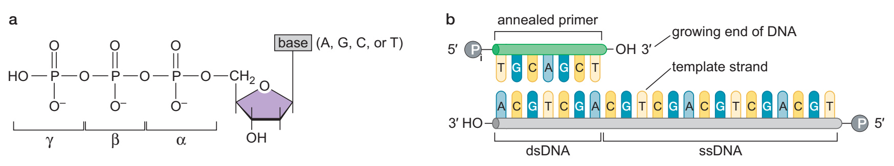{ width="750" height="140" loading="lazy" }](../_img/dna_replication/primer-template.jpg)
/// caption
左图从糖向外依次辨认 α、β、γ 磷酸；右图找到引物暴露的 3′-OH，以及它前方尚未配对的模板。模板与新生链反向平行。[^fig-gene-9-1]
///

原料是四种**脱氧核苷三磷酸（dNTP）**：dATP、dGTP、dCTP 和 dTTP。它们既提供要加入链中的核苷酸，也以三磷酸形式参与反应的能量收支。常规复制型 DNA 聚合酶不能直接把两个游离 dNTP 接成第一段新链；它需要先有这个配对好的末端，才适合继续工作。细胞稍后会用引发酶解决起步的问题。[^replication-chemistry]

### 3′ 端增长，究竟是哪一步

沿反应图看，引物末端的 3′-OH 进攻来袭 dNTP 的 α 磷酸，形成新的磷酸二酯键。β、γ 两个磷酸一起以焦磷酸的形式离开，后续焦磷酸水解有利于合成方向的净推进。来袭核苷酸的糖上又留下一个新的 3′-OH，于是同样的反应可以再做一次。

[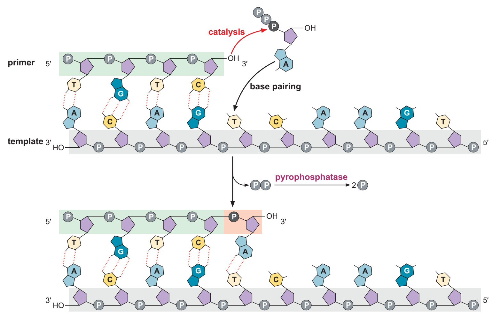{ width="680" height="431" loading="lazy" }](../_img/dna_replication/polymerization-chemistry.jpg)
/// caption
先找上图引物的 3′-OH，再在下图找到接入后新的 3′-OH。模板碱基决定配对选择，红箭头所指的是化学反应位置。[^fig-gene-9-2]
///

新链总是在 3′ 端增加核苷酸，所以把整条新链的增长方向记作 **5′→3′**；聚合酶沿模板读取的方向则是 3′→5′。这两个箭头描述不同的链，画复制叉时最容易在这里把自己绕进去。检查一个箭头之前，先问它画在模板旁边，还是画在新链旁边，能省掉不少无谓的眩晕。

聚合酶不只是把互补碱基凑在一起。它要定位引物末端、来袭 dNTP 和催化所需的金属离子，使反应基团形成合适的空间关系。许多 DNA 聚合酶的结构常用手掌、手指、拇指来描述：这是对结构形状的称呼，方便我们在三维图中找位置。

[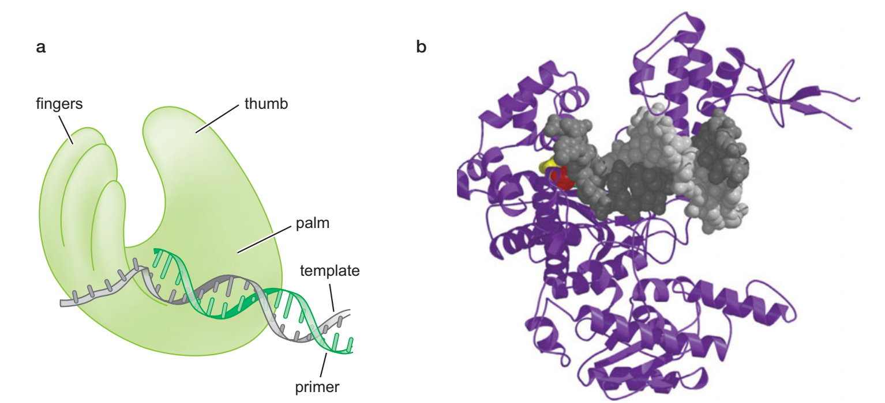{ width="690" height="315" loading="lazy" }](../_img/dna_replication/polymerase-structure.jpg)
/// caption
左图用手掌、手指和拇指标明位置，右图显示蛋白质与 DNA 的三维结构。找到 DNA 进入的位置，再把反应末端接到前一幅化学图上。[^fig-gene-9-5]
///

### 底物选择、校对和错配修复 { #replication-fidelity }

正确的碱基配对有利于底物进入适合催化的构象。错配不只改变两块碱基之间的氢键，也会影响引物末端的位置，使继续反应变得困难。如果错误已经接进去了，许多复制型聚合酶还能把新链末端送到另一个活性位点，切掉末端核苷酸，再回到聚合位点继续合成。

[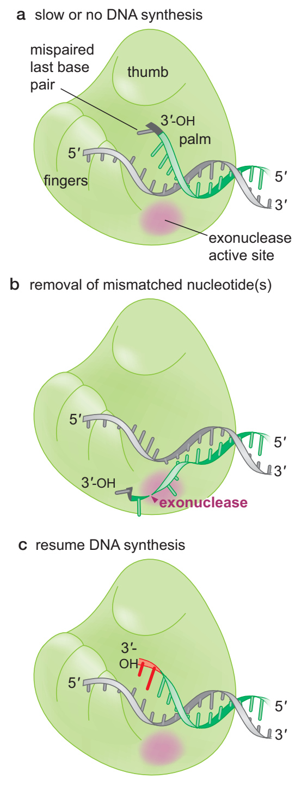{ width="410" height="1067" loading="lazy" }](../_img/dna_replication/proofreading.jpg)
/// caption
a 中错配末端难以继续延长；b 中新链 3′ 端进入外切位点；c 中修正后的末端重新合成。聚合与校对发生在不同活性位置。[^fig-gene-9-11]
///

这种 **3′→5′ 核酸外切校对**，方向与 DNA 合成相反：它从刚刚增长的末端往回切。逃过聚合酶选择和校对的错配，还可以由复制后的**错配修复**识别，并优先在新生链上纠正。这是第三层机制，不应一起叫作聚合酶校对。它们共同使正常细胞的复制错误达到极低的水平，常见概括在每 $10^9$ 个核苷酸一次或更低的量级；具体数值取决于物种、序列、聚合酶与测量方式。[^replication-fidelity]

dNTP 的浓度与比例也影响反应速度和误配机会。引发酶以及真核起始用的 Pol α 没有复制型聚合酶那样的完整校对能力，后来将引物区段移除、重新合成，因而也有利于提高最终产物质量。这是对过程作用的解释，不必把它写成 RNA 引物出现的唯一演化目的。损伤跨越、复制叉重启与修复性合成的取舍，见[DNA 损伤、修复与突变](../dna_repair.md)。

### 滑动钳让聚合酶留在模板上

一个聚合酶每秒能接入多少核苷酸，与它一次结合能连续合成多长，是两个问题。即使单步反应很快，如果动不动就从 DNA 上掉下来，长链复制仍会受到影响。环抱 DNA 的**滑动钳（sliding clamp）**为聚合酶提供了可随 DNA 移动的连接点。

[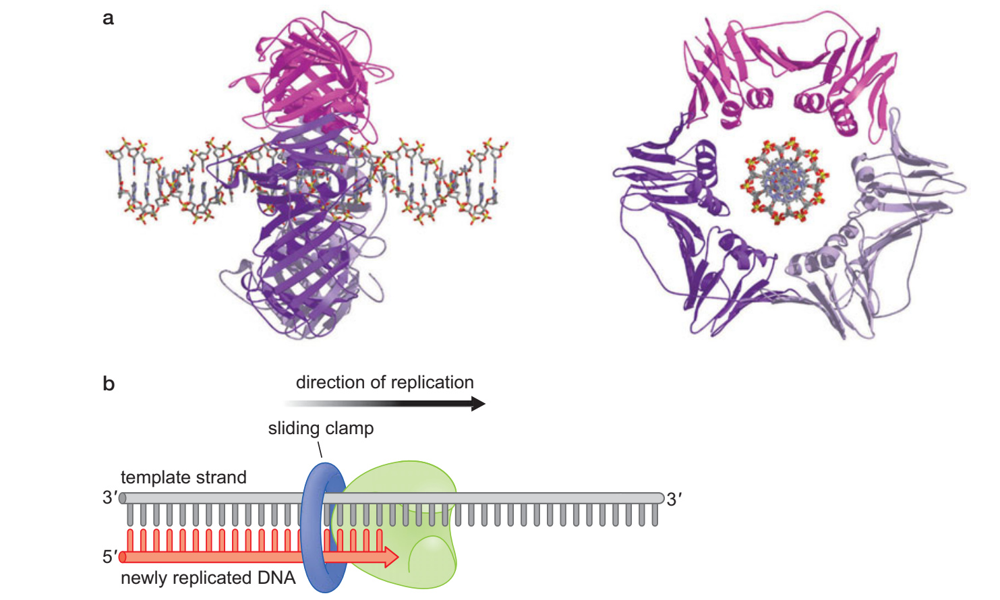{ width="680" height="408" loading="lazy" }](../_img/dna_replication/sliding-clamp.jpg)
/// caption
上排从侧面和孔口看钳环，下排显示它怎样让聚合酶与 DNA 保持联系。钳围住双链，但不把 DNA 锁死在某一个核苷酸位置。[^fig-gene-9-19]
///

细菌常用 β 钳，古菌和真核常用 PCNA。钳装载复合物在 ATP 结合与水解循环中打开钳、识别合适的引物—模板接头、将钳留在 DNA 上并释放。细菌型装载器与古菌、真核的 RFC 类装载器并不完全相同。先掌握共同任务，再比较成员名称，会比从一长串缩写开始好记得多。

## 把合成反应放回复制叉 { #replication-fork }

### 两条模板反向平行，聚合酶怎么办

复制进行时，亲代双链在一个分叉处打开，后方是已经复制的部分，前方是尚未打开的双链。这个 Y 形区域称为**复制叉（replication fork）**。现在固定下面的图，假设复制叉向右推进。

[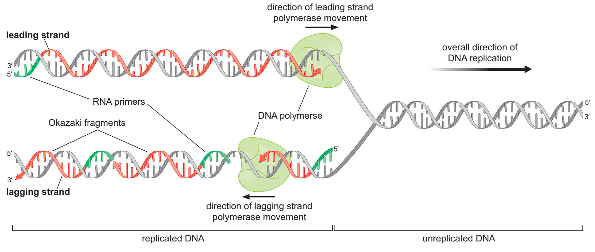{ width="760" height="323" loading="lazy" }](../_img/dna_replication/replication-fork.jpg)
/// caption
灰色为亲代模板，红色为新生 DNA，绿色短段为 RNA 引物。上侧新链的 3′ 端随叉向右延伸；下侧每个片段的 3′ 端向左延伸，但新的片段不断在靠近叉的位置启动。[^fig-gene-9-12]
///

上方那条模板以 3′→5′ 方向朝右延伸，聚合酶可以一边随复制叉前进，一边在新链的 3′ 端加原料，这条新链称为**前导链（leading strand）**。

下方模板的方向反过来了。聚合酶仍然只能延长新链的 3′ 端，所以每次合成的方向朝左，远离正在向右推进的叉。等叉继续向右打开一段模板，就需要在新的位置再起一个头，合成下一段。这条新链称为**后随链（lagging strand）**，由一段段冈崎片段连接而成。

“半不连续”说的是这种合成组织；“半保留”说的是旧链进入哪个子代双链。它们回答的问题不同，可以同时成立。正常复制叉的前导链较连续，遇到损伤、障碍或重启时也可出现间隙；这些情况要放回相应反应中看。

### 解链之后，还需要照顾暴露的模板

解旋酶利用 ATP 反应沿 DNA 移动，推动双链打开。许多复制型解旋酶是环形复合体，单链穿过中央孔道。下图展示乳头瘤病毒 E1 解旋酶的一个结构实例；它帮助我们看清“环围住一条链”是什么样子，细菌 DnaB 和真核 CMG 的具体组成与运动方向则需要分别说明。

[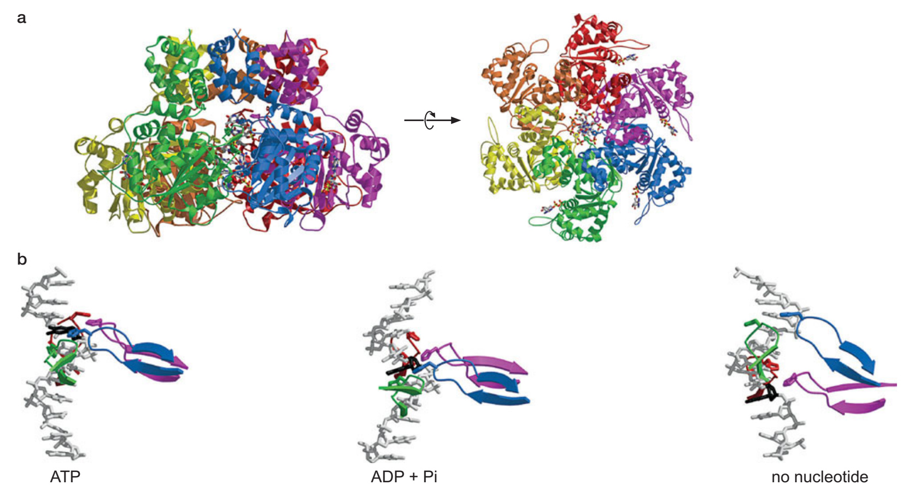{ width="740" height="403" loading="lazy" }](../_img/dna_replication/helicase-structure.jpg)
/// caption
上排从侧面和孔口看六聚体；下排比较不同核苷酸状态中接触单链 DNA 的蛋白环。下排是据结构提出的运动模型，不能当作直接拍摄的分子录像。[^fig-gene-9-15]
///

暴露的单链很容易局部重新配对，或折成影响复制的二级结构。细菌的 SSB、真核的 RPA，以及古菌中的 SSB/RPA 类蛋白覆盖单链，帮助维持可供复制的模板状态，也保护它免于不合适的处理。

双螺旋被打开时，拓扑问题会传到前方：如果 DNA 不能自由转动，未复制部分会积累额外扭转；叉本身的旋转又可能把缠绕转移到后方的子代分子之间。解旋酶忙着拆开碱基对，拓扑异构酶则通过受控的切割与重接来改变链的缠绕关系。

[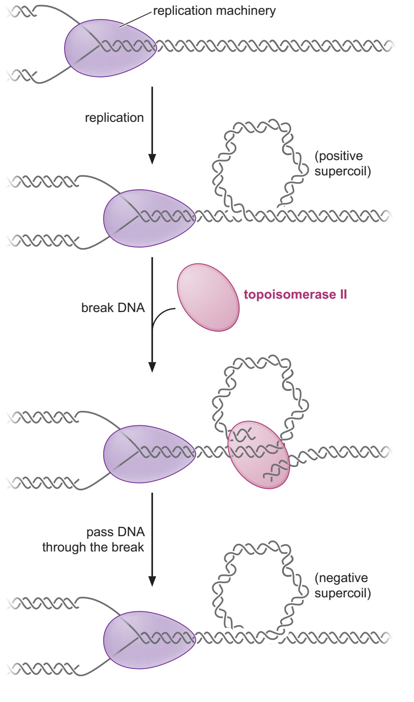{ width="420" height="712" loading="lazy" }](../_img/dna_replication/replication-topology.jpg)
/// caption
沿图看叉前方怎样积累扭转，再看暂时切开一段双链、让另一段穿过并重新连接的过程。图以细菌旋转酶相关的拓扑变化说明原理。[^fig-gene-9-17]
///

细菌 DNA 旋转酶可以引入负超螺旋，I 型或 II 型拓扑异构酶参与解除不同形式的应力；II 型酶还能解开复制产物之间的互锁。连接数和酶类别见[DNA 拓扑与超螺旋](../../biochem/nucleic_acid.md#dna-topology-supercoiling)。

### 引物从哪里来，冈崎片段怎样接力 { #leading-lagging-coordination }

**引发酶（primase）**能够从头合成一段短核酸，为 DNA 聚合酶准备配对好的 3′-OH。大肠杆菌 DnaG 合成短 RNA，并与 DnaB 解旋酶动态配合；许多古菌使用 PriS–PriL 类引发酶；真核 Pol α–primase 则先合成 RNA，再接上一小段 DNA。

前导链建立起始接头后，可以较长时间连续延伸；后随链必须反复引发。后随链聚合酶又与整个复制体保持联系，于是模板在它附近形成一个动态的环。环的长度随片段合成而改变，因此得名**长号模型（trombone model）**。这个名字倒很形象，麻烦通常出在看图时忘了跟哪一条线。

以下用大肠杆菌模型走一圈。先认出右侧负责开链的解旋酶，再看下方后随链模板形成的环，始终盯住正在增长的新链 3′ 端。

[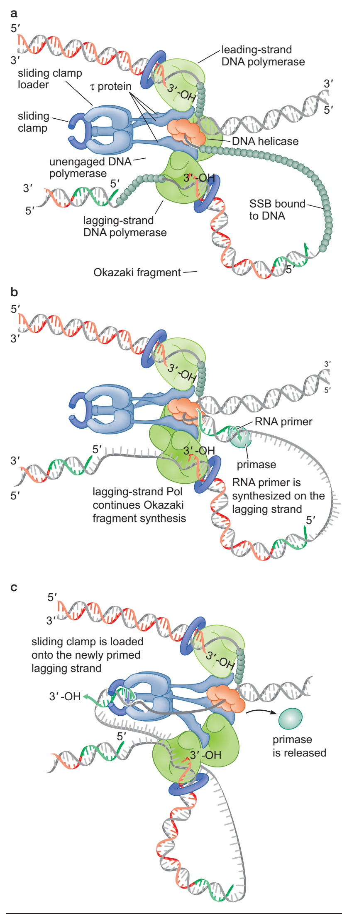{ width="470" height="1251" loading="lazy" }](../_img/dna_replication/trombone-a-c.jpg)
/// caption
a：已有冈崎片段正在延长；b：靠近解旋酶的新模板上出现 RNA 引物；c：装载器把新的钳环留在该引物—模板接头。此图裁取原图左列 a–c。[^fig-gene-9-23]
///

随着复制叉继续前进，新的单链模板暴露出来，DnaG 再放下一段 RNA 引物。钳装载器把新钳留在这个接头，一个可工作的后随链聚合酶接上去，开始下一段 DNA 合成。与此同时，前一个片段可以继续延长，直到接近它前面的片段边界。

[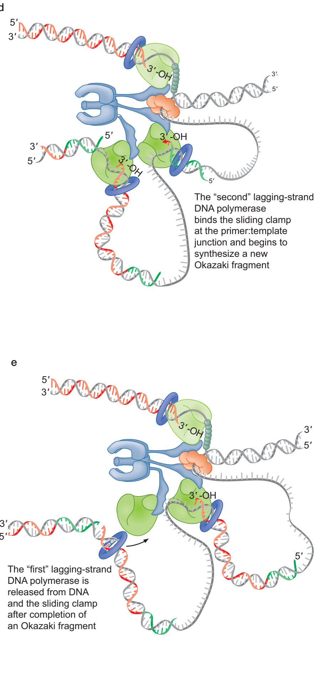{ width="490" height="1065" loading="lazy" }](../_img/dna_replication/trombone-d-e.jpg)
/// caption
d：另一后随链聚合酶接到新装载的钳上；e：前一个片段完成，其聚合酶释放并可参与后续循环。对应原图右列 d–e。[^fig-gene-9-23]
///

这张教材图画出一个前导链聚合酶和两个交替工作的后随链聚合酶，便于表示任务可以重叠进行。不同物种、复制状态和实验条件下，复制体的组分数目与连接关系会变化。它要说明的核心动作是引发、装钳、延伸与释放的接力；真核复制体有不同的结构组织，不能照着图上的每个零件直接改个名字。

### RNA 引物怎样换成连续的 DNA

冈崎片段之间最初并不是一条完整的 DNA 链。下一个片段的 5′ 端还带着引物，片段之间也有需要封闭的切口。在大肠杆菌中，DNA polymerase I 利用聚合活性向前填补，同时以 5′→3′ 核酸外切活性移除前方引物，让切口的位置向前移动，称为**切口平移（nick translation）**。RNase H 也参与处理 RNA–DNA 杂交中的 RNA。

[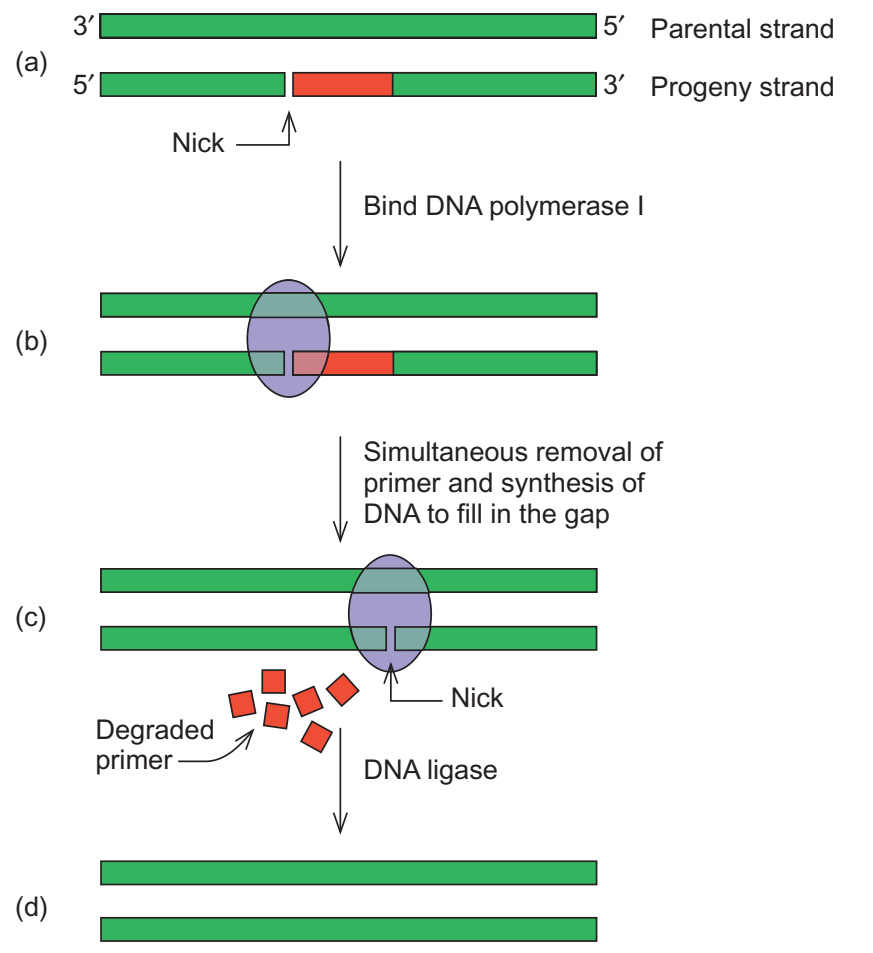{ width="480" height="524" loading="lazy" }](../_img/dna_replication/nick-translation.jpg)
/// caption
红段是待移除的引物。Pol I 在去除前方核苷酸的同时，从左侧片段的 3′ 端延长；最后的切口由 DNA 连接酶封闭。[^fig-weaver-20-15]
///

DNA 连接酶负责把相邻的 3′-OH 与 5′-磷酸接起来，不能代替聚合酶填一段没有核苷酸的空缺。把“填补”与“封口”分开看，各种酶的工作位置就清楚了。

真核细胞主要由 Pol δ 延伸并推开前方片段的 5′ 端，形成小瓣状结构（flap），再由 FEN1 切除。较长的 flap 可需要 Dna2 与 FEN1 协作，RNase H2 参与 RNA 的清除，最终由 DNA ligase I 封口。古菌常见 RNase H、Fen1、PCNA 和连接酶等组合，具体成员依谱系而变。这些系统都要完成移除、替换、连接三项任务，承担它们的酶及先后配合却不同。[^lagging-strand-maturation]

???+ abstract "冈崎片段：短 DNA 为什么会先出现，再消失"

    短时间加入带放射性标记的 DNA 前体，可以优先标记刚刚合成的部分，再按产物大小分离。下面左图所示的 T4 噬菌体复制实验中，最短标记时间主要得到短 DNA；时间延长后，较长 DNA 中的标记增加。右图换成连接酶有缺陷的噬菌体，短片段会持续积累。

    [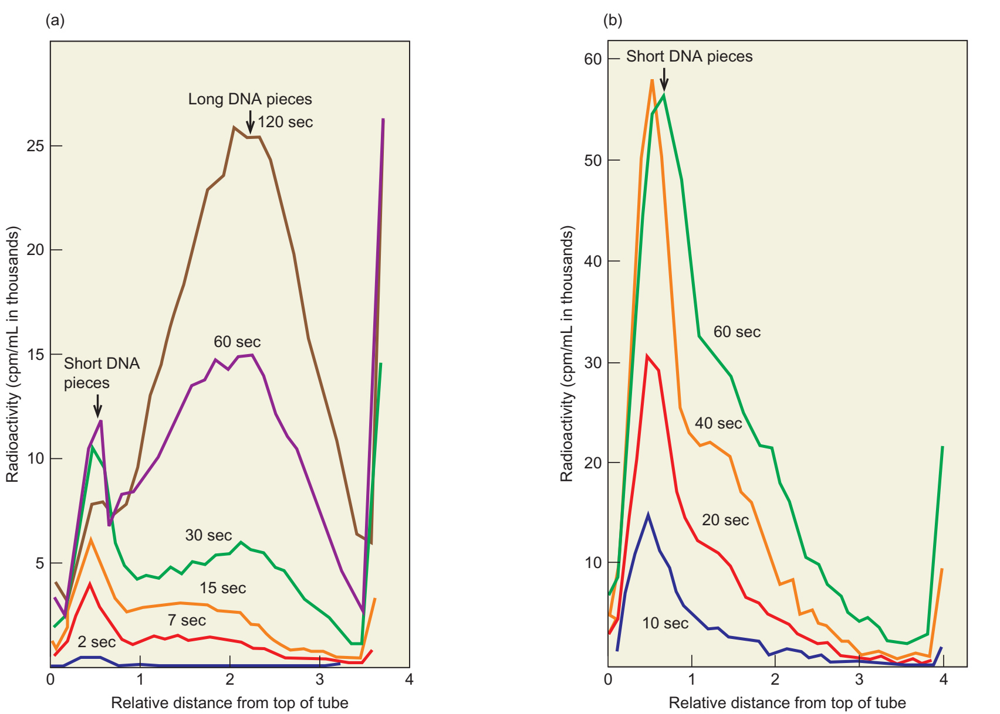{ width="730" height="522" loading="lazy" }](../_img/dna_replication/okazaki-pulse.jpg)
    /// caption
    横轴是距离心管顶部的相对距离，纵轴是放射性读数。左图中的长 DNA 随时间增多，右图的连接酶缺陷使短片段难以并成长链。这里按沉降行为分离大小，与前面的 CsCl 平衡密度实验不同。[^fig-weaver-20-6]
    ///

    这组证据把短产物接到了长链形成过程中，支持至少一条新链分段合成。早期某些实验中，前导链也呈现许多短片段，曾使解释更加复杂。后来在大肠杆菌中结合链特异检测与切除修复通路干预，发现新合成前导链可以长得多；误掺核糖核苷酸后的切除，是造成许多前导链断片的原因。取出来的 DNA 末端既记录合成，也记录合成后的加工，需要把两者分开。[^okazaki-fragments]

## 复制从哪里开始，又在什么时候开始 { #replication-origins }

### 一个起点可以建立两个复制叉

复制叉负责向前工作，**复制起点（origin of replication）**则是它被建立起来的区域。许多起点会发出两个相背运行的叉，在染色体上形成逐渐扩大的复制泡；一个起点及其复制所覆盖的区域构成一个复制子。

[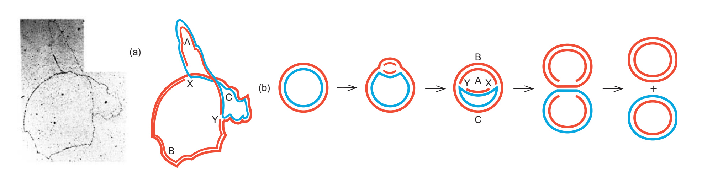{ width="760" height="186" loading="lazy" }](../_img/dna_replication/theta-replication.jpg)
/// caption
左侧为复制中分子的实际观察及描图，右侧表示复制泡沿环状 DNA 扩展，最后形成两条环。中间阶段的外形像希腊字母 θ。[^fig-weaver-20-9]
///

大肠杆菌常用一个 oriC 起点启动一轮染色体复制。ATP 结合状态的 DnaA 在起点的多个识别位点协同装配，使 DNA 解链元件打开；随后 DnaB 解旋酶被装载，引发酶与 Pol III 等合成装置加入，两个复制叉向相反方向出发。

[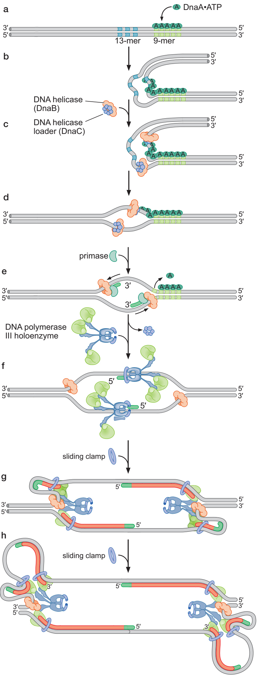{ width="460" height="1155" loading="lazy" }](../_img/dna_replication/bacterial-initiation.jpg)
/// caption
从 DnaA 结合开始，依次找 DnaB、引发酶和两套合成装置。图中的 9-mer、13-mer 概括经典起点元件，具体 oriC 位点排列比这幅组装示意更细致。[^fig-gene-9-27]
///

起点不是打开之后就不再管理。DnaA 的 ATP/ADP 状态、合成与结合位点滴定，以及起始后的失活过程，都会影响下一次启动。在大肠杆菌中，Dam 甲基化与 SeqA 对新复制、半甲基化 oriC 的结合，还能暂时限制再起始。

!!! tip "细菌分裂一次，不能机械理解成只出现一轮不重叠的复制"

    在快速生长条件下，大肠杆菌完成一轮染色体复制所需时间可能长于两次分裂的间隔，于是前一轮尚未结束，下一轮就已从新复制出的起点启动。讨论“一次性启动”时，应说明起点及生长周期的语境；不能把真核 G$_1$—S 的控制图直接套到细菌。

### 真核细胞把装载和激活分开 { #eukaryotic-licensing }

真核染色体更长，通常需要许多起点共同完成复制。如果同一区域重复启动，可能多复制；如果一大片区域没有及时启动，又可能留到周期结束仍未复制。细胞把准备起点与真正开动复制叉分成不同的状态。

晚 M 期至 G$_1$ 期，CDK 活性较低，ORC、CDC6 和 CDT1 帮助把两个头对头的 MCM2–7 六聚体装在双链 DNA 上。这个装载过程建立**复制前复合体（pre-replicative complex，pre-RC）**。此时起点获得了**复制许可（licensing）**，但装上的 MCM 尚未作为活性复制叉解旋酶工作。

进入 S 期，DDK 与 S-CDK 促进后续组装与激活，Cdc45、GINS 等加入，形成 **Cdc45–MCM2–7–GINS（CMG）**解旋酶。两个活性复合体分别建立相反方向的复制叉。与此同时，较高 CDK 活性、CDC6/CDT1 的降解或定位变化，以及后生动物 geminin 对 CDT1 的抑制等机制，使新 MCM 的装载受到限制。

[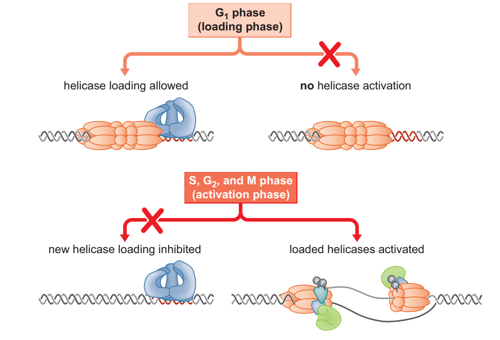{ width="680" height="463" loading="lazy" }](../_img/dna_replication/replication-licensing.jpg)
/// caption
上半部允许装载、尚未激活，下半部抑制新装载。图概括两类周期状态，正常核基因组的起点启动集中在 S 期，不表示 G₂ 和 M 期通常还在启动全新的复制轮次。[^fig-gene-9-33]
///

这样，某个起点可以先准备好，之后再使用；用过之后，在同一轮 S 期中又难以从头装一套新的。并非每个已获许可的起点最终都会启动，一部分会被邻近复制叉经过后被动复制，也能在复制受阻时提供备用起始机会。详细周期调控见[细胞周期中的复制许可](../../cell/cell_cycle.md#replication-licensing)。

真核 Pol α–primase 建立 RNA–DNA 引物后，主要延伸任务交给 Pol ε 与 Pol δ。在通常的未受扰动复制叉中，Pol ε 承担大部分前导链合成，Pol δ 承担大部分后随链合成；Pol δ 也参与起点附近的前导链建立以及某些重启和填补。CMG 周围的 Mcm10、Ctf4/And-1、Mrc1/Claspin、Timeless–Tipin 等蛋白，把合成、解链与复制叉保护联系起来。先认识这些蛋白分别在什么位置工作，再去记缩写，比背一份到场名单踏实。[^eukaryotic-replisome]

### 不同生物怎样使用这套原理

出芽酵母起点有较明显的序列约束；后生动物常表现为范围较宽、使用概率不同的起始区，受到序列性质、核小体、转录、核内环境和发育状态影响。因而在一个系统里好用的“富 AT 短序列”规则，不能不加说明地拿去寻找所有动物起点。[^origin-selection]

许多古菌用 Orc1/Cdc6 类蛋白识别起点、招募 MCM，滑动钳和多种复制叉蛋白也与真核同源；染色体可能有一个或多个起点。一些古菌在实验中删除全部已知起点后，仍能依赖重组相关方式起始复制。许多含 PolD 的古菌以 D 家族聚合酶完成主要染色体复制，另一些谱系主要使用 PolB；古菌有自己的复制系统，并非直接使用真核 Pol δ、Pol ε。[^archaeal-replication]

| 工作 | 细菌代表系统 | 古菌常见系统 | 真核核基因组 |
| --- | --- | --- | --- |
| 起点识别与装载 | DnaA；DnaC 等装载 DnaB | Orc1/Cdc6 类蛋白；MCM | ORC、CDC6、CDT1 装载 MCM2–7 |
| 解链 | DnaB | MCM 及相关辅助因子 | CMG |
| 引发 | DnaG 合成 RNA | PriS–PriL 类引发酶 | Pol α–primase 合成 RNA–DNA 引物 |
| 主要延伸 | Pol III 全酶 | PolD 或 PolB，依谱系而异 | Pol ε、Pol δ 的主要链分工 |
| 滑动钳与装载器 | β 钳；细菌型装载器 | PCNA；RFC 类装载器 | PCNA；RFC |
| 单链保护 | SSB | SSB/RPA 类蛋白 | RPA |
| 片段成熟 | Pol I、RNase H、连接酶 | RNase H、Fen1、连接酶等 | Pol δ、FEN1/Dna2、RNase H2、ligase I |

## 两个复制叉相遇之后 { #replication-termination }

复制叉大多通过与相向而来的复制叉会合而结束。两套机器越来越近，最后一段 DNA 仍要复制，引物仍要处理，后方子代分子之间的缠绕也要解除。序列已经各有一份，不等于染色体已经可以各走各的。

[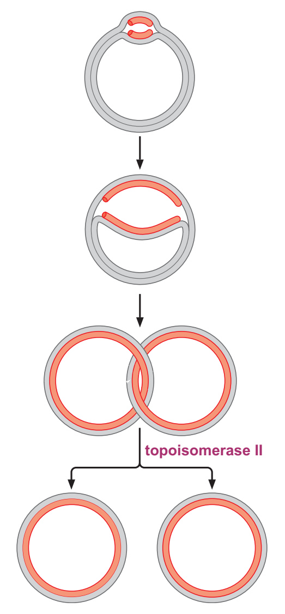{ width="390" height="840" loading="lazy" }](../_img/dna_replication/decatenation.jpg)
/// caption
跟随红色的新链看：两个子代环可以仍然互锁。暂时的双链切割、穿越和重接，使它们最终分离。[^fig-gene-9-35]
///

大肠杆菌的 Tus–Ter 系统能从特定方向阻挡复制叉，把许多会合事件限制在终止区。其他细菌可能缺少这套系统，或使用其他屏障。真核染色体大多数终止位置也由相邻复制叉的相遇决定，并不预先固定在一种通用终止序列上。

合成和拓扑处理结束后，复制体还要卸下来。在研究较充分的真核系统中，终止状态的 CMG 受到 MCM7 泛素化标记，再由 Cdc48/p97 类 ATPase 拆解并从染色质移除。若提前做这件事，复制叉会失去继续推进所需的核心装置。核糖体 DNA、着丝粒或强蛋白障碍附近，还可有局部、具方向性的复制叉屏障，需要分别分析。[^replication-termination]

### 线性染色体到了尽头怎么办 { #telomere-replication }

对于环状模板，总可以沿着环继续找到后面的序列；线性染色体终端却真的会走到头。先固定哺乳动物端粒的一端来看：富 G 链朝末端伸出 3′ 单链突出端，与之互补的富 C 链较短。

这个不对称的末端，使两种复制产物遇到不同问题。以前导方式合成的新 G 链，只能复制到旧 C 链的 5′ 末端；旧 G 链原来多伸出去的那一段，没有相应 C 链模板可供它照着合成。以旧 G 链为模板合成的新 C 链，则需要不断放下引物；常规复制体难以一直把末端区域完整复制下来。再加上形成新突出端所需的 5′ 端切除，末端维护不能只靠常规复制叉完成。[^telomere-replication]

**端粒酶**携带自己的 RNA 模板。它的催化蛋白称为端粒酶逆转录酶（TERT）：RNA 与染色体 G 链的 3′ 端配对，TERT 沿这段 RNA 模板延长 DNA；用完一段模板后，重新对齐，再加一轮重复。外面的染色体已经到头了，酶却把后续模板随身带来了。

[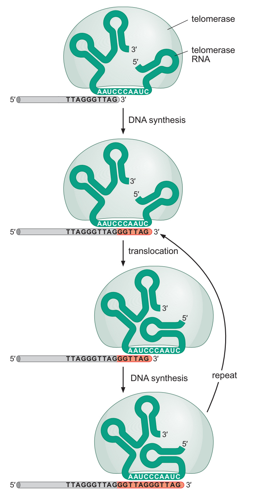{ width="460" height="837" loading="lazy" }](../_img/dna_replication/telomerase-cycle.jpg)
/// caption
绿色曲线是酶携带的 RNA，灰色与红色是 DNA。沿 DNA 的 3′ 端看每次增加的部分；模板重定位使同一段 RNA 能指导重复添加。[^fig-gene-9-38]
///

G 链延长后，互补 C 链仍要合成。CST（CTC1–STN1–TEN1）与 Pol α–primase 协作完成 C 链填补。Takai 等在 2024 年结合重构复制和细胞实验，区分了两类末端复制缺口：端粒酶维护 G 链，CST–Pol α–primase 则解决 C 链的不足。即使端粒酶能延长 G 链，也不能代替后一项工作。[^telomere-two-problems]

[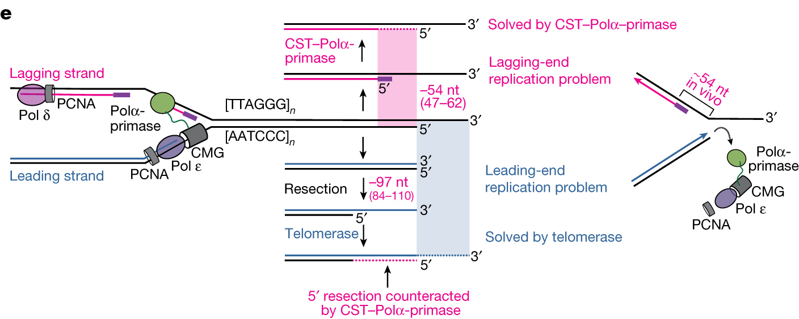{ width="750" height="300" loading="lazy" }](../_img/dna_replication/telomere-end-maintenance.jpg)
/// caption
从左侧复制叉进入中间两条路径：上方为后随端 C 链不足，下方为前导端加工与 G 链延长。粉色标出 CST–Pol α–primase 的作用，蓝色标出端粒酶作用；数值仅对应论文中的体系。[^fig-telomere-end-maintenance]
///

???+ abstract "端粒酶最初是怎样被找到的"

    Greider 与 Blackburn 在四膜虫提取物中检测到一种活性：它能向合适的端粒引物添加特定重复序列。这个实验把“末端需要额外合成”接到了可以在试管中测量的酶反应上。随后对其 RNA 组分与催化蛋白的研究，才逐步建立了今天的端粒酶机制。[^telomerase-discovery]

富 G 序列形成的二级结构、端粒结合蛋白和复制压力，也会影响复制叉通过。端粒酶活性、末端切除与填补、端粒修剪，以及某些细胞中的重组型端粒替代延长（ALT），共同影响长度稳态。因此，每个细胞周期都缩短同样数量的碱基并不是一条普遍定律。末端保护与染色质结构见[染色体的末端组织](../../cell/nucleus_chromatin.md#chromosome-architecture)。

## DNA 复制之后，染色质怎样回来 { #chromatin-replication }

真核 DNA 并不是一条裸露长线。复制叉遇到核小体时，需要暂时移开阻挡前进的组蛋白，又不能把原有染色质状态彻底丢掉。亲代 H3–H4 与 H2A–H2B 可以被复制体附近的伴侣回收，重新放到两条子代 DNA 上；新合成组蛋白则补足另一部分，使复制后的 DNA 恢复相应的核小体密度。

[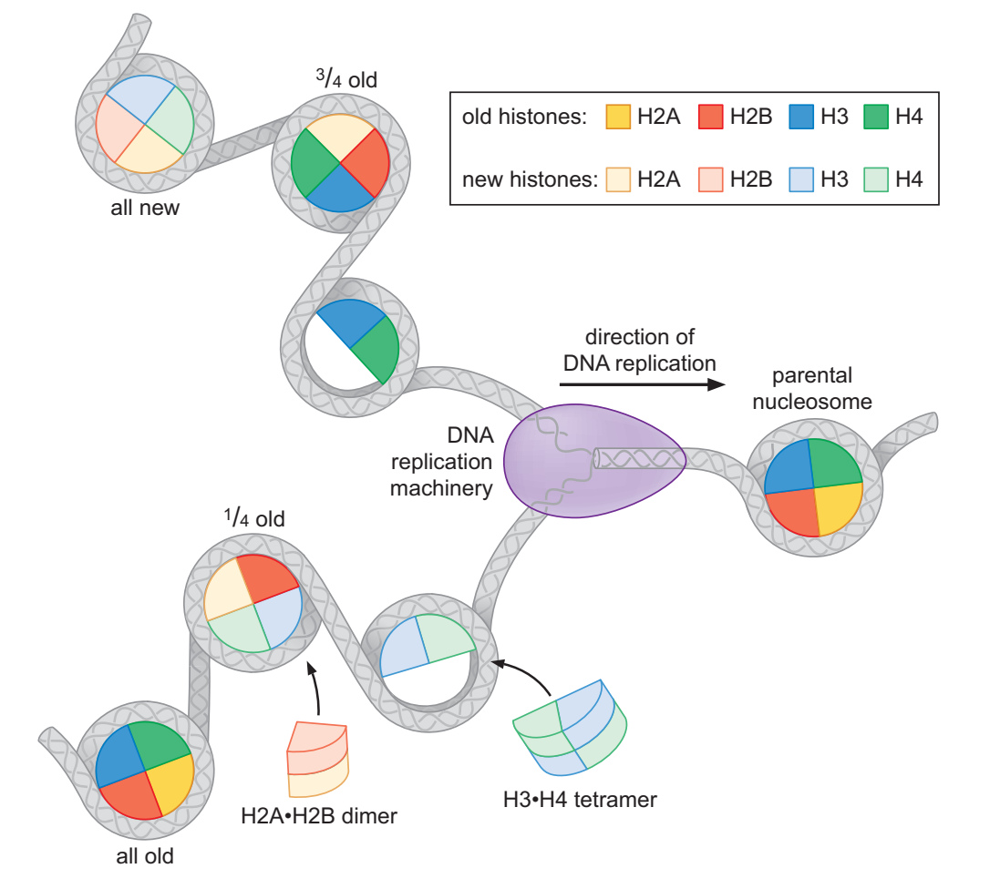{ width="650" height="578" loading="lazy" }](../_img/dna_replication/histone-recycling.jpg)
/// caption
深浅颜色区分亲代与新生组蛋白。重点看旧组分进入子代与新组分填补的关系；图中列出的混合比例不是每个核小体必须遵循的固定配方。[^fig-gene-8-43]
///

MCM2、Pol α 相关转移途径及 Pol ε 辅助亚基等，分别参与不同链方向的亲代组蛋白传递；ASF1、CAF-1 等组蛋白伴侣参与递送和装配。总体分配可以近似平衡，局部却会受到转移装置和染色质环境影响。亲代组蛋白的某些修饰为后续读写酶提供线索，新组蛋白上的修饰再逐步成熟。[^parental-histone-recycling]

所以染色质状态的延续包含回收、重新装配与后续修饰，不是把每个核小体的原位置和全部标记逐颗复印。复制还与姐妹染色单体黏连的建立相协调，为后续染色体分配保留两份复制产物之间的联系。完整背景见[细胞核、染色质与核糖体](../../cell/nucleus_chromatin.md)。

## 同一套合成化学，还能怎样安排 { #alternative-replication-modes }

### θ 型与滚环复制

前面环状 DNA 上扩大的复制泡，在中间阶段形似 θ，因此称为 θ 型复制。许多细菌、古菌和质粒利用这一类几何安排，起点数和双向复制的具体组织依系统而异。

另一种做法，是先在环的一条链上产生特定切口。切口留下一个 3′-OH，聚合酶便能沿完整的互补环延伸，把原来那条被切开的链逐渐置换出去。复制可以绕着环继续进行，伸出的链也越来越长，这就是**滚环复制（rolling-circle replication）**。

[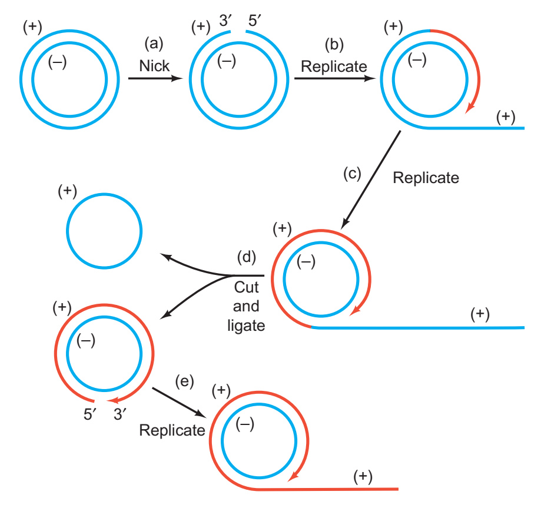{ width="550" height="507" loading="lazy" }](../_img/dna_replication/rolling-circle.jpg)
/// caption
先找切口产生的 3′ 端，再跟随红色新链沿完整蓝色模板延长。被逐出的旧链伸在环外；图最后显示一种切出、连接并继续合成互补链的安排。[^fig-weaver-20-12]
///

不同系统会在不同阶段切割、闭合或合成互补链，产物可以是单体，也可以先形成串联多聚体，再加工成单位基因组。多种质粒、单链 DNA 噬菌体和某些真核病毒使用滚环或相关机制；“噬菌体复制”并不是滚环的同义词。[^rolling-circle]

### 线粒体复制为什么有几种图景

动物线粒体 DNA 常以重链与轻链命名互补的两条链。哺乳动物主要由 Pol γ、Twinkle 解旋酶和线粒体单链结合蛋白 mtSSB 组织复制，RNA 聚合酶还参与提供引物。经典链置换模型中，一条新链先开始合成，逐步暴露另一条模板上的起始区域，再启动互补链合成，因而两条链的合成不同步。

[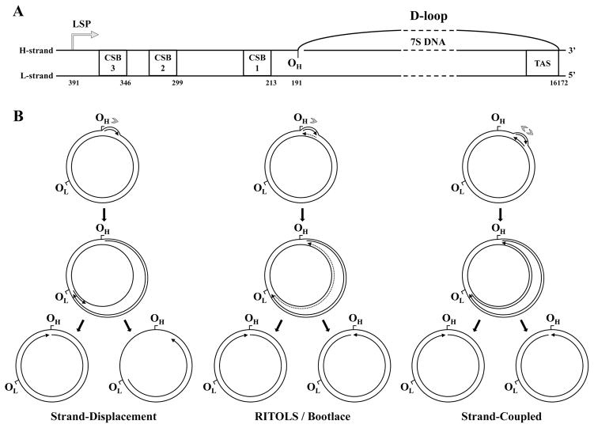{ width="760" height="547" loading="lazy" }](../_img/dna_replication/mitochondrial-models.jpg)
/// caption
A 标出非编码区中的 D 环和相关位点；B 从左到右比较三种模型。实线是 DNA，虚线是 RNA。先看两条新链是否同步形成，再看暴露模板上是否存在长段 RNA。[^fig-mitochondrial-models]
///

一些实验观察到后随链模板上广泛结合 RNA，形成称为 **RITOLS** 的模型；另一些中间体支持更为耦联的双链合成。细胞类型、复制阶段和样品处理，都可能影响检测到的结构。线粒体的 D 环也不等于所有细胞器 DNA 都要照做的一张通用复制路线图。拿这张图去比较不同物种时，聚合酶、引发和终止方式也要一并比较；相似的环状基因组，不保证使用同一套复制安排。[^mitochondrial-replication]

## 当模板换成 RNA { #reverse-transcription }

端粒酶已经展示过一次 RNA→DNA：改变的是模板种类，增长的仍是 DNA 的 3′ 端。其他逆转录酶把这一化学反应安排到病毒复制、移动元件和细菌防御中，形成了各不相同的过程。

### 两次链转移怎样完成病毒 DNA { #retroviral-reverse-transcription }

逆转录病毒需要通过 tRNA 引发、RNA 降解、两次链转移及两条 DNA 的相互延伸，重建完整末端。具体过程与分阶段图解见[逆转录病毒的两次链转移](reverse_transcription.md#retroviral-reverse-transcription)。

### 病毒之外的逆转录 { #reverse-transcriptase-diversity }

HBV、逆转座元件、group II intron 和 retron 对引物与产物的安排各不相同；系统比较及实验技术入口见[逆转录酶的不同工作场景](reverse_transcription.md#reverse-transcriptase-diversity)。逆转录的完整讲解见子页，早期讨论仍保留在本页页末。

## 参考资料与延伸阅读 { #references }

本页主要依据 *Molecular Biology of the Gene* 第 7 版第 9 章，染色质装配参照第 8 章；经典复制实验及相应图版补充自 Weaver 第 5 版第 20 章。较新的机制及物种差异在相邻脚注中注明。

- Watson JD, Baker TA, Bell SP, et al. *Molecular Biology of the Gene*. 7th ed. Pearson / Cold Spring Harbor Laboratory Press; 2014。
- Weaver RF. *Molecular Biology*. 5th ed. McGraw-Hill; 2012。
- Meselson M, Stahl FW. [The Replication of DNA in Escherichia coli](https://pmc.ncbi.nlm.nih.gov/articles/PMC528642/). *PNAS*. 1958;44:671–682.
- Okazaki R, et al. [Discontinuous Synthesis of DNA during Replication](https://pmc.ncbi.nlm.nih.gov/articles/PMC305445/). *PNAS*. 1968;60:329–336.
- Burgers PMJ, Kunkel TA. [Eukaryotic DNA Replication Fork](https://www.annualreviews.org/doi/10.1146/annurev-biochem-061516-044709). *Annual Review of Biochemistry*. 2017;86:417–438.
- Takai H, et al. [CST–polymerase α-primase solves a second telomere end-replication problem](https://www.nature.com/articles/s41586-024-07137-1). *Nature*. 2024;627:664–670.

[^fig-weaver-20-3]: Weaver RF. *Molecular Biology*. 5th ed. McGraw-Hill; 2012，图 20.3，印刷页 638。本站截取教材图版区域，去除页眉与原排版正文，保留图中标记；配中文图注，未重绘。
[^meselson-stahl]: $^{15}$N／$^{14}$N 转换、密度梯度结果及不同复制模型的预测见 Meselson 和 Stahl 的[原始论文](https://pmc.ncbi.nlm.nih.gov/articles/PMC528642/)。
[^fig-weaver-20-4]: Weaver RF. *Molecular Biology*. 5th ed. McGraw-Hill; 2012，图 20.4，印刷页 638。本站截取教材图版区域，去除页眉与原排版正文，保留图中标记；配中文图注，未重绘。原始条带及曲线出自 Meselson M、Stahl FW，*PNAS*. 1958;44:671–682（[原文](https://pmc.ncbi.nlm.nih.gov/articles/PMC528642/)）。
[^fig-gene-9-1]: Watson JD, Baker TA, Bell SP, et al. *Molecular Biology of the Gene*. 7th ed. Pearson / Cold Spring Harbor Laboratory Press; 2014，图 9–1，印刷页 258。本站截取教材图版区域，去除页眉与原排版正文，保留图中标记；配中文图注，未重绘。
[^replication-chemistry]: 聚合化学、底物与引物需求、复制叉组织主要依据 Watson 等，*Molecular Biology of the Gene*，第 7 版，第 9 章（2014）；也可参阅 Alberts 等的[复制机制章节](https://www.ncbi.nlm.nih.gov/books/NBK26850/)。
[^fig-gene-9-2]: Watson JD, Baker TA, Bell SP, et al. *Molecular Biology of the Gene*. 7th ed. Pearson / Cold Spring Harbor Laboratory Press; 2014，图 9–2，印刷页 259。本站截取教材图版区域，去除页眉与原排版正文，保留图中标记；配中文图注，未重绘。
[^fig-gene-9-5]: Watson JD, Baker TA, Bell SP, et al. *Molecular Biology of the Gene*. 7th ed. Pearson / Cold Spring Harbor Laboratory Press; 2014，图 9–5，印刷页 264。本站截取教材图版区域，去除页眉与原排版正文，保留图中标记；配中文图注，未重绘。B 为与 DNA 结合的 T7 DNA 聚合酶结构，据 Doublié S 等，*Nature*. 1998;391:251–258 改编。
[^fig-gene-9-11]: Watson JD, Baker TA, Bell SP, et al. *Molecular Biology of the Gene*. 7th ed. Pearson / Cold Spring Harbor Laboratory Press; 2014，图 9–11，印刷页 269。本站截取教材图版区域，去除页眉与原排版正文，保留图中标记；配中文图注，未重绘。
[^replication-fidelity]: 聚合酶底物选择、3′→5′ 校对和复制后错配修复的分层贡献见 Alberts 等的[复制机制章节](https://www.ncbi.nlm.nih.gov/books/NBK26850/)及 Ganai 与 Johansson 的[校对综述](https://pmc.ncbi.nlm.nih.gov/articles/PMC6153641/)。
[^fig-gene-9-19]: Watson JD, Baker TA, Bell SP, et al. *Molecular Biology of the Gene*. 7th ed. Pearson / Cold Spring Harbor Laboratory Press; 2014，图 9–19，印刷页 280。本站截取教材图版区域，去除页眉与原排版正文，保留图中标记；配中文图注，未重绘。结构图据 Krishna TS 等，*Cell*. 1994;79:1233–1243 改编；其中 DNA 为模型。
[^fig-gene-9-12]: Watson JD, Baker TA, Bell SP, et al. *Molecular Biology of the Gene*. 7th ed. Pearson / Cold Spring Harbor Laboratory Press; 2014，图 9–12，印刷页 270。本站截取教材图版区域，去除页眉与原排版正文，保留图中标记；配中文图注，未重绘。
[^fig-gene-9-15]: Watson JD, Baker TA, Bell SP, et al. *Molecular Biology of the Gene*. 7th ed. Pearson / Cold Spring Harbor Laboratory Press; 2014，图 9–15，印刷页 274。本站截取教材图版区域，去除页眉与原排版正文，保留图中标记；配中文图注，未重绘。乳头瘤病毒 E1 六聚体结构实例，原结构研究为 Enemark EJ、Joshua-Tor L，*Nature*. 2006;442:270–275。
[^fig-gene-9-17]: Watson JD, Baker TA, Bell SP, et al. *Molecular Biology of the Gene*. 7th ed. Pearson / Cold Spring Harbor Laboratory Press; 2014，图 9–17，印刷页 276。本站截取教材图版区域，去除页眉与原排版正文，保留图中标记；配中文图注，未重绘。
[^fig-gene-9-23]: Watson JD, Baker TA, Bell SP, et al. *Molecular Biology of the Gene*. 7th ed. Pearson / Cold Spring Harbor Laboratory Press; 2014，图 9–23，印刷页 285。本站截取教材图版区域，去除页眉与原排版正文，保留图中标记；配中文图注，未重绘。教材据 O’Donnell M，*Current Biology*. 2001;11:R935–R946 改编；本站分两幅展示 a–c 与 d–e，保留原始配色。
[^fig-weaver-20-15]: Weaver RF. *Molecular Biology*. 5th ed. McGraw-Hill; 2012，图 20.15，印刷页 647。本站截取教材图版区域，去除页眉与原排版正文，保留图中标记；配中文图注，未重绘。
[^lagging-strand-maturation]: 真核 Pol α–primase、Pol δ、PCNA、FEN1／Dna2 和 ligase I 的多路径冈崎片段成熟见 Balakrishnan 与 Bambara 的[综述](https://pmc.ncbi.nlm.nih.gov/articles/PMC3044941/)；跨域共同功能见 Alberts 等的[复制机制章节](https://www.ncbi.nlm.nih.gov/books/NBK26850/)。
[^fig-weaver-20-6]: Weaver RF. *Molecular Biology*. 5th ed. McGraw-Hill; 2012，图 20.6，印刷页 640。本站截取教材图版区域，去除页眉与原排版正文，保留图中标记；配中文图注，未重绘。原始 T4 实验据 Okazaki R 等，*Cold Spring Harbor Symposia on Quantitative Biology*. 1968;33:129–143 改编。
[^okazaki-fragments]: 不连续合成的经典实验见 Okazaki 等的[原始研究](https://pmc.ncbi.nlm.nih.gov/articles/PMC305445/)；前导链合成与合成后切除所致断片的区分见 [2019 年大肠杆菌研究](https://pmc.ncbi.nlm.nih.gov/articles/PMC6347710/)及 Williams、Kunkel 的[评述](https://pmc.ncbi.nlm.nih.gov/articles/PMC6397534/)。
[^fig-weaver-20-9]: Weaver RF. *Molecular Biology*. 5th ed. McGraw-Hill; 2012，图 20.9，印刷页 642。本站截取教材图版区域，去除页眉与原排版正文，保留图中标记；配中文图注，未重绘。A 的放射自显影原出处为 Cairns J，*Cold Spring Harbor Symposia on Quantitative Biology*. 1963;28:43–46。
[^fig-gene-9-27]: Watson JD, Baker TA, Bell SP, et al. *Molecular Biology of the Gene*. 7th ed. Pearson / Cold Spring Harbor Laboratory Press; 2014，图 9–27，印刷页 296。本站截取教材图版区域，去除页眉与原排版正文，保留图中标记；配中文图注，未重绘。
[^fig-gene-9-33]: Watson JD, Baker TA, Bell SP, et al. *Molecular Biology of the Gene*. 7th ed. Pearson / Cold Spring Harbor Laboratory Press; 2014，图 9–33，印刷页 301。本站截取教材图版区域，去除页眉与原排版正文，保留图中标记；配中文图注，未重绘。
[^eukaryotic-replisome]: CMG、Pol α、Pol δ、Pol ε、PCNA 及冈崎片段成熟在真核复制叉中的主要分工见 Burgers 与 Kunkel 的[综述](https://www.annualreviews.org/doi/10.1146/annurev-biochem-061516-044709)。
[^origin-selection]: 后生动物起点由序列、染色质、核内结构和发育状态共同选择的证据与方法边界见 Prioleau 与 MacAlpine 的[综述](https://pmc.ncbi.nlm.nih.gov/articles/PMC5002974/)。
[^archaeal-replication]: 古菌起点数量、Orc1/Cdc6–MCM、PolD／PolB 分工及无起点复制的谱系差异见 Greci 与 Bell 的[综述](https://pmc.ncbi.nlm.nih.gov/articles/PMC7712474/)。
[^fig-gene-9-35]: Watson JD, Baker TA, Bell SP, et al. *Molecular Biology of the Gene*. 7th ed. Pearson / Cold Spring Harbor Laboratory Press; 2014，图 9–35，印刷页 303。本站截取教材图版区域，去除页眉与原排版正文，保留图中标记；配中文图注，未重绘。
[^replication-termination]: 复制叉会合、最后片段合成、拓扑解连和终止后 CMG 卸载的机制与未解决边界见 Dewar 与 Walter 的[综述](https://pmc.ncbi.nlm.nih.gov/articles/PMC6386472/)；MCM7 泛素化与 p97 依赖卸载的跨物种证据见 Low 等的[研究](https://pmc.ncbi.nlm.nih.gov/articles/PMC8695382/)。
[^telomere-replication]: 端粒复制叉障碍、前导／后随末端加工、端粒酶延伸与 CST 介导 C 链填补见 Bonnell 等的[综述](https://pmc.ncbi.nlm.nih.gov/articles/PMC8047117/)。
[^fig-gene-9-38]: Watson JD, Baker TA, Bell SP, et al. *Molecular Biology of the Gene*. 7th ed. Pearson / Cold Spring Harbor Laboratory Press; 2014，图 9–38，印刷页 306。本站截取教材图版区域，去除页眉与原排版正文，保留图中标记；配中文图注，未重绘。
[^telomere-two-problems]: Takai H, Aria V, Borges P, Yeeles JTP, de Lange T. [CST–polymerase α-primase solves a second telomere end-replication problem](https://www.nature.com/articles/s41586-024-07137-1). *Nature*. 2024;627:664–670。体外重构与细胞链长分析支持端粒酶维护 G 链、CST–Pol α–primase 维护 C 链的分工；文中测得的缩短量对应其体系与条件。
[^fig-telomere-end-maintenance]: Takai 等，*Nature*. 2024;627:664–670，图 4e。截取[出版方图 4](https://www.nature.com/articles/s41586-024-07137-1/figures/4)的模型面板，保留原标记；其中数值来自论文所研究体系，不表示所有端粒每轮固定缩短相同长度。
[^telomerase-discovery]: 四膜虫提取物对端粒引物的序列特异延伸活性见 Greider 与 Blackburn 的[原始论文](https://pubmed.ncbi.nlm.nih.gov/3907856/)。
[^fig-gene-8-43]: Watson JD, Baker TA, Bell SP, et al. *Molecular Biology of the Gene*. 7th ed. Pearson / Cold Spring Harbor Laboratory Press; 2014，图 8–43，印刷页 251。本站截取教材图版区域，去除页眉与原排版正文，保留图中标记；配中文图注，未重绘。
[^parental-histone-recycling]: 亲代组蛋白近似均衡分配、MCM2 与链偏向以及新组蛋白填补的机制见 Tian 等的[研究](https://www.nature.com/articles/s41467-023-39185-y)；染色质装配背景见[细胞核、染色质与核糖体](../../cell/nucleus_chromatin.md#nucleosome-chromatin)。
[^fig-weaver-20-12]: Weaver RF. *Molecular Biology*. 5th ed. McGraw-Hill; 2012，图 20.12，印刷页 645。本站截取教材图版区域，去除页眉与原排版正文，保留图中标记；配中文图注，未重绘。
[^rolling-circle]: 细菌质粒滚环复制的切口引发、链置换和终止机制见 Khan 的[综述](https://pmc.ncbi.nlm.nih.gov/articles/PMC232620/)。
[^fig-mitochondrial-models]: Ciesielski GL, Oliveira MT, Kaguni LS. *Animal Mitochondrial DNA Replication*. 2016，[图 8](https://pmc.ncbi.nlm.nih.gov/articles/PMC4964852/#F8)。保留完整原图并转换为 JPEG；B 由作者据 McKinney EA、Oliveira MT，*Genetics and Molecular Biology*. 2013;36:308–315 改编。
[^mitochondrial-replication]: 链置换、RITOLS 和链耦联模型及物种差异见 Ciesielski GL、Oliveira MT、Kaguni LS 的[综述](https://pmc.ncbi.nlm.nih.gov/articles/PMC4964852/)（2016）；哺乳动物复制装置与链置换过程另见 Falkenberg 的[机制概述](https://pmc.ncbi.nlm.nih.gov/articles/PMC6056714/)（2018）。
