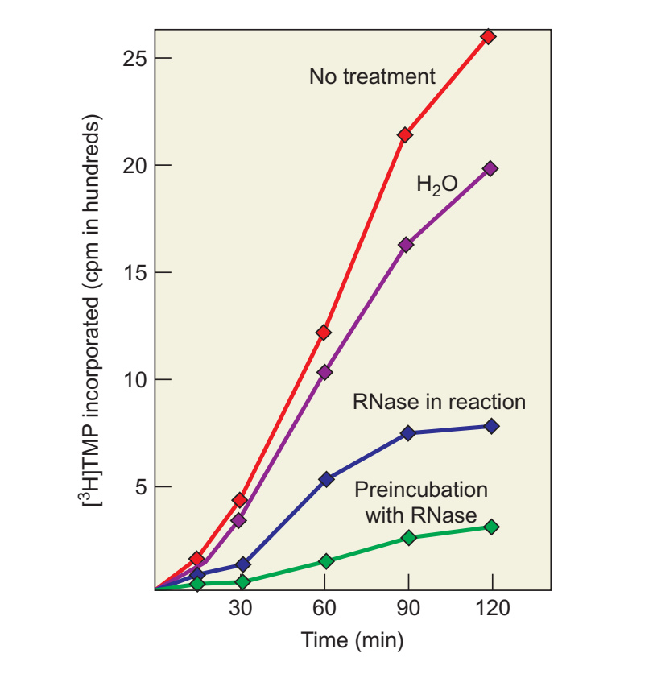
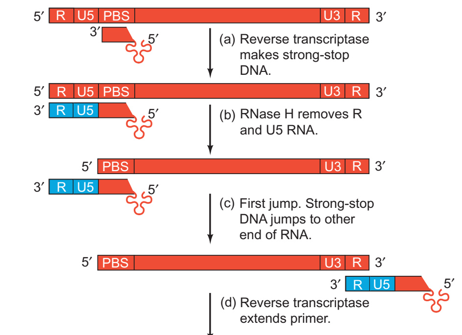
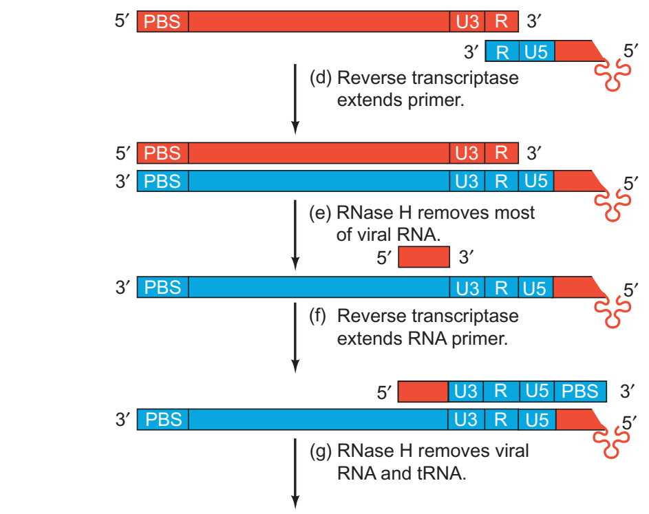
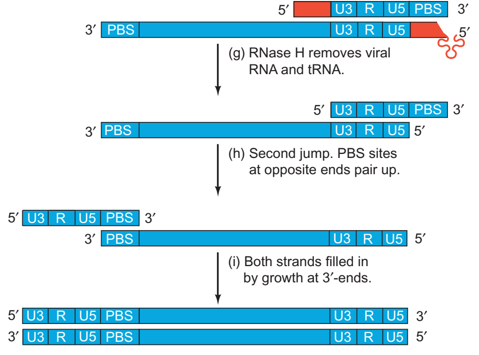
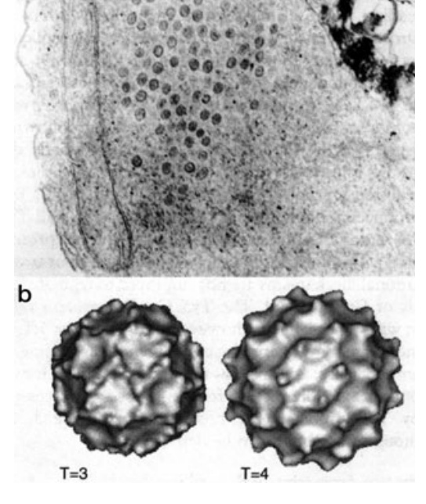
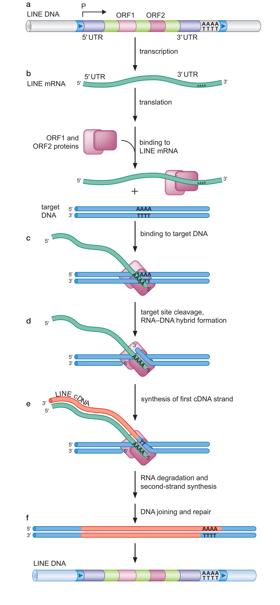

# 逆转录

在[DNA 复制](index.md)中，我们一直让 DNA 指导新 DNA 的合成。把模板换成 RNA，会发生什么？只要酶能识别 RNA–DNA 的引物—模板接头，DNA 仍然可以从配对好的 3′-OH 继续延长，原料也仍是 dNTP。反应没有要求模板必须与产物穿同一身衣服。

**逆转录（reverse transcription）**就是以 RNA 为模板合成 DNA。催化它的逆转录酶（reverse transcriptase，RT）广泛出现在病毒、移动遗传元件以及某些细胞系统中。许多 RT 还能够以 DNA 为模板合成 DNA；在一个完整的逆转录过程中，两种模板甚至会轮流上场。

这里的“逆”是相对于通常从 DNA 转录 RNA 的方向而言，新生 DNA 的增长仍然是 5′→3′。它也没有推翻中心法则：RNA 序列可以传给 DNA，与蛋白质序列不能作为模板逐位回写核酸，是不同的问题。

## 在病毒颗粒中找到 RNA 依赖的 DNA 合成 { #reverse-transcription }

1970 年，Temin 与 Mizutani、Baltimore 分别在 RNA 肿瘤病毒颗粒中检测到 RNA 依赖的 DNA 聚合活性。这个发现为“RNA 病毒可以经 DNA 中间体延续”的认识提供了酶学证据。先看 Baltimore 实验中的一组曲线，比直接记住这一句话更容易理解它的分量。[^reverse-transcriptase-discovery]

[{ width="500" height="519" }](../_img/dna_replication/reverse-transcriptase-discovery.jpg)
/// caption
横轴为反应时间，纵轴为进入酸不溶性产物的标记 dTMP。比较未额外处理、水预孵育、反应中加 RNase 和先用 RNase 预处理四条曲线；预处理 RNA 对后续合成的影响尤其明显。[^fig-weaver-23-20]
///

实验给病毒颗粒提供四种 dNTP，其中 dTTP 带有放射性标记，再检测进入酸不溶性产物的放射性。未作 RNase 处理时，信号随时间上升；在反应中加入 RNase，合成受到抑制；若先用 RNase 处理，再开始反应，抑制更明显。水预孵育则帮助分辨预处理操作本身的影响。

这表明，合成过程依赖可被 RNase 破坏的 RNA 组分。连同对产物为 DNA 等性质的鉴定，才能把结论落到 RNA 依赖的 DNA 聚合。实验曲线记录的是放射性进入产物，并没有直接拍到一个 RT 分子沿 RNA 行走；观察与机制之间，仍有需要逐步验证的联系。

???+ note "RNase 和 RNase H，名字相近，工作对象要分清"

    上面的发现实验用 RNase 处理来检验 RNA 的作用。逆转录病毒 RT 所带的 **RNase H** 活性，则识别 RNA–DNA 杂交体并切割其中的 RNA。它不会把杂交中的 DNA 一起按同样方式清掉，也不是遇见任意游离 RNA 都完成相同反应。

    RT 的 DNA 聚合活性与 RNase H 活性相互配合，使 RNA 模板在被复制后可以逐步移除。不同来源的逆转录酶，其亚基、辅助结构域和酶活性组合并不一致；后面用逆转录病毒作代表来讲这个过程。

## 先认清 RNA 和最终 DNA 的两端 { #retroviral-reverse-transcription }

以 HIV-1 为例，病毒颗粒携带两份正链 RNA 基因组和宿主来源的 tRNA。RNA 需要经过逆转录，变成可供整合的线性双链 DNA。初看反应图会遇到一串小方块：R、U5、PBS、PPT、U3……它们不是在提醒读者缩写还没背够，而是在标记复制过程中要重新对齐的序列。

先把 RNA 从 5′ 到 3′ 的次序写出来。中间的大段编码区暂时省略，只留下理解末端复制所需的位置：

```text title="RNA 基因组的两端"
RNA：5′—R—U5—PBS—……—PPT—U3—R—3′
```

**R** 是两端共有的重复序列；**U5** 原来只在 RNA 的 5′ 端附近，**U3** 原来只在 3′ 端附近。**PBS（primer-binding site）**是与 tRNA 引物配对的位置；**PPT（polypurine tract，多聚嘌呤区）**则与后面正链 DNA 的引发有关。

最终双链 DNA 两端各有一个完整的 **LTR（long terminal repeat，长末端重复）**，每个 LTR 都由 U3—R—U5 组成。只写与 RNA 同向的那条 DNA，就能看出变化：

```text title="完成逆转录后的 DNA"
DNA：5′—[U3—R—U5]—PBS—……—PPT—[U3—R—U5]—3′
           左侧 LTR                     右侧 LTR
```

注意，RNA 原先两端分别是 R—U5 和 U3—R，尚不是各自完整的 U3—R—U5。逆转录需要把原来分居两端的序列安排到两个完整末端中。两次链转移，正是理解这个结果的关键。[^retroviral-reverse-transcription]

### 从 tRNA 起步，再作第一次链转移

HIV-1 常用宿主 tRNA$^{\mathrm{Lys3}}$ 的 3′ 端作引物，其他逆转录病毒可使用不同种类的 tRNA。tRNA 与 PBS 配对后，RT 从这个 3′-OH 开始合成与基因组 RNA 互补的**负链 DNA**。

下图红色表示 RNA，蓝色表示 DNA。首先看最上方：引物靠近 RNA 的 5′ 端，而合成沿模板朝它的 5′ 端推进。于是 RT 先复制 U5 和 R，很快就用完了这一侧的模板，得到一小段负链强终止 DNA（minus-strand strong-stop DNA）。不是酶跑累了，是前面已经没有这条 RNA 可以读了。

[{ width="630" height="458" loading="lazy" }](../_img/dna_replication/reverse-transcription-a-c.jpg)
/// caption
红色为 RNA，蓝色为 DNA，三叶形表示 tRNA。先沿新生 DNA 的 3′ 端复制 U5、R；相应 RNA 被移除后，负链末端借 R 区互补性转到 RNA 的另一端。底部箭头承接后续延长。[^fig-weaver-23-23]
///

RNase H 清除相应的 RNA 后，新合成 DNA 的 R 互补序列暴露出来。RNA 的另一端也有 R，它便能在那里重新配对；新生 DNA 的 3′ 端得到了可继续读取的模板。这就是**第一次链转移**，也称负链转移。

转移可以发生到同一条 RNA 的另一端，也可以利用颗粒携带的另一份 RNA。这里移动的是带着已合成 DNA 的引物—模板关系，DNA 不需要从头另抄一份 U5。先前抄好的序列跟着它一起保留下来。[^retroviral-reverse-transcription]

### 负链继续延伸，RNA 留下一段作正链引物

第一次转移后，负链 DNA 可以从 RNA 的 3′ 端附近继续复制 U3 及更前方的序列，逐渐向 RNA 的 5′ 端延伸。沿途形成 RNA–DNA 杂交，RNA 模板又被 RNase H 逐步处理。

大部分 RNA 会被移除，但 PPT 区域可以留下适合引发的 RNA 片段，提供新的 3′-OH。RT 从它开始，以已经形成的负链 DNA 为模板，合成**正链 DNA**。到这里，同一种酶已经在用 DNA 指导 DNA 合成了。

[{ width="680" height="539" loading="lazy" }](../_img/dna_replication/reverse-transcription-d-f.jpg)
/// caption
图从负链已转到 RNA 另一端的状态继续。大部分红色 RNA 被移除后，留下的短红段为正链提供引物；上方新蓝链逐渐复制出 U3、R、U5 及 PBS 对应序列。[^fig-weaver-23-23]
///

正链合成复制负链上的 U3、R、U5，随后复制仍与负链相连的 tRNA 引物中的相应一段，得到 PBS 对应序列。与此同时，负链继续复制基因组 RNA 另一端的 PBS，最终两条 DNA 的末端便有了可以相互配对的 PBS 序列。

!!! tip "先跟住一条链的 3′ 端"

    在这几幅图中，RNA 红色、DNA 蓝色，但正负两条 DNA 都是蓝色。要判断哪条正在长，先看它从什么引物起步，再找正在延伸的 3′ 端；单凭颜色无法区分正链和负链。图为基本过程示意，HIV-1 还包含中央 PPT 等更细的引发安排。

### 第二次链转移，把两条 DNA 接成完整模板

tRNA 和正链 RNA 引物被处理后，互补的 PBS 区域可以彼此退火，使正链的 3′ 端转到负链另一端对应的位置，形成**第二次链转移**，也称正链转移。两条 DNA 随后互相充当模板，从各自的 3′ 端继续延伸，补齐缺少的部分。

[{ width="680" height="504" loading="lazy" }](../_img/dna_replication/reverse-transcription-g-i.jpg)
/// caption
先比较转移前相反两端的 PBS，再看它们配对后留下的两个可延长 3′ 端。最后两端都出现 U3—R—U5，形成完整 LTR。[^fig-weaver-23-23]
///

现在再回头数 U3 和 U5，就能解释它们为什么各出现在两个末端。第一次转移让负链把 RNA 两端的序列接入同一份 DNA，正链合成和第二次转移再使这些序列在最终双链两端补齐。把“逆转录”只画成 RNA 下方长出一条互补 DNA，会漏掉这套末端重建过程。

最后的病毒 DNA 由整合酶（integrase）及宿主相关反应完成整合，这属于 DNA 合成后的另一组步骤。完整生活史与细胞内过程见[病毒与亚病毒因子](../../micro/viruses.md)，整合反应见[DNA 重组与转座](../dna_recombination.md)。

!!! question "删掉一个 R 区，会先影响哪一步？（自编）"

    只考虑图示基本过程，并假设 tRNA 引发和初始短 DNA 合成都仍然正常。如果基因组 RNA 的 3′ 端 R 区被改动到不能与新生负链末端配对，哪一个阶段最先受到直接影响？

    ??? success "解析"

        第一次链转移需要新生负链的 R 互补序列与 RNA 3′ 端 R 配对。这种互补性被破坏后，最初的短 DNA 仍可能合成，但难以按原有路径转移并继续复制后面的 RNA。真实病毒中的突变还可能影响其他序列功能，这道题把它们暂时排除，只检验图中的配对依赖。

## 同样的逆转录，几种不同的工作场景 { #reverse-transcriptase-diversity }

### HBV：DNA 病毒为什么也需要逆转录

乙型肝炎病毒等 hepadnavirus 的病毒颗粒携带 DNA，但复制时先转录出**前基因组 RNA（pregenomic RNA）**，随后在装配中的核衣壳内把它逆转录回 DNA。按颗粒内的基因组把它归为 DNA 病毒，与其生活史中需要 RNA→DNA，并不矛盾。

它的起步方式也与 HIV 不同。病毒聚合酶的 terminal protein 结构域以自身酪氨酸残基提供引发羟基，最初的 DNA 因而与蛋白质共价相连。前面讲过 tRNA 的 3′-OH，这里换成蛋白质上的羟基；判断引发方式，要找到反应实际从哪里开始，而不是看见 RT 就自动补上一条 tRNA。[^hepadnavirus-reverse-transcription]

### 逆转座：RNA 中间体怎样回到基因组

LTR 逆转座元件的若干步骤与逆转录病毒相似：先产生 RNA，再合成 DNA，随后整合到新的基因组位置。酵母 Ty1 甚至会在细胞内形成病毒样颗粒。这组图的上半部分是过表达 Ty1 时观察到的颗粒，下半部分来自冷冻电镜重建，让“病毒样”有了可以直接比较的结构对象。

[{ width="460" height="544" loading="lazy" }](../_img/dna_replication/ty1-particles.jpg)
/// caption
上图为 Ty1 过表达条件下的电子致密颗粒；下图为带截短 Gag 的颗粒壳重建，T=3、T=4 表示壳体对称组织。两部分的材料和成像含义不同。[^fig-gene-12-30]
///

非 LTR 元件如 LINE，采用的典型办法是**靶位点引发逆转录（target-primed reverse transcription）**。元件编码的核酸内切活性在靶 DNA 上产生切口，切口的 3′-OH 与元件 RNA 配对，RT 就在这个靶位点开始合成 DNA。引物不必预先作为一条游离短链送来，插入位置本身提供了起步的末端。

[{ width="520" height="1122" loading="lazy" }](../_img/dna_replication/line-target-priming.jpg)
/// caption
先看靶 DNA 的切口，再找与 RNA 配对的 3′ 端。沿这个末端形成的新 DNA，是把 RNA 序列写入新位置的起点；后续仍需处理和连接。[^fig-gene-12-26]
///

group II intron 也把 RNA 与蛋白质组成的复合体用于移动，过程可涉及 RNA 的反向剪接、靶 DNA 切口和逆转录。不同元件的 RNA 结构、引物来源及插入步骤有各自安排，不能把 HIV 的两次链转移图直接拿来当总图。更完整的机制比较见[DNA 重组与转座](../dna_recombination.md)。

### 端粒酶：模板是酶自己的组成部分

端粒酶既没有把完整病毒 RNA 抄成 DNA，也不一定要搬到新的插入位点。它携带一小段内部 RNA 模板，反复延长染色体末端的 G 链。其催化亚基 TERT 属于逆转录酶，模板重定位使同一小段 RNA 可以指导多次重复添加；C 链填补则由另一套装置完成。具体过程见[端粒复制与维护](index.md#telomere-replication)。

### Retron：细菌会把 RNA 和 DNA 留在同一个分支结构里

细菌 **retron** 编码非编码 RNA 与 RT，可以产生称为 **msDNA** 的 RNA–DNA 分支结构。这里能够作为引发端的是 RNA 中特定鸟苷的 2′-OH，新 DNA 因而以特别的连接方式连在 RNA 上。逆转录的产物不必总是与 RNA 完全分离的一条 cDNA。

???+ abstract "从 msDNA 到抗噬菌体防御"

    Millman 等通过感染实验与遗传分析，发现许多 retron 与抗噬菌体防御相联系。以所研究的 Retron-Ec48 为例，噬菌体对宿主 RecBCD 功能的干扰可以触发防御；RNA、RT 及相关效应器的作用需要结合各自系统来分析。这个例子让 retron 从一种奇特的核酸产物，变成了可以追问触发条件与感染结局的生物学过程。[^retron-defense]

    不同 retron 家族的效应器和触发方式并不相同。遗传上证明某些组分对防御必需，与结构上看见它们怎样组装，是相互补充的证据；后续复合体结构研究进一步说明了 RT、RNA–DNA 与其他组分的关系。不能将所有 retron 的作用都缩成“提高突变率”或一种固定的防御开关。

| 系统 | 主要 RNA 模板来源 | 引发方式的代表 | 主要产物或作用 |
| --- | --- | --- | --- |
| HIV-1 等逆转录病毒 | 病毒基因组 RNA | 宿主 tRNA 的 3′ 端 | 带完整末端的双链病毒 DNA |
| HBV 等 hepadnavirus | 前基因组 RNA | 病毒聚合酶蛋白引发 | 病毒 DNA 基因组 |
| LTR 逆转座元件 | 元件转录本 | 许多系统利用 tRNA | 可整合的 DNA 中间体 |
| LINE 等非 LTR 元件 | 元件 RNA | 靶 DNA 切口提供的 3′-OH | 靶位点上的 cDNA 与后续插入 |
| 端粒酶 | 复合体内部 RNA | 染色体 G 链 3′ 端 | 端粒重复延长 |
| Retron | 编码的非编码 RNA | 特定鸟苷的 2′-OH | RNA–DNA 分支结构，许多系统参与防御 |

## 在实验室里，把 RNA 变成可分析的 DNA { #reverse-transcription-in-lab }

RT 也是常用实验工具。通过 oligo(dT)、随机引物或特异引物，可以从不同位置开始合成互补 DNA（cDNA），再用于扩增、定量或文库构建。选择引物，就是选择哪些 RNA、哪些区域更容易进入后续分析；RNA 二级结构、完整性以及酶的过程性，也会影响所得 cDNA。

因此，测到某段 cDNA，并不保证原始 RNA 的每个区域都被同样完整、同样高效地复制。具体操作与偏倚见[核酸扩增与定量](../../exptech/biochem_molecular/amplification_cloning.md)，文库背景见[分子克隆与构建设计](../../exptech/biochem_molecular/molecular_cloning.md#library-construction)。

从病毒颗粒中的一条活性曲线，到染色体末端和细菌的 RNA–DNA 分支，逆转录展示的是同一种合成能力怎样被放进不同过程。每遇到一个新系统，重新找一遍模板、引发羟基和新 DNA 的去向，往往就能把陌生的名称拆成可以理解的动作。

## 参考资料与延伸阅读 { #references }

本页结合 *Molecular Biology of the Gene* 第 7 版第 12 章与 Weaver 第 5 版第 23 章展开，发现实验和链转移图来自后者。HIV、HBV 和 retron 的进一步证据见相邻脚注。

- Watson JD, Baker TA, Bell SP, et al. *Molecular Biology of the Gene*. 7th ed. Pearson / Cold Spring Harbor Laboratory Press; 2014。
- Weaver RF. *Molecular Biology*. 5th ed. McGraw-Hill; 2012。
- Baltimore D. [Viral RNA-dependent DNA polymerase](https://pubmed.ncbi.nlm.nih.gov/4316300/). *Nature*. 1970;226:1209–1211.
- Temin HM, Mizutani S. [RNA-dependent DNA polymerase in virions of Rous sarcoma virus](https://pubmed.ncbi.nlm.nih.gov/4316301/). *Nature*. 1970;226:1211–1213.
- Hu WS, Hughes SH. [HIV-1 Reverse Transcription](https://pmc.ncbi.nlm.nih.gov/articles/PMC3475395/). *Cold Spring Harbor Perspectives in Medicine*. 2012;2:a006882.
- Millman A, et al. [Bacterial Retrons Function in Anti-Phage Defense](https://doi.org/10.1016/j.cell.2020.09.065). *Cell*. 2020.

[^reverse-transcriptase-discovery]: RNA 肿瘤病毒颗粒中 RNA 依赖 DNA 聚合活性的两项独立原始报告见 Baltimore 的[论文](https://pubmed.ncbi.nlm.nih.gov/4316300/)以及 Temin 和 Mizutani 的[论文](https://pubmed.ncbi.nlm.nih.gov/4316301/)。
[^fig-weaver-23-20]: Weaver RF. *Molecular Biology*. 5th ed. McGraw-Hill; 2012，图 23.20，印刷页 748。本站截取教材图版区域，去除页眉与原排版正文，保留图中标记；配中文图注，未重绘。教材据 Baltimore D，*Nature*. 1970;226:1209–1211（[原始研究](https://pubmed.ncbi.nlm.nih.gov/4316300/)）改编，原图材料为 R-MLV 颗粒。
[^retroviral-reverse-transcription]: tRNA 引发、RNase H、两次链转移、PPT 正链引发及 LTR 形成见 Hu 与 Hughes 的[机制综述](https://pmc.ncbi.nlm.nih.gov/articles/PMC3475395/)。
[^fig-weaver-23-23]: Weaver RF. *Molecular Biology*. 5th ed. McGraw-Hill; 2012，图 23.23，印刷页 749。本站截取教材图版区域，去除页眉与原排版正文，保留图中标记；配中文图注，未重绘。本站按阶段截取同一幅图，部分交界状态重复显示，便于衔接；保留原图的序列标记、链端、箭头和英文步骤。
[^hepadnavirus-reverse-transcription]: hepadnavirus 以 pregenomic RNA 为中间体及 RT 自身 Tyr 蛋白引发的机制见 Hu 与 Seeger 的[综述](https://pmc.ncbi.nlm.nih.gov/articles/PMC3611959/)。
[^fig-gene-12-30]: Watson JD, Baker TA, Bell SP, et al. *Molecular Biology of the Gene*. 7th ed. Pearson / Cold Spring Harbor Laboratory Press; 2014，图 12–30，印刷页 414。本站截取教材图版区域，去除页眉与原排版正文，保留图中标记；配中文图注，未重绘。教材转载自 Craig NL 等编，*Mobile DNA II*. ASM Press; 2002；B 另注明 H. Saibil 提供。
[^fig-gene-12-26]: Watson JD, Baker TA, Bell SP, et al. *Molecular Biology of the Gene*. 7th ed. Pearson / Cold Spring Harbor Laboratory Press; 2014，图 12–26，印刷页 407。本站截取教材图版区域，去除页眉与原排版正文，保留图中标记；配中文图注，未重绘。
[^retron-defense]: retron 由非编码 RNA、RT 与 msDNA 构成并参与抗噬菌体防御的遗传证据见 Millman 等的[研究](https://doi.org/10.1016/j.cell.2020.09.065)；多组分 retron 复合体的现代结构证据见相关[研究](https://pmc.ncbi.nlm.nih.gov/articles/PMC11974896/)。
