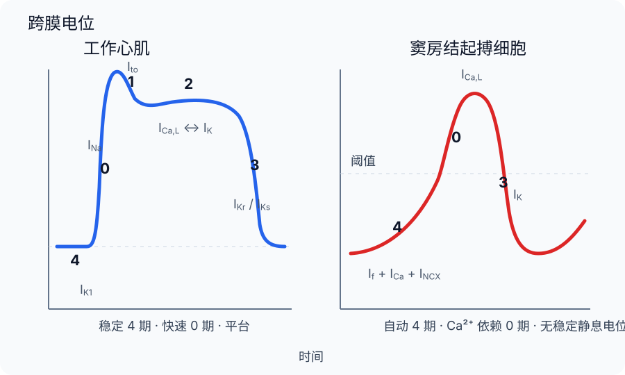

# 心脏电生理

心脏的电活动要同时在三个尺度上理解。单个细胞通过离子通道和转运体产生动作电位；相邻心肌细胞经缝隙连接传递局部电流，使兴奋按特定路径穿过心房、房室交界和心室；体表心电图则把全心许多细胞在时间和空间上的电位差投影到不同导联。三者彼此关联，却不能相互替代：一个心室肌细胞的平台期不是一段 ST 段，窦房结细胞的一次动作电位也不是一个 P 波。

这一电系统先规定收缩的先后次序，再由兴奋—收缩耦联把膜电位变化转成 Ca$^{2+}$ 瞬变和机械力。正常节律并非要求所有心肌同时兴奋，而是要求激动从合适的起点出发，以合适的延迟和速度依次到达各区。

## 不同心肌区域产生不同动作电位 { #regional-action-potentials }

心肌动作电位常被分成“快反应”和“慢反应”，依据主要是 0 期上升支的速度及其承担电流。心房肌、心室肌和 His–Purkinje 系统在膜电位足够负时以快速 Na$^+$ 电流形成陡峭上升支；窦房结和房室结细胞的最大舒张电位较不负，许多快速 Na$^+$ 通道不能充分恢复，0 期主要由 Ca$^{2+}$ 电流承担。这个分类描述的是膜电流状态，不应被误写成“工作细胞必为快反应、自律细胞必为慢反应”：Purkinje 细胞既有快反应动作电位，也保留潜在自律性。[^regional-action-potentials]

### 工作心肌的静息电位与五个时相 { #working-myocyte-action-potential }

心室工作细胞在舒张期具有较稳定的负膜电位。内向整流 K$^+$ 电流 $I_{K1}$ 在这一范围提供较高 K$^+$ 电导，Na$^+$/K$^+$-ATPase 和其他转运过程长期维持离子梯度。$I_{K1}$ 不是一个与电压无关、永远开放的“背景孔”：胞内 Mg$^{2+}$ 和多胺对通道孔的电压依赖性阻塞形成内向整流，使它在平台电位时的外向电流受到限制。

| 时相 | 膜电位变化 | 主要电流关系 |
| --- | --- | --- |
| 0 期 | 快速去极化 | 快速 Na$^+$ 通道开放产生 $I_{Na}$；再生性内流使上升支陡峭 |
| 1 期 | 早期短暂复极 | $I_{Na}$ 失活，瞬时外向 K$^+$ 电流 $I_{to}$ 等形成切迹；幅度有明显区域和物种差异 |
| 2 期 | 平台 | L 型 Ca$^{2+}$ 内流 $I_{Ca,L}$ 与多种外向 K$^+$ 电流近似平衡；交换器和较小的持续电流也会影响平台 |
| 3 期 | 终末复极 | Ca$^{2+}$ 内流衰减，$I_{Kr}$、$I_{Ks}$ 等延迟整流 K$^+$ 电流占优，随后 $I_{K1}$ 重新稳定负膜电位 |
| 4 期 | 舒张期静息 | $I_{K1}$ 主导静息电导；离子泵和交换器恢复跨膜梯度，但不承担一次动作电位的单一“复位开关” |

这张表是人类心室工作细胞的概念骨架，不是所有心肌的通用配方。心房细胞通常有不同的复极电流组合，包括在心房更显著的超快速延迟整流 K$^+$ 电流和乙酰胆碱激活 K$^+$ 电流；它们会改变平台、动作电位时程和静息附近电导，却不能简化成“心房 K$^+$ 通道更多”。Purkinje 细胞的 0 期很快、动作电位常较长，4 期还可缓慢去极化；具体时程仍随物种、心率、部位和记录条件改变，不能把“全心最长”当作无条件定义。[^ventricular-ion-currents]

### 窦房结的舒张期自动去极化 { #sinoatrial-pacemaking }

窦房结起搏细胞没有稳定的静息平台。3 期 K$^+$ 外流使膜复极到最大舒张电位后，4 期净内向电流逐渐占优，膜电位自行接近阈值；0 期主要由 L 型 Ca$^{2+}$ 通道开放产生，随后 K$^+$ 外流完成 3 期复极。它没有工作心肌那样清楚的 1、2 期，也不能用一个离子流解释整个舒张期去极化。

现代“耦合时钟”模型把质膜电流与胞内 Ca$^{2+}$ 循环视为相互作用的系统。超极化激活的 funny current（$I_f$）、衰减的外向 K$^+$ 电流、T 型和 L 型 Ca$^{2+}$ 电流共同改变膜电位；舒张期肌质网局部 Ca$^{2+}$ 释放又可通过正向 Na$^+$/Ca$^{2+}$ 交换产生净内向电流。膜电位会反过来调节 Ca$^{2+}$ 进入和肌质网装载，因此不能在 $I_f$ 与“Ca$^{2+}$ 时钟”之间任选一个作为唯一心脏节拍器。[^sinoatrial-coupled-clock]

{ loading=lazy }
/// caption
工作心肌具有稳定 4 期和平台期，窦房结细胞则以舒张期自动去极化反复到达阈值。[^fig-cardiac-action-potentials]
///

自主神经输入改变的是这个振荡系统的速率和稳定性，而不是替窦房结“制造”自律性。交感—β$_1$ 信号提高 cAMP/PKA 活性，可同时调节 $I_f$、Ca$^{2+}$ 通道和胞内 Ca$^{2+}$ 周转；迷走—M$_2$ 信号降低 cAMP，并通过乙酰胆碱激活 K$^+$ 电流使最大舒张电位更负、4 期斜率减小。完整的反射性调节见[心血管活动调节](blood_regulation.md)。

## 局部电流沿传导系统组织全心激动 { #cardiac-conduction }

一次正常窦性激动从窦房结传入右心房，并经心房肌束和 Bachmann 束等优先通路扩展到两侧心房。心房与心室之间的纤维骨架构成主要电绝缘边界，正常冲动须经房室结—His 束通路进入心室，再沿左右束支和 Purkinje 网迅速到达心内膜下心肌，最后经工作心肌向其余心室传播。所谓“房内优势传导通路”是由各向异性的肌束和连接结构共同形成的优先传播，不宜都理解成边界清楚、彼此绝缘的专用电缆。[^conduction-system]

房室交界的慢传导产生必要延迟，使心房激动和收缩先于心室。其基础不只是“细胞直径小”：结区细胞上升支主要依赖较慢的 Ca$^{2+}$ 电流，细胞几何、连接蛋白表达、缝隙连接密度和曲折的组织结构都增加传播时间。进入 His–Purkinje 系统后，大细胞、陡峭的 Na$^+$ 依赖上升支和适合纵向传播的连接结构使传导加快，从而缩小不同心室区域开始激动的时间差。

工作心肌中的传播速度取决于兴奋细胞可提供多大的局部电流，也取决于下游组织需要被充电的程度。快速 Na$^+$ 电流、膜电容、细胞尺寸、胞内与胞外轴向电阻、缝隙连接及纤维排列都参与其中。心肌沿细胞长轴通常比横跨细胞传播更快，称为传导各向异性；因此“闰盘越多、细胞分化越高就越快”并不是可推广的规律。[^conduction-velocity]

## 主导起搏点与潜在起搏点形成节律层级 { #pacemaker-hierarchy }

窦房结通常具有最高的自发放电频率，冲动会在较低位起搏组织自行到达阈值前先使其兴奋，这就是抢先占领。高频驱动还可在停止后暂时抑制潜在起搏点，称为超速驱动抑制；Na$^+$/K$^+$-ATPase 产生的外向泵电流是重要机制，但离子累积、通道恢复和胞内 Ca$^{2+}$ 状态也会参与。若窦房结停搏或冲动不能下传，房室交界或 His–Purkinje 系统可形成较慢的逸搏，避免立即失去全部心室激动。

教材常列窦房结、房室交界和 Purkinje 系统的“固有频率”，这些数值只表示大致层级。实测频率会受年龄、物种、自主神经张力、温度、离子环境、组织损伤和记录方式影响；窦性心率也不是孤立窦房结细胞的本征频率。判断自律性时应追踪最大舒张电位、4 期净内向电流增长、阈值和通道恢复，而不是机械背诵四个固定数字。[^pacemaker-hierarchy-source]

## 不应性限制重复激动并塑造折返条件 { #refractoriness-reentry }

快速反应心肌在 0 期之后，大量 Na$^+$ 通道进入失活态。直到膜充分复极并有足够通道恢复，刺激都不能产生可正常传播的新动作电位。绝对不应期表示任何刺激都不能触发新的扩布性反应；随后局部反应可能逐渐出现，但只有到有效不应期结束，刺激才足以形成可传播冲动。相对不应期中较强刺激可以触发动作电位，不过上升速度、幅度和传导常低于完全恢复时。有效不应期与动作电位时程相关却不等同，改变 Na$^+$ 通道恢复、组织耦联或刺激强度都可能使两者分离。

心肌较长的不应期与机械收缩大幅重叠，阻止骨骼肌式频率总和和强直，为每搏后的舒张保留时间。但“不应”并不意味着组织在整个复极过程中处处同样安全：不同区域复极和恢复速度不一，过早冲动可在一条路径被阻断、在另一条路径缓慢传过，并在原路径恢复后折返。持续折返通常需要可回到起点的路径、单向阻滞以及足够慢的传导，使波前后方的组织及时恢复；用简化关系表示，激动波长约为传导速度与有效不应期的乘积。[^reentry-mechanism]

细胞外 K$^+$ 轻度升高可使膜电位接近阈值，但继续去极化会使更多 Na$^+$ 通道失活，反而降低上升支和传导安全性。实际效应还受升高程度、速度、细胞类型及其他离子影响，不能用“高钾一定提高兴奋性”概括。期前搏动后的间歇同样不是固定规则：异位冲动是否逆向重置窦房结、下一次窦性冲动能否下传、异位灶位于心房还是心室，都会决定间歇是否接近完全代偿。

## 自律性、触发活动与折返构成心律失常的机制框架 { #arrhythmia-framework }

异常节律可从冲动形成或冲动传播两个层面出现。正常自律性增强或潜在起搏点逃逸属于自发起搏频率改变；原本不自律的细胞在异常条件下也可能出现异常自律性。早期后去极化发生在动作电位复极尚未完成时，常与动作电位过度延长及内向电流重新激活有关；延迟后去极化发生在复极完成后，常由胞内 Ca$^{2+}$ 负荷增加、经 Na$^+$/Ca$^{2+}$ 交换形成瞬时内向电流。二者达到阈值时可产生“触发活动”。折返则是既有冲动在组织中循环传播，并非某个细胞不断自行放电。[^arrhythmia-mechanisms]

这三个机制在真实心脏中可以相互促进。离子通道改变会影响动作电位时程和不应期，缺血、纤维化或缝隙连接重塑会降低传导速度并增加空间不均一，过早搏动则可能恰好遇到单向阻滞。旧笔记罗列的奎尼丁、维拉帕米、苯妥英、强心苷和 4-氨基吡啶只能作为离子流研究或药理机制的线索，不能从“阻断某通道”直接推出统一抗心律失常效果；药物类别、适应证和致心律失常风险留待病理生理与药理内容处理。

## 电兴奋经 Ca$^{2+}$ 瞬变连接机械搏动 { #electromechanical-coupling }

工作心肌动作电位的 $I_{Ca,L}$ 不只塑造平台，也向二联体局部间隙输入触发 Ca$^{2+}$，继而开放 RyR2，使肌质网释放更多 Ca$^{2+}$。SERCA 将 Ca$^{2+}$ 回收到肌质网，Na$^+$/Ca$^{2+}$ 交换器主要以正向模式外排 Ca$^{2+}$；质膜 Ca$^{2+}$-ATPase 通量较小。交换器方向由 Na$^+$、Ca$^{2+}$ 的电化学势和膜电位共同决定，不能把正向与反向模式当作固定的两套泵。详细的横桥激活和 Ca$^{2+}$ 回收见[肌细胞生理](../muscle.md)。[^cardiac-excitation-contraction]

一次电兴奋并不保证整颗心脏“全或无”地同步收缩。心房与心室由纤维骨架电隔离，各区域激动时间、Ca$^{2+}$ 瞬变和负荷也不同；闰盘使局部心肌形成电学连续的网络，而不是把所有心肌变成一个没有空间结构的细胞。电活动规定收缩次序，最终形成的压力、瓣膜事件和搏出量则见[心脏的泵血功能](blood_heart_pump.md)。

## 体表心电图是全心电活动的导联投影 { #surface-electrocardiogram }

心电图记录体表两点之间或探查电极与参考电位之间的电位差。信号来自大量细胞动作电位及其激动、复极顺序，并经过躯干容积导体、心脏位置和电极位置共同塑形。把已去极化区和未去极化区之间的瞬时电势差近似成合成向量有助于读图：净向量指向某导联正极时通常产生正向偏转，背离正极时产生负向偏转，与导联近乎垂直时振幅较小。表面心电图因此不是单细胞跨膜电位的直接记录。[^ecg-principle]

### 十二导联从两个平面观察同一电场 { #twelve-lead-system }

标准十二导联由 10 个电极推导而来。I、II、III 三个双极肢体导联和 aVR、aVL、aVF 三个加压单极肢体导联观察额面；V$_1$–V$_6$ 胸前导联从不同位置观察水平面。它们不是十二次彼此独立的心搏，也不是每个导联对应一块互不重叠的心肌。电极位置、滤波、增益和走纸速度都会影响波形与测量，所以读小格前必须先看校准；只有在 25 mm/s 时，一个 1 mm 小格才代表 0.04 s，一个 5 mm 大格代表 0.20 s。[^ecg-technology]

### 波、段和间期对应群体事件 { #ecg-waves-intervals }

| 成分 | 主要群体事件 | 解释边界 |
| --- | --- | --- |
| P 波 | 心房去极化 | 窦房结本身信号太小，通常不直接形成可辨波；心房复极常被随后 QRS 遮蔽 |
| PR 间期 | 从心房去极化开始到心室去极化开始，包含房室结及 His–Purkinje 近端传导 | 不能缩写成“纯房室结时间”；没有可辨 P 波时也无法按常规定义测量 |
| QRS 波群 | 心室去极化 | Q、R、S 按偏转方向命名，并非每个波群都必须同时具有三种波；心房复极多被掩盖 |
| ST 段 | 心室大部分区域均已去极化、跨区电压梯度较小 | 与细胞平台期相关，但不是一条单细胞平台曲线；近等电不表示离子电流停止 |
| T 波 | 心室复极产生的时空电压梯度 | 多数导联中常与主 QRS 同向，是复极顺序与极性共同作用的结果，并非绝对规则 |
| QT 间期 | 从心室去极化开始至复极结束 | 随心率、性别、年龄、QRS 时程和测量方法改变；校正公式本身也有速率偏差 |
| U 波 | T 波后可能出现的低幅波 | 发生机制仍不确定，不应断言为 Purkinje 纤维复极；显著与否受心率和多种状态影响 |

ST–T 改变可以由缺血引起，也可见于传导顺序改变、心室肥厚、电解质变化、药物、体温和其他生理或病理状态；“T 波低平、双向或倒置就代表心肌缺血”缺乏特异性。QT 与心率相关却不是简单反比，Bazett 等校正式也不能在所有心率下消除依赖。U 波来源尚无单一公认解释。上述边界正是体表群体信号不能被逐项硬套到单细胞时相的例子。[^ecg-repolarization-standards]

心房颤动时通常没有组织良好的重复 P 波，基线可见纤颤活动，房室传导造成的 R–R 间期常不规则；QRS 形态是否正常还取决于原有传导系统和频率。心室颤动则是无组织的心室激动，不再存在稳定可辨的 P–QRS–T 序列。这里只用它们说明“群体激动秩序丧失”如何投影到心电图，不以单个波形提供临床诊断或处置。

## 参考资料与延伸阅读 { #references }

- Rahm AK et al. [Role of ion channels in heart failure and channelopathies](https://pubmed.ncbi.nlm.nih.gov/30019205/). *Biophysical Reviews*. 2018;10:1097–1106。
- Donald L, Lakatta EG. [What makes the sinoatrial node tick?](https://pubmed.ncbi.nlm.nih.gov/37122227/). *Philosophical Transactions of the Royal Society B*. 2023;378:20220180。
- Kennedy A et al. [The Cardiac Conduction System: Generation and Conduction of the Cardiac Impulse](https://pubmed.ncbi.nlm.nih.gov/27484656/). *Critical Care Nursing Clinics of North America*. 2016;28:269–279。
- King JH, Huang CL-H, Fraser JA. [Determinants of myocardial conduction velocity](https://pubmed.ncbi.nlm.nih.gov/23825462/). *Frontiers in Physiology*. 2013;4:154。
- Antzelevitch C, Burashnikov A. [Overview of Basic Mechanisms of Cardiac Arrhythmia](https://pubmed.ncbi.nlm.nih.gov/21892379/). *Cardiac Electrophysiology Clinics*. 2011;3:23–45。
- Noble RJ, Hillis JS, Rothbaum DA. [Electrocardiography](https://www.ncbi.nlm.nih.gov/books/NBK354/). *Clinical Methods*, 3rd ed. NCBI Bookshelf。
- Kligfield P et al. [Recommendations for the Standardization and Interpretation of the Electrocardiogram, Part I](https://pubmed.ncbi.nlm.nih.gov/17322457/). *Circulation*. 2007;115:1306–1324。
- Rautaharju PM et al. [Recommendations for the Standardization and Interpretation of the Electrocardiogram, Part IV](https://pubmed.ncbi.nlm.nih.gov/19281931/). *Journal of the American College of Cardiology*. 2009;53:982–991。

[^regional-action-potentials]: 心房、心室、结区与 His–Purkinje 系统动作电位的区域差异见 Rahm 等 [Role of ion channels in heart failure and channelopathies](https://pubmed.ncbi.nlm.nih.gov/30019205/)；快／慢反应是对上升支电流与速度的概括，不等同于工作／自律细胞的互斥分类。
[^ventricular-ion-currents]: 心室动作电位中 $I_{Na}$、$I_{to}$、$I_{Ca,L}$、$I_{Kr}$、$I_{Ks}$ 与 $I_{K1}$ 的时相关系及区域性重塑见 Rahm 等[综述](https://pubmed.ncbi.nlm.nih.gov/30019205/)；本页只给出概念主导电流，不把任一时相写成单一通道独占。
[^sinoatrial-coupled-clock]: 窦房结细胞的质膜电流、局部 Ca$^{2+}$ 释放、Na$^+$/Ca$^{2+}$ 交换及组织异质性共同形成耦合时钟，见 Donald 与 Lakatta [What makes the sinoatrial node tick?](https://pubmed.ncbi.nlm.nih.gov/37122227/)。
[^fig-cardiac-action-potentials]: 本站依据 Rahm 等的区域动作电位综述与 Donald、Lakatta 的窦房结耦合时钟综述重绘；曲线为机制示意，不表示固定膜电位、时程或电流大小。
[^conduction-system]: 窦房结、房室结、His 束、束支与 Purkinje 网的结构和功能见 Kennedy 等 [The Cardiac Conduction System](https://pubmed.ncbi.nlm.nih.gov/27484656/)。
[^conduction-velocity]: 传导速度受快速 Na$^+$ 电流、膜电容、轴向电阻、细胞几何、缝隙连接和组织各向异性共同决定，见 King 等 [Determinants of myocardial conduction velocity](https://pubmed.ncbi.nlm.nih.gov/23825462/)。
[^pacemaker-hierarchy-source]: 窦房结主导、潜在起搏点受抢先占领和超速驱动抑制的层级，以 Donald、Lakatta 的[窦房结综述](https://pubmed.ncbi.nlm.nih.gov/37122227/)和 Kennedy 等的[传导系统综述](https://pubmed.ncbi.nlm.nih.gov/27484656/)交叉核验；固定频率只作近似范围而不进入正文。
[^reentry-mechanism]: 有效不应期、传导速度、单向阻滞与折返波长之间的机制关系见 Antzelevitch 与 Burashnikov [Overview of Basic Mechanisms of Cardiac Arrhythmia](https://pubmed.ncbi.nlm.nih.gov/21892379/)。
[^arrhythmia-mechanisms]: 正常／异常自律性、早期与延迟后去极化、触发活动及折返的机制分类见 Antzelevitch 与 Burashnikov [综述](https://pubmed.ncbi.nlm.nih.gov/21892379/)；本页不据此提供药物或临床处置建议。
[^cardiac-excitation-contraction]: L 型 Ca$^{2+}$ 内流、RyR2 钙诱导钙释放、SERCA 与 Na$^+$/Ca$^{2+}$ 交换的完整力学接口见本站[肌细胞生理](../muscle.md)及其引用的心肌兴奋—收缩耦联综述；此处只保留电活动所需边界。
[^ecg-principle]: 体表心电图是大量细胞动作电位与激动顺序经容积导体形成的电位差，而非单细胞跨膜电位，见 NCBI Bookshelf [Electrocardiography](https://www.ncbi.nlm.nih.gov/books/NBK354/)。
[^ecg-technology]: 十二导联、电极位置、增益、滤波、走纸速度和自动测量的技术标准见 Kligfield 等 [AHA/ACCF/HRS Part I 声明](https://pubmed.ncbi.nlm.nih.gov/17322457/)；小格时间必须在已知走纸速度下解释。
[^ecg-repolarization-standards]: ST 段、T 波、U 波和 QT 间期的生理基础、命名与解释边界见 Rautaharju 等 [AHA/ACCF/HRS Part IV 声明](https://pubmed.ncbi.nlm.nih.gov/19281931/)；复极异常可由多类生理、病理和药理因素产生，U 波机制仍未定论。
