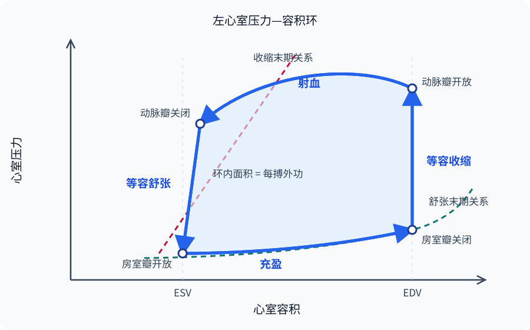

# 心脏的泵血功能

心脏由左右两个串联的压力泵组成：右心室把静脉回流送入低压肺循环，左心室再把肺静脉回流送入体循环。瓣膜随两侧压力梯度被动启闭；心肌的收缩与舒张则不断重建这些梯度。理解泵血需要同时追踪各心腔的压力、容积、瓣膜状态和血流方向。

在循环达到稳态时，左右心室在足够多个心动周期上的平均输出量相等，并与静脉回流相等。逐搏之间可以短暂不等，心肺血管的容量会缓冲这种差异；若长期不等，血液便会在肺循环或体循环一侧持续积聚。这个约束把单个心室的力学行为与整个循环连接起来。

## 心动周期的压力梯度与瓣膜事件 { #cardiac-cycle }

心动周期是一次心搏中各心腔收缩和舒张的完整序列。周期可以从任意相位开始计数，以下从心室充盈末期开始。心率（heart rate，HR）为每分钟 $HR$ 次时，单个周期的时长为

\[
T=\frac{60}{HR}\ \mathrm{s}
\]

心率升高时，收缩期和舒张期都会缩短，舒张期通常缩短得更明显，因此不能把静息时各期所占比例外推到快速心率。心房去极化、心室去极化和复极化为机械活动提供时序，但心电信号、传导延迟与不应期的细节见[心脏电生理](blood_heart_electrical.md)。[^cardiac-cycle-source]

### 瓣膜事件与心室容积 { #valve-events }

| 时相 | 瓣膜状态 | 压力与容积变化 |
| --- | --- | --- |
| 心房收缩 | 房室瓣开放，动脉瓣关闭 | 心房压升高，把充盈末期的一部分血液送入心室，心室达到舒张末期容积（end-diastolic volume，EDV） |
| 等容收缩 | 两组瓣膜均关闭 | 心室压迅速上升，容积保持 EDV；房室瓣关闭附近出现第一心音 |
| 快速与减慢射血 | 动脉瓣开放，房室瓣关闭 | 心室压超过动脉压后开始射血，心室容积由 EDV 降至收缩末期容积（end-systolic volume，ESV） |
| 等容舒张 | 两组瓣膜均关闭 | 动脉瓣关闭附近出现第二心音；心室压下降，容积保持 ESV |
| 快速充盈与充盈减慢 | 房室瓣开放，动脉瓣关闭 | 心室压低于心房压后被动充盈，早期流量较大，随后压力差缩小，进入下一次心房收缩 |

射血开始后，血柱已经获得动量，因此晚期即使心室—动脉压力梯度短暂变小或轻度反向，前向流量仍可在减速中维持片刻；当血液趋向返流时，半月瓣才关闭。瓣膜事件因而以跨瓣压差为基础，也受血液惯性和瓣叶运动的动态过程影响，不能只看某一个时刻的两条压力曲线。

“等容”成立的条件是流入与流出瓣均能关闭。二尖瓣关闭不全时，左心室收缩早期即可向左心房返流，严格的等容收缩期会缩短或消失；主动脉瓣关闭不全也会破坏等容舒张。此时由 $EDV-ESV$ 得到的是心室总搏出量，其中一部分可能逆向流动，不能直接等同于进入主动脉的前向搏出量。

静息窦性心律下，大部分心室充盈在心房收缩前已被动完成，心房收缩提供的末期增量随年龄、心率、静脉回流和心室顺应性而变。各充盈和射血时相的相对贡献随年龄、心率、静脉回流、顺应性和负荷条件连续变化。

### 心房压力波与心音 { #atrial-waves-heart-sounds }

心房既是静脉回流的储血腔和通道，也在舒张末期主动增加心室充盈。成体心房与腔静脉、肺静脉的交界没有像房室瓣那样的功能性单向瓣；心房收缩仍可把压力波和少量逆向流动传向大静脉，血液惯性并不能保证完全没有回传。

右心房压力及颈静脉脉搏常见三个正向波和两个主要下降支：a 波来自心房收缩；c 波主要反映等容收缩早期三尖瓣向心房侧膨隆及瓣环运动；x 下降与心房舒张、房室瓣平面下移有关；v 波是在房室瓣关闭期间静脉血继续充盈心房形成；房室瓣开放后的心房排空产生 y 下降。它们不是“一段一个波”的机械标签，更不存在把充盈减慢期概括成“无波”的规则。[^atrial-pressure-waves]

第一心音（first heart sound，S1）与二尖瓣、三尖瓣关闭后瓣膜—血液—心室结构的振动有关，标志机械收缩期开始；第二心音（second heart sound，S2）由主动脉瓣和肺动脉瓣关闭附近的振动组成，标志射血结束和舒张开始。胸壁上的“听诊区”是声音较易传到的位置，并不是瓣膜的解剖投影。第三心音（third heart sound，S3）出现在快速充盈期，可见于儿童、青年、运动员和妊娠等生理状态，也可在容量负荷或心衰时出现；第四心音（fourth heart sound，S4）位于心房收缩期，常与心房把血液推入顺应性下降的心室有关。S3、S4 的意义取决于年龄、节律、负荷和其他体征，“第三正常、第四病理”不足以概括这些条件差异。[^heart-sounds]

## 压力—容积环的逐搏力学信息 { #pressure-volume-loop }

把心室压力置于纵轴、心室容积置于横轴，按时间连接一个周期中的状态点，便得到压力—容积环。环的右下角是 EDV；随后的竖直上升段是等容收缩。动脉瓣开放后曲线向左移动，直至 ESV；动脉瓣关闭后的竖直下降段是等容舒张，房室瓣再次开放后沿舒张期压力—容积关系回到 EDV。[^pressure-volume-loop-source]

{ loading=lazy }
/// caption
压力—容积环以瓣膜事件为四个转折点，环的宽度对应搏出量，环内面积对应每搏外功。[^fig-pressure-volume-loop]
///

搏出量（stroke volume，SV）和射血分数（ejection fraction，EF）由容积关系定义：

\[
SV=EDV-ESV,\qquad EF=\frac{SV}{EDV}\times 100\%
\]

EF 是射出比例，不是流量，也不是收缩性的纯指标。它同时受前负荷、后负荷、心室几何和瓣膜返流影响：容积较小的心室即使 EF 保留，SV 仍可能偏低；发生返流时，EF 还可能包含未进入前向循环的搏出量。超声心动图或心脏磁共振测得的 EDV、ESV 与 EF 必须在成像方法、体型、节律和负荷条件中解释。[^chamber-quantification]

压力—容积环的面积近似为心室每搏对血液完成的外功：

\[
W_{\mathrm{stroke}}=\left|\oint P\,\mathrm{d}V\right|
\]

常规条件下压力—容积功是外功的主要部分，射流动能在高流量或瓣口狭窄时会变得更重要。右心室面对的肺循环压力远低于左心室面对的体循环压力，因此通常完成较少外功，但“右室每搏功恒为左室的 $1/6$”并不成立，比例会随肺动脉压、主动脉压、搏出量和瓣膜状态改变。外功也不等于心肌全部代谢耗能；实验中的收缩期压力—容积面积还包括收缩末期储存的势能，与每搏氧耗在稳定收缩状态下具有较好的相关性。[^cardiac-energetics]

## 搏出量的负荷、收缩性与心率因素 { #stroke-volume-determinants }

### 前负荷与 Frank–Starling 机制 { #preload-frank-starling }

前负荷描述收缩开始前心肌承受的牵张或壁应力。EDV、舒张末期压力和心房压常被当作替代指标，却不是同一个量：相同 EDV 在顺应性较低的心室中可产生更高压力，相同腔内压力在心包压或胸腔压改变时也不代表相同的跨壁牵张。静脉回流、充盈时间、心室主动松弛、被动顺应性和心包约束共同决定实际充盈。

在生理工作范围内，回心血量增加使心室舒张末期容积和肌节初长度增加；即使神经输入与细胞内 Ca$^{2+}$ 瞬变不变，肌丝的长度依赖性激活也会提高收缩力，使下一搏排出更多血液。这就是 Frank–Starling 机制。它在逐搏尺度上帮助心室输出追随静脉回流，并使左右心室维持长期流量匹配。这种力量增加反映同一收缩状态下的长度依赖反应；收缩性则特指独立于负荷变化的能力。[^frank-starling]

肌节拉长为何提高激活仍不是单一机制可以穷尽的问题。肌丝对 Ca$^{2+}$ 的敏感性、粗细肌丝协同激活、肌联蛋白（titin）产生的被动力和晶格几何都参与其中。离体肌条在超过最佳长度后可进入张力下降支，严重扩张或结构受损的心室也可能偏离正常上升关系；完整健康心脏通常受心包、细胞骨架和组织几何限制，主要工作在上升支，却不能据此宣布心功能曲线“绝无降支”。

### 射血后负荷的综合机械组成 { #afterload }

后负荷是心室射血时必须克服的机械负担。主动脉压或肺动脉压是重要组成，却不能完整代表心肌纤维承受的负荷；心室半径、壁厚、动脉阻抗、外周阻力和大动脉顺应性都会改变射血期壁应力。用薄壁近似表达时，壁应力随腔内压和半径增大、随壁厚增加而降低，这说明同样的动脉压对扩张薄壁心室和小腔厚壁心室并非相同负担。

在前负荷和收缩性暂时不变时，后负荷突然升高会推迟动脉瓣开放、减少肌纤维缩短，使 ESV 增加、SV 降低。后续搏动还受残余容积、下一搏前负荷、神经反射和收缩性共同影响，搏出量恢复程度随条件而变。动脉系统怎样通过压力、阻力与顺应性形成负荷，见[血管生理](blood_vessel.md)。

### 收缩性、舒张性与心率 { #contractility-heart-rate }

收缩性（contractility）是在给定前负荷与后负荷下改变力和缩短程度的能力，受胞内 Ca$^{2+}$ 动员、肌丝反应和交感—β$_1$ 肾上腺素能信号等调节。压力—容积分析常用收缩末期压力—容积关系的变化近似追踪它；舒张性则包括主动松弛速度（lusitropy）和被动顺应性，两者会反过来限制下一搏的前负荷。咖啡因可促进肌浆网 Ca$^{2+}$ 释放，茶碱还涉及磷酸二酯酶和腺苷受体，但二者都不宜被笼统列为临床意义上的“Ca$^{2+}$ 增敏剂”。

心输出量并不与心率在所有范围内成正比。心率适度升高时，每分钟搏次数增加，交感活动还可同时提高收缩性和松弛速度；心率过高时，舒张充盈和冠脉灌注时间缩短，SV 可能下降。转折点取决于节律、心室顺应性、血容量、收缩性和代谢状态，不存在适用于所有人的“超过 140 次/min 后必然负相关”阈值。自主神经和反射性调节机制见[心血管活动调节](blood_regulation.md)。

## 心功能—静脉回流曲线与循环工作点 { #cardiac-vascular-working-point }

“心功能曲线”在教材中可指不同实验关系，读图时必须先看横纵轴和控制变量。

| 曲线 | 常见坐标 | 主要表达的关系 |
| --- | --- | --- |
| 心室功能曲线 | SV 或每搏功对 EDV、舒张末期压力 | 在给定后负荷与收缩状态下观察 Frank–Starling 反应 |
| 心输出量曲线 | 心输出量（cardiac output，CO）对右心房压 | 综合表示整个心脏在一定收缩性、心率和心外压力下的泵血能力 |
| 静脉回流曲线 | 静脉回流量（venous return，VR）对右心房压 | 表示平均系统充盈压、静脉回流阻力和大静脉塌陷共同限定的回流能力 |

心输出量曲线与静脉回流曲线的交点才是完整循环的稳态工作点，因为该点同时满足 $CO=VR$ 和共同的右心房压。增加收缩性可把心输出量曲线上移，增加血容量或静脉收缩可移动静脉回流曲线，改变胸腔压或心包压又可平移心脏的充盈关系。真实生理扰动往往同时移动两条曲线，所以不能只沿一条 Frank–Starling 曲线推断整个循环的最终结果。[^osm-cardiac-curves]

这套曲线把“心脏能泵多少”和“外周能送回多少”分开，再通过交点合成。[血管生理](blood_vessel.md)解释平均系统充盈压、静脉容量和回流阻力，[心血管活动调节](blood_regulation.md)说明神经反射怎样同时改变心脏与血管。

## 心输出量、心指数与泵血储备 { #cardiac-output-reserve }

搏出量与心率共同给出每分钟心输出量，按体表面积（body surface area，BSA）校正后称心指数（cardiac index，CI）：

\[
CO=HR\times SV,\qquad CI=\frac{CO}{BSA}
\]

CO 是每个心室每分钟泵出的量，不能把左右心室数值相加称作“全心输出量”。静息参考值随体型、年龄、姿势、训练、体温和测量方法改变，固定的 $5\ \mathrm{L/min}$ 或 $70\ \mathrm{mL/beat}$ 只适合作为数量级示例，不是所有个体的生理常数。全身氧输送量（systemic oxygen delivery，$D_{\mathrm O_2}$）是 CO 与动脉血氧含量 $C_{a\mathrm O_2}$ 的乘积；若 CO 以 L/min、氧含量以 mL/dL 表示，还需乘以 10 完成单位换算：

\[
D_{\mathrm O_2}=CO\times C_{a\mathrm O_2}\times 10
\]

在氧耗和循环近似稳态、肺组织氧耗等影响可以忽略时，菲克原理（Fick principle）进一步用动脉与混合静脉血氧含量之差连接全身氧耗率与血流：

\[
\dot V_{\mathrm O_2}=CO\left(C_{a\mathrm O_2}-C_{\bar v\mathrm O_2}\right)\times 10,\qquad
CO=\frac{\dot V_{\mathrm O_2}}{\left(C_{a\mathrm O_2}-C_{\bar v\mathrm O_2}\right)\times 10}
\]

因此，氧输送取决于 CO 和动脉血氧含量，氧耗则同时反映血流与组织提取。慢性贫血相关的高输出状态、心腔重构及治疗属于[病理生理](../pathophysiology/index.md)范围；运动时心率、SV、血流再分配、通气与代谢的协同见[运动生理与整体适应](../exercise_environment.md)。[^cardiac-output-measurement]

心脏泵血储备通常指最大可达到的 CO 与静息 CO 之间的差值，也可用相对倍数表达。它来自心率储备和搏出量储备的共同贡献，却不是两个互不影响的容量简单相加：心率改变会改变充盈，静脉回流和收缩性又会改变 SV。训练状态、年龄、体型、测试方式和疾病都会改变储备，因此脱离情境给出固定倍数意义有限。

## 泵血指标的测量依赖性与负荷条件 { #pump-assessment }

| 方法 | 主要获得的信息 | 主要边界 |
| --- | --- | --- |
| 超声心动图／心脏磁共振 | 心腔容积、EF、瓣膜运动；多普勒（Doppler）或相位对比可估流量 | 几何假设、图像质量、节律和操作者会影响结果；不同方法不可无条件互换 |
| 菲克法 | 由氧耗和动静脉氧含量差计算 CO | 需要可靠测得或估计氧耗及混合静脉血氧含量；混合静脉血通常取自肺动脉，误差会传递到 CO |
| 指示剂稀释／热稀释 | 由已知指示剂或温度变化的稀释曲线估算流量 | 侵入性、分流、瓣膜返流和呼吸变化等会影响测量 |
| 心导管与压力—容积导管 | 心腔及大血管压力、压力梯度，研究条件下可构建压力—容积关系 | 侵入性；单次压力或负荷依赖指标不能独立代表整体泵功能 |

因此，“泵血功能”没有一个脱离情境的单一金标准。EF 描述容积分数，CO 描述流量，压力—容积环描述负荷下的逐搏力学，心指数用于体型校正，储备则需要受控应激。把这些指标与症状、节律、瓣膜状态、血压、回流和组织灌注放在一起，才不会把某个正常数值误当作整个循环正常。[^measurement-boundaries]

## 参考资料与延伸阅读 { #references }

- OpenStax, [Cardiac Cycle](https://openstax.org/books/anatomy-and-physiology-2e/pages/19-3-cardiac-cycle) 与 [Cardiac Physiology](https://openstax.org/books/anatomy-and-physiology-2e/pages/19-4-cardiac-physiology)。
- Solaro, R. J., [Regulation of Cardiac Contractility](https://www.ncbi.nlm.nih.gov/books/NBK54078/) 及 [Pressure Volume Loops Provide a Quantification of Contractility](https://www.ncbi.nlm.nih.gov/books/NBK54080/?report=reader). NCBI Bookshelf, 2011。
- Fukuda, N. et al., [Titin and troponin: central players in the Frank–Starling mechanism of the heart](https://pubmed.ncbi.nlm.nih.gov/20436852/). *Current Cardiology Reviews*, 2009。
- Lang, R. M. et al., [Recommendations for cardiac chamber quantification by echocardiography in adults](https://pubmed.ncbi.nlm.nih.gov/25559473/). *Journal of the American Society of Echocardiography*, 2015。
- Suga, H. et al., [Ventricular systolic pressure-volume area as predictor of cardiac oxygen consumption](https://pubmed.ncbi.nlm.nih.gov/7457620/). *American Journal of Physiology*, 1981。
- Persichini, R. et al., [Venous return and mean systemic filling pressure: physiology and clinical applications](https://pubmed.ncbi.nlm.nih.gov/35610620/). *Critical Care*, 2022。
- NCBI Bookshelf, [Physiology, Cardiac Output](https://www.ncbi.nlm.nih.gov/sites/books/NBK470455/)、[Physiology, Jugular Venous Pulsation](https://www.ncbi.nlm.nih.gov/books/NBK534125/) 与 [Physiology, Heart Sounds](https://www.ncbi.nlm.nih.gov/books/NBK541010/)。

[^cardiac-cycle-source]: 瓣膜随压力梯度开启或关闭、心房与心室收缩舒张的时序及心率改变周期长度的基础见 OpenStax [Cardiac Cycle](https://openstax.org/books/anatomy-and-physiology-2e/pages/19-3-cardiac-cycle)；各期时长随心率和生理状态改变。
[^atrial-pressure-waves]: a、c、v 波与 x、y 下降的机械来源见 NCBI Bookshelf [Physiology, Jugular Venous Pulsation](https://www.ncbi.nlm.nih.gov/books/NBK534125/)；颈静脉波形主要投影右心房压力，不能直接替代左心房压力。
[^heart-sounds]: S1、S2 与瓣膜关闭后心血管结构振动的关系，以及 S3、S4 的生理与病理边界见 NCBI Bookshelf [Physiology, Heart Sounds](https://www.ncbi.nlm.nih.gov/books/NBK541010/)和 OpenStax [Cardiac Cycle](https://openstax.org/books/anatomy-and-physiology-2e/pages/19-3-cardiac-cycle)。
[^pressure-volume-loop-source]: 压力—容积环的四个瓣膜转折点、EDV／ESV 与负荷分析见 Solaro [Pressure Volume Loops Provide a Quantification of Contractility](https://www.ncbi.nlm.nih.gov/books/NBK54080/?report=reader)。
[^fig-pressure-volume-loop]: 本站依据 NCBI Bookshelf [Pressure Volume Loops Provide a Quantification of Contractility](https://www.ncbi.nlm.nih.gov/books/NBK54080/?report=reader)中的压力—容积关系重绘；为概念示意，不表示固定正常压力或容积。
[^chamber-quantification]: 心腔容积和 EF 的超声测量、参考范围及方法边界见 Lang 等 [成人心腔定量建议](https://pubmed.ncbi.nlm.nih.gov/25559473/)；EF 是负荷依赖指标，不能单独等同于收缩性或前向输出。
[^cardiac-energetics]: 每搏外功由压力—容积环面积表示；收缩期压力—容积面积与心肌氧耗的经典实验关系见 Suga 等 [Ventricular systolic pressure-volume area as predictor of cardiac oxygen consumption](https://pubmed.ncbi.nlm.nih.gov/7457620/)。
[^frank-starling]: 长度依赖性激活、肌丝 Ca$^{2+}$ 敏感性、titin 被动力与仍在研究的分子边界见 Fukuda 等 [Titin and troponin in the Frank–Starling mechanism](https://pubmed.ncbi.nlm.nih.gov/20436852/)和 Solaro [Regulation of Cardiac Contractility](https://www.ncbi.nlm.nih.gov/books/NBK54078/)。
[^osm-cardiac-curves]: “心输出量曲线—静脉回流曲线—交点”的组织线索实质性改编自 osm.bio [《心功能曲线-血管功能曲线》固定版本](https://osm.bio/index.php?title=心功能曲线-血管功能曲线&oldid=1985)，并以 Persichini 等的[静脉回流与平均系统充盈压综述](https://pubmed.ncbi.nlm.nih.gov/35610620/)交叉核验；osm.bio 内容按 CC BY-SA 4.0 使用。
[^cardiac-output-measurement]: CO、CI、全身氧输送、菲克原理及热稀释法的基本关系见 NCBI Bookshelf [Physiology, Cardiac Output](https://www.ncbi.nlm.nih.gov/sites/books/NBK470455/)；直接菲克法要求同步测量氧耗、动脉血氧含量和混合静脉血氧含量。
[^measurement-boundaries]: 不同成像、菲克法与热稀释方法观察的是不同物理量，并各有负荷、几何和采样误差；超声容积定量见 Lang 等 [指南](https://pubmed.ncbi.nlm.nih.gov/25559473/)，流量方法见 NCBI Bookshelf [Cardiac Output](https://www.ncbi.nlm.nih.gov/sites/books/NBK470455/)。
