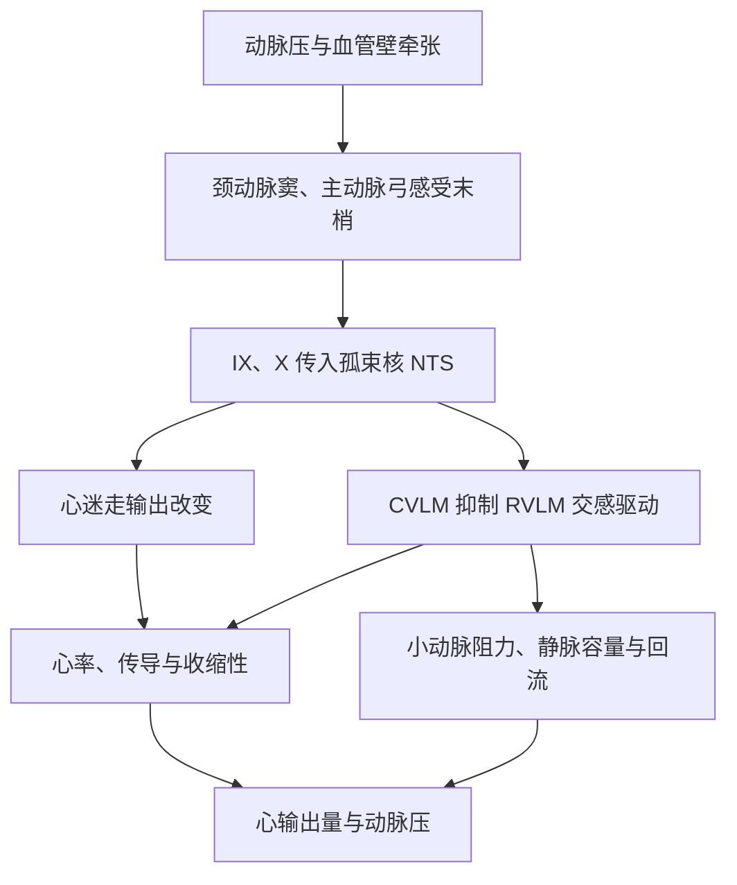

# 心血管活动调节

循环调节要同时解决两个并不等价的问题：维持足以推动全身血流的动脉压力，以及把有限的心输出量分配给当时最需要的器官。心脏、阻力血管、容量血管和肾脏分别改变心率、搏出量、血管阻力、静脉回流与细胞外液容量；神经反射、循环激素和组织局部信号又在不同时间尺度上叠加。因而，血压正常并不保证每个组织都得到合适灌流，某一器官血流增加也不必意味着全身动脉压同步升高。

## 心血管调节的对象与时间尺度 { #regulated-variables-and-timescales }

[血管生理](blood_vessel.md)已经给出近似关系 $MAP-P_{RA}\approx CO\times SVR$，[心脏泵血](blood_heart_pump.md)则说明 $CO=HR\times SV$。这些关系描述相互耦联的循环网络：小动脉收缩提高系统血管阻力，也会增加左心室后负荷；静脉收缩把容量血管中的血移向胸腔，可提高平均系统充盈压和回心血量；心率过快时舒张期缩短，搏出量未必保持不变。

| 主要时间尺度 | 代表性输入 | 主要效应器 | 最直接的作用 |
| --- | --- | --- | --- |
| 心搏至数秒 | 动脉壁牵张、心肺牵张、血气变化 | 迷走与交感传出 | 改变心率、传导、收缩性及动静脉张力 |
| 数秒至数分钟 | 局部代谢、肌源性反应、内皮信号 | 器官内阻力血管 | 使灌流与局部代谢需求和灌注压相匹配 |
| 数分钟至数小时 | 儿茶酚胺、血管紧张素 II、血管加压素、利钠肽 | 心血管与肾脏 | 调整阻力、泵血、钠水排泄和容量分布 |
| 数小时至更久 | 钠水摄入与排出、血管和心脏重塑 | 肾脏及组织结构 | 改变细胞外液容量和压力—排钠关系 |

压力感受反射、肾交感、肾素释放、局部代谢和中枢前馈通过协同与竞争形成完整响应。血管紧张素 II 可改变交感活动、血管反应性、口渴与肾小管转运；运动时中枢指令和肌肉感觉先行启动循环响应，活动肌的局部代谢舒张再覆盖部分交感缩血管作用。[^integrated-control]

## 心脏、阻力血管与容量血管的自主神经调节 { #autonomic-effectors }

### 心脏交感与迷走调节 { #cardiac-autonomic-control }

心交感节后纤维释放去甲肾上腺素，主要经 $\beta_1$ 受体提高窦房结起搏频率、加快房室传导，并增强心肌收缩和舒张。其细胞效应包括增加起搏细胞 cAMP 信号、促进 L 型 Ca$^{2+}$ 电流及肌浆网 Ca$^{2+}$ 循环；这些作用把[心脏电活动](blood_heart_electrical.md)与泵血能力联结起来。肾上腺髓质释放的循环肾上腺素和去甲肾上腺素可加强或延长这一响应，但不能把神经末梢释放与血中激素视作完全相同的信号。

迷走节后纤维在心内神经节附近释放乙酰胆碱，经 M$_2$ 受体降低 cAMP，并开放 G 蛋白门控 K$^+$ 通道。窦房结起搏减慢，房室结传导延迟；对心房收缩也有抑制，而对心室收缩性的直接影响通常弱于交感作用。两支自主输出可以相互拮抗，也可以同时增强或同时撤除；“交感兴奋就必然迷走抑制”不是普遍规则。左右侧心脏神经的投射存在偏向但高度重叠，不能硬分成“右侧只管心率、左侧只管收缩力”。[^cardiac-neural]

呼吸性窦性心律不齐表现为吸气期心率常加快、呼气期常减慢，主要反映心迷走输出随呼吸周期改变，也受到脑干呼吸—心血管耦联、压力感受反射和肺牵张输入共同塑造。心率变异性中的某些指标可估计窦房结所受的自主调节，但它们同时受呼吸频率、基础心率、年龄、运动和药物影响，不能简单读作一条“交感—迷走平衡尺”。[^respiratory-sinus-arrhythmia]

### 血管交感张力与全身血流分配 { #vascular-sympathetic-control }

多数小动脉和静脉接受持续的交感缩血管输入。节后纤维释放去甲肾上腺素，主要通过血管平滑肌 $\alpha_1$ 受体收缩；小动脉收缩提高局部阻力，静脉收缩减少未牵张容积并促进血液向中心转移。不同器官的神经支配密度和受体组成差异很大：皮肤、内脏和肾循环通常受到较强交感控制，脑和冠状循环则在很大程度上由局部代谢与内皮机制保护其供血。

$\beta_2$ 受体介导的舒张在骨骼肌等血管床较重要，生理条件下常由循环肾上腺素驱动。某些动物具有明确的交感胆碱能舒血管纤维，人类是否存在具有全身血流分配意义的同类通路仍缺乏一致证据。活动组织的代谢和内皮信号可产生功能性交感逸脱，使局部血流在全身交感活动升高时继续增加，同时保留一定交感约束。

## 延髓心血管整合网络 { #central-autonomic-network }

心血管反射的核心整合发生在分布式网络。孤束核（NTS）接受来自压力感受器、化学感受器和心肺传入的信号；NTS 兴奋尾侧腹外侧延髓（CVLM）神经元，后者以抑制性投射压低头端腹外侧延髓（RVLM）对脊髓交感节前神经元的驱动。NTS 还通过疑核等心迷走神经元改变心脏副交感输出。这个短回路解释了动脉压力升高为何能够同时降低交感活动并增强心迷走活动。[^baroreflex-network]

延髓回路还接受下丘脑、杏仁核、导水管周围灰质、岛叶及其他前脑区域的状态性调节；脊髓和心内神经网络也具有局部整合。运动、防御、进食、睡眠和潜水等状态由各具结构的整合模式实现。

## 动脉压力感受反射的快速缓冲 { #arterial-baroreflex }

颈动脉窦和主动脉弓壁内的感觉末梢感受血管壁形变，并不直接测量“血压数字”。同一压力下，血管顺应性改变会影响牵张和传入放电。颈动脉窦传入主要经舌咽神经进入 NTS，主动脉弓传入主要经迷走神经进入 NTS。压力升高使牵张和传入频率增加，继而抑制 RVLM—交感通路并增强心迷走活动；压力下降时则相反。[^baroreceptor-sensing]

从卧位站起时，重力使血液向下肢和腹部容量血管转移，中心静脉回流和搏出量短暂下降。压力感受器卸载后，心迷走输出迅速减少，交感输出上升，心率、收缩性、阻力血管和容量血管共同补偿。失血时也启动相似方向的反应；若血容量下降更深，还会显著招募血管加压素、肾素—血管紧张素系统和口渴等较慢机制。

压力感受反射最擅长在心搏至分钟尺度缓冲扰动。持续的压力改变会引起感受末梢和中枢通路的适应或重设，使反射围绕新的运行区间工作；这并不等于反射“完全失效”，也不意味着它单独决定慢性压力水平。长期稳态还必须使钠水摄入与肾脏排出重新相等。

## 化学感受与心肺传入的情境性反射 { #cardiopulmonary-reflexes }

颈动脉体和主动脉体的外周化学感受器响应动脉低氧，并受到 CO$_2$ 和 H$^+$ 影响。传入信号首先加强通气，也可提高交感血管活动。由于通气改变、肺牵张传入和压力感受反射会反过来影响循环，完整个体中的净心率和血压响应取决于是否能够自由呼吸、缺氧程度和原有压力，不能概括成固定的“化学感受器兴奋必然使心率升高或降低”。其呼吸侧机制将在[呼吸调节](../respiratory/regulation.md)展开。

心房、心室、肺血管和大静脉中的机械与化学敏感传入共同报告低压循环的充盈和心肺状态，但“心肺感受器”不是一种受体。静脉回流增加时，心房牵张可参与心率加快和容量排出；某些心室迷走传入强烈激活则可产生心动过缓、血管舒张和低血压。不同实验条件下命名的 Bainbridge 反射、Bezold–Jarisch 反射和容量反射，具有不同刺激与传入群，不能拼成一条方向恒定的统一回路。[^cardiopulmonary-receptors]

眼球压迫、内脏牵拉、疼痛和躯体感觉也可经脑干网络改变心率与血管张力。极重度脑灌注不足可引发强烈交感升压反应，但这是维持脑血流的后备反应，不是日常血压调节的主通路。这些反射应按刺激、传入、整合和效应器逐一分析。

## 血管—心脏—肾脏的体液反馈 { #humoral-control }

### RAS 的血管阻力与钠平衡调节 { #raas }

肾小球旁颗粒细胞在肾灌注压下降、致密斑 NaCl 递送减少或肾交感 $\beta_1$ 受体激活时增加肾素释放。肾素切割肝源性血管紧张素原形成血管紧张素 I，血管紧张素转化酶（ACE）在多处血管内皮和组织表面将其转成血管紧张素 II。ACE 在肺循环中丰富，但并非只存在于肺。[^raas-review]

血管紧张素 II 的经典作用主要经 AT$_1$ 受体实现：收缩阻力血管，促进肾上腺皮质释放醛固酮，增强肾小管 Na$^+$ 重吸收，并参与口渴、血管加压素释放和交感调节。醛固酮通过远端肾单位增加 Na$^+$ 保存，其容量和压力效应需要肾脏转运与摄入—排出平衡逐渐改变，不能与血管紧张素 II 的快速缩血管作用混为一谈。AT$_2$ 受体效应具有组织、发育阶段和病理状态依赖性，常可调节 AT$_1$ 轴，却不是在所有情境下都执行简单的反向动作。

ACE2 可把血管紧张素 II 转为血管紧张素-(1–7)，后者通过 Mas 受体参与一条常呈反调节性质的轴；其他肽段和组织内 RAS 还增加了网络复杂性。基础生理以“肾素—血管紧张素 II—AT$_1$—醛固酮”主轴及其重要反调节支路为中心，其他中间肽按具体机制展开。[^ace2-axis]

### 儿茶酚胺、血管加压素与利钠肽 { #circulating-hormones }

肾上腺髓质随交感节前活动释放肾上腺素和去甲肾上腺素。二者对 $\alpha$ 与 $\beta$ 受体的亲和和体内浓度不同，净效应还取决于剂量、血管床、原有张力和压力反射：肾上腺素可经心脏 $\beta_1$ 受体增加泵血，也可在某些血管床经 $\beta_2$ 受体舒张；浓度升高时 $\alpha$ 受体效应更加显著。不能据单一受体表断言某种儿茶酚胺必然使收缩压、舒张压和平均压按固定方向变化。

血管加压素（AVP）首先是渗透和水平衡激素。小幅血浆渗透压升高即可促进其释放，AVP 经集合管 V$_2$ 受体使水通道蛋白 AQP2 插入顶端膜、增加水重吸收。明显低血容量或低血压可更强地解除心肺和动脉传入对 AVP 神经元的抑制；较高 AVP 水平还可经血管 V$_{1a}$ 受体增加阻力。不同血管床反应并不完全一致，故不宜把 AVP 描述成任何状态下都占主导的“最强缩血管物质”。[^vasopressin]

心房牵张促进心房利钠肽（ANP）释放，心室压力或容量负荷可增加 B 型利钠肽（BNP）的合成与释放。两者通过 NPR-A—cGMP 信号促进排钠、影响肾血流和肾小管转运，并抑制 RAS 等保钠通路；它们还具有血管和心脏局部作用。BNP 的名称来自最初分离历史，而在人类循环调节中主要由心肌产生，不能因“脑钠肽”旧译而归作脑分泌激素。[^natriuretic-peptides]

## 内皮、激肽与血管旁分泌调节 { #endothelial-and-kinin-control }

内皮细胞感受剪切力、血液成分和邻近细胞信号。内皮型一氧化氮合酶（eNOS）产生的 NO 扩散至平滑肌，激活可溶性鸟苷酸环化酶并促进舒张；前列环素（PGI$_2$）和内皮依赖性超极化也可降低平滑肌张力。内皮素-1 多由内皮释放，经平滑肌 ETA 和部分 ETB 受体产生持久收缩；内皮 ETB 受体又能促进 NO、PGI$_2$ 释放并参与内皮素清除，所以“ETB 等于舒张、ETA 等于收缩”仍只是有用的第一近似。[^endothelial-mediators]

生理性止血中的血栓烷 A$_2$ 主要来自活化血小板；正常内皮则以 NO 和 PGI$_2$ 等信号维持抗栓与舒张背景。内皮素和血栓烷还参与止血与炎症；本页只讨论其血管张力接口，相关细胞互作见[生理性止血](blood_hemostasis.md)。

组织激肽释放酶从激肽原生成缓激肽等激肽，后者可通过内皮 B$_2$ 受体促进 NO 和前列腺素信号。ACE 同时是血管紧张素 I 转化酶和激肽酶 II，会快速灭活缓激肽；这使 RAS 与激肽系统在血管内皮表面发生交叉。ACE 沿血管树和器官呈异质分布，多种组织均可生成血管紧张素 II。[^kallikrein-kinin]

一氧化碳和硫化氢也可作为气体信号分子影响血管平滑肌、内皮和细胞氧化还原状态，但效应随浓度、供体、氧张力和血管床而变化。它们属于正在扩展的调节层，不宜在基础生理中用单一“扩血管”箭头或效力名次取代条件依赖的机制。

## 器官血流的局部代谢匹配 { #local-blood-flow-control }

自主调节是器官在一定灌注压范围内依靠局部机制维持相对稳定血流的能力，并不是全身神经反射。灌注压升高使阻力血管平滑肌被牵张，机械敏感通路、膜去极化和 Ca$^{2+}$ 内流可引起肌源性收缩；灌注压降低时则趋向舒张。肌源性反应对脑和肾等需要避免压力波动直接传入微循环的器官尤其重要，但有效范围和机制随器官而异。

组织活动增强时，O$_2$ 利用和代谢改变可通过 K$^+$、腺苷、CO$_2$、H$^+$、磷酸盐、乳酸、NO 和其他信号降低小动脉阻力，形成活动性充血。短暂阻断血流后，缺氧和代谢物积累以及肌源性舒张可使再灌注早期血流超过基线，称反应性充血。这些介质常相互冗余；列出一长串候选分子并不能证明每种组织都由同一种“代谢物”主导。[^local-flow-control]

内皮可把剪切力转成 NO 等信号，内皮细胞和平滑肌细胞之间的缝隙连接还能使电信号沿微血管传播，把毛细血管附近的需求传向上游小动脉。局部代谢、肌源性、流量介导和传导反应共同形成沿微血管网络传播的调节系统。器官特异的冠脉、脑、肾、骨骼肌和皮肤循环将在[器官循环](blood_organ.md)分别展开。

## 长期动脉压的肾脏钠水调节 { #long-term-pressure-control }

长期状态要求 Na$^+$ 和水的排出最终与摄入相等。肾灌注压升高通常促进排钠和排水，称压力性排钠和压力性利尿；细胞外液与有效循环容量随之下降，静脉回流和心输出量受到限制。压力下降时，肾交感活动、RAS、醛固酮和 AVP 等通路倾向于保存 Na$^+$ 和水，利钠肽则在容量扩张时提供反向输入。

压力性排钠不是“血压升高必使肾小球滤过率同比升高”。肾血流量和滤过率本身受到自身调节，压力变化还能通过肾髓质血流、肾间质静水压、旁分泌信号和分段小管转运改变 Na$^+$ 重吸收。神经和激素输入可移动压力—排钠关系，使相同动脉压下的钠排出发生变化。[^pressure-natriuresis]

快速神经反射负责秒级保护灌流，肾—体液控制则在较长时间内重建钠水平衡。站立时秒级反射先防止脑灌注骤降；持续改变盐摄入或细胞外液容量时，肾脏再重建收支平衡。慢性高血压和休克中的重设、失代偿与治疗属于病理生理问题，将在[病理生理学总论](../pathophysiology/index.md)和[休克、灌注障碍与多器官功能障碍](../pathophysiology/shock_organ_failure.md)中讨论。

## 整合状态下的压力与灌流优先级 { #integrated-states }

运动开始时，运动皮层相关的中枢指令和肌肉传入产生前馈，自主输出使心率、收缩性和静脉回流上升；活动肌局部舒张显著降低该血管床阻力。若只有局部舒张而无心输出量和其他血管床的协调，平均动脉压可能下降。运动中的压力感受反射围绕改变后的运行区间继续缓冲压力波动。心率、搏出量与温度、训练状态和负荷之间是条件性关系，详见[运动与环境生理](../exercise_environment.md)；单一温度或心率阈值无法概括个体、负荷与环境差异。

体温调节可要求皮肤血管扩张以散热，却会减少中心容量；失血时机体又优先收缩皮肤、内脏和肾血管以保存心脑灌流。潜水反应常把心动过缓与外周血管收缩组合起来，防御反应则可同时提高心输出量并重排骨骼肌、内脏和皮肤血流。生理调节依据当前需要保护的变量和器官，形成条件化的心脏与血管效应组合。

## 参考资料与延伸阅读 { #references }

- Suarez-Roca H, Mamoun N, Sigurdson MI, Maixner W. [Baroreceptor Modulation of the Cardiovascular System, Pain, Consciousness, and Cognition](https://pmc.ncbi.nlm.nih.gov/articles/PMC8480547/). *Comprehensive Physiology*. 2021;11:1373–1423.
- Herring N, Kalla M, Paterson DJ. [Neural Regulation of Cardiac Rhythm](https://www.ncbi.nlm.nih.gov/books/NBK597441/). In: *Cardiovascular Signaling in Health and Disease*. Springer, 2022.
- Clifford PS. [Local control of blood flow](https://doi.org/10.1152/advan.00074.2010). *Advances in Physiology Education*. 2011;35:5–15.
- Sarelius I, Pohl U. [Local control of blood flow during active hyperaemia: what kinds of integration are important?](https://pmc.ncbi.nlm.nih.gov/articles/PMC4626542/). *The Journal of Physiology*. 2015;593:4699–4711.
- Fountain JH, Kaur J, Lappin SL. [Physiology, Renin Angiotensin System](https://www.ncbi.nlm.nih.gov/books/NBK470410/). *StatPearls*. 2023.
- Rein J, Bader M. [The renin angiotensin aldosterone system](https://pmc.ncbi.nlm.nih.gov/articles/PMC11033231/). *Nature Reviews Nephrology*. 2024;20:363–374.
- Ivy JR, Bailey MA. [Pressure natriuresis and the renal control of arterial blood pressure](https://pmc.ncbi.nlm.nih.gov/articles/PMC4198007/). *The Journal of Physiology*. 2014;592:3955–3967.
- Szczepanska-Sadowska E, et al. [Vasopressin and oxytocin in control of the cardiovascular system](https://pmc.ncbi.nlm.nih.gov/articles/PMC7327933/). *Current Neuropharmacology*. 2020;18:14–41.
- Nakagawa Y, Nishikimi T, Kuwahara K. [The natriuretic peptide system](https://pmc.ncbi.nlm.nih.gov/articles/PMC10253422/). *International Journal of Molecular Sciences*. 2023;24:8702.
- Alhenc-Gelas F, et al. [Kallikrein/K1, kinins, and ACE/kininase II in homeostasis and disease](https://pmc.ncbi.nlm.nih.gov/articles/PMC6610447/). *Frontiers in Medicine*. 2019;6:136.
- Hall JE, Hall ME. [Guyton and Hall Textbook of Medical Physiology, 15th ed.](https://evolve.elsevier.com/cs/product/9780443111013?role=student). Elsevier, 2025.
- Boron WF, Boulpaep EL. [Medical Physiology, 3rd ed.](https://evolve.elsevier.com/cs/product/9781455743773?role=faculty). Elsevier, 2016.

[^integrated-control]: 不同时间尺度和效应器的整合框架交叉核对 Hall 与 Hall《医学生理学》、Boron 与 Boulpaep《医学生理学》及 Suarez-Roca 等的[压力感受调节综述](https://pmc.ncbi.nlm.nih.gov/articles/PMC8480547/)。
[^cardiac-neural]: 心脏自主神经的递质、受体、层级网络及心房—心室效应差异参见 NCBI Bookshelf 的[心律神经调节章节](https://www.ncbi.nlm.nih.gov/books/NBK597441/)。
[^respiratory-sinus-arrhythmia]: 呼吸性窦性心律不齐和心率变异性解释边界参见 Shaffer 与 Ginsberg 的[指标综述](https://pmc.ncbi.nlm.nih.gov/articles/PMC5624990/)及 NCBI Bookshelf 的[自主神经临床评估](https://pmc.ncbi.nlm.nih.gov/articles/PMC11292036/)。
[^baroreflex-network]: NTS—CVLM—RVLM 与心迷走通路参见 Suarez-Roca 等的[综述](https://pmc.ncbi.nlm.nih.gov/articles/PMC8480547/)；图为依据该回路自绘的功能示意。
[^baroreceptor-sensing]: 压力感受末梢的牵张编码、传入路径、动态范围和重设参见 Suarez-Roca 等的[综述](https://pmc.ncbi.nlm.nih.gov/articles/PMC8480547/)及 NCBI Bookshelf 的[压力感受器章节](https://www.ncbi.nlm.nih.gov/books/NBK538172/)。
[^cardiopulmonary-receptors]: 高压动脉感受器与低压心肺感受器的异质性参见 Suarez-Roca 等的[综述](https://pmc.ncbi.nlm.nih.gov/articles/PMC8480547/)和 Hainsworth 的[心肺感受器综述](https://pubmed.ncbi.nlm.nih.gov/24058186/)。
[^raas-review]: RAS 的触发、蛋白水解级联、受体及组织系统参见 Rein 与 Bader 的[综述](https://pmc.ncbi.nlm.nih.gov/articles/PMC11033231/)和 NCBI Bookshelf 的[RAS 生理章节](https://www.ncbi.nlm.nih.gov/books/NBK470410/)。
[^ace2-axis]: ACE2—血管紧张素-(1–7)—Mas 轴及其条件依赖的反调节作用参见 Santos 等的[综述](https://pmc.ncbi.nlm.nih.gov/articles/PMC7203574/)。
[^vasopressin]: AVP 的渗透、容量输入以及 V$_2$、V$_{1a}$ 受体作用参见 Szczepanska-Sadowska 等的[综述](https://pmc.ncbi.nlm.nih.gov/articles/PMC7327933/)。
[^natriuretic-peptides]: ANP、BNP 的来源、受体与容量稳态效应参见 Nakagawa 等的[综述](https://pmc.ncbi.nlm.nih.gov/articles/PMC10253422/)和 Daniels 与 Maisel 的[综述](https://pmc.ncbi.nlm.nih.gov/articles/PMC3037138/)。
[^endothelial-mediators]: 内皮 NO、PGI$_2$、内皮依赖性超极化及内皮素受体的血管床依赖效应参见[血管张力调节综述](https://pmc.ncbi.nlm.nih.gov/articles/PMC3040999/)和[内皮素-1 综述](https://pmc.ncbi.nlm.nih.gov/articles/PMC3693979/)。
[^kallikrein-kinin]: 组织激肽释放酶、激肽与 ACE／激肽酶 II 的交叉参见 Alhenc-Gelas 等的[综述](https://pmc.ncbi.nlm.nih.gov/articles/PMC6610447/)。
[^local-flow-control]: 肌源性、代谢性、流量介导和传导反应参见 Clifford 的[教学综述](https://doi.org/10.1152/advan.00074.2010)、Sarelius 与 Pohl 的[活动性充血综述](https://pmc.ncbi.nlm.nih.gov/articles/PMC4626542/)及 Segal 的[微循环调节综述](https://pubmed.ncbi.nlm.nih.gov/15804972/)。
[^pressure-natriuresis]: 压力性排钠的长期反馈、肾髓质血流、肾间质压和小管机制参见 Ivy 与 Bailey 的[综述](https://pmc.ncbi.nlm.nih.gov/articles/PMC4198007/)。
