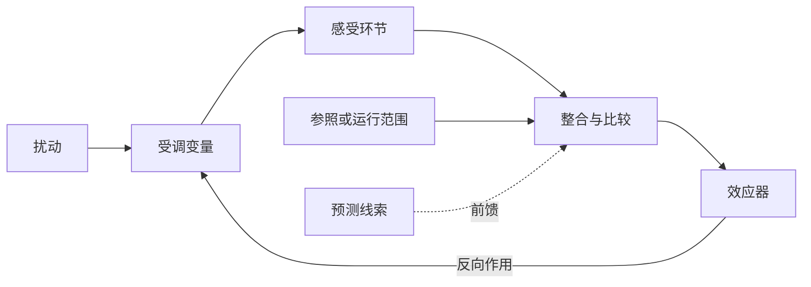

# 内环境与稳态

动物不断与外界交换物质和能量，却不能让每一次进食、运动或环境温度变化都原样传到细胞。多细胞动物在外界与细胞之间设置了上皮、体液和循环等层层界面：消化道和肺把物质带到机体边界，血液把它们分配到组织，组织间液再成为多数细胞真正接触的介质。所谓稳态，不是把这些流动停下来，而是在持续通量中把若干关键变量维持在可工作的范围内。这个组织原则把循环、呼吸、泌尿、内分泌和神经调节连成了一个整体。[^homeostasis-history]

## 内环境是细胞直接接触的体液环境 { #internal-environment }

### 体液区室由屏障界定 { #fluid-compartments }

细胞膜把细胞内液与细胞外液分开；毛细血管内皮又把细胞外液分成血浆和组织间液。血浆在血管内承担长距离运输，组织间液填充细胞之间的空间，两者经毛细血管壁交换水和小分子。进入淋巴毛细管的组织间液成为淋巴，随后回到静脉循环。脑脊液、眼内液和关节滑液等位于特化腔隙，常归入特化的细胞外液，但它们与血浆之间隔着性质各异的屏障，组成和更新速度也不相同。[^body-fluid-compartments]

“内环境”因此不是“身体里的全部液体”。消化道腔、呼吸道腔与外界相通，腔内容物仍位于上皮屏障的外侧；肾小管液由血浆滤出后，其成分沿肾单位不断改变，最终排出的尿液也不再是细胞赖以生存的内环境。这个拓扑边界比“液体是否位于体表以内”更有解释力：只有跨过上皮或血管屏障，物质才进入相应体液区室并参与全身分配。

体液占体重的比例以及细胞内、外液的分配会随年龄、性别、脂肪与肌肉比例和生理状态改变。教材中的近似比例适合建立量级感，却不应当作每个人都满足的固定常数。更稳定的区别来自溶质分布：细胞外液以 Na$^+$、Cl$^-$ 和 HCO$_3^-$ 为主要渗透活性离子，细胞内液则富含 K$^+$、磷酸盐和带负电的大分子；这些不对称分布由选择性通透、主动转运和细胞代谢共同维持。[跨膜转运与渗透](membrane_dynamics.md)将进一步讨论这些通量的驱动力。

### 循环、交换与清除使内环境持续更新 { #exchange-and-clearance }

内环境并不是一池静止的液体。氧从肺泡进入血液，再从血浆进入组织间液和细胞；营养物经肠上皮吸收后由门静脉和全身循环分配；细胞产生的二氧化碳、含氮废物和热量则沿相反方向被转运、转化或排出。毛细血管交换和淋巴回流连接血浆与组织间液，肝、肾、肺和皮肤不断改变其组成。任一器官都只完成这条通量链的一部分，[血液与循环生理总论](blood/index.md)、[呼吸生理总论与肺通气](respiratory/index.md)和[泌尿生理总论](urinary/index.md)将分别展开运输、气体交换和排泄的系统机制。

## 稳态是有通量的动态稳定 { #dynamic-homeostasis }

生理学中的稳态是受调变量在扰动下保持相对稳定的状态，不是热力学平衡，也不是数值完全不变。处于平衡的系统没有推动净变化的自由能梯度，而活细胞需要持续消耗能量来维持离子梯度、合成与降解物质、更新组织并向外界散热。水、离子和代谢物可以快速周转，只要输入、区室间交换和输出经过协调，其浓度或总量仍可在一定范围内波动。[^homeostatic-control]

### 运行范围比单一设定点更接近真实生理 { #operating-range }

“设定点”便于描述恒温器式的简单控制，但许多生理变量没有唯一且不变的目标值。体温具有昼夜节律，动脉压会随睡眠、站立和运动改变，通气也会随代谢需求上升。此时更适合谈一个随时间和情境变化的运行范围，以及系统对偏离这一范围的响应。临床参考区间还取决于采样条件、人群、测量方法和概率定义，不能把一张正常值表当作稳态机制本身。

一个变量表现得稳定，也不等于机体直接感受并控制了它。系统可能控制与它相关的另一变量，或同时受到多个过程的约束。例如动脉血压取决于心输出量和外周阻力，但压力感受反射直接获得的是血管壁牵张所产生的传入信号。分析稳态时，需要明确区分被观察的数值、真正的受调对象和感受器能够取得的信号。

## 信号路线与控制逻辑属于不同层次 { #regulatory-routes }

神经调节、体液调节和局部调节描述的是信息如何传递。神经信号通常沿特定通路快速到达效应器；激素和其他循环因子可把多个器官组织成较慢而持久的响应；组织代谢物、内皮介质和细胞间信号则可在局部匹配供给与需求。三条路线会彼此嵌套：交感神经可以促使肾上腺髓质释放儿茶酚胺，循环激素又能改变神经元和局部血管的反应性。所谓“自身调节”指器官在局部条件改变时调整功能，并不意味着它与神经和激素信号绝缘。

反馈、前馈和层级控制描述的则是信号在控制回路中的作用方式。同一条神经或激素通路可以参与负反馈，也可以参与正反馈或前馈；不能由信号载体直接推断控制逻辑。

## 负反馈降低扰动造成的偏差 { #negative-feedback }

负反馈回路至少包含受调变量、感受环节、整合环节和效应器。扰动先改变受调变量，感受器把变化转成信号，整合环节依据当前状态和参照范围组织输出，效应器再产生与原偏移方向相反的作用。真实生理系统中的这些功能不一定分别位于单一器官：多个感受器可以并行工作，中枢、内分泌轴和局部组织也可以分层整合。[^homeostatic-control]

反馈不是在扰动发生后把变量精确重置为原值的万能装置。要让感受器产生响应，受调变量往往必须先出现一定偏移；效应器能力有限，信号传递也存在延迟。回路增益越高，残余偏差通常越小，但增益、延迟和相互作用不合适时也可能发生振荡。机体因而常把快而容量有限的响应与慢而持久的响应叠加：动脉压可先通过压力感受反射改变心脏和血管活动，再通过肾脏调节钠水排泄影响长期血容量；体温则同时依靠血流、行为和产热改变。

| 受调对象 | 较快的响应 | 较慢或持久的响应 |
| --- | --- | --- |
| 动脉压与组织灌流 | 压力感受反射、心率和血管张力改变 | 肾脏钠水平衡、血容量与血管结构变化 |
| 体液渗透与容量 | 口渴、抗利尿激素和血管反应 | 肾小管转运、激素轴及摄入行为调整 |
| 二氧化碳与酸碱状态 | 通气变化、细胞与血液缓冲 | 肾脏排酸和 HCO$_3^-$ 调节 |
| 体温 | 皮肤血流、出汗、寒战和行为 | 代谢与内分泌适应、组织重塑 |
| 循环底物 | 胰岛激素与自主神经反应 | 肝、脂肪和肌肉的酶量及储备改变 |

这些例子强调的是时间尺度的重叠，而不是把每个变量交给一条唯一回路。一个效应器还可能同时影响多个目标：肾脏保钠有助于维持有效循环容量，却可能增加渗透负荷；皮肤血管扩张促进散热，却可能降低回心血量。稳态调节必须在相互竞争的需求之间折中。

## 正反馈推动有终点的状态转换 { #positive-feedback }

正反馈使初始变化进一步增强，适合把系统从一个状态迅速推向另一个状态。动作电位上升支中，膜去极化开放电压门控 Na$^+$ 通道，Na$^+$ 内流又造成更强的去极化；止血过程中，已被激活的血小板和凝血因子促进更多组分参与；分娩时，宫颈牵张与催产素释放也可相互加强。这些过程并非因为“正反馈有害”而例外存在，它们依靠通道失活、底物耗竭、空间边界、抑制系统或事件结束来终止。若放大过程缺少制动，正反馈才会成为失稳因素。[^homeostatic-control]

正反馈通常不是某个变量长期稳定的主要控制方式，却可以嵌套在更大的稳态系统中。凝血的局部放大服务于血管完整性，动作电位的快速再生服务于远距离信号传导；稳定来自正反馈模块的边界和外围负反馈，而不是要求每个局部反应都采取负反馈。

## 前馈在变量偏移前预先调节 { #feedforward }

前馈控制利用预测线索，在受调变量明显改变前启动效应器。看到或闻到食物可引发头期消化反应，开始运动时来自大脑运动指令和本体感觉的信息可迅速提高通气与循环活动，环境变冷时行为性避寒也可先于核心体温显著下降。前馈减少了等待误差信号所需的时间，因此特别适合变化迅速或反馈延迟较长的过程。[^anticipatory-regulation]

预测也可能不准确。若食物线索后并未摄食，或预期的运动强度与实际负荷不同，前馈响应就会过度或不足，仍需反馈根据真实变量重新校准。随意运动同样不是简单的“开环控制”：运动指令具有前馈成分，视觉、前庭和本体感觉反馈则持续修正姿势与动作。其神经环路将在[运动调控](../neuro/neuro_movement.md)中展开。

## 多层级调节在不同目标之间折中 { #hierarchical-regulation }

整只动物的稳态由不同空间和时间尺度的回路共同产生。细胞内的酶和转运体在秒级改变通量，局部组织按代谢需要调节灌流，神经反射协调多个器官，内分泌和肾脏机制在小时至更长时间尺度上改变储备与结构。较高层级还可以主动移动运行范围：运动时提高心输出量和通气不是稳态失败，而是为了维持活动肌的氧供、二氧化碳清除和温度平衡。

“异稳态”或 allostasis 常用来强调机体通过改变调节状态、预测需求和重新分配资源来取得稳定，但这个术语在不同文献中并不总是指同一套机制。它不必与稳态对立；更稳妥的理解是，稳态描述需要维持的生理关系，预测性和情境依赖的调节说明机体如何在变化环境中实现这些关系。[^allostasis]

当扰动超过效应器储备，感受或整合环节失真，或者一个目标的补偿持续损害另一个目标时，稳态便可能失代偿。疾病因此不能只定义为某个化验值越界：同一数值偏移可能是原发损伤，也可能是仍在发挥作用的代偿；判断机制还需追踪通量、时间进程和器官间关系。水盐、酸碱、缺氧、发热和应激中的失代偿将在[病理生理学](pathophysiology/index.md)各页继续讨论。

## 参考资料与延伸阅读 { #references }

- Billman GE. [Homeostasis: The Underappreciated and Far Too Often Ignored Central Organizing Principle of Physiology](https://www.frontiersin.org/journals/physiology/articles/10.3389/fphys.2020.00200/full). *Frontiers in Physiology*. 2020;11:200.
- Goldstein DS. [How does homeostasis happen? Integrative physiological, systems biological, and evolutionary perspectives](https://journals.physiology.org/doi/full/10.1152/ajpregu.00396.2018). *American Journal of Physiology-Regulatory, Integrative and Comparative Physiology*. 2019;316:R301–R317.
- Ramsay DS, Woods SC. [Clarifying the Roles of Homeostasis and Allostasis in Physiological Regulation](https://pmc.ncbi.nlm.nih.gov/articles/PMC4166604/). *Psychological Review*. 2014;121:225–247.
- OpenStax. [Homeostasis](https://openstax.org/books/anatomy-and-physiology-2e/pages/1-5-homeostasis)；[Body Fluids and Fluid Compartments](https://openstax.org/books/anatomy-and-physiology-2e/pages/26-1-body-fluids-and-fluid-compartments). *Anatomy and Physiology 2e*.
- Hall JE, Hall ME. [Guyton and Hall Textbook of Medical Physiology, 15th ed.](https://evolve.elsevier.com/cs/product/9780443111013?role=student). Elsevier, 2025.
- Boron WF, Boulpaep EL. [Medical Physiology, 3rd ed.](https://evolve.elsevier.com/cs/product/9781455743773?role=faculty). Elsevier, 2016.

[^homeostasis-history]: Bernard 以 *milieu intérieur* 强调细胞所处体内环境的稳定，Cannon 后来推广 homeostasis 一词；这里采用的历史与动态稳定表述参见 Billman 的[生理学综述](https://doi.org/10.3389/fphys.2020.00200)。
[^body-fluid-compartments]: 体液区室与比例的近似范围交叉核对 [OpenStax 体液章节](https://openstax.org/books/anatomy-and-physiology-2e/pages/26-1-body-fluids-and-fluid-compartments)及 NCBI Bookshelf 的 [Physiology, Water Balance](https://www.ncbi.nlm.nih.gov/books/NBK541059/)。
[^homeostatic-control]: 动态范围、反馈组成和正反馈终止条件参见 [Billman 2020](https://doi.org/10.3389/fphys.2020.00200)与 [OpenStax 稳态章节](https://openstax.org/books/anatomy-and-physiology-2e/pages/1-5-homeostasis)。
[^anticipatory-regulation]: 前馈与多层级调节参见 Goldstein 的[综合综述](https://doi.org/10.1152/ajpregu.00396.2018)及 [Billman 2020](https://doi.org/10.3389/fphys.2020.00200)。
[^allostasis]: “异稳态”概念的多种用法及其与稳态的关系参见 Ramsay 与 Woods 的[概念辨析](https://doi.org/10.1037/a0035942)。
