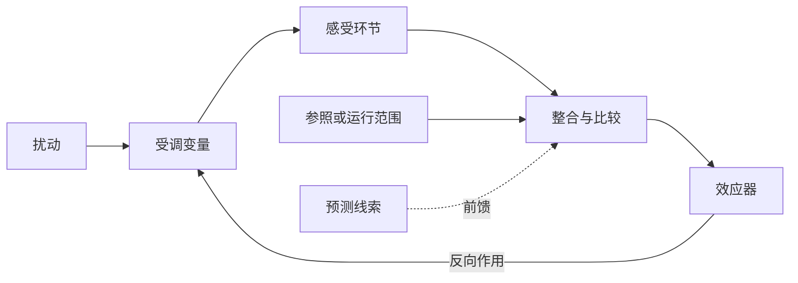

# 内环境与稳态

动物不断与外界交换物质和能量，多细胞动物借助上皮、体液和循环等层层界面缓冲外界变化：消化道和肺把物质带到机体边界，血液把它们分配到组织，组织间液再成为多数细胞真正接触的介质。稳态（homeostasis）是在持续通量中把若干关键变量维持于可工作的范围。这个组织原则把循环、呼吸、泌尿、内分泌和神经调节连成了一个整体。[^homeostasis-history]

## 内环境的体液组成 { #internal-environment }

### 体液区室的屏障 { #fluid-compartments }

细胞膜把细胞内液与细胞外液分开；毛细血管内皮又把细胞外液分成血浆和组织间液。血浆在血管内承担长距离运输，组织间液填充细胞之间的空间，两者经毛细血管壁交换水和小分子。进入淋巴毛细管的组织间液成为淋巴，随后回到静脉循环。脑脊液、眼内液和关节滑液等位于特化腔隙，常归入特化的细胞外液，但它们与血浆之间隔着性质各异的屏障，组成和更新速度也不相同。[^body-fluid-compartments]

“内环境”按细胞直接接触的体液区室定义。消化道腔、呼吸道腔与外界相通，腔内容物位于上皮屏障的外侧；肾小管液由血浆滤出后，其成分沿肾单位不断改变，最终形成待排出的尿液。这个拓扑边界比“液体是否位于体表以内”更有解释力：物质跨过上皮或血管屏障后，才进入相应体液区室并参与全身分配。

体液占体重的比例以及细胞内、外液的分配会随年龄、性别、脂肪与肌肉比例和生理状态改变，教材中的近似比例用于建立量级感。区室间更稳定的区别来自溶质分布：细胞外液以 Na$^+$、Cl$^-$ 和 HCO$_3^-$ 为主要渗透活性离子，细胞内液则富含 K$^+$、磷酸盐和带负电的大分子；这些不对称分布由选择性通透、主动转运和细胞代谢共同维持。相应通量的驱动力见[跨膜转运与渗透](membrane_dynamics.md)。

### 体液区室的循环、交换与清除 { #exchange-and-clearance }

内环境处于持续更新之中。氧从肺泡进入血液，再从血浆进入组织间液和细胞；营养物经肠上皮吸收后由门静脉和全身循环分配；细胞产生的二氧化碳、含氮废物和热量则沿相反方向被转运、转化或排出。毛细血管交换和淋巴回流连接血浆与组织间液，肝、肾、肺和皮肤不断改变其组成。完整的运输、气体交换和排泄机制分别见[血液与循环生理总论](blood/index.md)、[呼吸生理总论与肺通气](respiratory/index.md)和[泌尿生理总论](urinary/index.md)。

## 稳态中的动态通量 { #dynamic-homeostasis }

生理学中的稳态是受调变量在扰动下保持相对稳定的动态状态，与热力学平衡和数值恒定具有不同含义。处于平衡的系统没有推动净变化的自由能梯度，而活细胞需要持续消耗能量来维持离子梯度、合成与降解物质、更新组织并向外界散热。水、离子和代谢物可以快速周转；输入、区室间交换和输出经过协调时，其浓度或总量便在一定范围内波动。[^homeostatic-control]

### 设定点与运行范围 { #operating-range }

“设定点”便于描述恒温器式的简单控制，许多生理变量则具有随时间和情境变化的运行范围。体温具有昼夜节律，动脉压会随睡眠、站立和运动改变，通气也会随代谢需求上升。临床参考区间取决于采样条件、人群、测量方法和概率定义；稳态机制还需说明感受、整合和效应通路怎样产生相应分布。

一个变量表现稳定，可以来自直接控制，也可以来自相关变量的控制或多个过程的共同约束。例如动脉血压取决于心输出量和外周阻力，压力感受反射直接获得的则是血管壁牵张所产生的传入信号。分析稳态时，需要明确区分被观察的数值、真正的受调对象和感受器能够取得的信号。

## 信号路线与控制逻辑 { #regulatory-routes }

神经调节、体液调节和局部调节描述的是信息如何传递。神经信号通常沿特定通路快速到达效应器；激素和其他循环因子可把多个器官组织成较慢而持久的响应；组织代谢物、内皮介质和细胞间信号则可在局部匹配供给与需求。三条路线会彼此嵌套：交感神经可以促使肾上腺髓质释放儿茶酚胺，循环激素又能改变神经元和局部血管的反应性。“自身调节”强调器官对局部条件的响应，同时仍可与神经和激素信号叠加。

反馈、前馈和层级控制描述的是信号在控制回路中的作用方式。同一条神经或激素通路可以参与负反馈、正反馈或前馈，控制逻辑由信号在回路中的连接关系决定。

## 负反馈调节 { #negative-feedback }

负反馈回路至少包含受调变量、感受环节、整合环节和效应器。扰动先改变受调变量，感受器把变化转成信号，整合环节依据当前状态和参照范围组织输出，效应器再产生与原偏移方向相反的作用。真实生理系统中的这些功能不一定分别位于单一器官：多个感受器可以并行工作，中枢、内分泌轴和局部组织也可以分层整合。[^homeostatic-control]

反馈在扰动后减小变量偏移，其效果受感受阈值、效应器容量和信号延迟限制。回路增益越高，残余偏差通常越小，但增益、延迟和相互作用不合适时也可能发生振荡。机体因而常把快而容量有限的响应与慢而持久的响应叠加：动脉压可先通过压力感受反射改变心脏和血管活动，再通过肾脏调节钠水排泄影响长期血容量；体温则同时依靠血流、行为和产热改变。

| 受调对象 | 较快的响应 | 较慢或持久的响应 |
| --- | --- | --- |
| 动脉压与组织灌流 | 压力感受反射、心率和血管张力改变 | 肾脏钠水平衡、血容量与血管结构变化 |
| 体液渗透与容量 | 口渴、精氨酸加压素（arginine vasopressin，AVP，又称抗利尿激素）和血管反应 | 肾小管转运、激素轴及摄入行为调整 |
| 二氧化碳与酸碱状态 | 通气变化、细胞与血液缓冲 | 肾脏排酸和 HCO$_3^-$ 调节 |
| 体温 | 皮肤血流、出汗、寒战和行为 | 代谢与内分泌适应、组织重塑 |
| 循环底物 | 胰岛激素与自主神经反应 | 肝、脂肪和肌肉的酶量及储备改变 |

这些例子展示了时间尺度重叠和多回路共同调节。一个效应器还可能同时影响多个目标：肾脏保钠可在容量不足时支持细胞外液容量和循环灌注，但心脏泵血功能受限或静脉压力升高时，持续保钠会加重淤血和水肿；皮肤血管扩张促进散热，却可能降低回心血量。稳态调节必须在相互竞争的需求之间折中。[^sodium-volume-tradeoff]

## 正反馈与状态转换 { #positive-feedback }

正反馈使初始变化进一步增强，适合把系统从一个状态迅速推向另一个状态。动作电位上升支中，膜去极化开放电压门控 Na$^+$ 通道，Na$^+$ 内流又造成更强的去极化；止血过程中，已被激活的血小板和凝血因子促进更多组分参与；分娩时，宫颈牵张与催产素释放也可相互加强。这些过程依靠通道失活、底物耗竭、空间边界、抑制系统或事件结束来终止；放大过程缺少制动时，正反馈会成为失稳因素。[^homeostatic-control]

正反馈主要驱动有终点的状态转换，也可以嵌套在更大的稳态系统中。凝血的局部放大服务于血管完整性，动作电位的快速再生服务于远距离信号传导；模块边界和外围负反馈使这些局部放大与整体稳定相容。

## 前馈调节 { #feedforward }

前馈控制利用预测线索，在受调变量明显改变前启动效应器。看到或闻到食物可引发头期消化反应，开始运动时来自大脑运动指令和本体感觉的信息可迅速提高通气与循环活动，环境变冷时行为性避寒也可先于核心体温显著下降。前馈减少了等待误差信号所需的时间，因此特别适合变化迅速或反馈延迟较长的过程。[^anticipatory-regulation]

预测与实际输入存在偏差时，前馈响应可能过度或不足，反馈会依据真实变量重新校准。随意运动同时包含前馈和反馈：运动指令提前动员相关系统，视觉、前庭和本体感觉则持续修正姿势与动作。具体神经环路见[运动调控](../neuro/neuro_movement.md)。

## 多层级调节与目标权衡 { #hierarchical-regulation }

整只动物的稳态由不同空间和时间尺度的回路共同产生。细胞内的酶和转运体在秒级改变通量，局部组织按代谢需要调节灌流，神经反射协调多个器官，内分泌和肾脏机制在小时至更长时间尺度上改变储备与结构。较高层级还可以主动移动运行范围；运动时提高心输出量和通气，正是为了维持活动肌的氧供、二氧化碳清除和温度平衡。

异稳态（allostasis）常用来强调机体通过改变调节状态、预测需求和重新分配资源来取得稳定，但这个术语在不同文献中指涉的机制范围并不完全一致。稳态描述需要维持的生理关系，预测性和情境依赖的调节则说明机体如何在变化环境中实现这些关系，两种表述可以互补。[^allostasis]

当扰动超过效应器储备，感受或整合环节失真，或者一个目标的补偿持续损害另一个目标时，稳态便可能失代偿。同一化验值偏移既可能来自原发损伤，也可能反映仍在发挥作用的代偿；疾病机制的判断还需追踪通量、时间进程和器官间关系。水盐、酸碱、缺氧、发热和应激中的失代偿见[病理生理学](pathophysiology/index.md)各页。

## 参考资料与延伸阅读 { #references }

- Billman GE. [Homeostasis: The Underappreciated and Far Too Often Ignored Central Organizing Principle of Physiology](https://www.frontiersin.org/journals/physiology/articles/10.3389/fphys.2020.00200/full). *Frontiers in Physiology*. 2020;11:200.
- Goldstein DS. [How does homeostasis happen? Integrative physiological, systems biological, and evolutionary perspectives](https://journals.physiology.org/doi/full/10.1152/ajpregu.00396.2018). *American Journal of Physiology-Regulatory, Integrative and Comparative Physiology*. 2019;316:R301–R317.
- Ramsay DS, Woods SC. [Clarifying the Roles of Homeostasis and Allostasis in Physiological Regulation](https://pmc.ncbi.nlm.nih.gov/articles/PMC4166604/). *Psychological Review*. 2014;121:225–247.
- Schrier RW. [Decreased effective blood volume in edematous disorders: what does this mean?](https://pubmed.ncbi.nlm.nih.gov/17568020/). *Journal of the American Society of Nephrology*. 2007;18:2028–2031.
- OpenStax. [Homeostasis](https://openstax.org/books/anatomy-and-physiology-2e/pages/1-5-homeostasis)；[Body Fluids and Fluid Compartments](https://openstax.org/books/anatomy-and-physiology-2e/pages/26-1-body-fluids-and-fluid-compartments). *Anatomy and Physiology 2e*.
- Hall JE, Hall ME. [Guyton and Hall Textbook of Medical Physiology, 15th ed.](https://evolve.elsevier.com/cs/product/9780443111013?role=student). Elsevier, 2025.
- Boron WF, Boulpaep EL. [Medical Physiology, 3rd ed.](https://evolve.elsevier.com/cs/product/9781455743773?role=faculty). Elsevier, 2016.

[^homeostasis-history]: Bernard 以 *milieu intérieur* 强调细胞所处体内环境的稳定，Cannon 后来推广 homeostasis 一词；这里采用的历史与动态稳定表述参见 Billman 的[生理学综述](https://doi.org/10.3389/fphys.2020.00200)。
[^body-fluid-compartments]: 体液区室与比例的近似范围交叉核对 [OpenStax 体液章节](https://openstax.org/books/anatomy-and-physiology-2e/pages/26-1-body-fluids-and-fluid-compartments)及 NCBI Bookshelf 的 [Physiology, Water Balance](https://www.ncbi.nlm.nih.gov/books/NBK541059/)。
[^homeostatic-control]: 动态范围、反馈组成和正反馈终止条件参见 [Billman 2020](https://doi.org/10.3389/fphys.2020.00200)与 [OpenStax 稳态章节](https://openstax.org/books/anatomy-and-physiology-2e/pages/1-5-homeostasis)。
[^sodium-volume-tradeoff]: Na$^+$ 总量、细胞外液容量、有效动脉充盈与水肿之间的关系，参见 Schrier 的[水肿性疾病有效血容量综述](https://pubmed.ncbi.nlm.nih.gov/17568020/)；血 Na$^+$ 浓度与体内 Na$^+$ 总量的区别见[水与电解质代谢紊乱](pathophysiology/water_electrolyte.md#three-axis-framework)。
[^anticipatory-regulation]: 前馈与多层级调节参见 Goldstein 的[综合综述](https://doi.org/10.1152/ajpregu.00396.2018)及 [Billman 2020](https://doi.org/10.3389/fphys.2020.00200)。
[^allostasis]: “异稳态”概念的多种用法及其与稳态的关系参见 Ramsay 与 Woods 的[概念辨析](https://doi.org/10.1037/a0035942)。
