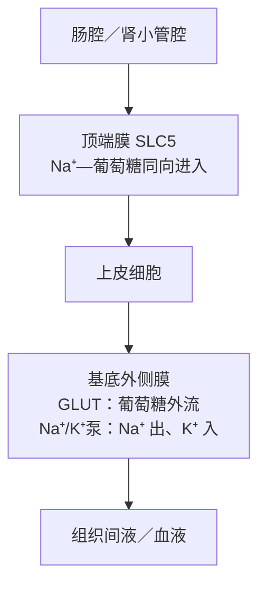

# 跨膜转运与渗透

[内环境与稳态](internal_env.md)之所以能够维持，首先因为膜把连续的体液分成了组成不同的区室。脂双层会阻挡多数水溶性物质，通道和载体又为特定溶质提供受控路径；泵消耗代谢能建立梯度，梯度随后驱动离子、电信号、营养吸收和细胞容积变化。完整描述一种跨膜转运，需要同时说明净通量的自由能来源、溶质实际经过的路径，以及膜如何改变这条路径的通透性。

## 跨膜转运的自由能差 { #transport-driving-force }

对于从膜外移到膜内的一种溶质，稀溶液近似下的摩尔自由能变化可写成

$$
\Delta G_{\mathrm{o}\rightarrow\mathrm{i}}
=RT\ln\!\left(\frac{a_{\mathrm{i}}}{a_{\mathrm{o}}}\right)
+zF\left(\psi_{\mathrm{i}}-\psi_{\mathrm{o}}\right),
$$

其中 $a$ 是活度，$z$ 是电荷数，$\psi$ 是电势，$R$、$T$ 和 $F$ 分别为气体常数、绝对温度和法拉第常数。中性溶质的 $z=0$，方向主要由化学势差决定；离子的浓度差与膜电位共同构成电化学势差。若指定方向的 $\Delta G<0$，净转运在热力学上可以自发发生；若 $\Delta G>0$，则必须与 ATP 水解、光能或另一溶质的顺势转运耦联。达到电化学平衡时，两个方向的通量相等，分子仍在持续运动。[^transport-thermodynamics]

浓度梯度只是跨膜驱动力的一部分。带正电离子可能在电场作用下逆浓度方向移动；中性分子即使存在浓度差，若脂双层对它几乎不通透且缺少转运蛋白，实际通量仍可接近零。离子平衡电位、膜电导和多离子共同形成膜电位的过程将在[细胞的电活动](electrical_activity.md)中展开。

### 转运路径的速率与选择性 { #transport-pathways }

| 路径 | 跨膜装置 | 净通量的直接驱动力 | 主要动力学特征 |
| --- | --- | --- | --- |
| 单纯扩散 | 脂双层本身 | 溶质的化学势差；带电物质还受电势差影响 | 低浓度范围内通常近似随浓度差线性变化 |
| 通道介导的被动转运 | 可开放的亲水孔道 | 电化学势差或水的化学势差 | 通量大，受选择性滤器、门控和开放概率控制 |
| 载体介导的易化扩散 | 交替开放的结合位点 | 被转运物自身的电化学势差 | 可饱和，具有底物选择性和竞争现象 |
| 初级主动转运 | ATP 酶或其他能量耦联泵 | ATP 水解等直接供能 | 有固定或偏好的耦联化学计量，可建立梯度 |
| 次级主动转运 | 同向或反向耦联载体 | 一种溶质顺势移动释放的自由能 | 多种底物必须按一定关系完成同一转运循环 |

这张表按能量耦联方式区分机制；具体蛋白的作用仍由底物方向、化学计量和实验条件共同确定。载体既可催化被动易化扩散，也可参与主动转运；通道开放时则让底物沿既有驱动力移动，部分家族还存在机制上的例外。[^osm-carriers-channels]

## 单纯扩散与净通量 { #simple-diffusion }

分子在热运动中不断改变方向；没有梯度时，任一截面两侧的平均交换量相等，宏观上没有净通量。出现浓度梯度后，高浓度一侧越过截面的分子平均更多，于是产生由高浓度指向低浓度的净扩散。随机游走的均方位移满足 $\langle r^2\rangle=2dDt$，其中 $d$ 是空间维数、$D$ 是扩散系数，因此典型扩散距离只按时间的平方根增长。扩散适合短距离交换，具体距离取决于扩散系数、介质性质和空间维数。

### 菲克第一定律与膜通透系数 { #ficks-law }

一维情况下，溶质 $s$ 的扩散通量密度为

$$
J_s=-D_s\frac{\mathrm{d}c_s}{\mathrm{d}x},
$$

$J_s$ 的单位是单位面积、单位时间通过的物质的量，$D_s$ 的量纲为面积／时间；负号表示净通量指向浓度降低的方向。膜面积为 $A$ 时，物质的量转运速率是 $\dot n_s=AJ_s$；通量密度 $J_s$ 与总转运速率 $\dot n_s$ 具有不同含义和量纲。[^fick-law]

若把膜近似为厚度 $\delta$、性质均一的薄层，并假定两侧边界层内浓度稳定，则从 1 侧到 2 侧的稳态通量可写成

$$
J_{s,1\rightarrow2}=P_s(c_{s,1}-c_{s,2}),
\qquad
P_s=\frac{K_sD_s}{\delta}.
$$

$K_s$ 是溶质在膜相与水相之间的分配系数，$P_s$ 是通透系数。脂溶性较高、扩散系数较大或膜较薄时，其他条件相同的通量较大；膜面积则决定总转运量。氧、二氧化碳和许多疏水小分子可以直接穿过脂双层，离子及多数较大的极性分子通常需要蛋白质路径。真实细胞还存在未搅拌水层、膜脂组成变化和代谢消耗，因而这一线性式主要适用于相应条件近似恒定的范围。

## 渗透与水的化学势 { #osmosis }

当膜允许水通过而对某些溶质不通透时，加入溶质会降低水的化学势，水便从水化学势较高的一侧净移向较低的一侧。达到平衡时，渗透造成的静水压差可以抵消这一趋势。对理想稀溶液，渗透压近似为

$$
\Pi\simeq RT\sum_j c_j,
$$

求和对象是能够独立运动的溶质粒子，所以解离产生的离子需要分别计入；非理想溶液则应使用活度。真实细胞膜对不同溶质的通透性不同，在观察时间内跨膜缓慢的粒子才能持续形成有效渗透力。[^osmotic-pressure]

水可以穿过脂双层，也可经水通道蛋白快速通过；不同组织的水通透性因此相差很大。水通道改变达到平衡的速率，却不提供逆渗透方向的能量。细胞外存在较多有效渗透粒子时，水净流出、细胞缩小；外液有效渗透粒子较少时，水净流入，动物细胞可能肿胀甚至破裂。

### 渗透浓度、质量渗透浓度与张力 { #osmolarity-tonicity }

| 概念 | 常用含义 | 是否取决于具体膜和时间尺度 |
| --- | --- | --- |
| 渗透浓度（osmolar concentration） | 每升溶液所含渗透活性粒子数，常用 Osm/L | 否，主要是溶液的粒子浓度性质 |
| 质量渗透浓度（osmolality） | 每千克溶剂所含渗透活性粒子数，常用 Osm/kg | 否；质量不随温度改变，实验测量常用此量 |
| 张力（tonicity） | 外液在达到相应时间尺度的平衡后改变细胞体积的能力 | 是，只由对该膜有效的不易透溶质贡献 |

因此，等渗透浓度与等张描述不同性质。与细胞内液等渗透浓度的尿素溶液起初可以没有明显水流，但尿素逐渐入胞后，外液留下的有效渗透粒子不足，水继续进入细胞；它在较长时间尺度上表现为低张。反过来，膜转运或代谢状态改变也会改变同一种溶质的有效性。细胞体积由总粒子数、膜对各溶质的通透性和观察时间共同决定。[^tonicity]

细胞内蛋白质和有机磷酸等固定阴离子被限制在膜内，会影响可移动离子的分布并产生持续的入水倾向。动物细胞依靠 Na$^+$/K$^+$-ATPase 不断排出漏入的 Na$^+$，再配合 K$^+$、Cl$^-$ 通道和有机渗透物调节形成“泵—漏”平衡。细胞体积由这一耗能的非平衡稳态维持，单次渗透平衡计算只能描述其中一部分条件。

## 蛋白质介导的被动转运 { #facilitated-transport }

### 通道介导的扩散 { #channels }

通道跨越脂双层形成亲水孔道，开放后允许适合其选择性滤器的离子或水沿电化学势差通过。孔径、带电残基、脱水代价和配位几何共同决定选择性，部分通道的底物选择可以十分严格。通道可由膜电位、细胞外或细胞内配体、机械力、温度、磷酸化状态及膜内储库充盈程度等信号门控，膜的通透性因通道数目和开放概率在短时间内显著改变。[^channels-and-carriers]

Na$^+$、K$^+$、Ca$^{2+}$ 和 Cl$^-$ 通道的亚型及药理性质依赖具体细胞环境。L 型 Ca$^{2+}$ 通道参与某些心肌动作电位平台和兴奋—收缩耦联，T 型通道则具有不同的电压依赖和动力学；K2P 钾通道属于双孔域钾通道家族，细胞器膜上的双孔通道 TPC 则属于另一类阳离子通道。它们在[细胞的电活动](electrical_activity.md)、[肌细胞生理](muscle.md)、[心脏电生理](blood/blood_heart_electrical.md)及[神经递质与受体](../neuro/neuro_transmitter_receptor.md)中按相应膜环境继续展开。

### 载体介导的易化扩散 { #passive-carriers }

载体先在膜的一侧结合底物，构象变化使结合位点转向另一侧，再释放底物。由于一次转运循环需要结合、构象变化和解离，载体在底物升高时会趋于饱和；结构相近的底物还可能竞争同一结合位点。被动载体不消耗 ATP，净方向仍由底物本身的电化学势差决定，并可随梯度反转。

红细胞主要借 GLUT1 摄取葡萄糖，许多神经元富集 GLUT3；两者都属于 SLC2 易化己糖转运体。肠道和肾小管顶端膜的 SLC5 Na$^+$—葡萄糖同向转运体采用另一种机制：SLC2 使糖顺势转运，SLC5 则利用 Na$^+$ 梯度把糖逆其自身梯度积累。[^slc-families]

## 主动转运与能量耦联 { #active-transport }

### 初级主动转运与梯度建立 { #primary-active-transport }

初级主动转运把 ATP 水解等放能反应直接耦联到溶质转运。动物细胞质膜上的 Na$^+$/K$^+$-ATPase 每完成一个典型循环，消耗 1 个 ATP，将 3 个 Na$^+$ 运出并把 2 个 K$^+$ 运入，因此既建立 Na$^+$、K$^+$ 梯度，也产生一个净正电荷外移。泵本身对静息膜电位有直接生电贡献，更重要的作用是长期维持通道和次级载体所使用的离子梯度。[^sodium-pump]

P 型 ATPase 还包括 Ca$^{2+}$ 泵和 H$^+$/K$^+$ 泵；V 型 ATPase 主要以 H$^+$ 转运酸化细胞器或某些上皮表面；ABC 蛋白常以 ATP 驱动有机物和脂质转运。家族归属需要与机制证据结合，例如同属 ABC 超家族的 CFTR 主要作为 ATP 调控的 Cl$^-$ 通道工作。

### 次级主动转运与梯度利用 { #secondary-active-transport }

耦联载体把几种底物放进同一个循环。若它们同向移动，称同向转运；若方向相反，称反向转运。对一个完整循环，所有被转运物的自由能变化相加：

$$
\Delta G_{\mathrm{cycle}}=\sum_i \nu_i\Delta G_i.
$$

只要指定方向的总和为负，一种离子顺电化学势移动释放的能量就能推动另一底物逆势移动。动物质膜最常利用 Na$^+$ 梯度，细菌、线粒体和许多细胞器则常利用 H$^+$ 梯度。若离子梯度和膜电位发生足够大的变化，一些耦联载体也可能减慢、停止或反向运行；“主动”描述的是被耦联底物的能量关系，不保证流向永远不变。

SLC5 转运体用 Na$^+$ 梯度摄取葡萄糖等底物；SLC6 单胺转运体则把 Na$^+$、常伴 Cl$^-$ 的顺势转运与递质再摄取耦联。去甲肾上腺素转运体 NET（SLC6A2）介导去甲肾上腺素的 Na$^+$／Cl$^-$ 依赖性再摄取；肾上腺素在不同组织还可经有机阳离子转运等路径摄取。[^slc-families]

## 极性上皮的矢量运输 { #epithelial-transport }

吸收和分泌需要跨越整个细胞层及其两侧膜。极性上皮把不同转运蛋白分别放在顶端膜和基底外侧膜：顶端膜面向肠腔、肾小管腔或腺腔，基底外侧膜面向组织间液和血液。溶质可依次跨过两侧膜走经细胞路径，也可沿紧密连接控制的细胞旁路径通过；水则根据渗透与静水压力，经水通道、脂双层或细胞旁隙移动。

图中以葡萄糖吸收说明能量接力：基底外侧 Na$^+$/K$^+$-ATPase 消耗 ATP 维持低胞内 Na$^+$，顶端 SLC5 同向转运体利用这一梯度积累葡萄糖，葡萄糖再由基底外侧 GLUT 顺势离开。不同肠段和肾单位各有相应的同工型、化学计量及调节方式；详细过程分别见[消化与吸收](digestive/digestion_absorption.md)和[肾小球滤过与肾小管转运](urinary/filtration_transport.md)。

细胞吞噬、胞饮、受体介导内吞和胞吐也能搬运大量物质，但货物随膜泡出芽和融合改变区室，分析时属于膜泡运输，而单个溶质直接穿过脂双层则属于跨膜通量。前一类过程见[内膜系统、蛋白质分选与囊泡运输](../cell/endomembrane.md)。区分这两个层级，有助于衔接跨膜热力学、膜泡拓扑和器官级运输。

## 参考资料与延伸阅读 { #references }

- Alberts B, Johnson A, Lewis J, et al. [Membrane Transport of Small Molecules and the Electrical Properties of Membranes](https://www.ncbi.nlm.nih.gov/books/NBK21044/). *Molecular Biology of the Cell*, 4th ed.
- IUPAC. [Diffusion coefficient](https://goldbook.iupac.org/terms/view/D01719)；[Osmotic pressure](https://goldbook.iupac.org/terms/view/O04344). *Compendium of Chemical Terminology*, 5th ed.
- OpenStax. [The Cell Membrane](https://openstax.org/books/anatomy-and-physiology-2e/pages/3-1-the-cell-membrane). *Anatomy and Physiology 2e*.
- IUPHAR/BPS Guide to PHARMACOLOGY. [Transporter families](https://www.guidetopharmacology.org/GRAC/ReceptorFamiliesForward?type=TRANSPORTER).
- Hall JE, Hall ME. [Guyton and Hall Textbook of Medical Physiology, 15th ed.](https://evolve.elsevier.com/cs/product/9780443111013?role=student). Elsevier, 2025.
- Boron WF, Boulpaep EL. [Medical Physiology, 3rd ed.](https://evolve.elsevier.com/cs/product/9781455743773?role=faculty). Elsevier, 2016.

[^transport-thermodynamics]: 电化学势、被动与主动转运的能量边界参见 NCBI Bookshelf 的 [Principles of Membrane Transport](https://www.ncbi.nlm.nih.gov/books/NBK26815/)。
[^osm-carriers-channels]: 通道、被动载体、泵及若干生理实例的组织线索参考并重组自 osm.bio《[载体蛋白和通道蛋白](https://osm.bio/index.php?title=%E8%BD%BD%E4%BD%93%E8%9B%8B%E7%99%BD%E5%92%8C%E9%80%9A%E9%81%93%E8%9B%8B%E7%99%BD&oldid=14634)》（固定版本 oldid=14634；贡献者：寸烛盈夜、Sofia、野狼君卡共和、长河；[CC BY-SA 4.0](https://creativecommons.org/licenses/by-sa/4.0/)）。本页重新按自由能耦联分类，并以 NCBI Bookshelf、IUPAC 与 IUPHAR/BPS 数据库核验和纠正具体表述。
[^fick-law]: 扩散通量密度和扩散系数的定义参见 IUPAC Gold Book 的 [Diffusion coefficient](https://doi.org/10.1351/goldbook.D01719)。
[^osmotic-pressure]: 渗透压的热力学定义及理想稀溶液近似参见 IUPAC Gold Book 的 [Osmotic pressure](https://doi.org/10.1351/goldbook.O04344)。
[^tonicity]: 体液区室移动和膜通透性边界交叉核对 NCBI Bookshelf 的 [Physiology, Water Balance](https://www.ncbi.nlm.nih.gov/books/NBK541059/)与 [Biochemistry, Hypertonicity](https://www.ncbi.nlm.nih.gov/books/NBK541095/)。
[^channels-and-carriers]: 通道孔道、载体交替开放及两者速率差异参见 NCBI Bookshelf 的 [Membrane Transport of Small Molecules](https://www.ncbi.nlm.nih.gov/books/NBK21044/)与 [Principles of Membrane Transport](https://www.ncbi.nlm.nih.gov/books/NBK26815/)。
[^slc-families]: 葡萄糖易化扩散、Na$^+$—葡萄糖同向转运和单胺再摄取的家族归属参见 IUPHAR/BPS Guide to PHARMACOLOGY 的 [SLC2](https://www.guidetopharmacology.org/GRAC/FamilyDisplayForward?familyId=140&familyType=TRANSPORTER)、[SLC5](https://www.guidetopharmacology.org/GRAC/FamilyDisplayForward?familyId=143&familyType=TRANSPORTER)及 [SLC6](https://www.guidetopharmacology.org/GRAC/FamilyDisplayForward?familyId=144&familyType=TRANSPORTER) 页面。
[^sodium-pump]: Na$^+$/K$^+$-ATPase 的化学计量、生电性及其对次级转运和细胞容积的作用参见 NCBI Bookshelf 的 [Carrier Proteins and Active Membrane Transport](https://www.ncbi.nlm.nih.gov/books/NBK26896/)。
