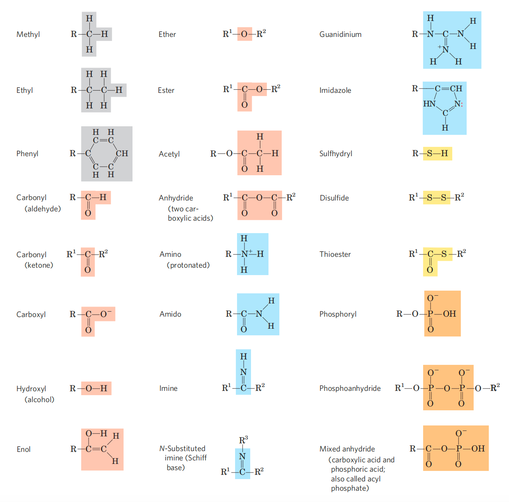

说在前面：全英文的生物化学难点在有很多专业名词的生词，且许多酶和反应的名字非常易混，不好记忆。可以先用中文记忆逻辑关系，再记英文词汇（逃

我这里的章节不会按照老师的ppt进行，而是按照知识的自然顺序。

**Fall semester**: Zengyi Chang, Yongmei Qin

**Spring semester**: Junyu Xiao, Xiao-Wei Chen, Chengqi Yi

## Chapter 1 Introduction

### 1. Foundations of Biochemistry

**Cell structure**

=== "Bacterial cell"

    - cytoplasm
    - plasma membrane
    - ribosomes
    - nucleoid

=== "Animal cell"

    - cytoplasm
    - plasma membrane
    - ribosomes
    - nucleus
    - nuclear membrane
    - membrane-bounded organelles

macromolecules: proteins, polysaccharides, nucleic acids, lipids

**Biomolecules are compounds of carbon**

- The four single bonds around a carbon have a characteristic tetrahedral arrangement
- It is able to link into linear, branched or cyclic structures, to which all kinds of functional groups (e.g., alcohol, amino, carboxyl) can be attached
- C-C single bonds are free to rotate
- C=C double bonds are shorter and do not allow free rotation. The two carbons and atoms attached to them all lie in the same rigid plane

**区分概念：Conformation (构象) and Configuration (构型)**

=== " Conformation (构象)"

    - the spatial arrangement of substituent groups that ==without breaking any bonds==, are free to assume different positions in space because of the freedom of rotation about single bonds
    - Conformational changes in protein are common and functionally important

=== "Configuration (构型)"

    - the isomers can not be interconverted unless ==covalent bonds are broken==. Configuration is conferred by the presence of _double bonds_(1) or _chiral centers_(2)
    { .annotate }

        1. cis顺式 trans反式
        2. D / L

    - Chiral molecules: A carbon atom with four different substituents which is asymmetric （opposite： achiral molecule）

    - Function of biomolecules are stereospecific

    - Enantiomers (对映异构物) and Diasteromers (⾮对映异构物)

**common fuctional groups**

{ width="600" loading="lazy" }
/// caption
from Lehninger Biochemistry
///

- The chemical personality of a molecule is determined by its functional groups

### 2. Water

**hydrogen bonds**

 - Hydrogen bond readily occurs between an electronegative atom and a hydrogen covalently bonded to another electronegative atom (always O or N), when they are ~0.3 nm (3 angstrom) apart
 - Hydrogen bonds are “weak” bonds, but The “weakness” of 
hydrogen bonds are important to biological system. eg. DNA

**Water are solvent**

- Hydrophilic(亲水的): soluble in water
- Hydrophobic(疏水的): not soluble in water
- Amphipathic (or amphiphilic)(两亲的): part of the compound likes water and part of the compound repels water

## Chapter 2 Proteins

### 1. Amino acids

**History**

A class of compounds, synthesized by plants and vital for animal health, was first identified in the 18th century
> - The compounds we now know as proteins were observed to coagulate or flocculate when treated with heat or acid. Early examples included egg-white albumin, serum albumin, fibrin, and wheat gluten, as documented by Fourcroy and others in the 18th century.
> - By the early 19th century, it was recognized that these nitrogen-containing compounds were essential for animal survival.
> - In 1838, Mulder and Berzelius introduced the term "protein"—from the Greek prōteios, meaning "primary" or "holding first place"—to designate this class of substances
> - It was initially believed that proteins from plants could be directly incorporated into animal tissues.
> - Later in the 19th century, digestion studies revealed that proteins are in fact composed of amino acids.

**basic structure**

All standard amino acids are α-amino acids, sharing a common core 
structure: 

- central α-carbon atom
- a primary amino group (–NH₂)
- a hydrogen atom (–H)
- carboxyl group (–COOH)
- distinctive side chain (R group)

{ width="600" loading="lazy" }
/// caption
from Lehninger Biochemistry
///

Each standard amino acid has a unique combination of properties

Nearly all proteins are composed of L-amino acids

- Jacobus van 't Hoff and Joseph Le Bel independently proposed in 1874 the tetrahedral geometry of carbon atoms, explaining chirality and optical activity.
- Emil Fischer established the D/L naming system in 1900s, using **D- and L-glyceraldehyde（甘油醛）** as reference standards. 
- All amino acids they tested from proteins could be chemically correlated to L-glyceraldehyde.
- In 1951, Johannes Martin Bijvoet et al confirmed the L-configuration of amino acids via X-ray crystallography.
- D-amino acids were in 1950s through the chemical analysis of hydrolyzed bacterial cell walls (Peptidoglycan).

Two cysteine residues in peptide chains can form a covalent disulfide bond between them

- Disulfide bonds, intrachain or interchain, are common structural features in secreted proteins（分泌蛋白） and peptides, as well as in proteins from thermophilic archaea（热塑性古生菌）
- In contrast, they are uncommon in the cytosolic proteins（胞内蛋白） of eukaryotic and bacterial cells owing to the reducing intracellular environment

Some uncommon amino acids are generated in proteins through post-translational modifications

Certain uncommon amino acids are biosynthesized in proteins through reversible post-translational modifications

- Phosphorylation(on Ser, Thr, Tyr)
- Methylation (on Arg)
- Acetylation (on Lys)
- Methylation(on Glu)
- Adenylylation (on Tyr)

**properties**

- absorption of near-UV light (280 nm)
- Free amino acids are capable of acting as diprotic or triprotic acids
- At physiological pH (~7.4), amino acids predominantly exist as zwitterions
- Both the α-carboxyl and the α-amino groups become more acidic due to the effects of neighboring chemical groups
- characteristic isoelectric point (pI)

